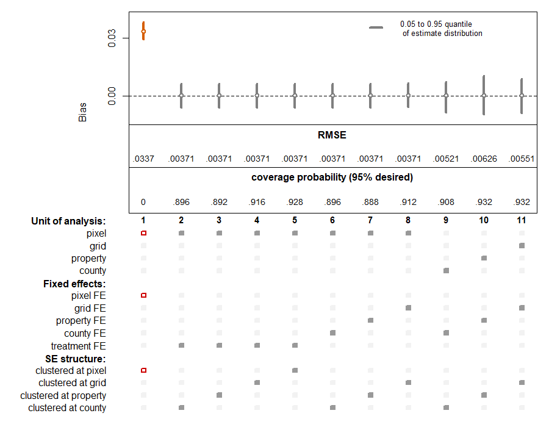
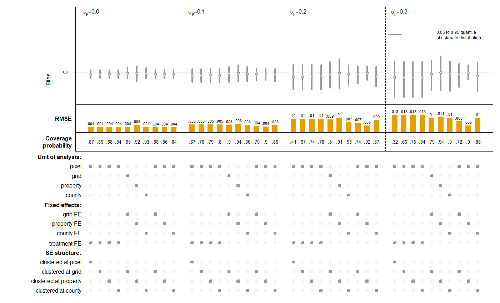
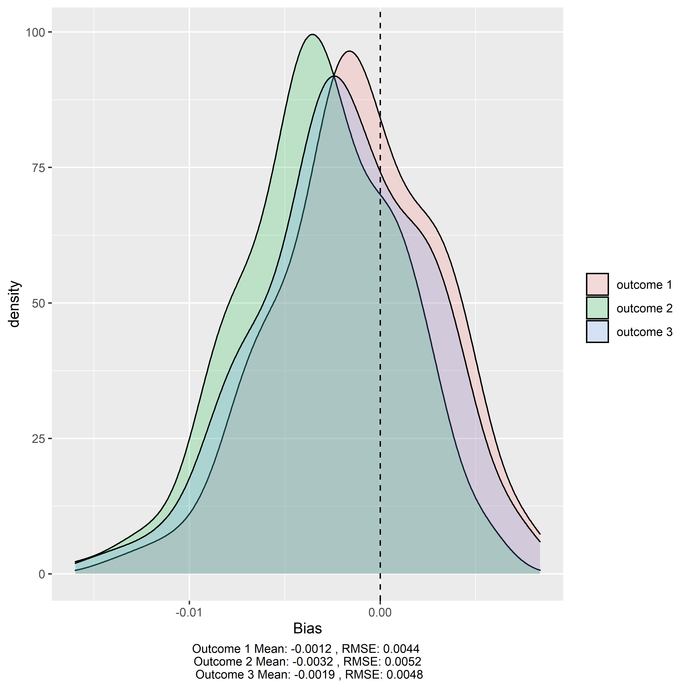
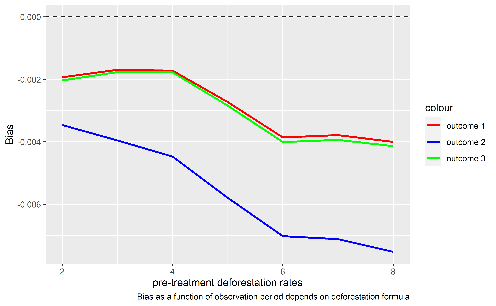

\sectionfont{\fontsize{11}{11}\selectfont}
\subsectionfont{\fontsize{11}{11}\selectfont}

```{r setup, include=FALSE}
library(knitr)
library(ggplot2)
library(kableExtra)
library(tidyverse)


knitr::opts_chunk$set(echo = FALSE, warnings = FALSE, messages = FALSE, out.width="49%", fig.align = "center")
```

<!-- To do: -->
<!-- - lit table citations -->

<!-- Possible extensions: -->
<!-- - weighting possibilities -->
<!-- make properties more or less heterogeneous -->

<!-- - spatial autocorrelation -->
<!-- perform diagnostics to show how reseachers can use data to examine spatial autocorrelation -->


# Abstract {-}
Conservation practitioners need rigorous evidence measuring the effectiveness of proposed policy interventions. Economists are increasingly generating this evidence by applying methods of impact evaluation to remotely sensed panel data on land use change. However, these applications come with new challenges. Using Monte Carlo simulations and analytical proofs, we demonstrate that many of the panel econometric models employed for avoided deforestation impact evaluation are biased - the significance, magnitude and even direction of estimated effects from many studies are likely incorrect. These errors threaten to undermine the evidence base that underpins conservation policy adoption and design. We review this burgeoning literature and develop practical guidance for the design of econometric models quantifying conservation policy effectiveness. 

# Introduction

The founding goal of conservation biology was to provide principles and tools to preserve biological diversity [@soule1985]. To live up to this goal, scientists must generate causal evidence detailing the effectiveness of  conservation interventions [@williams2020]. Such evidence is critical for practitioners who grapple with challenging questions of cause and effect. Do marine protected areas stop unsustainable harvesting of fish? Can payments for ecosystem services encourage lasting reforestation? When successful, conservation science provides answers that improve the way society confronts environmental challenges. However, inappropriate methods can yield misleading conclusions and, as a result, risk diverting scarce financial and political resources from the most effective conservation strategies.

Increasingly, econometric methods of impact evaluation have been used to disentangle causal relationships in conservation science [@butsic2017; @baylis2016]. These methods can generate accurate estimates of an intervention's impact by comparing observed outcomes to a rigorous counterfactual of what would have happened in the absence of an intervention [@ferraro2009; @meyfroidt2016; @ferraro2019; @ribas2020]. Conservation impact evaluation increasingly makes use of panel data in which units are observed repeatedly through time, thanks, in large part, to the proliferation of remote sensing [@blackman2013; @jones2015]. For example, NASA's landsat missions provide detailed and consistent information on land use spanning the entirety of the world since the 1970s [@hansen2012]. As a result, a scientist hoping to quantify the impacts of a land use policy adopted decades ago can assemble data for treated and control units that span both pre- and post-implementation periods [@jain2020].

However, many commonly used measures of land use change have structural differences from the data used in traditional, linear panel models. For example, deforestation is often measured using data with a similar structure to the Global Forest Change product produced by @hansen2013. When converted to a panel structure, these data yield binary observations detailing the first year in which each 30 by 30m pixel was deforested. Importantly, the data do not allow for the detection of reforestation timing and, as a result, are unable to detect repeated deforestation events in the same location. To date, insufficient attention has been paid to how such binary, irreversible outcome data may affect the performance of standard econometric tools.

Here, we use a combination of analytical proofs and Monte Carlo simulations to demonstrate that many econometric analyses of deforestation are likely biased - significance, magnitude and even direction of estimated effects might be incorrect. These biases arise even when researchers follow common guidance to adopt "rigorous" research designs with valid counterfactuals [@blackman2013; @jones2015]. To help guide future impact evaluations, we propose multiple ways in which this bias can be eliminated. Finally, we reflect on the econometric benefits that emerge when researchers are able to match their model structure to the relevant scale of land use decisionmaking.

<!--
NOTE: I've tried to condense the intro a fair bit - hopefully I didn't remove any text you were terribly attached to. In case you want to add something back, I've left a lot of this text below...

To date, many econometric impact evaluations of conservation interventions use the unit of analysis provided by the data. The pixel is the unit of analysis at which researchers access remotely sensed forest cover data, and the pixel is a standard unit of analysis for empirical models. We show that this can lead to severe bias and improper inference in the context of deforestation impact evaluations. We argue that researchers should think about the actual process by which land-use change occurs, considering factors that may impact outcome heterogeneity in a given setting. For example, if property ownership is a strong determinant of heterogeneity, a pixel level analysis may be atheoretical in relation to the true land-use change process. This type of decision has known implicaions for bias, raising the question of how to select the proper unit of analysis in a given setting [@avelino2016]. Of particular interest is when these processes operate in conjuction with one another at multiple scales. 

The remainder of this paper is structured as follows. Section 2 reviews the standard panel econometric methods in the land-use impact evaluation literature. Section 3 identifies major potential issues with the use of two way fixed effects (TWFE) regression models in the deforestation context, supported by analytical proofs. Section 4 describes our Monte Carlo simulation approach to exploring the performance of alternative model parameterizations. Section 5 presents results from the Monte Carlo simulations that show certain model parameterizations overcome the bias and improper inference associated with commonly used specifications. Section 6 concludes and offers guidance for researchers’ impact evaluations.
-->

# Conservation impact evaluation using panel methods

While randomized experiments are the gold standard for scientific discovery in both the natural and social sciences [@edwards2020; @jayachandran2017], conservation often poses questions that are prohibitively expensive, unethical or impossible to pursue through experimentation. In such settings, a growing portfolio of statistical techniques enable researchers to draw causal conclusions using observational data [@larsen2019]. Importantly, these methods account for the non-random assignment of interventions that often confound identification of causal relationships; i.e., a low rate of deforestation within a remote protected area may reflect the protected area's effectiveness, or it may be indicative of the remote location's poor suitability for agricultural development [@andam2008; @pfaff2009]. These approaches frequently build upon panel data, in which researchers are able to observe changes in outcomes after the adoption of an intervention [@blackman2013]. When a rigorous research design is applied to panel data, observational studies can yield conclusions that are comparable to what a researcher would discover if they were able to run a randomized experiment [@ferraro2017].

We center our attention on the case in which a researcher would like to quantify the impact of a policy intervention on deforestation rates. We assume that the intervention has clearly defined boundaries (e.g., a protected area, certified concession, or indigenous territory), and that the researcher has access to spatially explicit observations of forest cover and forest loss spanning the periods before and after the intervention was adopted. This general setting describes a broad array of research studies that apply panel methods to remotely sensed data (Table \@ref(tab:table-lit)).

\renewcommand{\arraystretch}{1.5}
```{r table-lit}

lit_table <- read.csv("lit_table.csv")[,1:4]

kable(lit_table, format = "latex", 
      caption = "Econometric model structures used in avoided deforestation impact evaluations",
      col.names = c("Paper",
                    "Panel Method",
                    "Unit of analysis",
                    "Unit fixed effects level")) %>% 
  row_spec(0,bold=TRUE) %>% 
  kable_styling(font_size = 10, latex_options = c("striped", "HOLD_position"),
                #full_width = TRUE
                position = "center"
                )

```
\clearpage
<!-- 
TODO: -this is the one TODO that still needs to be addressed to a certain extent. I'm thinking that I'll wait to add the studies that use binary "any deforestation within bounds" outcome until we incorporate this outcome into the simulations. At that point, I'll more descriptively include the outcome as something separate from the unit of analysis

1. For "regression" panel methods - what does this mean? Aren't all of these studies using regression? Are these cross-sectional rather than panel models?
- need to address this in a more informative way, but many are in panel settings but use a model that does not use fixed effects 
3. Add studies that use binary "any deforestation within bounds" outcome?
- need to add these studies
4. Differentiate NDVI as an outcome vs binary deforestation?
- currently, I've excluded studies that use only NDVI. Some of these use both NDVI and a binary outcome
-->

In each of the studies detailed in Table \@ref(tab:table-lit), the researcher's goal is to measure the impact that a specific policy had on deforestation within treated units. The parameter describing the causal effect of the policy is referred to as the \textit{average treatment effect on the treated}, or $ATT$. The $ATT$ estimates the difference between a) the average deforestation rate of treated units with treatment and b) the average deforestation rate of treated units without treatment. The fundamental challenge is that, for every treated unit, the researcher is unable to observe the value that the outcome would have taken in the absence of treatment [@holland1986]. In our case, this means that the researcher cannot observe the deforestation that would have occurred in treated units had they not received treatment. Figure \@ref(fig:counterfactual) displays this problem in the context of a simulated conservation intervention that reduced deforestation rates in treated areas --- the landscape is depicted as observed by the researcher at the end of the observation period, including the unobservable counterfactual of what would have happened if the conservation intervention had not been adopted. Note that in untreated areas, there is no counterfactual deforestation, since no intervention ever took place. 

```{r counterfactual, echo=FALSE, fig.cap="This figure shows deforestation that would have ocurred in the absence of the conservation intervention at the same point in time, after implementation of the conservation intervention. Note that no counterfactual deforestation occurs in the control area, since no intervention ocurred.", out.width = "100%"}
knitr::include_graphics("figs/lscape.png")
```

Researchers generally observe maps depicting pixel-level, binary deforestation, similar to what is depicted in Figure \@ref(fig:counterfactual). In the form of a panel dateset, the researcher observes the year in which a pixel is converted from forest to non-forest, and importantly, deforested pixels do not revert back to forest cover over the course of the study period. Thus, repeated deforestation events cannot be detected in the same location. In order to correct for this irreversibility, many studies drop deforested pixels in the periods after they first become deforested [@jones2015; @alix-garcia2017]. In the literature, the outcome variable describing pixel $i$, in property $v$, in time $t$ is often defined as follows:
\begin{align*}
 y_{ivt} = \begin{cases}
      1 &  \text{if pixel $i$ is deforested in time $t$}\\
      0 &  \text{if pixel $i$ has never been deforested} \\
      NAN & \text{if pixel $i$ was deforested prior to time $t$}
   \end{cases}
\end{align*}

The $ATT$ is then the average effect of the conservation intervention on treated pixels. Let $y_{ivt}(1)$ and $y_{ivt}(0)$ denote the potential outcomes of pixel $i$ in property $v$ in time $t$ with and without the treatment, respectively. The $ATT$ can now be expressed: 
$$ ATT = E[y_{ivt}(1) - y_{ivt}(0) |  t\geq t_0, D_i=1]$$

, where $t_0$ is the year that the intervention is implemented and $D_i$ is a dummy equal to one if pixel $i$ is ever treated.

## The difference-in-differences and two-way fixed effects estimators

The remainder of our paper focuses on two methods commonly used to estimate the $ATT$ in conservation intervention settings with panel data: Difference-in-Differences (DID) and Two-way Fixed Effects (TWFE) regression models [@blackman2013; @jones2015]. The DID and TWFE methods have become so popular in part, because the researcher does not need random assignment of treatment to generate convincing estimates of a program's impact on avoided deforestation. Instead, the researcher must make a common trends assumption, under which we evaluate both methods. 

\textbf{Assumption 1:} (Common trends)
\begin{align*}
E[y_{ivt}(0) |  t\geq t_0, D_i=1]-E[y_{ivt}(0) |  t< t_0, D_i=1]=E[y_{ivt}(0) |  t\geq t_0, D_i=0]-E[y_{ivt}(0) |  t< t_0, D_i=0]
\end{align*}

Assumption 1 requires that both units in the intervention area and untreated units would have experienced the same average change in the outcome (trend) in the absence of the intervention. While fundamentally untestable, ensuring that deforestation rates in the intervention area and the control area followed parallel trajectories prior to the date of the intervention can give creedence to this assumption [@butsic2017]. 

We also evaluate the DID and TWFE models under the following stable unit treatment value assumption (SUTVA)

\textbf{Assumption 2:} (SUTVA)
\begin{align*}
\forall d \in \{ 0,1\}: \text{ if }D_i=d \text{ and }t\geq t_0, \text{ then }y_{ivt}(d)=y_{ivt}
\end{align*}

Assumption 2 requires that the potential outcomes for pixel $i$, $y_{ivt}(1)$ and $y_{ivt}(0)$, do not depend on the treatment status of any other pixel. There also cannot exist unobserved versions of treatment that may affect the potential outcomes. 

The typical DID regression model includes a dummy variable equal to one for units in the treatment group, a dummy variable equal to one for observations in the period after the intervention, and their interaction. 

\textbf{Regression 1:} (DID regression)
Let $\beta_{DID}$ denote the coefficient of the interaction between $D_{i}$ and an indicator for whether the intervention has been implemented in time $t$, $\mathbb{1} \{ t\geq t_0\}$,  in the following (population) OLS regression: 
\begin{align}
y_{ivt} = \alpha_0 + \alpha_1 D_i + \alpha_2 \mathbb{1} \{ t\geq t_0\}+ \beta_{DID} \text{ x } D_i \mathbb{1} \{ t\geq t_0\}  + \epsilon_{it}
\end{align}

Conceptually, the DID estimator calculates the treatment effect as the difference between the differences of the treated and untreated observations before and after treatment [@butsic2017]. 
\begin{align*}
\beta_{DID} = E[y_{ivt} |  t\geq t_0, D_i=1] - E[y_{ivt} |  t<t_0, D_i=1] - (E[y_{ivt} |  t\geq t_0, D_i=0] - E[y_{ivt} |  t<t_0, D_i=0] )\\
\end{align*}

It is easy to show that under Assumption 1 and 2, 
\begin{align*}
\beta_{DID}=ATT
\end{align*}

Often times, however, the researcher wants to estimate the $ATT$ in a setting that is not consistent with the two-group, two-period case covered by DID models. TWFE regression models are frequently used to apply DID methods to multiple groups or treatment periods. This amounts to estimating a regression that controls for unit and time fixed effects, which account for any unobservable confounding variables that may vary across units or through time. 

\textbf{Regression 2:} (TWFE regression)
Let $\beta_{TWFE}$ denote the coefficient of the interaction between $D_{i}$ and $\mathbb{1} \{ t\geq t_0\}$  in the following (population) OLS regression: 
\begin{align}
y_{ivt} = \alpha + \beta_{TWFE} \text{ x } D_i \mathbb{1} \{ t\geq t_0\} + \lambda_t + \gamma_i + \epsilon_{it}
\end{align}
, where $\lambda_t$ and $\gamma_i$ are year and pixel fixed effects, respectively. 

Because TWFE regression models are often used to generalize the DID method, they are used in a wider variety of settings and have gained paramount popularity in the land use change impact evaluation literature. Settings in which units undergo treatment in more than two distinct time periods may be amenable to TWFE regression, but not the standard DID method. For example, a researcher may use an TWFE regression model to examine the effectiveness of a network of protected areas, where the protected areas were created at different times or a payment for ecosystem services (PES) program, which enrolls properties in annual cohorts. In the case of two groups and two time periods, the TWFE regression should give an estimate equivalent to that of the DID model [@wooldridge]. This flexibility has led to TWFE regression models becoming the gold standard in the literature. 

When the treatment effect is constant across groups and over time, TWFE regressions typically estimate the average treatment effect in treated units under the standard common trends assumption [@dechaisemartin2020]. However, when TWFE models in the form of Regression 2 are applied to a binary, irreversible process such as deforestation, $\beta_{TWFE}$ fails to identify the $ATT$. 

# Pixel level, TWFE models fail to estimate the $ATT$

Despite widespread use of pixel level analyses of deforestation, the application of TWFE models to a binary, irreversible process such as deforestation is not a viable method to estimate the $ATT$. In this context, the researcher is interested in how the intervention impacts the occurrence of deforestation events (i.e. the decision to clear), not simply the presence of cleared land. Keeping the deforested pixel in the panel beyond the first period in which it was observed as deforested may imply that it has actively been deforested in each subsequent time period, when in fact, no new deforestation event or clearing decision has ocurred. These pixels, therefore, contribute unwarrantedly toward the deforestation rate in each additional period they are left in the panel. We show that pixel level regression models failing to drop deforested pixels in subsequent periods do indeed incur bias (Appendix \@ref(keep-pixels)).

While dropping pixels (as in our definition of $y_{ivt}$) has been offered as a correction to account for the irreversibility of deforestation events [@jones2015], it is quite problematic in TWFE models. In fact, with this correction, the TWFE model yields the post-treatment difference in outcomes (single difference), rather than the desired $ATT$. The result stems from the fact that the TWFE regression is not able to identify off of pixels that are dropped in the first period. Thus the pre-treatment period deforestation rates are not accounted for in $\beta_{TWFE}$.

\textbf{Result:} $\beta_{TWFE}$ does not identify the $ATT$, but rather, in the two-group, two-period case identifies the post treatment difference in outcomes. 

\[ \beta_{TWFE} = ATT + \underbrace{E[y_{it}(0) | t<t_0, D_i=1] - E[y_{it}(0) | t<t_0, D_i=0]}_{\text{pre-treatment difference in deforestation rates}} \]

\textbf{Proof:} Appendix \@ref(TWFE-proof) Q.E.D.

Thus, regression 2 forgoes the benefits that panel methods provide. If the treated area has a different baseline deforestation rate than the control, the researcher will present a biased estimate of the intervention's impact. This is often the case in the context of interventions that seek to reduce a landscape's deforestation rate, because the intervention is implemented in a given area precisely because of a desire to reduce deforestation. It is conceivable that this bias could not only lead to changes in the magnitude of estimates, but changes in its sign, thereby influencing policymakers to adopt ineffective policies or ignore effective program designs. In cases where the researcher has two groups and two distinct time periods, the simple DID model can still identify the $ATT$, however, researchers often find themselves in situations where the more flexible TWFE model is preferable to the simple DID. Unfortunately, TWFE models with pixel fixed effects as described by Regression 2 cannot be used to convincingly identify the $ATT$. 

# Monte Carlo simulations to compare alternative model performance

The rapid growth of the conservation impact evaluation literature has resulted in a diversity of alternate model structures that could yield more accurate estimates of the effectiveness of different interventions (Table \@ref(tab:table-lit)). To explore the relative performance of these different models, we employ a series of Monte Carlo simulations. Specifically, we randomly generate synthetic landscapes with known policy effectiveness and analyze the performance of different econometric models in estimating the policy's known impact.

## Data generating process

Each of our simulated landscapes consists of administrative units that are either untreated $(D=0)$ or are assigned to a conservation treatment $(D=1)$. We observe deforestation in two, even-length periods, a pre-treatment $(t < t_{0})$ and a post-treatment $(t \ge t_{0})$ period. 

We follow @kerr and @pfaff2004a and model these binary deforestation events as a function of each pixel's unobservable value along a continous, latent variable ($y^*_{ivt}$) indicating the return to clearing pixel $i$, in property $v$, in year $t$. The latent variable is defined:
\begin{align*}
y^*_{ivt} =\beta_0 + \beta_1 D_i +
 \beta_{2,0} (1 -  D_i ) \mathbbm{1}\{  t \geq t_0  \} +(\beta_{2,1} + \beta_3 )D_i \mathbbm{1}\{  t \geq t_0  \} +
 \alpha_i + u_{it} + \rho_{v}
\end{align*}

<!--
Robert: I think the equation above indicates that b3 and b2,1 are multiplied against the same term? Is that a typo?
Albert: 
- not a typo, but I've simplified the expression
- in order to get common trends, we need to allow for the coefficent affecting the evolution of the latent variable across the two time periods to differ between treated and untreated pixels. This allows us to ensure that the evolution of the outcome would be the same without treatment for each group. Key here is the distinction between the evolution of the outcome vs. latent variable. 
-->

<!-- The data generating process underlying our Monte Carlo simulations begins with the assignment of five parameters: The mean, pre-treatment period deforestation rate for untreated units, $baseline_0$; the mean, pre-treatment period deforestation rate for treated units, $baseline_1$; untreated units' mean change in deforestation rates occurring between the pre- and post-treatment periods, $trend_0$; treated units' mean counterfactual change in deforestation rates occurring between the pre- and post-treatment periods in the absence of treatment, $trend_1$; and lastly, the average treatment effect of the policy on the treated units, $ATT$. The researcher's primary goal is to estimate ATT. In all of our simulations, we impose parallel trends (i.e. set $trend_0 = trend_1$).  -->

That is, the returns to deforestation evolve over the two time periods $(\mathbbm{1}\{  t \geq t_0  \})$, and differ across the control $(  D_i = 0 )$ and treated pixels $(  D_i = 1 )$. In addition, we assume that the value of deforestation is influenced by time-invariant random disturbances at the scale of individual pixels ($\alpha_i \sim N(0, \sigma_a^2)$) or properties ($\rho_v \sim N(0, \sigma_p^2)$), as well as time-varying, pixel-scale disturbances ($u_{it} \sim N(0, \sigma_u^2)$). These disturbances can represent a variety of spatial and temporal processes including, for example, the biophysical characteristics of a location, or the preferences of a property owner. 

Rather than directly observing deforestation rates across the landscape in each time period, the researcher observes annualized maps depicting pixel-level, binary deforestation $(y_{ivt}\ \epsilon \ 0, 1)$ with the following mapping from the latent $y^*_{ivt}$ to the observed $y_{ivt}$:

<!-- $\tilde{y}_{ivt}$: -->
<!-- \begin{align} -->
<!--  \tilde{y}_{ivt} = \begin{cases}  -->
<!--       1 & y^*_{ivt} > 0\\ -->
<!--       0 & otherwise -->
<!--    \end{cases} -->
<!-- \end{align} -->

<!-- The standard outcome variable in the literature, $y_{ivt}$, then becomes: -->
<!-- \begin{align} -->
<!--  y_{ivt} = \begin{cases}  -->
<!--       1   & \tilde{y}_{ivt} = 1 \text{ and } \tilde{y}_{ivT}=0 \text{ for all }T<t  \\ -->
<!--       0   &  \tilde{y}_{ivt} = 0 \text{ and } \tilde{y}_{ivT}=0 \text{ for all }T<t \\ -->
<!--       NAN & otherwise -->
<!--    \end{cases} -->
<!-- \end{align} -->

\begin{align}
 y_{ivt} = \begin{cases}
      1   & y^*_{ivt} > 0 \text{ and } y^*_{iv \tau} \leq 0 \text{ for all } \tau<t  \\
      0   &  y^*_{ivt} \leq 0 \text{ and } y^*_{iv \tau} \leq 0 \text{ for all } \tau<t \\
      NAN & otherwise
   \end{cases}
\end{align}

## Assumed parameter values

It is not uncommon to see annual treatment effects amounting to less than a 1 percentage point reduction in the annual deforestation rate [e.g. @robalino2013; @jones2017]. These modest reductions in the annual deforestation rate, however, can amount to large landscape-scale effects. For example, @alix-garcia2018 find that environmental land registration in Brazil’s Amazonian states of Mato Grosso and Para reduced the annual deforestation rate by an average 0.5 percentage points, which has amounted to an overall deforestation reduction of 10\%. We have parameterized a guiding example, representative of an impactful intervention in a high deforestation setting, to explore for the remainder of the paper. 

The initial simulated landscape has the following characteristics: a pre-treatment deforestation rate of 2\% in the control area; a pre-treatment deforestation rate of 5\% in the intervention area; a decrease in the deforestation rate of 0.5 percentage points between the first and second period in the absence of treatment; and an average reduction of 1 percentage point in the deforestation rate in treated units due to the intervention ($ATT = -0.01$). We assume that $\sigma_a = 0.25$, and $\sigma_u = 0.1$. Finally, we begin by assuming away property-level disturbances ($\sigma_p = 0$) but relax this assumption in Section \@ref(property). Note that Assumption 1 and 2 are satisfied by construction. 

## Evaluation criteria

We compare econometric models using a combination of estimate bias, root mean squared error (RMSE), and coverage probability. Using our Monte Carlo simulations, we calculate estimate bias as the difference between each model's mean estimate of the $ATT$ and the known $ATT$ parameter. RMSE describes the distribution of estimates around the $ATT$. Coverage probability is defined as the proportion of simulations in which the true $ATT$ lies within the simulation's 95\% confidence interval (CI). As such, we would expect the $ATT$ to lie within this CI 95\% of the time, however, factors such as the bias of the estimates, their distribution, and treatment of standard errors may impact coverage.  

# Alternative specifications can yield unbiased estimates of the $ATT$

TWFE models have risen to prominence due to their flexibility in applying DID methods to settings with multiple groups and variation in treatment timing, however, TWFE models with pixel fixed effects are not a viable approach to estimate the $ATT$ in deforestation impact evaluations. Column 1 of Figure \@ref(fig:summary-fig) shows the bias associated with Regression 2. In our guiding example, the ex-post single difference is 0.02 (the $ATT$ plus the post-treatment group difference in deforestation rates), when the true $ATT$ is equal to -0.01. This means that a positive bias of 0.03 results from the use of this regression model. However, we show that multiple alternate model specifications enable researchers to generate unbiased estimates of the $ATT$. We describe three straightforward solutions to this challenge below.

## Traditional difference-in-differences model

In the two-group, two-period case the typical DID model (Regression 1) is an unbiased estimator of the $ATT$, as shown in columns 2-5 of Figure \@ref(fig:summary-fig) (The typical DID is equivalent to including treatment fixed effects). However, researchers often want to use TWFE models because of their flexibility in situations that do not fall under the typical DID setup. Therefore, researchers should be aware of the trade-offs using aggregated units of analysis and fixed effects when using TWFE models for deforestation impact evaluation. 

## Aggregated fixed effects

One can also use fixed effects at the level of a spatially aggregated unit rather than the pixel level to resolve bias associated with TWFE regressions with pixel fixed effects. For simplicity, we assume the researcher can choose between three levels at which to aggregate the data: grid cell, county, and property. Grid cells are uniform grids layered over the study area. Counties are heterogeneous administrative units at which we assign the treatment. Lastly, properties are smaller administrative units that lie within one or more counties. These models are all in the form of Regression 3.

\textbf{Regression 3:} (pixel level TWFE regression with aggregated fixed effects)
Let $\beta_{FE,j}$ denote the coefficient of the interaction between $D_{i}$ and $\mathbb{1} \{ t\geq t_0\}$  in the following (population) OLS regression:
\begin{align}
y_{it} = \alpha + \beta_{FE,j} \text{ x } D_i \mathbb{1} \{ t\geq t_0\} + \lambda_t + \gamma_j + \epsilon_{it}
\end{align}
, where $\lambda_t$ denotes year fixed effects and $\gamma_j$ denotes one of grid (g), county (c), or property (v) fixed effects.

Columns 9-11 of Figure \@ref(fig:summary-fig) show that pixel level TWFE regressions are unbiased estimators of the $ATT$ when grid, county, or property fixed effects are used rather than pixel fixed effects. We also see that, in the absence of property level perturbations (i.e. $\sigma_p=0$ in the DGP), all three models provide nearly identical estimates and estimate distributions. 

```{r summary-fig, fig.cap="bias, distribution, and coverage of all models with clustered standard errors. ",  out.width="100%"}

```


## Spatially aggregated units of analysis

Another potential solution to the bias associated with TWFE models is for researchers to aggregate multiple pixel level observations into larger units of analysis. The researcher must now calculate the deforestation rate in each time period. While we detail the tradeoffs of various deforestation rate calculations in the appendix (Appendix \@ref(rate-formula)), the following results are based on one common formula to calculate deforestation rates. 
\begin{align*}
z_{jt} &= \frac{F_{j,t-1} - F_{j,t}}{F_{j,t-1}}
\end{align*}
, where $F_{j,t}$ and $F_{j,t-1}$ are the forest cover in unit $j$ at times $t$ and $t-1$, respectively. Unit $j$ represents one of the three aggregated units, the grid cell (g), county (c), or property (v). This calculation is used consistently in the literature [e.g. @carlson2018; @busch2015a], and is arguably the most widely used formula.

\textbf{Regression 4:} (grid/county/property level regression)
Let $\beta_{j}$ denote the coefficient of the interaction between $D_{j}$ and $\mathbb{1} \{ t\geq t_0\}$  in the following (population) OLS regression, where $j=\{g,c,v \}$:
\begin{align}
z_{jt} = \alpha + \beta_{j} \text{ x } D_j \mathbb{1} \{ t\geq t_0\} + \lambda_t + \gamma_j + \epsilon_{jt}
\end{align}
, where $\lambda_t$ denotes year fixed effects and $\gamma_j$ denotes one of grid, county, or property fixed effects. Note that in these regressions, the level of unit fixed effects matches the unit of analysis. The treatment variable $D_j = \frac{1}{N_j}\sum_{i=1}^{N_j}D_i$, is the average treatment value amongst all pixels in unit $j$.

We find little evidence that any one aggregated unit of analysis is consistently preferrable in terms of bias. Columns 6-8 of Figure \@ref(fig:summary-fig) show that the bias of the estimates is not critically different depending on level of aggregation, however, the distributions are varied. In particular, the property-level model had the highest RMSE of unbiased specifications due to the heterogeneity in property sizes across the landscape. Note that the RMSE of these models is slightly greater than that of the corresponding models with aggregated unit fixed effects. 

# The value of linking model structure to the scale of decision-making {#property}

Connecting the econometric model to the process by which land use change occurs on the ground has clear benefits for estimation and inference in deforestation impact evaluation. Table \@ref(tab:table-lit) shows that researchers often use a binary point, pixel, or grid cell as the unit of analysis. While this may sometimes be the preferred unit, it may lead to biased results if the land use change process operates at a different scale. Property level unobservables impact both treatment effect estimates and coverage probabilities. This is likely to be a factor when land use decisions are made at the property level, or the intervention seeks to alter underlying landowner incentives. In our Monte Carlo simulations, we vary the standard deviation of the time-invariant property level disturbances in the initial DGP, $\sigma_p$, in order to account for these unobservables. 

The introduction of property level unobservables changes the relative performance of each level of aggregation. Figure \@ref(fig:property-uoa) demonstrates that models incorporating the property into the analysis, whether with spatially aggregated fixed effects (Regression 3) or units of analysis (Regression 4), perform relatively better than their counterparts in terms of bias when the standard error governing the property level disturbances, $\sigma_p$, increases. The left panel of Figure \@ref(fig:property-uoa) demonstrates that the property-level specification suffers from less bias than models with any other aggregated unit of analysis when $\sigma_p$ is non-zero. The right panel of Figure \@ref(fig:property-uoa) demonstrates a similar takeaway in terms of pixel level specifications with aggregated unit fixed effects. We see that models with grid, property, county, or treatment (DID) fixed effects perform similarly in terms of bias when there are no property level disturbances. However, as $\sigma_p$ increases, the model with property fixed effects suffers from less bias than the others. These findings indicate that incorporating the relevant decision making unit into the econometric specification can help to reduce estimate bias. 

```{r property-uoa, fig.cap="Property level unobservables differentially impact coefficient bias from models with aggregated units of analysis and aggregated fixed effects", fig.pos='H', fig.show='hold'}
knitr::include_graphics(c("figs/bias_uoa.png", "figs/bias_fe.png"))
```

<!--
NOTE: This figure seems like the hardest for me to know how general these results are. Why would bias decrease as you increase random perturbations? Does performance of grid just reflect that our current grid is between county and property in size?
Really good point- I'll try to think about alternatives for the next iteration
-->

As property level unobservables play a larger role, the treatment of standard errors also becomes more important. Standard error clustering is used by nearly every study in the literature for inference. The clustering problem is caused by the presence of a common unobserved random shock at the group level that leads to correlation between all observations within a group [@hansen2007]. We have introduced the random shock at the property level in our guiding example to represent individual landowner preferences or property characteristics. As such, correlation within grids and counties will also be introduced, since they contain multiple pixels within a property. Clustering standard errors relaxes the assumption of no correlation across observations within the spatial unit used for clustering [@jones2015]. 

Table \@ref(tab:did-cover) demonstrates how the presence of property level unobservables impacts coverage probability in the pixel level DID model (Regression 1). The level at which standard errors are clustered clearly has an impact on coverage probability. When property level unobservables enter the DGP, clustering at the pixel level is ill-advised, as coverage probability declines rapidly. Note that regardless of the level at which standard errors are clustered, coverage probability using the pixel level DID model is not near the desired 95\%, particularly in the presence of property level unobservables. 

```{r did-cover, fig.pos = "H", fig.cap = "test"}

coverage_did <- read.csv("did_coverage.csv")[2:5,2:7] #%>%
  #arrange(desc(std_error))%>%#, aggregation)

kable(coverage_did, format = "latex", row.names = FALSE, booktabs = T,
      caption = "Coverage probabilities for pixel level DID model in presence of property level unobservables",
      col.names = NULL) %>% 
  add_header_above(c("unit of analysis"=1, "standard error structure"=1, "0"=1, "0.1" = 1, "0.2" = 1, "0.3" = 1), escape = TRUE, line =TRUE, bold = TRUE)%>%
  add_header_above(c(" "=1, " "=1, "coverage probability ($\\\\sigma_p =$)"=4), escape = FALSE, line =FALSE, bold =TRUE)%>%
  kable_styling(font_size = 10, latex_options = c("HOLD_position", "striped"), 
                position = "center")
```

Table \@ref(tab:cover) demonstrates how coverage probabilities are impacted by property-level unobservables for TWFE models with aggregated unit fixed effects and units of analysis. Looking at the pixel level TWFE models with aggregated unit fixed effects (Regression 3; rows 1-3 of Table \@ref(tab:cover)) demonstrates that the pixel level model with property fixed effects also outperforms other pixel level TWFE models in terms of coverage probability. In fact, of the pixel level models, the model with property fixed effects led to the coverage probability nearest the desired 95\% when $sigma_p$ was nonzero. Of the specifications with aggregated units of analysis (i.e., Regression 4; rows 4-6 of Table \@ref(tab:cover)), the property level specification maintained a coverage probability nearest to the desired 95\% as $\sigma_p$ increased. Of the models with aggregated units of analysis, the property level model led to the coverage probability nearest the desired 95\% whenever $\sigma_p$ was nonzero. These findings demonstrate the benefits of incorporating the property into the econometric specification, whether as the level of the unit fixed effects or the unit of analysis.

<!-- ^This paragraph feels a bit dense, but I think the takeaway comes across -->

```{r cover, results = "asis", fig.show='hold'}

# coverage_uoa <- read.csv("coverage.csv")[,2:7] %>%
#   arrange(desc(std_error))%>%#, aggregation)%>%
#   filter(std_error != "classical" & aggregation != "pixel")%>%
#   mutate(fe = aggregation)%>%
#   dplyr::select(fe, everything())%>%
#   dplyr::select(aggregation, everything())

coverage_agg <- read.csv("agg_coverage.csv")[2:7] %>%
  mutate("fixed effects" = aggregation)%>%
  dplyr::select(`fixed effects`, everything())%>%
  dplyr::select(aggregation, everything())%>%
  rename(cover_1=5, cover_2=6, cover_3=7)

coverage_fe <- read.csv("fe_coverage.csv")[2:7] %>%
  rename("fixed effects" = 1)%>%
  filter(std_error != "classical" )%>%
  mutate(aggregation = "pixel")%>%
  dplyr::select(aggregation, everything())%>%
  rename(cover_1=5, cover_2=6, cover_3=7)

coverage <- rbind(coverage_fe, coverage_agg)

kable(coverage, format = "latex", row.names = FALSE,  booktabs = T,
      caption = "Coverage probabilities for TWFE models using aggregated units of analysis in presence of property level unobservables",
      col.names = NULL) %>%
  add_header_above(c("unit of analysis"=1,"fixed effects"=1, "standard error structure"=1, "0"=1, "0.1" = 1, "0.2" = 1, "0.3" = 1), escape = TRUE, line =TRUE, bold = TRUE)%>%
  add_header_above(c(" "=1, " "=1, " "=1, "coverage probability ($\\\\sigma_p =$)"=4), escape = FALSE, line =FALSE, bold =TRUE)%>%
  kable_styling(font_size = 10, latex_options = c("HOLD_position", "striped"),
                position = "center")%>%
  row_spec(3, hline_after = TRUE)


```

Using Figure \@ref(fig:summary) to compare across all models, we see that RMSE tends to increase across all specifications as $\sigma_p$ increases. The pixel-level model with property fixed effects tends to have the lowest RMSE whenever $\sigma_p$ is nonzero. In contrast, the specification with the property as the unit of analysis (column 6 in each subplot) and pixel-level DID (columns 1-4 of each subplot) tend to have the highest RMSE. When bias and coverage probability are comparable, it is preferable to use the model with lower RMSE. 

<!-- I can easily add column numbers to the plot, but left out to declutter a bit. Thoughts on this decision? -->

Overall, this section highlights the benefits of structuring one's econometric modeling decisions around the decision-making unit. In some instances, researchers do not have access to geospatial boundaries of the relevant decision-making unit. In these cases, utilizing a grid cell or alternative administrative unit are likely preferable to pixel level DID models for purposes of both estimation and inference. 

```{r summary, fig.align="left", fig.cap="bias, distribution, and coverage of all models with clustered standard errors. Each subplot represents simulated landscapes with varying $\\sigma_p$. ", out.width = "100%", fig.pos='H', fig.show='hold'}

```

# Planned extensions

We plan to undertake the following extensions in future iterations of this paper:

\begin{itemize}
\item weighting by administrative unit size in order to obtain landscape-scale interpretation. One of the reasons authors prefer the pixel as the unit of analysis is because it is easy to interpret the treatment effect coefficient as the average effect across the landscape. When an aggregated unit of analysis is used, the interpretation is in reference to the characteristic unit. 
\item incorporate binary outcome variable equal to one if any deforestation occurs in administrative unit during time $t$. This outcome has been used with increasing frequency, and the coefficient has been interpreted as a deforestation rate. This measure may perform better when heterogeneity is present. 
\end{itemize}

# Conclusions

<!-- a.     Failure of TWFE -->
<!-- b.     Point-level with aggregated FE and aggregated outcomes both work -->
<!-- c.     Benefits from connecting empirical model structure to the level of decision-making -->


Despite past guidance to the contrary, models that incorporate fixed effects for individual points are unable to yield unbiased estimates of a policy's $ATT$ when applied to irreversible, binary observations of deforestation. This is due to the fact that when pixels are dropped after they first become deforested, TWFE models cannot identify off of points deforested in the pre-treatment periods. This novel finding casts doubt on the reliability of a number of estimates in the avoided deforestation literature. 

In order to avoid issues associated with TWFE models that incorporate point fixed effects, researchers can take advantage of aggregated spatial units. TWFE models with aggregated units of analysis and point level TWFE models with aggregated fixed effects are both viable solutions. Which spatial unit of aggregation is preferable depends upon the process by which land use change actually occurs. Bias can arise when the unit of analysis differs from the scale of the process determining land use change. As such, we explore the benefits of conducting estimation and inference at the level of the relevant decision-making unit and provide guidance for when the researcher does not have access to geospatial boundaries detailing the relevant units. Ultimately, context plays a role in what is feasible, and researchers should make clear the limits to their impact evaluation strategy. 

We do not integrate many aspects of the up and coming literature that explores how remotely sensed data may need special consideration when used in impact evaluation. Aspects of the collection process such as satellite sensor characteristics, atmospheric conditions, and image processing may influence the structure of remotely sensed data products [@jain2020; @alix-garcia2021]. Of particular concern is the propensity for non-classical measurement error, which can lead to biased estimates of the $ATT$ [@wooldridge]. @alix-garcia2021 propose a solution for the case of a remotely sensed binary outcome in which misclassification is non-classical. As the proliferation of research relying on satellite data continues, researchers will need consider the intricacies of particular satellite data sources in order to substantiate causal claims.

Several econometric considerations relevant to model design and interpretation were not explored in this paper. TWFE regression models have received substantial attention in the econometrics literature recently, regarding concerns surrounding their viability and interpretability [e.g. @kropko2020]. For example, properties of TWFE regression models that arise when the treatment effect is heterogeneous across groups or over time may lead to erroneous results [@dechaisemartin2020]. We largely abstract away from choices of scale with regards to grid size or unit of analysis, but biased estimates may result from scale choices that are too large or too small relative to the data generating process or decision unit [@avelino2016]. This makes choice of grid cell size a relevant but unexplored aspect of our study. Lastly, the benefits of pre-matching control and treatment units are not addressed, but they are well understood to be substantial [e.g. @jones2015; @blackman2013].

Without clear guidance on key econometric decisions, a wide variety of methods have been used in the literature using quasi-experimental methods for avoided deforestation impact evaluation. We show that a number of studies use specifications that suffer from estimation bias and imprecise inference. The observations made here may apply to a wider audience beyond the set of researchers investigating the impacts of conservation interventions on deforestation. Any evaluation of interventions implemented at a spatial scale may benefit from this discussion. These results further apply to many settings in which the outcome represents an irreversible binary event. For example, studies addressing technology adoption as an outcome may fall prey to the same issues we describe with a point level analysis. Moving forward, it is imperative that researchers use methods that minimize bias and allow inference at expected levels of confidence. Misleading results may lead policymakers to avoid impactful policy designs or adopt policy that worsens environmental damages. 


# Acknowledgements and data {-}
We thank the University of California, Santa Barbara's Academic Senate for a Faculty Research Grant that supported this work. This paper contributes to the global land programme.

# References
<div id="refs"></div>

# Appendix {#appendix}
<!-- Getting to point where we probably need to number appendices -->

 
## proof showing pixel level TWFE regression models do not identify $ATT$ {#TWFE-proof}

In settings with a binary and unrepeatable outcome variable, the commonly used pixel level TWFE model yields the post-treatment difference in outcomes (single difference), rather than the desired $ATT$.


proof:

Consider a two-period setting $(t=1,2)$ with multiple pixels indexed by $i$. We observe $y_{it}$, the realized deforestation occurring in each pixel in each time period. Some units are exposed to a policy treatment ($D_i=1$) in the second time period $( t_0=2)$. Using the potential outcomes framework, we consider the potential outcomes for each observation as $y_{i,2}(D_i)$. In this notation, the treatment effect for unit $i$ can be defined as

$$\tau_i = y_{i,2}(1) - y_{i,2}(0) $$

<!-- We are interested in estimating the average treatment effect on the treated (ATT), which can be defined as: -->

In many deforestation maps generated through remote sensing, deforestation is represented as a binary indicator. Furthermore, deforestation is only observed once for a given location since these data products typically do not monitor the timing of reforestation. Given these constraints, deforestation is typically (@alix-garcia2017; @jones2015) represented as a binary, unrepeatable variable taking the following values: 


\[y_{it}= \begin{cases} 
      0 & \text{the pixel has never been deforested}\\
      1 & \text{the pixel was deforested in year }t\\
      NAN & \text{the pixel was deforested in a year }<t\\
   \end{cases}
\]

The traditional two-way fixed effects model seeks to estimate this effect using the following regression specification:

$$ y_{it} = \alpha + \beta_{TWFE} \text{ x } D_i \mathbb{1} \{ t\geq t_0\}  + \gamma_i + \eta_{t=2}+ u_{it}, \text{ for } t=1,2 $$

Taking into account the data structure of $y_{it}$ and our two-period case, we are left with:

$$ y_{i1}=\alpha+\gamma_i+u_{i1}$$

and

\[y_{i2}= \begin{cases} 
      \alpha+\beta_{TWFE} \text{ x }D_i+\gamma_i+\eta_{t=2} + u_{i2} & y_{i1}= 0\\
      NAN & y_{i1} \neq 0 
   \end{cases}
\]


First differencing,

\[y_{i2}-y_{i1}= \begin{cases} 
      (\alpha+\beta_{TWFE} \text{ x }D_i+\gamma_i+\eta_{t=2} + u_{i2}) - (\alpha+\gamma_i+u_{i1}) & y_{i1}= 0\\
      NAN & y_{i1} \neq 0 
   \end{cases}
\]


 Focusing on the first case, where $y_{i1}=0$
\begin{align*}
y_{i2}-y_{i1}&=(\alpha+\beta_{TWFE}\text{ x }D_i+\gamma_i+\eta_{t=2} + u_{i2}) - (\alpha+\gamma_i+u_{i1})\\
&=\beta_{TWFE}\text{ x }D_i + \eta_{t=2} + \Delta u_{i}
\end{align*}


The general expression can be restated as:

\[y_{i2}-y_{i1}= \begin{cases} 
 \beta_{TWFE} \text{ x }D_i + \eta_{t=2} + \Delta u_{i} & y_{i1}= 0\\
      NAN & y_{i1} \neq 0 
   \end{cases}
\]

With binary treatment ($D_i$), $\hat{\beta}_{TWFE}$, the regression’s estimate of $\beta_{TWFE}$ can be expressed as the double difference in mean outcomes across treated / untreated units, and across the two time periods:


\begin{align*}
\hat{\beta}&= \frac{1}{n_{i:D_i=1}}\sum_{i:D_i=1} y_{i2} - \frac{1}{n_{i:D_i=1}}\sum_{i:D_i=1} y_{i1} - (\frac{1}{n_{i:D_i=0}}\sum_{i:D_i=0} y_{i2} - \frac{1}{n_{i:D_i=0}}\sum_{i:D_i=0} y_{i1})
\end{align*}


However, this is only valid when $y_{i1}=0$. As a result, we can restate as: 

\begin{align*}
\hat{\beta}_{TWFE}&= \frac{1}{n_{i:D_i=1}}\sum_{i:D_i=1} y_{i2} - 0 - (\frac{1}{n_{i:D_i=0}}\sum_{i:D_i=0} y_{i2} - 0)\\
\end{align*}

Applying the potential outcomes notation to indicate whether we see the treated or untreated outcome:
\begin{align*}
\hat{\beta}_{TWFE}&= \frac{1}{n_{i:D_i=1}}\sum_{i:D_i=1} y_{i2}(1) - \frac{1}{n_{i:D_i=0}}\sum_{i:D_i=0} y_{i2}(0)\\
\end{align*}

Adding and subtracting $\frac{1}{n_{i:D_i=1}}\sum_{i:D_i=1} y_{i2}(0)$ gives:
\begin{align*}
\hat{\beta}_{TWFE}&=    \frac{1}{n_{i:D_i=1}}\sum_{i:D_i=1} y_{i2}(1) - y_{i2}(0)  \\
+& \frac{1}{n_{i:D_i=0}}\sum_{i:D_i=1}y_{i2}(0) - \frac{1}{n_{i:D_i=0}}\sum_{i:D_i=0} y_{i2}(0) 
\end{align*}

And finally, taking the expectation gives:
\begin{align*}
E[\hat{\beta}_{TWFE}]&=ATT+Diff\\
\beta_{TWFE}&=ATT+Diff\\
\blacksquare &
\end{align*}

## Demonstration that dropping pixels in periods after they are first deforested is necessary {#keep-pixels}

Remotely sensed metrics of deforestation at the pixel level are often subject to the dynamics of forest disturbance and regrowth. After a deforestation event occurs, the deforested area is unlikely to revert to forest cover within the study period, as it takes several years for forest to regenerate to a detectable level. In the panel therefore, it is probable that in the periods after a pixel is first realized as deforested, subsequent observations of the pixel will also observe the pixel as deforested. 

The logic for dropping binary pixels after they first become deforested is as follows. A forested pixel switches from its assigned value of 0 to a value of 1 following a discrete deforestation event. Keeping the deforested pixel in the panel beyond the first period in which it was observed as deforested may imply that it has actively been deforested in each subsequent time period. In fact, no new deforestation event has ocurred, but the area simply remains deforested from the prior event. These pixels, therefore, contribute positively towards the deforestation rate in each period they are left in the panel. 

### Analytical expression of bias in two-period two-group case when pixels are not dropped from the panel

The DID estimand is
\begin{align*}
& E[y_{it} |  t\geq t_0, D_i=1] - E[y_{it} |  t<t_0, D_i=1] - (E[y_{it} |  t\geq t_0, D_i=0] - E[y_{it} |  t<t_0, D_i=0] )\\
=& P(y_{it}=1 |  t\geq t_0, D_i=1) - P(y_{it}=1 |  t<t_0, D_i=1) - \\
& (P(y_{it}=1 |  t\geq t_0, D_i=0) - P(y_{it}=1 |  t<t_0, D_i=0) )
\end{align*}

In the case of an irreversible binary outcome, the first and third terms can be reexpressed, giving
\begin{align*}
& P(y_{it}=1 |  t\geq t_0, D_i=1)\cup P(y_{it}=1 |  t<t_0, D_i=1) - P(y_{it}=1 |  t<t_0, D_i=1) - \\
 & (P(y_{it}=1 |  t\geq t_0, D_i=0)\cup P(y_{it}=1 |  t<t_0, D_i=0) - P(y_{it}=1 |  t<t_0, D_i=0) ) \\
=& P(y_{it}=1 |  t\geq t_0, D_i=1) + P(y_{it}=1 |  t<t_0, D_i=1) -P(y_{it}=1 |  t\geq t_0, D_i=1)\cap P(y_{it}=1 |  t<t_0, D_i=1) -\\
& P(y_{it}=1 |  t<t_0, D_i=1) -\\
& (P(y_{it}=1 |  t\geq t_0, D_i=0) + P(y_{it}=1 |  t<t_0, D_i=0) - P(y_{it}=1 |  t\geq t_0, D_i=0)\cap P(y_{it}=1 |  t<t_0, D_i=0) - \\
& P(y_{it}=1 |  t<t_0, D_i=0) )\\
=& P(y_{it}=1 |  t\geq t_0, D_i=1) -P(y_{it}=1 |  t\geq t_0, D_i=1)\cap P(y_{it}=1 |  t<t_0, D_i=1) -\\
& (P(y_{it}=1 |  t\geq t_0, D_i=0) - P(y_{it}=1 |  t\geq t_0, D_i=0)\cap P(y_{it}=1 |  t<t_0, D_i=0))
\end{align*}

We can attempt to sign the bias introduced here. The bias will be positive when
\begin{align*}
&P(y_{it}=1 |  t\geq t_0, D_i=1) -P(y_{it}=1 |  t\geq t_0, D_i=1)\cap P(y_{it}=1 |  t<t_0, D_i=1) -\\
& (P(y_{it}=1 |  t\geq t_0, D_i=0) - P(y_{it}=1 |  t\geq t_0, D_i=0)\cap P(y_{it}=1 |  t<t_0, D_i=0))\\
\geq & ATT\\
\Leftrightarrow \\
&P(y_{it}(1)=1 |  t\geq t_0, D_i=1) -P(y_{it}(1)=1 |  t\geq t_0, D_i=1)\cap P(y_{it}(0)=1 |  t<t_0, D_i=1) -\\
& (P(y_{it}(0)=1 |  t\geq t_0, D_i=0) - P(y_{it}(0)=1 |  t\geq t_0, D_i=0)\cap P(y_{it}(0)=1 |  t<t_0, D_i=0))\\
\geq & P(y_{it}(1) = 1 | t\geq t_0, D_i=1) - P(y_{it}(0) = 1 | t\geq t_0, D_i=1)\\
\Leftrightarrow \\
& P(y_{it}(0) = 1 | t\geq t_0, D_i=1)-P(y_{it}(0)=1 |  t\geq t_0, D_i=0)\\
\geq & P(y_{it}(1)=1 |  t\geq t_0, D_i=1)\cap P(y_{it}(0)=1 |  t<t_0, D_i=1) - P(y_{it}(0)=1 |  t\geq t_0, D_i=0)\cap P(y_{it}(0)=1 |  t<t_0, D_i=0)\\
\end{align*}

While it is not possible to sign the bias, it will be positive when:
\begin{align*}
P(y_{it}(0) = 1 | t\geq t_0, D_i=1) \geq P(y_{it}(0)=1 |  t\geq t_0, D_i=0)
\end{align*}
and
\begin{align*}
P(y_{it}(1)=1 |  t\geq t_0, D_i=1) \geq P(y_{it}(0)=1 |  t\geq t_0, D_i=0)
\end{align*}
and
\begin{align*}
P(y_{it}(0)=1 |  t<t_0, D_i=1) \geq P(y_{it}(0)=1 |  t<t_0, D_i=0)
\end{align*}

Thus, under parallel trends, if the deforestation rate is higher in the treatment group both before and after treatment, the bias will be positive (and vice versa). 

### Monte Carlo evidence

Figure \@ref(fig:keep-pixels) demonstrates the bias incurred from keeping deforested pixels in the panel after they are first realized as deforested in the context of our guiding example. Pixels that were deforested prior to the implementation of the policy continued to contribute to the deforestation rate in the post period in both the treatment and control groups. Dropping the pixels in the periods after they are first observed as deforested mitigates this bias in the DID model, as seen in Figure \@ref(fig:keep-pixels). 


```{r keep-pixels, echo=FALSE,out.width="75%", fig.cap="Distribution of DID estimates leaving deforested pixels in the panel and of DID estimates dropping deforested pixels. Note that leaving deforested pixels in the panel incurs severe bias.", fig.pos = 'H', fig.show='hold', fig.align='center'}
knitr::include_graphics("figs/did_keep.png")
```

While dropping pixels in the periods after they first become cleared does generate a small amount of bias, this is inherent to the nature of binary forest cover data. Dropping these observations allows the researcher to attain estimates with bias much closer to zero than would be possible keeping them in the panel. This bias is unrelated to that which may arise from satellite sensor characteristics, satellite angle, or atmospheric conditions [@jain2020].

## Initial Monte Carlo parameter to $\beta$ coefficient mapping

The following five parameters and their definitions inform the simulation parameterizations. 

\begin{align*}
baseline_0 &= E[y_{it}(0) |  t<t_0, D_i=0]\\
baseline_1 &= E[y_{it}(0) |  t<t_0, D_i=1]\\
trend_0 &= E[y_{it}(0) |  t\geq t_0, D_i=0] - E[y_{it}(0) |  t<t_0, D_i=0]\\
trend_1 &= E[y_{it}(0) |  t\geq t_0, D_i=1] - E[y_{it}(0) |  t<t_0, D_i=1]\\
ATT &= E[y_{it}(1) - y_{it}(0) |  t\geq t_0, D_i=1]\\
\end{align*}

Note the following constraints on the parameters:
\begin{align*}
E[y_{it}(0) |  t \geq t_0, D_i=0] \geq 0\\
E[y_{it}(1) |  t \geq t_0, D_i=1] \geq 0
\end{align*}

The parameters can be expressed as follows:

\begin{align*}
ATT =& E[y_{it}(1) - y_{it}(0) |  t\geq t_0, D_i=1] \\
=& E[ y_{it}(1) |  t\geq t_0, D_i=1] - E[y_{it}(0) |  t\geq t_0, D_i=1]\\
=& P(y_{it}(1) = 1 | t\geq t_0, D_i=1) - P(y_{it}(0) = 1 | t\geq t_0, D_i=1)\\
=& P(y_{it}^* (1) >0 | t\geq t_0, D_i=1) - P(y_{it}^*(0) >0 | t\geq t_0, D_i=1)\\
=& P(\beta_0 + \beta_1 +\beta_2 +\beta_3 + \alpha_i +u_{it} > 0) - P(\beta_0 + \beta_1 +\beta_2 + \alpha_i +u_{it} > 0)\\
=& P(-\alpha_i -u_{it} < \beta_0 + \beta_1 +\beta_2 +\beta_3) - P(-\alpha_i -u_{it} < \beta_0 + \beta_1 +\beta_2)\\
=& F(\beta_0 + \beta_1 +\beta_2 +\beta_3) - F(\beta_0 + \beta_1 +\beta_2)
\end{align*}


\begin{align*}
trend_0 =& E[y_{it}(0) |  t\geq t_0, D_i=0] - E[y_{it}(0) |  t<t_0, D_i=0]\\
=& P(y_{it}(0)=1 |  t\geq t_0, D_i=0) - P(y_{it}(0)=1 |  t<t_0, D_i=0)\\
=& P(y^*_{it}(0)>0 |  t \geq t_0, D_i=0) - P(y^*_{it}(0)>0 |  t<t_0, D_i=0)\\
=& P(-\alpha_i -u_{it} < \beta_0 +\beta_{2,0}) - P(-\alpha_i -u_{it} < \beta_0 )\\
=& F(\beta_0 + \beta_{2,0}) - F(\beta_0)
\end{align*}

\begin{align*}
trend_1 =& E[y_{it}(0) |  t\geq t_0, D_i=1] - E[y_{it}(0) |  t<t_0, D_i=1]\\
=& P(y_{it}(0)=1 |  t\geq t_0, D_i=1) - P(y_{it}(0)=1 |  t<t_0, D_i=1)\\
=& P(y^*_{it}(0) > 0 |  t \geq t_0, D_i=0) - P(y^*_{it}(0)>0 |  t<t_0, D_i=0)\\
=& P(-\alpha_i -u_{it} < \beta_0 +\beta_1+\beta_{2,1}) - P(-\alpha_i -u_{it} < \beta_0+\beta_1 )\\
=& F(\beta_0 ++\beta_1+ \beta_{2,1}) - F(\beta_0+\beta_1)
\end{align*}

\begin{align*}
baseline_0 =& E[y_{it}(0) |  t<t_0, D_i=0]\\
=& P(y_{it}(0)=1 |  t< t_0, D_i=0)\\
=& P(y^*_{it}(0)>0 | t<t_0, D_i=0)\\
=& P(-\alpha_i -u_{it} < \beta_0 ) \\
=& F(\beta_0)
\end{align*}

\begin{align*}
baseline_1 =& E[y_{it}(0) |  t<t_0, D_i=1]\\
=& P(y_{it}(0)=1 |  t< t_0, D_i=1)\\
=& P(y^*_{it}(0)>0 | t<t_0, D_i=1)\\
=& P(-\alpha_i -u_{it} < \beta_0 +\beta_1) \\
=& F(\beta_0+\beta_1)
\end{align*}


, Where $F()$ is the CDF of a $N(0, \sigma^2_a + \sigma^2_u + \sigma^2_p)$


Now solving for the $\beta$ coefficients:

solving for $\beta_0$
\begin{align*}
& baseline_0= F(\beta_0) \\
\Leftrightarrow \\
& \beta_0 = F^{-1}(baseline_0)
\end{align*}

solving for $\beta_1$
\begin{align*}
& baseline_1= F(\beta_0 + \beta_1) \\
\Leftrightarrow \\
& \beta_1 = F^{-1}(baseline_1) - \beta_0
\end{align*}

solving for $\beta_{20}$
\begin{align*}
&trend= F(\beta_0 + \beta_{2,0} ) - F(\beta_0) \\
\Leftrightarrow \\
&trend + baseline_0 =F( \beta_0 + \beta_{2,0})\\
\Leftrightarrow \\
&F^{-1}(trend + baseline_0 ) =\beta_0 + \beta_{2,0}\\
\Leftrightarrow \\
&\beta_{20} = F^{-1}(trend + baseline_0 ) - \beta_0 
\end{align*}

solving for $\beta_{21}$
\begin{align*}
&trend= F(\beta_0 + \beta_{1}+\beta_{2,1} ) - F(\beta_0 + \beta_1) \\
\Leftrightarrow \\
&trend + baseline_1 =F( \beta_0 +\beta_1+ \beta_{2,1})\\
\Leftrightarrow \\
&F^{-1}(trend + baseline_1 ) =\beta_0 + +\beta_1+ \beta_{2,1}\\
\Leftrightarrow \\
&\beta_{21} = F^{-1}(trend + baseline_1 ) - \beta_0 -\beta_1
\end{align*}

solving for $\beta_3$
\begin{align*}
&ATT= F(\beta_0 + \beta_1 +\beta_{2,1} +\beta_3) - F(\beta_0 + \beta_1 +\beta_{21})\\
\Leftrightarrow \\
&ATT + F(\beta_0 + \beta_1 +\beta_{2,1}) = F(\beta_0 + \beta_1 +\beta_{2,1} +\beta_3) \\
\Leftrightarrow \\
&F^{-1}(ATT + F(\beta_0 + \beta_1 +\beta_{2,1}) )= \beta_0 + \beta_1 +\beta_{2,1} +\beta_3\\
\Leftrightarrow \\
&\beta_3 = F^{-1}(ATT + F(\beta_0 + \beta_1 +\beta_{2,1}) )- (\beta_0 + \beta_1 +\beta_{21})\\
\end{align*}


## Calculating deforestation rates {#rate-formula}

Upon choosing an aggregated unit of analysis, the researcher must compute the deforestaion rate. This varies thoughout the literature, and many authors do not explicitly define the formula used. Different names are used to describe the calculation of the annual deforestation rate, which generates further confusion [@puyravaud2003]. We test the performance of three common deforestation rate formulas in the literature. 

One common formula to calculate annual deforestation rates is
\begin{align}
\text{Outcome 1)} &= \frac{F_{i,t-1} - F_{it}}{F_{i,t-1}}
\end{align}
, where $F_{it}$ and $F_{i,t-1}$ are the forest cover at times $t$ and $t-1$, respectively. This calculation is used consistently in the literature [e.g. @carlson2018; @busch2015a], and is arguably the most widely used formula. Some authors have also calculated the deforestation rate in relation to the initial observed level of forest cover, replacing $F_{it}$ with $F_{i0}$, the baseline forest cover, in equation (1). This gives outcome 2):
\begin{align}
\text{Outcome 2)} &= \frac{F_{i0} - F_{it}}{F_{i0}}
\end{align}
<!-- Are there any examples in which people used this formula in the literature? -->

Lastly, we consider a formula derived from the Compound Interest Law that has also been used in recent studies [e.g. @ruggiero2019; @puyravaud2003]. Outcome 3) is given by:

\begin{align}
\text{Outcome 3)} &= ln(F_{i,t-1}/F_{it})
\end{align}

```{r deforrates, echo=FALSE,out.width="75%", fig.cap="Distribution of estimates produced by different outcome variable formulae", fig.pos='H', fig.align='center'}

```

Figure \@ref(fig:deforrates) demonstrates that outcome 1 results in the least bias in our guiding example. The other outcomes result in relatively greater bias, although this difference seems minimal in our setting. RMSE is also comparable across the three outcomes. 

We express concern surrounding the use of the initial observed baseline forest cover in the calculation of deforestation rates, as in formula (2). As the rate is calculated in periods further away from the baseline, the deforestation rate will be increasingly high, even if the rate has not changed over time. We demonstrate this issue in Figure \@ref(fig:formula-length) by examining how bias behaves as a function of the length of study period. Formula (2) is indeed the least robust to changes in the length of study period. We set $trend =0$ and $ATT=0$ to show a basic case where the intervention had no effect and deforestation rates in the treated and untreated group are stable though time.

Regardless of authors' choice of formula, we advise that this formula be explicitly stated in the paper. This will help to avoid confusion as to which formula was used and help researchers understand which methods are the standard within the literature. Moving forward in our paper, all specifications using aggregated data use outcome 1. In our guiding example, it resulted in the least bias and lowest RMSE, and it is currently the most common deforestation rate calculation used in the literature. 

Here, we show that outcome formula 2) is problematic in our context. We examine the performance of the three outcomes in an example where $ATT=0$ and $trend=0$. This simple exercise allows us to gauge how the outcomes behave through time. As we see below, outcome 2) is the least robust to changes in the study period length, while outcomes 1) and 2) behave nearly identically. 


```{r formula-length, echo=FALSE, out.width="75%", fig.cap="Bias as a function of study period length with ATT =0 and no time trend", fig.pos='H', fig.align='center'}

#, "figs/outcome_byyr2.png"))

```

## Unit of Analysis

Researchers must decide on the unit of analysis for their econometric model, which comes with several implications both for the interpretation of results and consideration of spatial autocorrelation. Analyses using a binary pixel or plot are standard in the literature [@jones2015], but authors have used multiple areal units including larger grids or irregular polygons based on administrative boundaries. A pixel or grid cell (e.g., pixels aggregated to a 5kmx5km grid) level analysis may be preferable in contexts where there is no clear alternative unit of interest, however, the pixel is often times used without any explanation for why it is preferred to alternative options.

Pixel level analyses often times require the researcher to sample points in the interest of computational feasibility [e.g. @alix-garcia2018; @anderson2018]. In our paper, we do not consider the impact this may have on the analysis. Sampling pixels from the landscape may ignore important spatial dependencies or relationships that would be captured with aggregation. Some papers, as a result, choose to aggregate pixels to the grid level. This maintains the landscape-scale interpretation provided by pixel level analyses, while allowing the author to include every pixel in the analysis within a manageable number of grid cells. In exchange for fine-scale spatial specificity, using coarser-resolution cells rather than pixels has the benefits of diluting the effects of possible spatial misalignments between datasets, enabling easier interpolation of missing data within cells, and subsuming localized spatial correlation [@busch2015a]. Although not necessarily an issue, one consideration of using grid cell aggregation is the potential for the grid cell to overlap two or more administrative units. In this case, the treatment variable will be continuous, or the researcher must make a decision as to how treatment should be represented. 

Other papers in the literature choose to conduct analysis at the level of the property or comparable decision making unit. This level of analysis matches the scale at which management decisions often occur [@carlson2018], and has been promoted in the context of PES programs that enroll at the property level. Using the entire area owned by an individual landowner or a larger administrative unit such as the county provides the advantage of accounting for spillover effects that occur when the intervention spurs deforestation on other parts of the relevant unit [@blackman2018; @alix-garcia2014; @arriagada2012]. Some researchers have avoided them due to interpretability in certain situations. The interpretation on the treatment effect coefficient is the average effect on a property with average characteristics [@alix-garcia2017]. The effect of the intervention on a landowner's land use decisions is likely what the researcher is after when evaluating PES program, however, this measure may be less directly related to the success of a landscape-scale intervention. If a property does not have an easily attributable first date of treatment because of shifts or overlaps in boundaries over time, it may also not be an easy unit of analysis to work with. 


<!-- ### Functional form -->

<!-- While the vast majority of papers use OLS, maintaining a linear functional form, some authors do justify their use of alternate functional forms based on the structure of observed data. In many cases, the distribution of observed data is nonnegative and concentrated near zero deforestation [@carlson2018; @busch2015a]. @busch2015a argues a poisson model is theoretically consistent with forest cover loss within an aggregated unit being the count of many independent, discrete binary observations of forest cover loss at the pixel level.  -->

<!-- While non-linear functional forms may be theoretically preferable to OLS, this is often times more complicated to implement in practice. In order to obtain an interpretable estimate of the $ATT$, researchers using non-linear functional forms generally need to compute marginal or average partial effects from the estimated coefficients. It has been noted in the impact evaluation literature that fixed effects cannot typically be used in most non-linear methods due to the incidental parameters problem [e.g. @jones2015; @wendland2015], favoring the use of OLS in regression models containing fixed effects. @fernandez-val2016 show that a bias correction is needed to get asymptotically unbiased estimates logit, probit, and poisson TWFE models. These bias corrections are available in various statistical packages and are necessary in order to get unbiased estimates when using fixed effects with non-linear functional forms. -->


<!-- In our paper, coefficient estimates are converted into the $ATT$ using the \textbf{mfx} package in R, which takes into account the binary nature of the treatment variable.  -->
