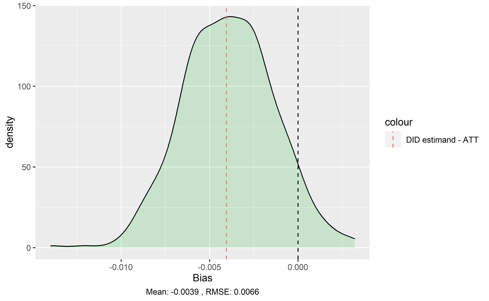
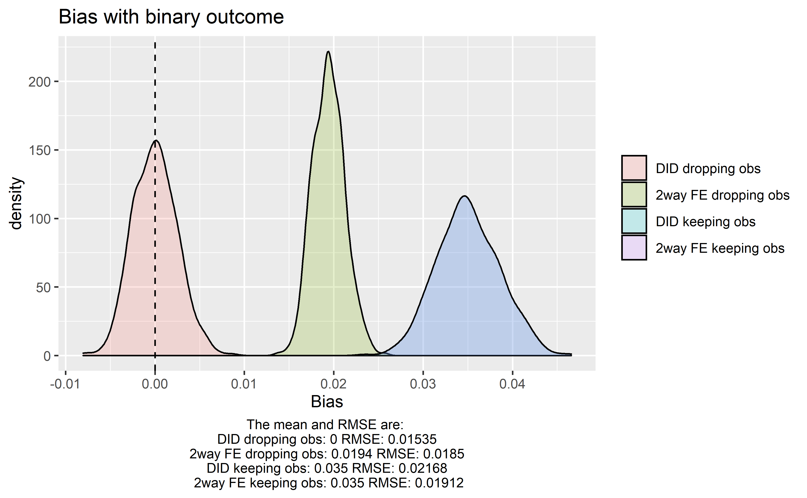
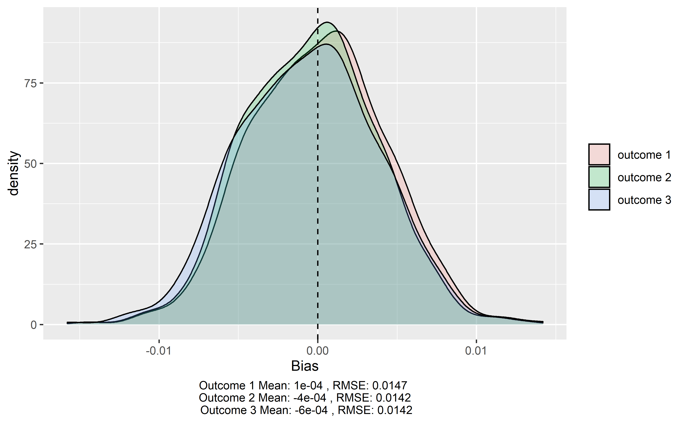
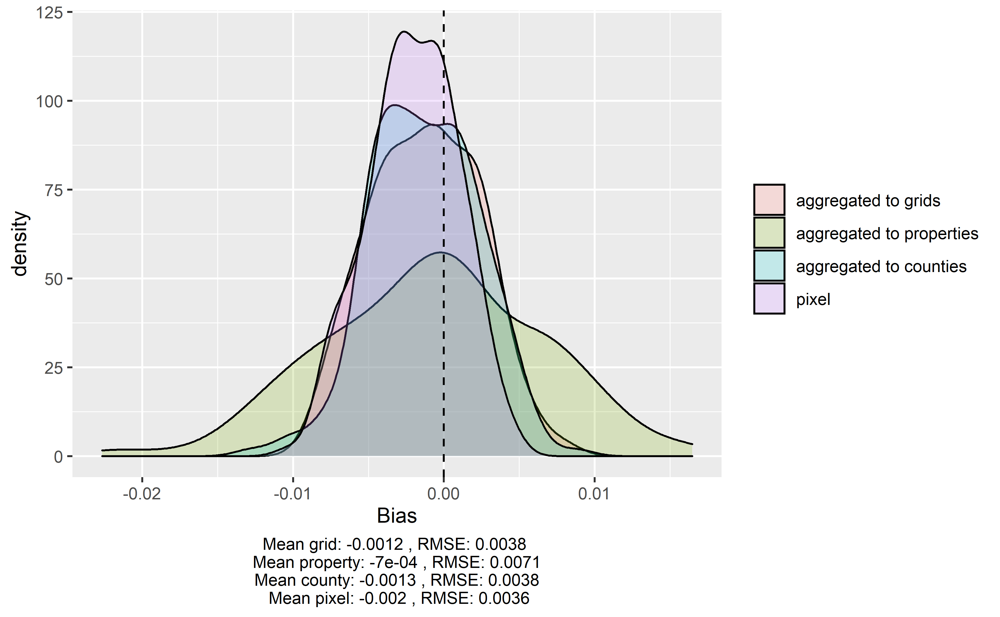
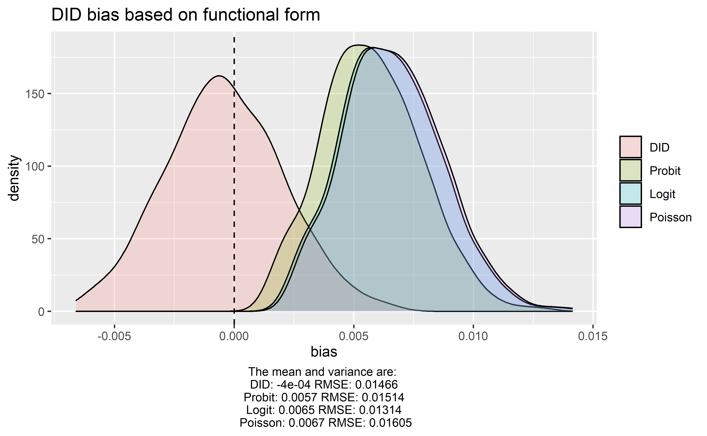

```{r setup, include=FALSE}
library(knitr)
library(ggplot2)
library(kableExtra)
library(tidyr)

knitr::opts_chunk$set(echo = TRUE)
```


## Abstract
Conservation practitioners need rigorous evidence measuring the effectiveness of proposed policy interventions. In response, scientists are increasingly combining methods of impact evaluation with remotely sensed data on land use change to assess conservation effectiveness. Here we review this burgeoning literature to develop practical guidance for the design of econometric models quantifying conservation policy effectiveness. Using Monte Carlo simulations and analytical proofs, we demonstrate that many of the models employed for conservation impact evaluation suffer from significant bias - the significance, magnitude and even direction of estimated effects from many studies may be incorrect. These errors threaten to undermine the evidence base that is increasingly used to inform conservation policy adoption. To address this concern, we provide clear guidance to help scientists minimize the bias of their impact evaluations by carefully designing the structure of their econometric model, their unit of observation and their method and scale of data aggregation.

<!-- Word count notes: Right now it appears we're hovering around 5,700 words. It looks like the CI word count for reviews is 5,000. I've started to comment out/ question some of the points in the set up and analysis to bring it down-->

## Introduction
The founding goal of conservation biology is to provide principles and tools to preserve biological diversity [@soule1985]. To live up to this goal, scientists must generate causal evidence detailing the effectiveness of  conservation interventions [@williams2020]. Such evidence is critical for practitioners who grapple with challenging questions of cause and effect. Do marine protected areas stop unsustainable harvesting of fish? Can payments for ecosystem services encourage lasting reforestation? When successful, conservation science provides answers that improve the way society confronts environmental challenges. However, inappropriate methods can yield misleading conclusions and, as a result, risk diverting scarce financial and political resources from the most effective conservation strategies.

Increasingly, conservation science has turned to econometric methods of impact evaluation to disentangle causal relationships [@butsic2017; @baylis2016]. While randomized experiments are the gold standard for scientific discovery in both the natural and social sciences [@edwards2020; @jayachandran2017], conservation often poses questions that are prohibitively expensive, unethical or impossible to pursue through experimentation. In such settings, a growing portfolio of statistical techniques enable researchers to draw causal conclusions using observational data [@larsen2019]. These methods generate accurate estimates of an intervention's impact by comparing observed outcomes to a rigorous counterfactual of what would have happened in the absence of an intervention [@ferraro2009; @meyfroidt2016; @ferraro2019; @ribas2020]. Importantly, these methods account for the non-random assignment of interventions that often confound identification of causal relationships; a low rate of deforestation within a remote protected area may reflect the protected area's effectiveness, or it may be indicative of the remote location's poor suitability for agricultural development [@andam2008; @pfaff2009]. A diversity of research designs such as regression discontinuity, synthetic control, matching, instrumental variables and event studies have been used to generate statistical counterfactuals of conservation interventions [@butsic2017]. These approaches frequently build upon panel data settings in which units are observed repeatedly through time, enabling researchers to observe changes in outcomes after the adoption of an intervention [@blackman2013]. When a rigorous research design is applied to panel data, observational studies can yield conclusions that are comparable to what a researcher would discover if they were able to run a randomized experiment [@ferraro2017].

Conservation impact evaluation increasingly makes use of panel data thanks, in large part, to the proliferation of remote sensing [@blackman2013; @jones2015].  For example, NASA's landsat missions provide detailed and consistent information on land use spanning the entirety of the world since the 1970s [@hansen2012]. As a result, a scientist hoping to quantify the impacts of a land use policy adopted decades ago can assemble data for treated and control units that span both pre- and post-implementation periods [@jain2020]. New sensors and methods allow for similar time series tracking changes in air pollution, fires, or animal movement [XX].

However, many of these remotely sensed metrics have structural differences from the data used in more traditional applications of causal inference. These differences include the underlying error structure of generated data products and unique properties of the ecological processes being studied. Here we demonstrate that, as a result of these differences, many of the econometric models used in this growing literature are likely biased - significance, magnitude and even direction of estimated effects might be incorrect. These biases arise even when researchers follow common guidance to adopt "rigorous" research designs with valid counterfactuals [@blackman2013; @jones2015]. Based on a review of the existing literature, we identify key model design decisions that researchers need to make. Using Monte Carlo simulations and analytical proofs, we show how these design decisions affect the validity of causal inference in these settings. Lastly, we illustrate ways in which scientists can tailor these design decisions to minimize bias and better understand the implications of their impact evaluations.

## Key considerations for impact evaluations of deforestation
We focus on the case in which a researcher would like to quantify the impact that an intervention has had on deforestation rates. We assume that the intervention has clearly defined boundaries (e.g. a protected area, certified concession, or indigenous territory), and that the researcher has access to spatially explicit observations of forest cover and forest loss spanning the periods before and after the intervention was adopted. The fundamental problem of causal inference is that, for every treated unit, we fail to observe the value that the outcome would have taken in the absence of treatment [@holland1986]. Figure 1 displays this problem in the context of our simulated conservation intervention --- Panel A depicts the landscape as observed by the researcher at the end of the observation period, while Panel B depicts the unobservable counterfactual of what would have happened if the conservation intervention had not been adopted. The researcher's goal is to measure the Average Treatment Effect on the Treated $(ATT)$, which quantifies the avoided deforestation occurring inside treated units. This general setting describes a broad array of research studies that apply panel methods to remotely sensed data (Table 1). 


```{r, echo=FALSE,out.width="49%", fig.pos = 'H', fig.cap="Left: deforestation observed in the period after the policy has been implemented in the intervention area; Right: deforestation that would have ocurred in the absence of the conservation intervention at the same point in time. Note that deforestation in the control area is the same in both cathe realized and counterfactual cases, since no intervention ocurred.", fig.show='hold', fig.align='center'}
knitr::include_graphics(c("landscape_figs/period2_nolegend.png","landscape_figs/counterfactual.png"))
```
<!-- FIGURE NOTES: 
1) Probably want to make clear that figures both represent the landscape at the same point in time, ie the end of the observation period 
2) XX Maybe rename "counties" as "Administrative unit" to make them more globally relevant?
3) XX Maybe rename "control area" as "Untreated area" since some methods would drop some counties
4) Group control area and intervention area labels; separate from deforested pixel / counterfactual deforestation
5) Maybe add a table on the side that illustrates a simple calculation of the ATT? ie - Mean observed deforestation: XX; Mean counterfactual deforestation: XX; ATT: XX. Or maybe it'd be better to just integrate this into the caption?
-->


In panel data settings, two broad methods are often used to measure the impact of conservation interventions: Difference-in-Differences (DID) and Two-way Fixed Effects (TWFE) regression models [@blackman2013; @jones2015]. The typical DID regression model includes a dummy variable equal to one for units in the treatment group, a dummy variable equal to one for observations in the period after the intervention, and their interaction. Conceptually, the DiD estimator calculates the treatment effect as the difference between the differences of the treated and untreated observations before and after treatment [@butsic2017]. The DID estimator identifies the ATT under one main assumption, known as the common trends assumption. It amounts to assuming that both units in the intervention area and untreated units would have experienced the same average change in the outcome in the absence of the intervention. While fundamentally untestable, ensuring that deforestation rates in the intervention area and the control area followed parallel trajectories prior to the date of the intervention can give creedence to this assumption [@butsic2017]. 

Figure 2 shows the intuition behind the DID estimator in two time periods. Deforestation rates in the control area changed between the first and second period. The common trends assumption amounts to assuming that the deforestation rate in the intervention area would have changed by the same amount in the absence of the intervention. In our example, the DID estimator is the difference between post and pre-treatment deforestation rates in units with the intervention, minus the difference between post and pre-treatment deforestation rates in units without. 

```{r, echo=FALSE,out.width="49%", fig.cap="Left: deforestation observed in the first period; Right: deforestation observed in the second period. Note that pixels deforested in the first period are still observed as deforested in the second", fig.show='hold', fig.align='center'}
knitr::include_graphics(c("landscape_figs/landscape_did.png"))
```
<!-- FIGURE NOTES: 
1) It might be easier to read if you collapsed the two panels into one - differentiating defor in T0 (white) and defor in T1 (black). 
2) Maybe couple this with a graph showing defor in the two groups through time (boxplot?), and how that is used to calculate DID 
-->


TWFE regression models are often used to apply DID methods to multiple groups or treatment periods. This amounts to estimating a regression that controls for unit and time fixed effects. Intuitively, this can be thought of as including a dummy variable for each unit of analysis and each time period. The fixed effects account for any unobservable confounding variables that may vary across units or through time. When the treatment effect is constant across groups and over time, TWFE regressions
estimate the $ATT$ under the standard common trends assumption [@deChaisemartin2019]. Because TWFE regression models are often used to generalize the DID method, they are used in a wider variety of settings. Settings in which units undergo treatment in more than two distinct time periods may be amenable to TWFE regression, but not the standard DID method. For example, a researcher may use an TWFE regression model to examine the effectiveness of a network of protected areas, where the protected areas where created at different times or a payment for ecosystem services (PES) program, which enrolls properties in annual cohorts. In the case of two groups and two time periods, the TWFE regression should give an estimate equivalent to that of the DID model [@wooldridge]. This flexibility has led to TWFE regression models becoming commonplace in the literature. 

### Key model parameterizations in the literature

<!-- Several key decisions must be made by the researcher in the design of the econometric model for causal inference. We outline some of the key design decisions including the choice between DID and TWFE models, the unit of analysis, functional form, and calculation of deforestation rates. Minimal guidance currently exists on how to think about these decisions.   -->

#### Unit of analysis
Analyses using a binary pixel or plot are common in the literature [@jones2015]. One benefit of a pixel level analysis is that results can be interpreted directly as the average effect across the landscape [@alix-garcia2017]. This may be preferable in contexts where there is no clear alternative unit of interest. For example, @anderson2018 explore how overlapping land allocations impact deforestation. Here, the estimated effect from a pixel-level analysis is more intuitive than would be generated from an "overlap" level analysis, where the coefficient could be interpreted as the average effect on a representative "overlap". Pixel level analyses often times requires the researcher to sample points in the interest of computational feasibility [e.g. @alix-garcia2018; @anderson2018]. 

Sampling pixels from the landscape may ignore important spatial dependencies or relationships that would be captured with aggregation. Some papers, as a result, choose to aggregate pixels to the grid level. This maintains the landscape-scale interpretation provided by pixel level analyses, while allowing the author to include every pixel in the analysis within a manageable number of grid cells. In exchange for fine-scale spatial specificity, using coarser-resolution cells rather than pixels has the benefits of diluting the effects of possible spatial misalignments between datasets, enabling easier interpolation of missing data within cells, and subsuming localized spatial correlation [@busch2015]. Although not necessarily an issue, one consideration of using grid cell aggregation is the potential for the grid cell to overlap two or more administrative units. In this case, the treatment variable will be continuous, or the researcher must make a decision as to how treatment should be assigned. 

Several other papers choose to conduct analysis at the level of the property or comparable decision making unit. This level of analysis matches the scale at which management decisions occur [@carlson2018], and has been promoted in the context of PES programs that enroll at the property level. Using the entire area owned by an individual landowner may provide the secondary advantage of indirectly addressing slippage within the property. Spatial spillover effects that may occur when the intervention spurs deforestation on other parts of a management unit or landowner property are accounted for [@blackman2018; @alix-garcia2014; @arriagada2012]. Although this does not apply to general equilibrium leakage due to price responses or changes in relative profitability [@arriagada2012], this offers one advantage relative to a pixel or grid level analysis.

Property level analyses have been promoted in the context of PES programs, but some researchers have avoided them due to interpretability in certain situations. The interpretation on the treatment effect coefficient is the average effect on a property with average characteristics [@alix-garcia2017]. The effect of the intervention on a landowner's land use decisions is likely what the researcher is after when evaluating PES program, however, this measure may be less directly related to the success of a landscape-scale intervention. If a property does not have an easily attributable first date of treatment because of shifts or overlaps in boundaries over time, it may also not be an easy unit of analysis to work with.

Some researchers choose to use a larger administrative boundary as the unit of analysis such as the state, municipality, or county in order to address the level at which the intervention is applied. Again, this may mitigate concerns over bias emerging from local spillovers within an administrative unit [@sims2017]. 


#### calculating deforestation rates and outcomes

Upon choosing an aggregated unit of analysis, the researcher must compute the deforestaion rate. This varies thoughout the literature, and many authors do not explicitly define the formula used. Different names are used to describe the calculation of the annual deforestation rate, which generates further confusion [@puyravaud2003]. 

A common formula to calculate annual deforestation rates is
\begin{align}
r_1 &= \frac{F_{i,t-1} - F_{it}}{F_{i,t-1}}
\end{align}
, where $F_{it}$ and $F_{i,t-1}$ are the forest cover at times $t$ and $t-1$, respectively. This calculation is used consistently in the literature [e.g. @carlson2018; @busch2015] and has been referred to as the rate of deforestation, and annual deforestation percentage. 

Some authors have also calculated the deforestation rate in relation to the initial observed level of forest cover, presumably replacing $A_1$ with $A_0$, the baseline forest cover, in equation (1)
\begin{align}
r_2 &= \frac{F_{i0} - F_{it}}{F_{i0}}
\end{align}

@puyravaud2003 suggest the rate of annual forest change be calculated instead using
\begin{align}
r_3 &= ln(F_{it}/F_{i,t-1})
\end{align}

The deforestation rate can be obtained by computing $-r_3$. This formula is derived from the Compound Interest Law and has also been used in recent studies [e.g. @ruggiero2019]. It has been suggested, because $r_1$ may underestimate deforestation, relying arbitrarily on the period's initial forest cover ($F_{it}$) as a baseline. As deforestation rates grow larger, the difference between $r_1$ and $-r_3$ grows. 


#### Functional form

The decision of functional form is another often overlooked decison, particularly with a binary measure of forest cover. The vast majority of papers use OLS, maintaining a linear functional form. Few authors explain their reasoning for choosing the functional form of the econometric model, whether linear or non-linear. In many cases, the distribution of observed data is nonnegative and concentrated near zero deforestation [@carlson2018; @busch2015]. @busch2015 argues a poisson model is theoretically consistent with forest cover loss within an aggregated unit being the count of many independent, discrete binary observations of forest cover loss at the pixel level. 

While non-linear functional forms may be theoretically preferable to OLS, this is often times more complicated to implement in practice. In order to obtain an interpretable estimate of the $ATT$, researchers using non-linear functional forms generally need to compute marginal or average partial effects from the estimated coefficients. It has been noted in the impact evaluation literature that fixed effects cannot typically be used in most non-linear methods due to the incidental parameters problem [e.g. @jones2015; @wendland2015], favoring the use of OLS in regression models containing fixed effects. @fernandez-val2016 show that a bias correction is needed to get asymptotically unbiased estimates logit, probit, and poisson TWFE models. These bias corrections are available in various statistical packages and are necessary in order to get unbiased estimates when using fixed effects with non-linear functional forms. 


\renewcommand{\arraystretch}{1.5}
```{r table1, echo = FALSE, results = "asis", fig.show='hold'}

lit_table <- read.csv("lit_table.csv")[,1:4]

kable(lit_table, format = "latex", 
      caption = "Table of common methods in the literature",
      col.names = c("Paper",
                    "Panel Method",
                    "Unit of analysis",
                    "Functional form")) %>% 
  row_spec(0,bold=TRUE) %>% 
  kable_styling(font_size = 10, latex_options = c("striped", "HOLD_position"),
                #full_width = TRUE
                position = "left"
                )

```


## Methods
### Monte Carlo simulations
We employ a series of Monte Carlo simulations to (1) generate synthetic landscapes with known policy effectiveness and (2) analyze the performance of different econometric models in estimating the policy's known impact. Our landscape consists of administrative units that are either untreated $(D=0)$ or are assigned to a conservation treatment $(D=1)$. We observe deforestation in two, even-length periods, a pre-treatment $(t < t_{0})$ and a post-treatment $(t \ge t_{0})$ period. The data generating process underlying our Monte Carlo simulations begins with the assignment of four parameters: The mean, pre-treatment period deforestation rate for untreated units, $baseline_0$; the mean, pre-treatment period deforestation rate for treated units, $baseline_1$; untreated units' mean change in deforestation rates occurring between the pre- and post-treatment periods, $trend$; and lastly, the average treatment effect of the policy on the treated units, $ATT$. The ATT is the primary parameter the researcher is interested in estimating. 

Rather than directly observing each unit's deforestation rate in each time period, the researcher observes annualized maps depicting pixel-level, binary deforestation $(y_{it}\ \epsilon \ 0, 1)$. We follow XX and assume that these binary observations of deforestation reflect each pixel's unobservable value along a continuous, latent variable indicating the pixel's suitability for deforestation. We define this latent variable as:
\begin{align}
y^*_{it} = \beta_0 + \beta_1 \mathbbm{1}\{  D_i = 1  \} +\beta_2 \mathbbm{1}\{  t \geq t_0  \} +\beta_3 \mathbbm{1}\{  D_i = 1  \} \mathbbm{1}\{  t \geq t_0  \} + \alpha_i +u_{it}
\end{align}
The $\beta$ coefficients can be defined as functions of the four parameters assigned by the researcher (Appendix 1). A pixel-specific random disturbance is generated according to $\alpha_i \sim N(0, \sigma_a^2)$ and the error term is generated according to $u_{it} \sim N(0, \sigma_u^2)$. 


The mapping from the latent to observed variable $y_{it}$ is
\begin{align}
 y_{it} = \begin{cases} 
      1 & y^*_{it} > 0  \\
      0 & otherwise
   \end{cases}
\end{align}
Here, the observed outcome variable, $y_{it}$, is equal to 1 if pixel $i$ is observed as deforested in time $t$ and 0 otherwise. The observed variable is the binary outcome visible to the researcher, which represents the result of a more complex data generating process that reflects the pre-defined effectiveness of the policy $(ATT)$ as well as temporal trends in deforestation $(trend)$, pre-treatment differences in deforestation probabilities $(baseline_1)$, unobservable, pixel-specific determinants of deforestation $(\alpha_i)$ and time-varying, pixel-level disturbances $(u_{it})$. The area represented by a pixel may not be entirely deforested but may still be classified as deforested using the binary outcome metric. 

### Set up and evaluation


It is not uncommon to see annual treatment effects amounting to less than a 1% reduction in the annual deforestation rate [e.g. @robalino2013; @jones2017]. These modest reductions in the annual deforestation rate, however, can amount to large effects over the course of the study period. For example, @alix-garcia2018 find that environmental land registration in Brazil’s Amazonian states of Mato Grosso and Para reduced the annual deforestation rate by an average 0.5 percentage points, which has  amounted to an overall deforestation reduction of 10\%. We have parameterized a guiding example, representative of an impactful intervention, to explore for the remainder of the paper. The results of two other examples are displayed in Table XX, however our general messages are consistent across landscape parameterizations. 

<!-- The initial simulated landscape has the following characteristics: a pre-treatment deforestation rate of 2\% in the control area ($baseline_0 = 0.02$); a pre-treatment deforestation rate of 4\% in the intervention area ($baseline_1 = 0.04$); a decrease in the deforestation rate of .5\% between the first and second period in the control area ($trend = -0.005$); and an average reduction of 1\% in the deforestation rate in treated units due to the intervention ($ATT = -0.01$). Lastly, we assign $\sigma_a = .25$ and $\sigma_u = .1$.  -->

<!-- ** 
Hoping to convert most of the above three paragraphs to a table of parameters
--> 

The primary criteria we use to compare econometric models are the bias and coverage probability of their estimate of the $ATT$ parameter. Using our Monte Carlo simulations, we determine bias by computing the difference between each model's estimate of the ATT and the known $ATT$ parameter. Coverage probability is defined as the proportion of simulations in which the true $ATT$ lies within the simulation's 95\% confidence interval (CI). As such, we would expect the $ATT$ to lie within this CI 95\% of the time, however, factors such as the bias of the estimates, their distribution, and treatment of standard errors may impact coverage. If the estimator is biased, for example, it is ex-ante less likely that the true parameter falls within the CI. 

## Results

### Bias inherent to binary deforestation DGP

Bias often arises in the DID and TWFE models because of the data generating process inherent to remotely sensed metrics of deforestation. In the case of a binary pixel, the researcher does not observe the underlying spatial process of deforestation. The pixel is realized as deforested only when clearing exceeds some specific threshold (expressed in equation (5)). The use of NDVI or canopy cover thresholds to define a binary forest cover variable are prevalent in the literature [e.g. @holland2017, @honey-roses2011, @bruggeman2015]. For example, @takahashi2013 and @southworth2004 explicitly determine a threshold value of NDVI and define pixels with NDVI values that are greater than the threshold as forested. Here, a pixel may be subject to continuous clearing pressure but only be classified as deforested when the NDVI value drops below the threshold value. Alternatively, discontinuous clearing pressure may exist but will only be realized when a deforestation event causes the pixel to drop below the threshold. Even popular forest loss datasets [e.g. @hansen2013] that detect deforestation by stand level disturbance may suffer from similar bias, since a clearing event must exceed some threshold to be detected. Therefore, small-scale logging and deforestation events are less likely to be detected, potentially leading to an underestimate of forest loss [@burivalova2015]. Some level of misclassification error, and resulting bias, is extremely likely in the classification of pixels into a binary forest cover outcome. 


<!-- This is representative of many analyses using binary satellite measures of deforestation. Building the panel of binary outcomes based on a threshold tree cover level is prevalent in the literature. For example, @takahashi2013 and @southworth2004 determine a threshold value of NDVI and define pixels with NDVI values that are greater than the threshold as forested and areas with NDVI values below the threshold as non-forest. @holland2017 set a classification threshold of 50\% canopy cover to calculate percent loss of the baseline forest cover and annual percent change in forest, building from updated forest base estimates for each year. Several other papers use a threshold tree cover level or index value to aid in the generation of the outcome variable [e.g. @honey-roses2011; @bruggeman2015]. Even popular forest loss datasets such as [@hansen2013] that gauge deforestation by stand level disturbance may suffer from similar bias, since it is challenging to detect small-scale logging and deforestation, which may lead to an underestimate of forest loss [@burivalova2015]. If one wanted to analyze the impact of a new policy on forest cover loss, but the policy resulted only in small-scale deforestation, the systematic error in the forest change data product would lead to a severe underestimation of forest cover loss [@jain2020]. 
This bias is distinct from that which may arise from satellite sensor characteristics, satellite angle, or atmospheric conditions [@jain2020]. We do not explore the interaction of these two potential sources of bias in our paper, however, it is likely an important consideration.  

Current framing seems to indicate that the latent variable is mapping %deforestation -> binary deforestation. While I think that's part of what's going on in the mapping, I don't think that captures all situations. The latent variable also allows for discontinuous clearing pressure - ie clearing of an entire pixel occurs when the value of clearing exceeds some specific threshold. This is similar to employment termination models, where an individual is fired if y*>0. Nicoletti and Rondinelli, 2010
-->

Mathematically, this bias will arise any time the latent variable has error generated according to a distribution with a nonlinear cumulative distribution function. and is subsequently mapped to a binary observable outcome subject to a threshold. In Figure 3, we can see this bias in the context of our guiding example. Allowing the outcome to vary between 0 and 1 across time periods allows us to see the bias due only to the disparity between the underlying spatial data generating process and the observed binary outcome. We do not exolore the sensitivity of this bias to various thresholds, but bring attention to its existence. For the remainder of the paper, we net out this bias in order to focus on bias that arises from various model selection decisions.

```{r, echo=FALSE,out.width="75%", fig.cap="Inherently biased estimates due to nature of observed data", fig.pos='H', fig.align='center'}

```

### Unit of analysis

#### Treatment of binary outcome
Analyses at the pixel level are prevalent in the literature, as seen in Table 1. Further, it has often been promoted as the preferred unit of analysis in certain cases. The pixel is generally the level at which the researcher is able to observe the data and is assigned a binary outcome. Remotely sensed metrics of deforestation at the pixel level are often subject to the dynamics of forest disturbance and regrowth. After a deforestation event occurs, the deforested area is unlikely to revert to forest cover within the study period, as it takes several years for forest to regenerate to a detectable level. In the panel therefore, it is probable that in the periods after a pixel is first realized as deforested, subsequent observations of the pixel will also observe the pixel as deforested. 

In order to account for these dynamics in the context of deforestation, it has been advised to drop deforested pixels in the periods after they first become deforested [@jones2015; @alix-garcia2017]. The logic for doing so is as follows. A forested pixel switches from its assigned value of 0 to a value of 1 following a discrete deforestation event. Keeping the deforested pixel in the panel beyond the first period in which it was observed as deforested may imply that it has actively been deforested in each subsequent time period. In fact, no new deforestation event has ocurred, but the area simply remains deforested from the prior event. These pixels, therefore, contribute positively towards the deforestation rate in each period they are left in the panel. Indeed, we see in our Monte Carlo simulations that DID regression models failing to drop deforested pixels in subsequent periods incur severe bias. 

Figure 4 demonstrates the magnitude and direction of the bias incurred from keeping deforested pixels in the panel after they are first realized as deforested in the context of our guiding example. Pixels that were deforested prior to the implementation of the policy continued to contribute to the deforestation rate in the post period in both the treatment and control groups. Dropping the pixels in the periods after they are first observed as deforested mitigates this bias in the DID model, as seen in Figure 4. 

```{r, echo=FALSE,out.width="49%", fig.cap="Left: distribution of DID estimates leaving deforested pixels in the panel; Right: DID estimates dropping deforested pixels", fig.pos = 'H', fig.show='hold', fig.align='center'}
knitr::include_graphics(c("figs/fig2.png", "figs/fig3.png"))
```

#### Issue with TWFE using pixel as unit of analysis
Despite widespread use of pixel level analyses, they are problematic in the context of TWFE regression models. In fact, the TWFE model yields the post-treatment difference in outcomes (single difference), rather than the desired ATT. We provide two forms of evidence to support this claim: (1) evidence from our Monte Carlo simulations and (2) an analytical proof found in the appendix. The result stems from the fact that the TWFE regression is only able to identify off of pixels that are not dropped over the course of the observation period. Thus the pre-treatment period deforestation rates are not accounted for in the TWFE estimates. 

```{r, echo=FALSE,out.width="75%", fig.cap="Distribution of estimates produced depending on pixel level regression model", fig.pos='H', fig.align='center'}

```

In Figure 5, we see Monte Carlo Outcomes for four econometric model specifications with a binary outcome: (1) DID dropping deforested pixels from the panel for the periods after they are first realized as deforested; (2) TWFE dropping deforested pixels from the panel for the periods after they are first realized as deforested; (3) DID keeping deforested pixels in the panel for the length of the study period; and (4) TWFE keeping deforested pixels in the panel for the length of the study period. We see that estimate distributions from specifications (3) and (4) are identical, showing that DID and TWFE regression models are generally identical in the two-group, two-period case. As described above, we again see the bias resulting from leaving deforested pixels in the panel for the duration of the study period in specifications (3) and (4). 

We now bring attention to the distinction between specifications (1) and (2). In both specifications, observations are dropped from the panel in the periods after they are first realized as deforested. As discussed and seen in Figure 4, this is preferable in terms of bias when using the pixel as the unit of analysis. The figure shows, however, that the TWFE model returns a biased measure of the ATT, and in fact, estimates an ex-post single difference. Table 3 shows the resulting bias in the context of the guiding example. 

<!-- I've also transitioned the below paragraph into a table in order to reduce word count -->

<!-- In our guiding example, the ex-post single difference is 0.01 (the $ATT$ plus the pre-treatment group difference in deforestation rates), which would seem to indicate a increase of 1\% in the deforestation rate due to the intervention, when it actually led to a 1\% decrease in the deforestation rate. Thus, the ex-post single difference as well as the TWFE estimate, is biased positively by 2\%, as evidenced both in Figure 5 and the analytical proof found in the appendix. In the context of our guiding example, this also leads to a change in the direction of the estimated $ATT$, which could influence policymakers to avoid an effective policy design. This shows that TWFE models using the pixel as the unit of analysis are not a viable approach to estimate the $ATT$ in deforestation impact evaluations. In contrast, the DID regression model does not suffer from this severe bias. While pixel-level analyses are not feasible in TWFE regression models, the grid-level is a viable substitute for comparable interpretation. In cases where the researcher has two groups and two distinct time periods, a pixel level analysis is still feasible using the simple DID model.  -->

```{r simple table, echo = FALSE, results = "asis", fig.show='hold'}

simple_table <- read.csv("simple_table.csv")[,2:5]

kable(simple_table, format = "latex",
      caption = "ATT versus ex-post single difference (difference in treated and untreated deforestation rates after intervention) in guiding example",
      col.names = c("treated ex-post",
                    "untreated ex-post",
                    "ex-post single difference",
                    "true ATT")) %>%
  row_spec(0,bold=TRUE) %>%
  kable_styling(font_size = 10, latex_options = c("HOLD_position")
                #full_width = TRUE
                #position = "left"
                )

```


In the guiding example, the positive bias also leads to a change in the direction of the estimated $ATT$, which could influence policymakers to avoid an effective policy design. This shows that TWFE models using the pixel as the unit of analysis are not a viable approach to estimate the $ATT$ in deforestation impact evaluations. In contrast, the DID regression model does not suffer from this severe bias, meaning that a pixel level analysis is feasible in the two-period, two-group case. 


### Calculating deforestation rates

Upon aggregating data, the researcher must determine how to calculate deforestation rates in the outcome. With no clear guidance on how this deforestation rate should be computed, there have been a variety of techniques used. We examine the three methods outlined in section 2.  

\begin{center}
\begin{table}[H]
\begin{tabular}{cc}
\cline{1-2}
& \textbf{Outcome}  \\ \cline{1-2}
(1) & $\frac{F_{i,t-1} - F_{it}}{F_{i,t-1}}$ \\ \cline{1-2}
(2) & $\frac{F_{i0} - F_{it}}{F_{i0}}$\\ \cline{1-2}
(3) & $log(F_{i,t-1}/F_{it}) $ \\ \cline{1-2}
\end{tabular}
\end{table}
\end{center}

```{r, echo=FALSE,out.width="75%", fig.cap="Distribution of estimates produced by different outcome variable formulae", fig.pos='H', fig.align='center'}

```

As seen in Figure 7, outcome 1 results in the least bias in our guiding example. The other outcomes result in relatively greater bias, although this difference seems minimal in our guiding example. 

We express some concern surrounding the use of the initial baseline forest cover in analyses, as in formula (2). In settings with high deforestation rates, this outcome may overestimate the deforestation rate. As the rate is calculated in periods far away from the baseline, the deforestation rate will be increasingly high. This may impact the viability of the analysis, as the rate becomes artificially inflated in later years. 

Regardless of authors' choice of formula, we advise that this formula be explicitly stated in the paper. This will help to avoid confusion as to which formula was used and help researchers understand which methods are the standard within the literature. Moving forward in our paper, all specifications using aggregated data use outcome 1. In our guiding example, it resulted in the least bias, and it is currently the most common deforestation rate calculation used in the literature. 

#### Aggregated Outcomes
Since pixel level analyses are not feasible in the context of TWFE regressions, researchers should be aware of the tradeoffs using aggregated units of analysis. The following results apply to both DID and TWFE regression models, as both are equivalent in the two-period, two-group example. We now opt to use TWFE regression models when aggregating data, and DID regression models for pixel level analyses due to the aforementioned issues with TWFE regressions at the pixel level. 

For simplicity, we assume the researcher can choose between three levels at which to aggregate the data: grid cell, county, and property. Grid cells are uniform grids layered over the study area and may have a treatment value between 0 and 1 following aggregation of pixels. Counties are heterogeneous administrative units at which we now assign the treatment. Lastly, properties are smaller administrative units within a county. 


```{r, echo=FALSE,out.width="75%", fig.cap="Distribution of estimates produced by level of aggregation", fig.pos='H', fig.align='center'}

```

We find little evidence that any one level of aggregation is consistently preferrable in terms of bias, meaning that coverage probability plays a larger role as an evaluation metric. We explore the bias and coverage probabilities corresponding to different levels of aggregation in the context of our guiding example. Figure 8 shows that the bias of the estimates is not critically different depending on level of aggregation, however, the distributions are varied. Notice that the distribution of estimates when aggregating to the property level is wider than the others. This is likely due to heterogeneity in property size. The distribution of the estimates, bias, and standard error structure will affect the coverage probabilities. We compare coverage at each level of aggregation in Table 2 using classical standard errors. We have not yet introduced any structure into the DGP that would warrant clustering. Despite the clear differences in the distributions of estimates, both pixel and property-level analyses yield the desired 95\% coverage probabilities. 

```{r table2, echo = FALSE, results = "asis", fig.show='hold'}

coverage_table <- read.csv("coverages.csv")[,2:4]

kable(coverage_table[4:7,], format = "latex", row.names = FALSE,
      caption = "Table of coverage based on unit of analysis",
      col.names = c("unit of analysis",
                    "standard error structure",
                    "coverage probability")) %>% 
  row_spec(0,bold=TRUE) %>% 
  kable_styling(font_size = 10, latex_options = c("HOLD_position"),
                #full_width = TRUE
                position = "center"
                )
```


#### Property level unobservables
Property level unobservables may impact both treatment effect estimates and coverage probabilities. This is likely to be a factor when land use decisions are made at the property level or the intervention seeks to alter underlying landowner incentives. We introduce an additional error term to the initial DGP that varies at the property level in order to account for these unobservables. This property level error term is generated according to $\rho_{ip} \sim N(0, .15^2)$. Table 3 shows that property level unobservables negatively impact coverage at every level without clustering standard errors. The property level analyses suffer the least from this reduced coverage probability. 

```{r table3, echo = FALSE, results = "asis", fig.show='hold'}

coverage_table2 <- read.csv("coverages_p15.csv")[,2:4]
  

kable(coverage_table2[4:7,], format = "latex", row.names = FALSE,
      caption = "Table of coverage in presence of property level unobservables",
      col.names = c("unit of analysis",
                    "standard error structure",
                    "coverage probability")) %>% 
  row_spec(0,bold=TRUE) %>% 
  kable_styling(font_size = 10, latex_options = c("HOLD_position"),
                #full_width = TRUE
                position = "center"
                )
```

As property level unobservables play a larger role, the treatment of standard errors also becomes more important. Almost all studies in the literature use clustered standard errors for inference. The clustering problem is casued by the presence of a common unobserved ramdom shock at the group level that will lead to correlation between all observations within a group [@hansen2007]. We have introduced the random shock at the property level in our guiding example to represent the decision-making unit. As such, correlation within grids and counties will also be introduced, since they contain multiple pixels within a property. Clustering standard errors relaxes the assumption of no correlation across observations within the spatial unit used for clustering [@jones2015]. Examining the below table shows that clustering to the respective level of aggregation does indeed improve the coverage probability. Property level aggregation leads to relatively preferred coverage probabilities, regardless of the standard error structure. These results highlight the benefit of using the relevant decision-making unit as the unit of analysis as well as clustering standard errors at that level. 


```{r table4, echo = FALSE, results = "asis", fig.show='hold'}

coverage_table3 <- coverage_table2[1:3,] %>%
  rbind(coverage_table2[8,])

kable(coverage_table3, format = "latex", row.names = FALSE,
      caption = "Table of coverage in presence of property level unobservables",
      col.names = c("unit of analysis",
                    "standard error structure",
                    "coverage probability")) %>% 
  row_spec(0,bold=TRUE) %>% 
  kable_styling(font_size = 10, latex_options = c("HOLD_position"),
                #full_width = TRUE
                position = "center"
                )
```


<!-- ** 
One idea for a nice summary figure: I wonder if it's possible to create a variant of Ariel Ortiz-Boboa's regression specification chart to display all of the above models at once (https://twitter.com/arielortizbobea/status/1237518566598963200?lang=en)
Imagine the boxes representing the bias distribution for each econometric model specification, the bottom boxplot illustrating deviation from 95% confidence interval, and the table below highlighting the specifications. This could be an amazing way to summarize the results of any model specification in one figure for the eventual shiny app. It'd also allow us to compare how sensitive our results are to different parametrizations. 
-->

### Functional form

We now seek to explore the effect of using non-linear functional forms. We use DID regression models at the pixel level in this section to avoid the aforementioned issues with FE models at the pixel level. We also reintroduce the bias due to classification error in the dgp in order to explore whether alternative functional forms may help to mitigate this bias. Coefficient estimates are converted into the $ATT$ using the \textbf{mfx} package in R, which takes into account the binary nature of the treatment variable. 

```{r, echo=FALSE,out.width="75%", fig.cap="Distribution of estimates produced by different functional form", fig.pos='H', fig.align='center'}

```

We see in Figure 6 that the OLS model outperforms the non-linear specifications when not accounting for bias emerging from classification error. However, upon considering the bias resulting from the classification error, non-linear functional forms are preferable. The underlying DGP and error structure play a role in determining which functional form leads to the least bias in a given scenario. As is common in the literature already, we advise that authors check that the result is robust to different choices of functional form. 


We leave a thourough discussion of the choice of functional form in the presence of non-classical measurement error to future work, but highlight the importance of this area of exploration.  

## Discussion
This paper seeks to leave researchers with a clear sense of the decisions that play a role in their choice of econometric specification. We discuss and show the benefits of conductiong the analysis at the level of the relevant decision making unit when it is of importance. Choice of functional form should be justified in the context of each institutional setting, taking into account the underlying DGP. Robustness checks should account for the possibility of alternative functional forms. Formulas in the calculation of the deforestation rate should be made explicit to avoid confusion. Ultimately, context plays a role in all of these decisions. There is no one size fits all econometric specification and researchers should make clear which decisions they have made as well as their reasoning. We have developed a shiny app available at .. so that researchers can explore the potential tradeoffs with choices of econometric model design.  

Several econometric considerations relevant to model design and interpretation were not explored in this paper. FE regression models have received substantial attention in the econometrics literature recently regarding concerns surrounding their viability and interpretability [e.g. @kropko2020]. For example, properties of FE regression models that arise when the treatment effect is heterogeneous across groups or over time may lead to erroneous results [@deChaisemartin2019]. We largely abstract away from choices of scale with regards to grid size or unit of analysis, but biased estimates may result from scale choices that are too large or too small relative to the data generating process or decision unit [@avelino2016]. This makes choice of grid cell size a relevant but unexplored aspect of our study. We do not address more general considerations surrounding the use of satellite data including satellite sensor characteristics, atmospheric conditions, or the error structure of certain remotely sensed data products [@jain2020]. These considerations all play a role in the choice of econometric method, but are left for future exploration. Lastly, the benefits of pre-matching control and treatment units is not addressed, but they are well understood to be substantial [e.g. @jones2015; @blackman2013]. 

Without clear guidance on key econometric model design decisions, a wide variety of methods have been used in the literature using quasi-experimental methods for conservation impact evaluation. We show that a number of studies likely provide estimates that suffer from bias or improper inference. In particular, our result about the use of FE models with the pixel as the relevant unit of analysis casts doubt as to the reliability of a significant number of estimates. This said, a significant number of studies have used proper intuition in the design of their econometric models. The increasingly widespread awareness of methods of causal inference is a further positive step. The observations made here may apply to a wider audience beyond the set of researchers investigating the impacts of conservation interventions on deforestation. Any evaluation of interventions implemented at a spatial scale may benefit from this discussion. These results further apply to many settings in which the outcome represents an irreversible binary event. For example, studies addressing technology adoption as an outcome may fall prey to the same issues we describe with a pixel level analysis. Moving forward, it is imperative that researchers use methods that minimize bias and allow inference at expected levels of confidence. Misleading results may lead policymakers to avoid impactful policy designs or adopt policy that worsens environmental damages. 


## Acknowledgements and data
We thank the University of California, Santa Barbara's Academic Senate for a Faculty Research Grant that supported this work. This paper contributes to the global land programme.

## References
<div id="refs"></div>

## Appendix

### Two-way fixed effects proof

We can show that in the case where the binary outcome is dropped in periods after the outcome is realized as a 1, two-way fixed effects regressions typically do not identify the ATT, but the ATT + the group difference. 

proof:


### Initial parameter to $\beta$ coefficient mapping

The researcher sets the following four parameters:

\begin{align*}
baseline_0 &= E[y_{it}(0) |  t<t_0, D_i=0]\\
baseline_1 &= E[y_{it}(0) |  t<t_0, D_i=1]\\
trend &= E[y_{it}(0) |  t\geq t_0, D_i=0] - E[y_{it}(0) |  t<t_0, D_i=0]\\
ATT &= E[y_{it}(1) - y_{it}(0) |  t\geq t_0, D_i=1]\\
\end{align*}

Note the following constraints on the parameters:
\begin{align*}
E[y_{it}(0) |  t \geq t_0, D_i=0] \geq 0\\
E[y_{it}(1) |  t \geq t_0, D_i=1] \geq 0
\end{align*}

The parameters can be expressed as follows:

\begin{align*}
ATT =& E[y_{it}(1) - y_{it}(0) |  t\geq t_0, D_i=1] \\
=& E[ y_{it}(1) |  t\geq t_0, D_i=1] - E[y_{it}(0) |  t\geq t_0, D_i=1]\\
=& P(y_{it}(1) = 1 | t\geq t_0, D_i=1) - P(y_{it}(0) = 1 | t\geq t_0, D_i=1)\\
=& P(y_{it}^* (1) >0 | t\geq t_0, D_i=1) - P(y_{it}^*(0) >0 | t\geq t_0, D_i=1)\\
=& P(\beta_0 + \beta_1 +\beta_2 +\beta_3 + \alpha_i +u_{it} > 0) - P(\beta_0 + \beta_1 +\beta_2 + \alpha_i +u_{it} > 0)\\
=& P(-\alpha_i -u_{it} < \beta_0 + \beta_1 +\beta_2 +\beta_3) - P(-\alpha_i -u_{it} < \beta_0 + \beta_1 +\beta_2)\\
=& F(\beta_0 + \beta_1 +\beta_2 +\beta_3) - F(\beta_0 + \beta_1 +\beta_2)
\end{align*}


\begin{align*}
trend =& E[y_{it}(0) |  t\geq t_0, D_i=0] - E[y_{it}(0) |  t<t_0, D_i=0]\\
=& P(y_{it}(0)=1 |  t\geq t_0, D_i=0) - P(y_{it}(0)=1 |  t<t_0, D_i=0)\\
=& P(y^*_{it}(0)>0 |  t\geq t_0, D_i=0) - P(y^*_{it}(0)>0 |  t<t_0, D_i=0)\\
=& P(-\alpha_i -u_{it} < \beta_0 +\beta_2) - P(-\alpha_i -u_{it} < \beta_0 )\\
=& F(\beta_0 + \beta_2) - F(\beta_0)
\end{align*}

\begin{align*}
baseline_0 =& E[y_{it}(0) |  t<t_0, D_i=0]\\
=& P(y_{it}(0)=1 |  t< t_0, D_i=0)\\
=& P(y^*_{it}(0)>0 | t<t_0, D_i=0)\\
=& P(-\alpha_i -u_{it} < \beta_0 ) \\
=& F(\beta_0)
\end{align*}

\begin{align*}
baseline_1 =& E[y_{it}(0) |  t<t_0, D_i=1]\\
=& P(y_{it}(0)=1 |  t< t_0, D_i=1)\\
=& P(y^*_{it}(0)>0 | t<t_0, D_i=1)\\
=& P(-\alpha_i -u_{it} < \beta_0 +\beta_1) \\
=& F(\beta_0+\beta_1)
\end{align*}


, Where $F()$ is the CDF of a $N(0, \sigma^2_a + \sigma^2_u)$


Now solving for the $\beta$ coefficients:

solving for $\beta_0$
\begin{align*}
& baseline_0= F(\beta_0) \\
\Leftrightarrow \\
& \beta_0 = F^{-1}(baseline_0)
\end{align*}

solving for $\beta_1$
\begin{align*}
& baseline_1= F(\beta_0 + \beta_1) \\
\Leftrightarrow \\
& \beta_1 = F^{-1}(baseline_1) - \beta_0
\end{align*}

solving for $\beta_2$
\begin{align*}
&trend= F(\beta_0 + \beta_2 ) - F(\beta_0) \\
\Leftrightarrow \\
&trend + baseline_0 =F( \beta_0 + \beta_2)\\
\Leftrightarrow \\
&F^{-1}(trend + baseline_0 ) =\beta_0 + \beta_2\\
\Leftrightarrow \\
&\beta_2 = F^{-1}(trend + baseline_0 ) - \beta_0 
\end{align*}

solving for $\beta_3$
\begin{align*}
&ATT= F(\beta_0 + \beta_1 +\beta_2 +\beta_3) - F(\beta_0 + \beta_1 +\beta_2)\\
\Leftrightarrow \\
&ATT + F(\beta_0 + \beta_1 +\beta_2) = F(\beta_0 + \beta_1 +\beta_2 +\beta_3) \\
\Leftrightarrow \\
&F^{-1}(ATT + F(\beta_0 + \beta_1 +\beta_2) )= \beta_0 + \beta_1 +\beta_2 +\beta_3\\
\Leftrightarrow \\
&\beta_3 = F^{-1}(ATT + F(\beta_0 + \beta_1 +\beta_2) )- (\beta_0 + \beta_1 +\beta_2)\\
\end{align*}


### Bias inherent to binary deforestation DGP

This bias can be represented by the difference between the DID estimand and the ATT parameter of interest:

\begin{align*}
&DID_{estimand} - ATT \\
\Leftrightarrow \\
&E[y_{it}(1)  |  t\geq t_0, D_i=1] - E[y_{it}(0)  |  t< t_0, D_i=1] - (E[y_{it}(0)  |  t\geq t_0, D_i=0] - E[y_{it}(0)  |  t< t_0, D_i=0])\\ &- E[y_{it}(1) - y_{it}(0) |  t\geq t_0, D_i=1]\\
\Leftrightarrow \\
&F(\beta_0 + \beta_1 +\beta_2 +\beta_3) - F(\beta_0 +\beta_2) - (F(\beta_0 + \beta_1 ) - F(\beta_0 )) \\&- (F(\beta_0 + \beta_1 +\beta_2 +\beta_3) - F(\beta_0 + \beta_1 +\beta_2))\\
\Leftrightarrow \\
&F(\beta_0 + \beta_1 +\beta_2) + F(\beta_0 )) - (F(\beta_0 +\beta_2) + F(\beta_0 + \beta_1 )) 
\end{align*}


