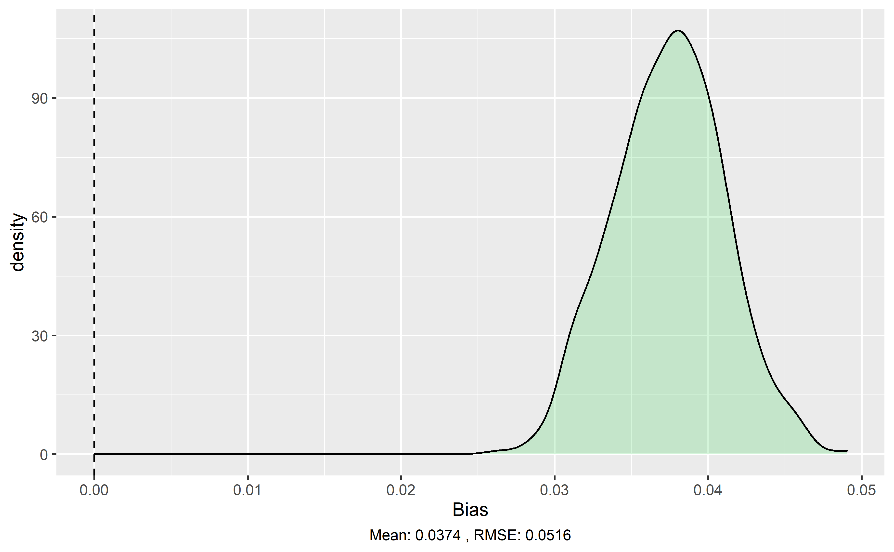

```{r setup, include=FALSE}
library(knitr)
library(ggplot2)
library(kableExtra)

knitr::opts_chunk$set(echo = TRUE)
```


## Abstract
Conservation practitioners need rigorous evidence measuring the effectiveness of proposed policy interventions. In response, scientists are increasingly combining methods of impact evaluation with remotely sensed data on land use change to assess conservation effectiveness. Here we review this burgeoning literature to develop practical guidance for the design of econometric models quantifying conservation policy effectiveness. Using Monte Carlo simulations and analytical proofs, we demonstrate that many of the models employed for conservation impact evaluation suffer from significant bias - the significance, magnitude and even direction of estimated effects from many studies may be incorrect. These errors threaten to undermine the evidence base that is increasingly used to inform conservation policy adoption. To address this concern, we provide clear guidance to help scientists minimize the bias of their impact evaluations by carefully designing the structure of their econometric model, their unit of observation and their method and scale of data aggregation.

## Introduction
The founding goal of conservation biology is to provide principles and tools to preserve biological diversity [@soule1985]. To live up to this goal, scientists must generate causal evidence detailing the effectiveness of  conservation interventions [@williams2020]. Such evidence is critical for practitioners who grapple with challenging questions of cause and effect. Do marine protected areas stop unsustainable harvesting of fish populations? Can payments for ecosystem services encourage lasting reforestation? When successful, conservation science provides answers that improve the way society confronts environmental challenges. However, inappropriate methods can yield misleading conclusions and, as a result, risk diverting scarce financial and political resources from the most effective conservation strategies.

Increasingly, conservation science has turned to econometric methods of impact evaluation to disentangle causal relationships [@butsic2017; @baylis2016]. While randomized experiments are the gold standard for scientific discovery in both the natural and social sciences, conservation often poses questions that are impossible or unethical to pursue through experimentation. In such settings, a growing portfolio of statistical techniques enable researchers to draw causal conclusions using observational data. When implemented carefully, these methods can yield conclusions that are comparable to what a researcher would discover if they were able to run a randomized experiment [@ferraro2017].
[@ferraro2019]

Econometric methods generate accurate estimates of an intervention's impact when they effectively control for the non-random assignment of the intervention. A low rate of deforestation within a remote protected area may reflect the protected area's effectiveness, or it may be indicative of the remote location's poor suitability for agricultural development [@andam2008; @pfaff2009]. Econometric methods control for both observed and unobserved... Panel data settings, in which units are observed repeatedly through time, greatly facilitate the measurement of treatment effects and program impacts [@blackman2013]. XX - ELABORATE ON SUITE OF METHODS - panel, matching... XX importance of counterfactual thinking [@ferraro2009; @meyfroidt2016; @ribas2020]

Econometric methods of causal inference have become particularly useful for conservation impact evaluation as a result of the proliferation of remotely sensed data [@blackman2013; @jones2015].  For example, NASA's landsat missions provide detailed and consistent information on land use spanning the entirety of the world since the 1970s. As a result, a scientist hoping to quantify the impacts of a land use policy adopted decades ago can assemble longitudinal data for treated and control units that span both pre- and post-implementation periods.  [@jain2020]

However, many of the remotely sensed metrics used in these applications have structural differences from the data used in more traditional applications of causal inference. These differences include... Here we demonstrate that, as a result of these differences, many of the econometric models used in this growing literature are likely biased - significance, magnitude and even direction of estimated effects might be incorrect. These biases arise even when researchers follow common guidance to adopt "rigorous" research designs with valid counterfactuals [@blackman2013; @jones2015]. Based on a review of the existing literature, we identify key model design decisions that researchers need to make. Using Monte Carlo simulations and analytical proofs, we show how these design decisions affect the validity of , we illustrate ways in which scientists can tailor these design decisions to minimize the bias in their impact evaluations.

<!-- ** maybe if we want to discuss prevalence or trends, we could choose 5 or so journals to bound the search (conservation letters, plos one, land economics, pnas, jaere) 
Robert - I think we can sidestep this for now. I think
we have plenty to cover, and hope the right reviewers won't need to see this to be convinced it's important. -->

## Key considerations for impact evaluations of deforestation
<!-- I think we want an introductory section that serves as a review of the approach. This section should: -->
<!-- 1) Introduce data setting: Use a simple diagram of a small landscape with deforestation and a conservation initiative. Show counterfactual vs observed to demonstrate PO framework -->

We consider the case in which a researcher would like to quantify the impact that an intervention has had on deforestation rates. We assume that the intervention has clearly defined boundaries (e.g. a protected area, certified concession, or indigenous territory), and that the researcher has access to spatially explicit observations of forest cover and forest loss spanning the periods before and after the intervention was adopted. The fundamental problem of causal inference is that, for every treated unit, we fail to observe the value that the outcome would have taken in the absence of treatment [@holland1986]. Figure 1 displays this problem in the context of our simulated conservation intervention. Assuming that the intervention reduced deforestation, we do not observe the counterfactual deforestation that would have ocurred in the intervention area in the absence of the intervention. This general setting describes a broad array of research studies that apply panel methods to remotely sensed data (Table 1). The researcher's goal is to measure the Average Treatment Effect on the Treated $(ATT)$, which quantifies the change in deforestation occurring inside treated units when compared to an unobservable counterfactual world in which no conservation intervention was adopted (Figure 1). 


```{r, echo=FALSE,out.width="49%", fig.cap="Left: deforestation observed in the period after the policy has been implemented in the intervention area; Right: deforestation that would have ocurred in the absence of the conservation intervention. Deforestation in the control area is the same in both cases, since no intervention ocurred.", fig.show='hold', fig.align='center'}
knitr::include_graphics(c("landscape_figs/period2_nolegend.png","landscape_figs/counterfactual.png"))
```


<!-- 2) Describe the traditional DiD and FE models -->
In panel data settings, two methods in particular are often used to measure the impact of conservation interventions: Difference-in-Differences (DID) and Two-way Fixed Effects (FE) regression models [@blackman2013; @jones2015].

The typical DID regression model includes a dummy variable equal to one for units in the treatment group, a dummy variable equal to one for observations in the period after the intervention, and their interaction. Conceptually, the DiD estimator calculates the treatment effect as the difference between the differences of the treated and untreated observations before and after treatment [@butsic2017]. The DID estimator identifies the ATT under one main assumption,  known as the common trends assumption. It amounts to assuming that both units in the intervention area and untreated units would have experienced the same average change in the outcome in the absence of the intervention. While fundamentally untestable, ensuring that deforestation rates in the intervention area and the control area followed parallel trajectories prior to the date of the intervention can give creedence to this assumption [@butsic2017]. 

Figure 2 shows the intuition behind the DID estimator in two time periods. Deforestation rates in the control area changed between the first and second period. The common trends assumption amounts to assuming that the deforestation rate in the intervention area would have changed by the same amount in the absence of the intervention. In our example, the DID estimator is the difference between post and pre-treatment deforestation rates in units with the intervention, minus the difference between post and pre-treatment deforestation rates in units without. 

```{r, echo=FALSE,out.width="49%", fig.cap="Left: deforestation observed in the first period; Right: deforestation observed in the second period. Note that pixels deforested in the first period are still observed as deforested in the second", fig.show='hold', fig.align='center'}
knitr::include_graphics(c("landscape_figs/period1.png","landscape_figs/period2.png"))
```

FE regression models are often used to apply DID methods to multiple groups or treatment periods. This amounts to estimating a regression that controls for unit and time fixed effects. Intuitively, this can be thought of as including a dummy variable for each unit of analysis and each time period. The fixed effects account for any unobservable confounding variables that may vary across units or through time. Because FE regression models are often used to generalize the DID method, they are used in a wider variety of settings. Settings in which units undergo treatment in more than two distinct time periods may be amenable to an FE regression, but not the standard DID method. For example, a researcher may use an FE regression model to examine the effectiveness of a network of protected areas, where the protected areas where created at different times or a payment for ecosystem services (PES) program, which enrolls properties in annual cohorts. In the case of two groups and two time periods, the FE regression should give an estimate equivalent to that of the DID model [@wooldridge]. This flexibility has led to FE regression models becoming commonplace in the literature. 

<!-- 3) Highlight the key parameters in the model, and introduce table illustrating how different researchers use a wide variety of parameterizations -->

### Key model parameterizations in the literature

Several key decisions must be made by the researcher in the design of the econometric model for causal inference. We outline some of the key design decisions including the choice between DID and FE models, the unit of analysis, functional form, and calculation of deforestation rates. Studies have made these decisions, and minimal guidance exists on how to think about these decisions.  

#### Unit of analysis

Analysis using a binary pixel or plot are common in the literature [@jones2015]. One benefit of a pixel level analysis is that results can be interpreted directly as the average effect across the landscape [@alix-garcia2017]. Often times, this unit of analysis requires the researcher to sample points in the interest of computational feasibility. 

Some papers choose to aggregate pixels to the grid level. This maintains the landscape-scale interpretation provided by pixel level analysies, while allowing the author to include every pixel in the analysis within a manageable number of grid cells. In exchange for fine-scale spatial specificity, using coarser-resolution cells rather than pixels has the benefits of diluting the effects of possible spatial misalignments between datasets, enabling easier interpolation of missing data within cells, and subsuming localized spatial correlation [@busch2015]. A consideration of using grid cell aggregation is the potential for the grid cell to overlap two or more administrative units. In this case, the treatment variable will be continuous, or the researcher must make a decision as to how treatment should be assigned. 

Several other papers choose to conduct analysis at the level of the property or comparable decision making unit. This level of analysis matches the scale at which management decisions occur [@carlson2018], and has been promoted in the context of PES programs that enroll at the property level. Using the entire area owned by an individual landowner may provide the secondary advantage of indirectly addressing slippage within the property, since spatial spillover effects that may occur when the intervention spurs deforestation on other parts of a management unit or landowner property are accounted for [@blackman2018, @alix-garcia2014, @arriagada2012]. This does not apply to general equilibrium leakage due to price responses or changes in relative profitability [@arriagada2012], but offers one disctinct advantage to using the decision making unit as the unit of analysis. 

Property level analyses have been promoted in the context of PES programs, but some researchers have avoided them due to interpretability in certain situations. The interpretation on the treatment effect coefficient is the average effect on a property with average characteristics [@alix-garcia2017]. The effect of the intervention on a landowner's land use decisions is likely what the researcher is after when evaluating PES program, however, this measure may be less directly related to the success of a landscape-scale intervention. If a property does not have an easily attributable first date of treatment because of shifts or overlaps in boundaries over time, it may also not be an easy unit of analysis to work with relative to a pixel or grid cell. Some researchers choose to use a larger administrative boundary as the unit of analysis such as the state or county in order to address the level at which the intervention is applied. 


#### calculating deforestation rates and outcomes

Upon choosing an aggregated unit of analysis, the researcher must compute the deforestaion rate. This varies thoughout the literature, and many authors do not explicitly define the formula used. Different names are used to describe the calculation of the annual deforestation rate, which generates further confusion [@puyravaud2003]. 

A common formula to calculate annual deforestation rates is
\begin{align}
r_1 &= \frac{F_1 - F_2}{F_2}\frac{1}{t_2-t_1}
\end{align}
, where $F_1$ and $F_2$ are the forest cover at time $t_1$ and $t_2$, respectively. This calculation is used consistently in the literature [e.g. @carlson2018, @busch2015] and has been referred to as the rate of deforestation, and annual deforestation percentage. 

@puyravaud2003 suggest the rate of annual forest change be calculated instead using
\begin{align}
r_2 = \frac{ln(F_2/F_1)}{t_2-t_1}
\end{align}

The deforestation rate can be obtained by computing $-r_2$. This formula is derived from the Compound Interest Law and has also been used in recent studies [e.g. @ruggiero2019]. It has been suggested, because $r_1$ may underestimate deforestation, relying arbitrarily on the period's initial forest cover ($F_1$) as a baseline. As deforestation rates grow larger, the difference between $r_1$ and $-r_2$ grows. 

Some authors have calculated the deforestation rate in relation to the initial observed level of forest cover, presumably replacing $A_1$ with $A_0$, the baseline forest cover, in equation (1).

#### Functional form

The decision of functional form is another often overlooked decison, particularly when a binary outcome is used. The vast majority of papers use OLS, maintaining a linear functional form. Few authors explain their reasoning for choosing the functional form of the econometric model, whether linear or non-linear. In many cases, the distribution of observed data is nonnegative, concentrated near zero deforestation, and not overdispersed [@carlson2018, @busch2015]. @busch2015 argues the poisson is theoretically consistent with forest cover loss within an aggregated unit being the count of many independent, discrete binary observations of forest cover loss at the pixel level. 

While non-linear functional forms may be theoretically preferable to OLS, this is often times more complicated to implement in practice. In order to obtain an interpretable estimate of the $ATT$, researchers using non-linear functional forms generally need to compute marginal or average partial effects from the estimated coefficients. These methods can also be more computationally demanding. It has been noted in the impact evaluation literature that fixed effects cannot typically be used in most non-linear methods due to the incidental parameters problem [e.g. @jones2015, @wendland2015], favoring the use of OLS in regression models containing fixed effects. @fernandez2016 show that a bias correction is needed to get asymptotically unbiased estimates logit, probit, and poisson regression models with individual and time fixed effects. These bias corrections are available in various statistical packages [e.g. ] and are necessary in order to get unbiased estimates when using fixed effects with non-linear functional forms. 

<!-- I think all this belongs outside of the methods. If we're shooting for a review article, this deserves its own dedicated section with lots of references to highlight how different researchers have made these decisions. -->


<!-- ** 
Robert - Maybe better to move tables into csvs that are loaded and formatted into markdown using kable?
Especially for the simulation results below, this will allow us to create an easy output file that then gets dynamically loaded in this script.
-->
\renewcommand{\arraystretch}{1.5}
```{r table1, echo = FALSE, results = "asis", fig.show='hold'}

lit_table <- read.csv("lit_table.csv")[,1:4]

kable(lit_table, format = "latex", 
      caption = "Table of common methods in the literature",
      col.names = c("Paper",
                    "Panel Method",
                    "Unit of analysis",
                    "Functional form")) %>% 
  row_spec(0,bold=TRUE) %>% 
  kable_styling(font_size = 10, latex_options = c("striped", "HOLD_position"),
                #full_width = TRUE
                position = "left"
                )

```


## Methods
### Monte Carlo simulations
<!-- ** 
Return to simple diagram from previous section but here, instead of showing counterfactual vs reality, highlight two time periods to illustrate DiD method.
-->

To study how choices pertaining to model selection influence estimates of conservation program effectiveness, we employ a set of Monte Carlo simulations to generate and analyze data. To begin, consider a setting in which a policy is implemented to reduce deforestation at a discrete point in time. The researcher observes treatment and control units in two time periods, before and after the implementation of the policy. Forest cover outcome data is obtained at the pixel resolution, where pixels are determined to either be forested or deforested for a given time period.

The data generating process underlying our Monte Carlo simulations begins with the assignment of four parameters: The pre-treatment period deforestation rate for untreated units, $baseline_0$; the pre-treatment period deforestation rate for treated units, $baseline_1$; the difference in the deforestation rate between the period in which the treatment has been implemented and the pre-treatment period for the untreated units, $trend$; and lastly, the average treatment effect of the policy on the untreated units, $ATT$. The ATT is the primary parameter the researcher is interested in uncovering. 

We then define the latent variable,
\begin{align}
y^*_{it} = \beta_0 + \beta_1 \mathbbm{1}\{  D_i = 1  \} +\beta_2 \mathbbm{1}\{  t \geq t_0  \} +\beta_3 \mathbbm{1}\{  D_i = 1  \} \mathbbm{1}\{  t \geq t_0  \} + \alpha_i +u_{it}
\end{align}
The $\beta$ coefficients are derived from the above four parameters assigned by the researcher (see appendix 1). The treatment variable, $D_i$, is equal to 1 when pixel $i$ is treated. The period in which the treatment is implemented is denoted $t_0$. The pixel specific parameter is generated according to $\alpha_i \sim N(0, .1^2)$ and the error term is generated according to $u_{it} \sim N(0, .25^2)$. This latent variable encaptures the underlying spatial processes determining the policy's impact on deforestation within the area represented by a given pixel. This is unobservable to the researcher in its current form. 

The mapping from the latent to observed variable $y_{it}$ is
\begin{align}
 y_{it} = \begin{cases} 
      1 & y^*_{it} > 0  \\
      0 & else
   \end{cases}
\end{align}
Here, the observed outcome variable, $y_{it}$, is equal to 1 if pixel $i$ is observed as deforested in time $t$ and 0 otherwise. The observed variable is the binary outcome visible to the researcher. It tells the researcher whether the pixel is classified as deforested or forested. The area represented by a pixel may not be entirely deforested but may still be classified as deforested using the binary outcome metric. 


### Set up and evaluation measures

The range of estimated treatment effects varies in the conservation impact evaluation literature using quasi-experimental methods. It is not uncommon to see annual treatment effects amounting to less than a 1% reduction in the annual deforestation rate [e.g. @robalino2013, @alix_garcia2012, @jones2017]. These modest reductions in the annual deforestation rate, however, can amount to large effects over the course of the study period. For example, @alix-garcia2018 find that environmental land registration in Brazil’s Amazonian states of Mato Grosso and Para reduced the annual deforestation rate by an average 0.5 percentage points, which amounted to an overall deforestation reduction of 10\%. 

We have parameterized a guiding example, representative of an impactful intervention, to explore for the remainder of the paper. We have set our simulation to correspond to a landscape with the following characteristics: a pre-treatment deforestation rate of 2\% in the control area; a pre-treatment deforestation rate of 4\% in the intervention area; a decrease in the deforestation rate of .5\% between the first and second period in the control area; and an average reduction of 1\% in the deforestation rate in treated units due to the intervention. 

The primary criteria we use to evaluate different methods are bias and coverage probability. Using our Monte Carlo simulations, we determine bias by computing the difference between the mean of the coefficient estimates from a given regression model and the $ATT$ parameter. Coverage probability is defined as the proportion of simulations in which the true $ATT$ lies within the simulation's 95\% confidence interval (CI). As such, we would expect the $ATT$ to lie within this CI 95\% of the time, however, factors such as the bias of the estimates, their distribution, and treatment of standard errors may impact coverage. If the estimator is biased, for example, it is ex-ante less likely that the true parameter falls within the CI. 

## Results

### Bias inherent to binary deforestation DGP
Because of the data generating process inherent to remotely sensed metrics of deforestation as well as our framework, there is often bias. In the case of a binary pixel as in our DGP, the researcher does not observe the underlying spatial process of deforestation, but instead, a pixelated version according to a forest cover share cutoff. The area represented by a pixel may experience a decline in forest cover, but this deforestation will only be observable if it pushes the pixel's total forested share below the cutoff (expressed by equation (3) in our DGP). 

This is representative of many analyses using binary satellite measures of deforestation. Building the panel of binary outcomes based on a threshold tree cover level is prevalent in the literature. For example, @takahashi2013 and @southworth2004 determine a threshold value of NDVI and define pixels with NDVI values that are greater than the threshold as forested and areas with NDVI values below the threshold as non-forest. @holland2017 set a classification threshold of 50\% canopy cover to calculate percent loss of the baseline forest cover and annual percent change in forest, building from updated forest base estimates for each year. Several other papers use a threshold tree cover level or index value to aid in the generation of the outcome variable [e.g. @honey-roses2011, @bruggeman2015]. Any time the latent DGP has error generated according to a distribution with a nonlinear cumulative distribution function (e.g. normal, as in ours), this type of bias will arise. The magnitude and direction of the resulting bias depend largely on the $baseline_0$, $baseline_1$, $trend$, and $ATT$ parameters. Understanding at a minimum the likely direction of this bias will aid in proper inference. 

This bias is distinct from that which may arise from satellite sensor characteristics, satellite angle, or atmospheric condiitons (@jain2020). We do not explore the interaction of these two potential sources of bias in our paper, however, it is likely an important consideration. In Figure 3, we can see this bias in the context of our guiding example. Allowing the outcome to vary between 0 and 1 across time periods allows us to see the bias due only to the disparity between the underlying spatial data generating process and the observed binary outcome. For the remainder of the paper, we net out the bias due to the discussed underlying spatial processes in order to focus on bias that arises from various model selection decisions. 

```{r, echo=FALSE,out.width="75%", fig.cap="Biased estimates due to inherent bias", fig.pos='H', fig.align='center'}
knitr::include_graphics("figs/fig1.png")
```

### Unit of analysis

#### Treatment of binary outcome
Analyses at the pixel level are prevalent in the literature, as seen in Table 1. Further, it has often been promoted as the preferred unit of analysis in certain cases. The pixel is generally the level at which the researcher is able to observe the data and is assigned a binary outcome. Remotely sensed metrics of deforestation at the pixel level are often subject to the dynamics of forest disturbance and regrowth. After a deforestation event occurs, the deforested area is unlikely to revert to forest cover within the study period, as it takes several years for trees to regrow to a detectable level. In the panel therefore, it is probable that in the periods after a pixel is first realized as deforested, subsequent observations of the pixel will also observe the pixel as deforested. 

In order to account for these dynamics in the context of deforestation, it has been advised to drop deforested pixels in the periods after they first become deforested [@jones2015; @alix-garcia2017]. The logic for doing so is as follows. A forested pixel switches from its assigned value of 0 to a value of 1 following a discrete deforestation event. Keeping the deforested pixel in the panel beyond the first period in which it was observed as deforested may imply that it has actively been deforested in each subsequent time period. In fact, no new deforestation event has ocurred, but it simply remains deforested from the prior event. These pixels, therefore, contribute positively towards the ddeforestation rate in each period they are left in the panel. Indeed, we see in our Monte Carlo simulations that regression models failing to drop deforested pixels in subsequent periods incur severe bias. 

Figure 4 demonstrates the magnitude and direction of the bias incurred from keeping deforested pixels in the panel after they are first realized as deforested in the context of our guiding example. We see that the direction of the bias is positive, which aligns with our intuition from above. The positive bias seems to stem from deforested observations in years subsequent to the actual deforestation event contributing to the deforestation rate. As a result, pixels that were deforested prior to the implementation of the policy continued to contribute to the deforestation rate in the post period in both the treatment and control groups.
* it might be possible to get an expression for this bias in two periods

```{r, echo=FALSE,out.width="75%", fig.cap="Distribution of estimates produced by binary regression model when deforested pixels remain in panel", fig.pos='H', fig.align='center'}

```

#### Issue with FE using pixel as unit of analysis
Despite widespread use of pixel level analyses, they are problematic in the context of FE regression models. In fact, the FE model yields the post-treatment difference in outcomes (single difference), rather than the desired ATT. We provide two forms of evidence to support this claim: (1) an analytical proof and (2) evidence from our Monte Carlo simulations. The result arises from the fact that the FE regression is only able to identify off of pixels that are not dropped in the panel. Thus the pre-treatment period deforestation rates are not accounted for in the FE estimates. 

```{r, echo=FALSE,out.width="75%", fig.cap="Distribution of estimates produced depending on pixel level regression model", fig.pos='H', fig.align='center'}
knitr::include_graphics("figs/twowayFE.png")
```

In Figure 6, we see Monte Carlo Outcomes for four econometric model specifications with a binary outcome: (1) FE dropping deforested pixels from the panel for the periods after they are first realized as deforested; (2) DID dropping deforested pixels from the panel for the periods after they are first realized as deforested; (3) DID keeping deforested pixels in the panel for the length of the study period; and (4) FE keeping deforested pixels in the panel for the length of the study period. We see that specifications (3) and (4) are identical, showing that DID and FE regression models are generally identical in the two-group, two-period case. As described above, we again see the bias resulting from leaving deforested pixels in the panel for the duration of the study period in specifications (3) and (4). 

We now bring attention to the distinction between specifications (1) and (2). In both specifications, observations are dropped from the panel in the periods after which they are first realized as deforested. As discussed, this is preferable in terms of bias when using the pixel as the unit of analysis. The figure shows that the FE model returns a biased measure of the ATT, and in fact, estimates an ex-post single difference. In our guiding example, the ex-post single difference is 0.01 (the $ATT$ plus the pre-treatment group difference in deforestation rates), which would seem to indicate a increase of 1\% in the deforestation rate due to the intervention, when in fact it led to a 1\% decrease in the deforestation rate. Thus, the ex-post single difference as well as the FE estimate, is biased positively by 2\%, as evidenced both in Figure 6 and the analytical proof found in the appendix. In the context of our guiding example, this also led to a change in the direstion of the estimated $ATT$. This shows that FE models using the pixel as the unit of analysis are not a viable approach to estimate the $ATT$ in deforestation impact evaluations. In contrast, the DID regression model does not suffer from this severe bias. In cases where the researcher has two groups and two distinct period, a pixel level analysis is still feasible. 

### Functional form

We consider the effect of using non-linear functional forms for the regression models on the $ATT$ estimates. We use DID regression models in this section to avoid bias corrections that would be necessary with fixed effects regression models due to the incidental parameters problem. Coefficient estimates are converted into the $ATT$ using the \textbf{mfx} package in R, which takes into account the binary nature of the treatment variable. 

```{r, echo=FALSE,out.width="75%", fig.cap="Distribution of estimates produced by different functional form", fig.pos='H', fig.align='center'}
knitr::include_graphics("figs/functionalform.png")
```

### Calculating deforestation rates
* outcome calculations and weighting

Upon aggregating data, the researcher must determine how to calculate deforestation rates in the outcome. With no clear guidance on how this deforestation rate should be computed, there have been a variety of techniques used. We examine the three methods outlined in section 2.  

\begin{table}[H]
\begin{tabular}{cc}
\cline{1-2}
& Outcome  \\ \cline{1-2}
(1) & $\frac{F_{i,t-1} - F_{it}}{F_{i,t-1}}$ \\ \cline{1-2}
(2) & $log(F_{i,t-1}/F_{it}) $\\ \cline{1-2}
(3) & $\frac{F_{i0} - F_{it}}{F_{i0}}$ \\ \cline{1-2}
\end{tabular}
\end{table}

```{r, echo=FALSE,out.width="75%", fig.cap="Distribution of estimates produced by different outcome variable formulae", fig.pos='H', fig.align='center'}
knitr::include_graphics("figs/outcomes.png")
```

As seen in Figure... , outcome 1 results in the least bias in our guiding example. The other outcomes result in relatively greater bias. 

#### Aggregated Outcomes
Since pixel level analyses are not feasible in the context of FE regressions, researchers should be aware of the tradeoffs using aggregated units of analysis. The following results apply to both DID and FE regression models, as both are equivalent in the two-period, two-group example. For simplicity, we assume the researcher can choose between three levels at which to aggregate the data: grid cell, county, and property. Grid cells are uniform grids layered over the study area and may have a treatment value between 0 and 1 following aggregation of pixels. Counties are heterogeneous administrative units at which we now assign the treatment. Lastly, properties are smaller administrative units within a county. 

We find little evidence that any one level of aggregation is consistently preferrable in terms of bias, meaning that coverage probability plays a larger role as an evaluation metric. We explore the bias and coverage probabilities corresponding to different levels of aggregation in the context of our guiding example. Figure 4 shows that the bias of the estimates is not critically different depending on level of aggregation, however, the distributions are varied Notice that the distribution of estimates when aggregating to the property level is wider than the others. This is likely due to the heterogeneity in property size. The distribution of the estimates as well as the standard errors will affect the coverage probabilities. Looking at Table 3

#### Property level unobservables
Property level unobservables may impact both treatment effect estimates and coverage probabilities. This is likely to be a factor when land use decisions are made at the property level by the landowner or the policy intervention seeks to alter landowner incentives underlying certain land use activities. We introduce an additional error term to the initial DGP that varies at the property level in order to account for these unobservables. 

As property level unobservables play a larger role, the treatment of standard errors also becomes more important. 

*plot of p_err vs. coverage by agg method and error structure

### standard error structure
JL15: For cross-sectional and fixed effects regressions we use cluster robust standard errors to control for spatial autocorrelation. Clustering standard errors relaxes the assumption of no correlation across observations within the spatial unit used for clustering.


## Discussion
<!-- ** 
Robert - I think this should be a really short summary of the key guiding principles.

Guiding principles - If we were to give a researcher one paragraph to guide their model design, what would it be?
Link to shiny app that gives researchers ability to visualize landscapes and quantify biases under different designs?

Limitations - reference broader econometric literature that highlights considerations beyond the scope
of this analysis. eg time-varying adoption under heterogeneous treatment effects.

Implications - how does this change our interpretation of the existing literature?
Why is it important that scientists follow our suggestions for future impact evaluation?
Does this apply beyond our example deforestation case?
-->

## Acknowledgements and data

## References
<div id="refs"></div>

## Appendix

### Initial parameter to $\beta$ coefficient mapping

The researcher sets the following four parameters:

\begin{align*}
baseline_0 &= E[y_{it}(0) |  t<t_0, D_i=0]\\
baseline_1 &= E[y_{it}(0) |  t<t_0, D_i=1]\\
trend &= E[y_{it}(0) |  t\geq t_0, D_i=0] - E[y_{it}(0) |  t<t_0, D_i=0]\\
ATT &= E[y_{it}(1) - y_{it}(0) |  t\geq t_0, D_i=1]\\
\end{align*}

Note the following constraints on the parameters:
\begin{align*}
E[y_{it}(0) |  t \geq t_0, D_i=0] \geq 0\\
E[y_{it}(1) |  t \geq t_0, D_i=1] \geq 0
\end{align*}

The parameters can be expressed as follows:

\begin{align*}
ATT =& E[y_{it}(1) - y_{it}(0) |  t\geq t_0, D_i=1] \\
=& E[ y_{it}(1) |  t\geq t_0, D_i=1] - E[y_{it}(0) |  t\geq t_0, D_i=1]\\
=& P(y_{it}(1) = 1 | t\geq t_0, D_i=1) - P(y_{it}(0) = 1 | t\geq t_0, D_i=1)\\
=& P(y_{it}^* (1) >0 | t\geq t_0, D_i=1) - P(y_{it}^*(0) >0 | t\geq t_0, D_i=1)\\
=& P(\beta_0 + \beta_1 +\beta_2 +\beta_3 + \alpha_i +u_{it} > 0) - P(\beta_0 + \beta_1 +\beta_2 + \alpha_i +u_{it} > 0)\\
=& P(-\alpha_i -u_{it} < \beta_0 + \beta_1 +\beta_2 +\beta_3) - P(-\alpha_i -u_{it} < \beta_0 + \beta_1 +\beta_2)\\
=& F(\beta_0 + \beta_1 +\beta_2 +\beta_3) - F(\beta_0 + \beta_1 +\beta_2)
\end{align*}


\begin{align*}
trend =& E[y_{it}(0) |  t\geq t_0, D_i=0] - E[y_{it}(0) |  t<t_0, D_i=0]\\
=& P(y_{it}(0)=1 |  t\geq t_0, D_i=0) - P(y_{it}(0)=1 |  t<t_0, D_i=0)\\
=& P(y^*_{it}(0)>0 |  t\geq t_0, D_i=0) - P(y^*_{it}(0)>0 |  t<t_0, D_i=0)\\
=& P(-\alpha_i -u_{it} < \beta_0 +\beta_2) - P(-\alpha_i -u_{it} < \beta_0 )\\
=& F(\beta_0 + \beta_2) - F(\beta_0)
\end{align*}

\begin{align*}
baseline_0 =& E[y_{it}(0) |  t<t_0, D_i=0]\\
=& P(y_{it}(0)=1 |  t< t_0, D_i=0)\\
=& P(y^*_{it}(0)>0 | t<t_0, D_i=0)\\
=& P(-\alpha_i -u_{it} < \beta_0 ) \\
=& F(\beta_0)
\end{align*}

\begin{align*}
baseline_1 =& E[y_{it}(0) |  t<t_0, D_i=1]\\
=& P(y_{it}(0)=1 |  t< t_0, D_i=1)\\
=& P(y^*_{it}(0)>0 | t<t_0, D_i=1)\\
=& P(-\alpha_i -u_{it} < \beta_0 +\beta_1) \\
=& F(\beta_0+\beta_1)
\end{align*}


, Where $F()$ is the CDF of a $N(0, \sigma^2_a + \sigma^2_u)$


Now solving for the $\beta$ coefficients:

solving for $\beta_0$
\begin{align*}
& baseline_0= F(\beta_0) \\
\Leftrightarrow \\
& \beta_0 = F^{-1}(baseline_0)
\end{align*}

solving for $\beta_1$
\begin{align*}
& baseline_1= F(\beta_0 + \beta_1) \\
\Leftrightarrow \\
& \beta_1 = F^{-1}(baseline_1) - \beta_0
\end{align*}

solving for $\beta_2$
\begin{align*}
&trend= F(\beta_0 + \beta_2 ) - F(\beta_0) \\
\Leftrightarrow \\
&trend + baseline_0 =F( \beta_0 + \beta_2)\\
\Leftrightarrow \\
&F^{-1}(trend + baseline_0 ) =\beta_0 + \beta_2\\
\Leftrightarrow \\
&\beta_2 = F^{-1}(trend + baseline_0 ) - \beta_0 
\end{align*}

solving for $\beta_3$
\begin{align*}
&ATT= F(\beta_0 + \beta_1 +\beta_2 +\beta_3) - F(\beta_0 + \beta_1 +\beta_2)\\
\Leftrightarrow \\
&ATT + F(\beta_0 + \beta_1 +\beta_2) = F(\beta_0 + \beta_1 +\beta_2 +\beta_3) \\
\Leftrightarrow \\
&F^{-1}(ATT + F(\beta_0 + \beta_1 +\beta_2) )= \beta_0 + \beta_1 +\beta_2 +\beta_3\\
\Leftrightarrow \\
&\beta_3 = F^{-1}(ATT + F(\beta_0 + \beta_1 +\beta_2) )- (\beta_0 + \beta_1 +\beta_2)\\
\end{align*}


### Bias inherent to binary deforestation DGP

This bias can be represented by the difference between the DID estimand and the ATT parameter of interest:

\begin{align*}
&DID_{estimand} - ATT \\
\Leftrightarrow \\
&E[y_{it}(1)  |  t\geq t_0, D_i=1] - E[y_{it}(0)  |  t< t_0, D_i=1] - (E[y_{it}(0)  |  t\geq t_0, D_i=0] - E[y_{it}(0)  |  t< t_0, D_i=0])\\ &- E[y_{it}(1) - y_{it}(0) |  t\geq t_0, D_i=1]\\
\Leftrightarrow \\
&F(\beta_0 + \beta_1 +\beta_2 +\beta_3) - F(\beta_0 +\beta_2) - (F(\beta_0 + \beta_1 ) - F(\beta_0 )) \\&- (F(\beta_0 + \beta_1 +\beta_2 +\beta_3) - F(\beta_0 + \beta_1 +\beta_2))\\
\Leftrightarrow \\
&F(\beta_0 + \beta_1 +\beta_2) + F(\beta_0 )) - (F(\beta_0 +\beta_2) + F(\beta_0 + \beta_1 )) 
\end{align*}


### Two-way fixed effects proof