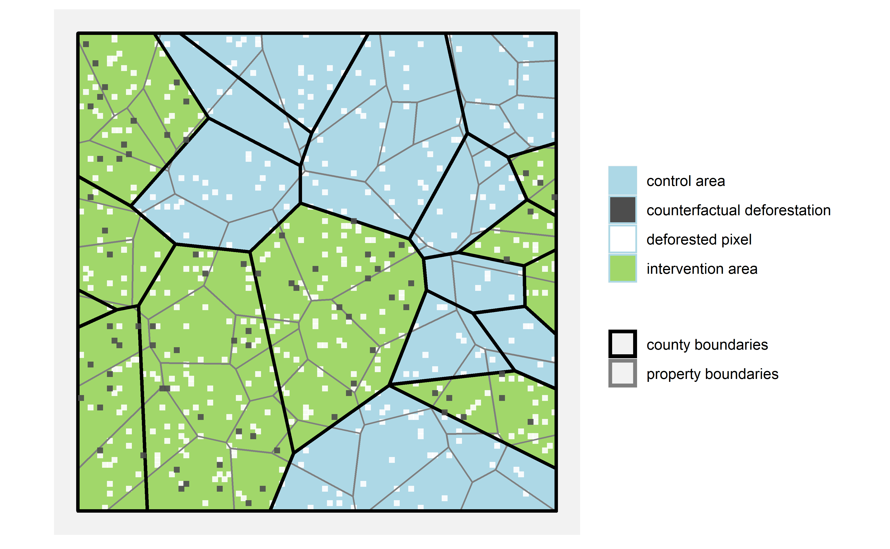
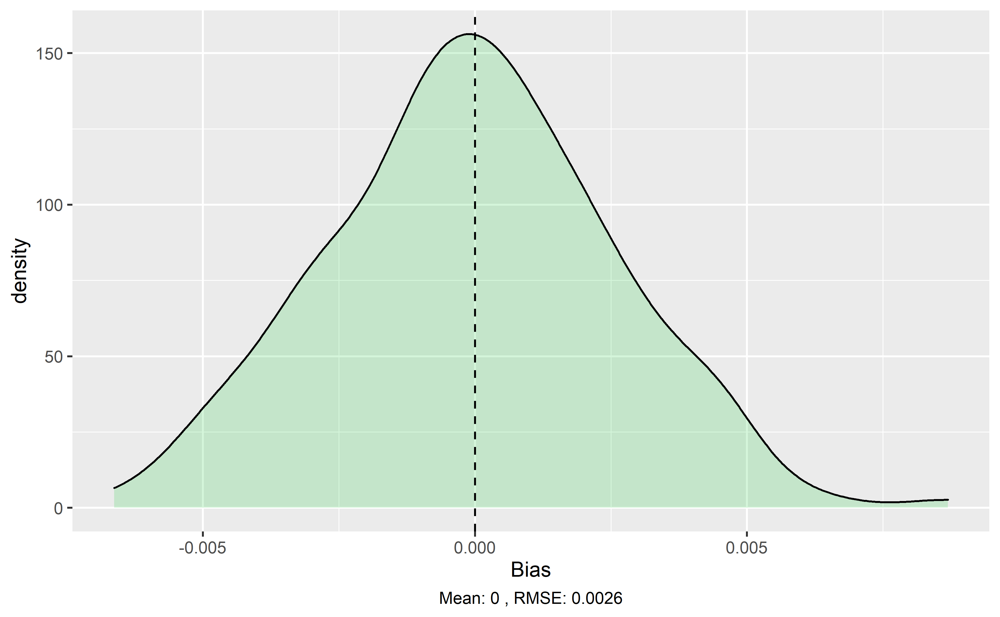
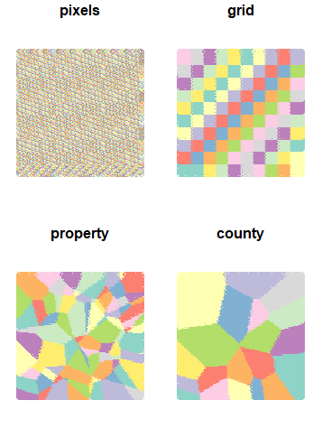
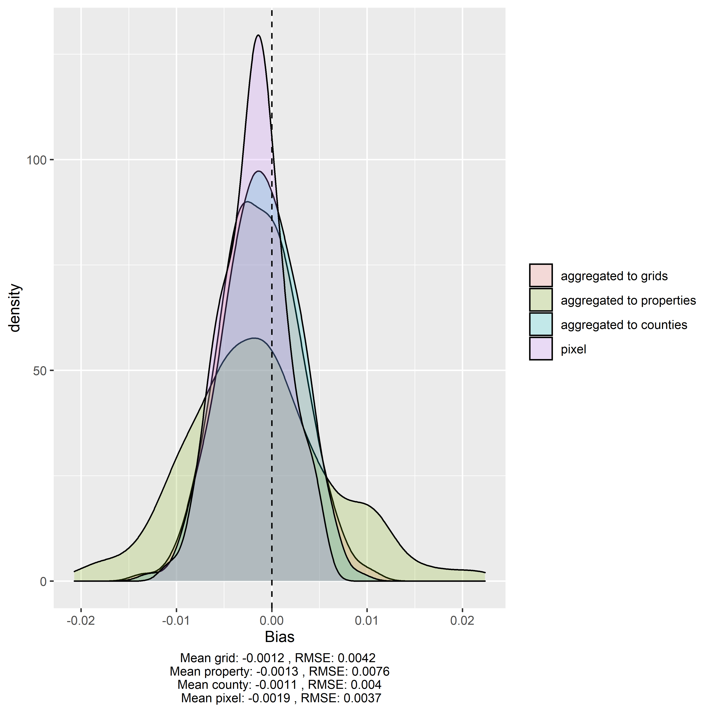
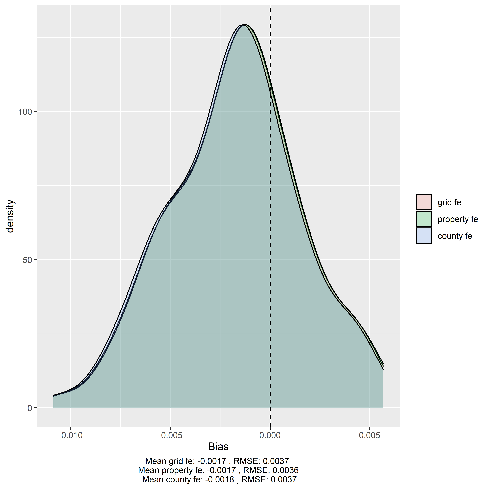

\sectionfont{\fontsize{11}{11}\selectfont}
\subsectionfont{\fontsize{11}{11}\selectfont}

```{r setup, include=FALSE}
library(knitr)
library(ggplot2)
library(kableExtra)
library(tidyverse)


knitr::opts_chunk$set(echo = FALSE, warnings = FALSE, messages = FALSE, out.width="49%", fig.align = "center")
```


<!-- To do: -->
<!-- - citations -->
<!-- - functional form: emphasize disciplinary differences in approaches -->
<!-- - motivate advantages of TWFE in TWFE section -->
<!-- - summary figure for specifications -->

<!-- Possible extensions: -->
<!-- - weighting possibilities -->
<!-- make properties more or less heterogeneous -->

<!-- - spatial autocorrelation -->
<!-- perform diagnostics to show how reseachers can use data to examine spatial autocorrelation -->


# Abstract {-}
Conservation practitioners need rigorous evidence measuring the effectiveness of proposed policy interventions. Increasingly, scientists are generating this evidence by applying methods of impact evaluation to remotely sensed panel data on land use change, however, these applications come with new challenges. Using Monte Carlo simulations and analytical proofs, we demonstrate that many of the panel econometric models employed for avoided deforestation impact evaluation are biased - the significance, magnitude and even direction of estimated effects from many studies are likely incorrect. These errors threaten to undermine the evidence base that is increasingly used to inform conservation policy adoption and design. We review this burgeoning literature and develop practical guidance for the design of econometric models quantifying conservation policy effectiveness. 

# Introduction

<!-- Narrow to deforestation - de-emphasize remote sensing -->

The founding goal of conservation biology was to provide principles and tools to preserve biological diversity [@soule1985]. To live up to this goal, scientists must generate causal evidence detailing the effectiveness of  conservation interventions [@williams2020]. Such evidence is critical for practitioners who grapple with challenging questions of cause and effect. Do marine protected areas stop unsustainable harvesting of fish? Can payments for ecosystem services encourage lasting reforestation? When successful, conservation science provides answers that improve the way society confronts environmental challenges. However, inappropriate methods can yield misleading conclusions and, as a result, risk diverting scarce financial and political resources from the most effective conservation strategies.

Increasingly, econometric methods of impact evaluation have been utilized to disentangle causal relationships in conservation science [@butsic2017; @baylis2016]. These methods generate accurate estimates of an intervention's impact by comparing observed outcomes to a rigorous counterfactual of what would have happened in the absence of an intervention [@ferraro2009; @meyfroidt2016; @ferraro2019; @ribas2020]. Conservation impact evaluation increasingly makes use of panel data in which units are observed repeatedly through time, thanks, in large part, to the proliferation of remote sensing [@blackman2013; @jones2015]. For example, NASA's landsat missions provide detailed and consistent information on land use spanning the entirety of the world since the 1970s [@hansen2012]. As a result, a scientist hoping to quantify the impacts of a land use policy adopted decades ago can assemble data for treated and control units that span both pre- and post-implementation periods [@jain2020]. 

However, many of the commonly used metrics have structural differences from the data used in more traditional applications of causal inference, particularly in the case of deforestation. These differences include the structure of generated data products and unique properties of the ecological processes being studied, both of which are especially relevant in the land-use change context. Observed land-use change outcomes are often irreversible in the short term; i.e. the replacement of native grasslands with a housing development. This is particularly true for deforestation events, after which the regrowth of forest to a detectable level is generally not within a relevant time frame to the research question at hand. Some researchers have taken steps to account for this property of deforestation processes. We show that ignoring this aspect of the deforestation process as well as adopting commonly used panel adjustments can result in erroneous estimates. 

Most econometric impact evaluations to date use the unit of analysis provided by the data. The pixel is the unit of analysis at which researchers access remotely sensed forest cover data, and the pixel is a standard unit of analysis for empirical models. We show that this can lead to severe bias and improper inference in the context of deforestation impact evaluations. We argue that researchers should think about the actual process by which land-use change occurs, considering factors that may impact outcome heterogeneity in a given setting. For example, if property ownership is a strong determinant of heterogeneity, a pixel level analysis may be atheoretical in relation to the true land-use change process. This type of decision has known implicaions for bias, raising the question of how to select the proper unit of analysis in a given setting [@avelino2016]. Of particular interest is when these processes operate in conjuction with one another at multiple scales. 

We demonstrate that, as a result of the differences inherent to data and analysis in the deforestation context, many of the econometric models used in this growing literature are likely biased - significance, magnitude and even direction of estimated effects might be incorrect. These biases arise even when researchers follow common guidance to adopt "rigorous" research designs with valid counterfactuals [@blackman2013; @jones2015]. Using analytical proofs and Monte Carlo simulations, we show how these model decisions affect the validity of causal inference in these settings. Lastly, we illustrate ways in which scientists can best minimize bias and better understand the implications of their impact evaluations.

The remainder of this paper is structured as follows. Section 2 reviews the standard panel econometric methods in the land-use impact evaluation literature. Section 3 identifies major issues with the two way fixed effects (TWFE) regression models in the deforestation context, supported by analytical proofs. Section 4 describes our Monte Carlo simulation approach to exploring the performance of alternative model parameterizations. Section 5 presents results from the Monte Carlo simulations that show certain model parameterizations overcome the bias and improper inference associiated with comonly used specifications. Section 6 concludes and offers guidance for researchers' impact evaluations.

# Excitement surrounding panel methods for impact evaluation of avoided deforestation interventions

While randomized experiments are the gold standard for scientific discovery in both the natural and social sciences [@edwards2020; @jayachandran2017], conservation often poses questions that are prohibitively expensive, unethical or impossible to pursue through experimentation. In such settings, a growing portfolio of statistical techniques enable researchers to draw causal conclusions using observational data [@larsen2019]. Importantly, these methods account for the non-random assignment of interventions that often confound identification of causal relationships; a low rate of deforestation within a remote protected area may reflect the protected area's effectiveness, or it may be indicative of the remote location's poor suitability for agricultural development [@andam2008; @pfaff2009]. These approaches frequently build upon panel data settings in which units are observed repeatedly through time, enabling researchers to observe changes in outcomes after the adoption of an intervention [@blackman2013]. When a rigorous research design is applied to panel data, observational studies can yield conclusions that are comparable to what a researcher would discover if they were able to run a randomized experiment [@ferraro2017].

We center our attention on the case in which a researcher would like to quantify the impact of a policy intervention on deforestation rates. We assume that the intervention has clearly defined boundaries (e.g., a protected area, certified concession, or indigenous territory), and that the researcher has access to spatially explicit observations of forest cover and forest loss spanning the periods before and after the intervention was adopted. The fundamental problem of causal inference is that, for every treated unit, we fail to observe the value that the outcome would have taken in the absence of treatment [@holland1986]. Figure XX displays this problem in the context of our simulated conservation intervention --- the landscape is depicted as observed by the researcher at the end of the observation period, including the unobservable counterfactual of what would have happened if the conservation intervention had not been adopted. Note that in untreated areas, there is no counterfactual deforestation, since no intervention ever took place. The researcher's goal is to measure the avoided deforestation occurring inside treated units. This general setting describes a broad array of research studies that apply panel methods to remotely sensed data (Table 1). 

```{r counterfactual, echo=FALSE, fig.pos = 'H', fig.cap="This figure shows deforestation that would have ocurred in the absence of the conservation intervention at the same point in time, after implementation of the conservation intervention. Note that no counterfactual deforestation occurs in the control area, since no intervention ocurred.", fig.show='hold'}

```


## The difference-in-differences and two-way fixed effects estimators

The remainder of our paper focuses on two methods commonly used in panel settings to measure the impact of conservation interventions: Difference-in-Differences (DID) and Two-way Fixed Effects (TWFE) regression models [@blackman2013; @jones2015]. The typical DID regression model includes a dummy variable equal to one for units in the treatment group, a dummy variable equal to one for observations in the period after the intervention, and their interaction. Conceptually, the DID estimator calculates the treatment effect as the difference between the differences of the treated and untreated observations before and after treatment [@butsic2017]. The DID estimator identifies the treatment effect parameter under one main assumption, known as the common trends assumption. It amounts to assuming that both units in the intervention area and untreated units would have experienced the same average change in the outcome (trend) in the absence of the intervention. While fundamentally untestable, ensuring that deforestation rates in the intervention area and the control area followed parallel trajectories prior to the date of the intervention can give creedence to this assumption [@butsic2017]. The DID method has become so popular in part, because the researcher does not need random assignment of treatment to generate convincing estimates of a program's impact on avoided deforestation, as long as the common trends assumption plausibly holds. 

Figure XX displays intuition behind the DID estimator in the context of our simulated conservation intervention, given the deforestation rate trends in the intervention and untreated areas along with the unobservable counterfactual of what would have happened if the conservation intervention had not been adopted.

<!-- In figure legend, change blue and green to "pixels not deforested in intervention area/ in untreated area over the course of the observation period" -->

<!-- Figure XX displays intuition behind the DID estimator in the context of our simulated conservation intervention --- Panel A depicts the deforestation in the landscape as observed by the researcher in the first versus second periods, while Panel B depicts how the DID estimator is found, given the deforestation rate trends in the intervention and untreated areas along with the unobservable counterfactual of what would have happened if the conservation intervention had not been adopted. -->


```{r twoperiod-deforestation, fig.cap="Left: Deforestation across two time periods in the landscape; Right: The DID estimator (estimated ATT) amounts to the difference in pre-treatment deforestation rates (pre-treatment difference) minus the post-treatment difference in deforestation rates (post-treatment difference) between units with and without the intervention.", fig.show='hold', fig.pos = 'H'}
knitr::include_graphics(c("figs/did_trends.png"))

#knitr::include_graphics(c("figs/twoperiod_landscape.png","figs/did_trends.png"))
```

TWFE regression models are often used to apply DID methods to multiple groups or treatment periods. This amounts to estimating a regression that controls for unit and time fixed effects. Intuitively, this can be thought of as including a dummy variable for each unit of analysis and each time period. The fixed effects account for any unobservable confounding variables that may vary across units or through time. When the treatment effect is constant across groups and over time, TWFE regressions estimate the average treatment effect in treated units under the standard common trends assumption [@deChaisemartin2019]. 

Because TWFE regression models are often used to generalize the DID method, they are used in a wider variety of settings and have gained paramount popularity in the land use change impact evaluation literature. Settings in which units undergo treatment in more than two distinct time periods may be amenable to TWFE regression, but not the standard DID method. For example, a researcher may use an TWFE regression model to examine the effectiveness of a network of protected areas, where the protected areas where created at different times or a payment for ecosystem services (PES) program, which enrolls properties in annual cohorts. In the case of two groups and two time periods, the TWFE regression should give an estimate equivalent to that of the DID model [@wooldridge]. This flexibility has led to TWFE regression models becoming the gold standard in the literature. While we do not consider Table XX a perfect representation of the entire literature of deforestation impact evaluation using panel data, 15 of the 26 identified studies use TWFE models. 

\renewcommand{\arraystretch}{1.5}
```{r table-lit, results = "asis", fig.show='hold'}

lit_table <- read.csv("lit_table.csv")[,1:4]

kable(lit_table, format = "latex", 
      caption = "Table of common econometric model decisions in the literature",
      col.names = c("Paper",
                    "Panel Method",
                    "Unit of analysis",
                    "Functional form")) %>% 
  row_spec(0,bold=TRUE) %>% 
  kable_styling(font_size = 10, latex_options = c("striped", "HOLD_position"),
                #full_width = TRUE
                position = "left"
                )

```

<!-- ## A model of land use change  -->

<!-- In the model below, a risk-neutral landowner of each forested plot j faces a dynamic optimization problem. The property owner selects T, the time when land is cleared, in order to maximize the expected present discounted value of returns from the use of plot j: -->

<!-- $$ \max_{T}   \int_0^T S_{jt}e^{-rt}dt + \int_T^{\infty} R_{jt}e^{-rt}dt - C_Te^{-rt}$$ -->

<!-- where:  -->

<!-- $S_{jt}=$ expected return to forest uses of the land -->

<!-- $R_{jt}=$ expected return to non-forest uses of the land -->

<!-- $C_T=$ cost of clearing net of obtainable timber value and including lost option value -->

<!-- $r=$ interest rate -->

<!-- In order for clearing at time $T$, (1) clearing must be profitable, and (2) it must not be preferred to wait. The following ``Arbitrage" condition must hold: -->

<!-- $$ R_{jt} - S_{jt} - r_tC_t+\frac{dC_T}{dt}>0$$ -->
<!-- Our empirical methodology is based on this condition.  -->

<!-- Assuming that our explanatory variables enter in a linear way, the implications of this model for any given plot can be expressed in terms of a latent variable: -->

<!-- $$y^*_{jt} = R_{jt} - S_{jt} - r_tC_t+\frac{dC_T}{dt}$$ -->

<!-- and its mapping to the observed outcome, $y_{jt}$, where: -->


<!-- \[y_{jt}= \begin{cases}  -->
<!--  1 & \text{if } y^*_{jt} > 0 \\ -->
<!--  0 & \text{otherwise} -->
<!--    \end{cases} -->
<!-- \] -->


# Commonly used models fail to estimate the $ATT$

## Defining the $ATT$ and the often used binary forest cover outcome

We now define the parameter the researcher hopes to estimate in deforestation impact evaluations. The average treatment effect on the treated, or the $ATT$, estimates the impact of the conservation intervention on the units that receive it relative to the counterfactual scenario without the intervention. Mathematically, it can be defined as

$$ ATT = E[y_{it}(1) - y_{it}(0) |  t\geq t_0, D_i=1]$$

, where $t_0$ is the year that the intervention is implemented and $D_i$ is a dummy equal to one if unit $i$ is ever treated. 

Often times, the researcher accesses the data at the pixel level, and analyses at the pixel level are prevalent in the literature, as seen in Table 1. Further, it has often been promoted as the preferred unit of analysis in many cases. Deforested pixels generally do not revert back to forest cover over the course of the study period. In the deforestation context, the researcher is interested in how the intervention impacts the decision to clear, not the presence of cleared land. Keeping the deforested pixel in the panel beyond the first period in which it was observed as deforested may imply that it has actively been deforested in each subsequent time period, when in fact, no new deforestation event or clearing decision has ocurred. These pixels, therefore, contribute unwarrantedly toward the deforestation rate in each additional period they are left in the panel. We show that pixel level regression models failing to drop deforested pixels in subsequent periods do indeed incur bias (Appendix 7.2). 

In order to correct for irreversibilities in this deforestation process, it has been advised to drop deforested pixels in the periods after they first become deforested [@jones2015; @alix-garcia2017]. In the literature, the typical outcome variable describing pixel $i$ in time $t$ can be defined as follows: 

\begin{align*}
 y_{it} = \begin{cases} 
      1 &  \text{if pixel $i$ is deforested in time $t$}\\
      0 &  \text{if pixel $i$ has never been deforested} \\
      NAN & \text{if pixel $i$ was deforested prior to time $t$} 
   \end{cases}
\end{align*}

## Issue using TWFE with binary outcome

Despite widespread use of pixel level analyses, they are problematic in the context of TWFE regression models. In fact, with this correction, the TWFE model yields the post-treatment difference in outcomes (single difference), rather than the desired ATT. We provide an analytical proof to support our claim. It can be found in the appendix (7.1). The result stems from the fact that the TWFE regression is not able to identify off of pixels that are dropped in the first period. Thus the pre-treatment period deforestation rates are not accounted for in the TWFE estimates. 

The following pixel level TWFE regression is commonly used in the literature, with $\beta$ used to identify the $ATT$:

\begin{align}
y_{it} = \alpha + \beta \text{ x } \mathbb{1} \{ t\geq t_0\} \mathbb{1} \{ D_i = 1\}+ \gamma_t + \lambda_i + \epsilon_{it}
\end{align}

, where $\gamma_t$ and $\lambda_i$ are year and pixel fixed effects, respectively. 

\textbf{Claim:} The TWFE regression described by equation (1) does not identify the $ATT$, but rather the post treatment difference in outcomes. 

\[ E [\hat{\beta }] = ATT + \underbrace{E[y_{it}(0) | t<t_0, D_i=1] - E[y_{it}(0) | t<t_0, D_i=0]}_{\text{pre-treatment difference in deforestation rates}} \]

Thus, the above regression sacrifices the benefits that panel methods provide. If the treated area has a different baseline deforestation rate than the control, the researcher will present a biased estimate of the intervention's impact. This is often the case in the context of interventions that seek to reduce a landscape's deforestation rate, because the intervention is often implemented in a given area precisely because of its deforestation rate. It is conceivable that this bias could not only lead to changes of the magnitude estimates, but a change in the sign, thereby influencing policymakers to adopt ineffective ineffective programs. In cases where the researcher has two groups and two distinct time periods, a pixel level analysis is still feasible using the simple DID model, however, researchers often find themselves in situations where the more flexible TWFE model is preferable to the simple DID. Unfortunately, TWFE models with pixel fixed effects as described by equation (1) generally cannot identify the $ATT$. 

# Methods


## Monte Carlo simulations

We employ a series of Monte Carlo simulations to evaluate the benefits and pitfalls of different econometric model specifications. Monte Carlo simulations allow us to (1) generate synthetic landscapes with known policy effectiveness and (2) analyze the performance of econometric models in estimating the policy's known impact. Doing so provides additional support for our analytical results as well as evidence of the tradeoffs made when using different models. 

Our landscape consists of administrative units that are either untreated $(D=0)$ or are assigned to a conservation treatment $(D=1)$. We observe deforestation in two, even-length periods, a pre-treatment $(t < t_{0})$ and a post-treatment $(t \ge t_{0})$ period. 

<!-- We develop a reduced form specification motivated by intuitions from the structural model. In our theoretical model, clearing occurs if -->

<!-- $$y^*_{jt} = R_{jt} - S_{jt} - r_tC_t+\frac{dC_T}{dt} >0 $$ -->
In the context of our simulated landscape and conservation intervention, we assume

\begin{align*}
y^*_{ivt} =&\beta_0 + \beta_1 \mathbbm{1}\{  D_i = 1  \} +\\
& \beta_{2,0} \mathbbm{1}\{  t \geq t_0  \} (1 - \mathbbm{1}\{  D_i = 1  \})+\beta_{2,1} \mathbbm{1}\{  t \geq t_0  \} \mathbbm{1}\{  D_i = 1  \} +\\
&\beta_3 \mathbbm{1}\{  D_i = 1  \} \mathbbm{1}\{  t \geq t_0  \} +\\
& \alpha_i + u_{it} + \rho_{v}
\end{align*}

<!-- The data generating process underlying our Monte Carlo simulations begins with the assignment of five parameters: The mean, pre-treatment period deforestation rate for untreated units, $baseline_0$; the mean, pre-treatment period deforestation rate for treated units, $baseline_1$; untreated units' mean change in deforestation rates occurring between the pre- and post-treatment periods, $trend_0$; treated units' mean counterfactual change in deforestation rates occurring between the pre- and post-treatment periods in the absence of treatment, $trend_1$; and lastly, the average treatment effect of the policy on the treated units, $ATT$. The researcher's primary goal is to estimate ATT. In all of our simulations, we impose parallel trends (i.e. set $trend_0 = trend_1$).  -->


<!-- We use equation XX to motivate our empirical approach in the context of a conservation intervention. Our latent $(y^*_{ivt})$ indicates the return to deforesting pixel $i$, in property $v$, in year $t$. We define this latent variable as: -->

<!-- $$y^*_{ivt} = \beta_0 + \beta_1 \mathbbm{1}\{  D_i = 1  \} +$$  -->
<!-- $$\beta_{2,0} \mathbbm{1}\{  t \geq t_0  \} (1 - \mathbbm{1}\{  D_i = 1  \})+\beta_{2,1} \mathbbm{1}\{  t \geq t_0  \} \mathbbm{1}\{  D_i = 1  \} +$$ -->
<!-- $$\beta_3 \mathbbm{1}\{  D_i = 1  \} \mathbbm{1}\{  t \geq t_0  \} +$$ $$\alpha_i + u_{it} + \rho_{v}$$ -->

That is, the returns to deforestation evolve over the two time periods $(\mathbbm{1}\{  t \geq t_0  \})$, across the control and treated units $(\mathbbm{1}\{  D_i = 1  \})$. In addition, we assume that the value of deforestation is influenced by time-invariant random disturbances at the scale of individual pixels ($\alpha_i \sim N(0, \sigma_a^2)$) or properties ($\rho_v \sim N(0, \sigma_p^2)$), as well as time-varying, pixel-scale disturbances ($u_{it} \sim N(0, \sigma_u^2)$). These disturbances can represent a variety of spatial and temporal processes including, for example, the biophysical characteristics of a location, or the preferences of a property owner. 

Rather than directly observing deforestation rates across the landscape in each time period, the researcher observes annualized maps depicting pixel-level, binary deforestation $(y_{ivt}\ \epsilon \ 0, 1)$ with the following mapping from the latent $y^*_{ivt}$ to the observed $y_{ivt}$:
\begin{align}
 y_{ivt} = \begin{cases} 
      1 & y^*_{ivt} > 0  \\
      0 & otherwise
   \end{cases}
\end{align}

<!-- Figure 3 demonstrates that DID estimates are unbiased using our DGP allowing the outcome variable $y_{ivt}$ to vary between 0 and 1 across periods.  -->

<!-- ```{r, fig.cap="DID estimates when outcome is allowed to vary across periods", fig.pos = 'H', fig.show='hold'} -->
<!--  -->
<!-- ``` -->

## Set up and evaluation
<!-- 1 percent, or 1 percentage point? -->
It is not uncommon to see annual treatment effects amounting to less than a 1 percentage point reduction in the annual deforestation rate [e.g. @robalino2013; @jones2017]. These modest reductions in the annual deforestation rate, however, can amount to large effects over the course of the study period. For example, @alix-garcia2018 find that environmental land registration in Brazil’s Amazonian states of Mato Grosso and Para reduced the annual deforestation rate by an average 0.5 percentage points, which has  amounted to an overall deforestation reduction of 10\%. We have parameterized a guiding example, representative of an impactful intervention, to explore for the remainder of the paper. 

The initial simulated landscape has the following characteristics: a pre-treatment deforestation rate of 2\% in the control area; a pre-treatment deforestation rate of 5\% in the intervention area; a decrease in the deforestation rate of .5 percentage points between the first and second period in the absence of treatment; and an average reduction of 1 percentage point in the deforestation rate in treated units due to the intervention ($ATT = -0.01$). Lastly, $\sigma_a = .25$, $\sigma_p = 0$, and $\sigma_u = .1$. With $\sigma_p = 0$, there is no influence of random disturbances at the property scale. 

We use three primary criteria to compare econometric models: bias, RMSE, and coverage probability of their estimate of the $ATT$ parameter. Using our Monte Carlo simulations, we determine bias by computing the difference between each model's mean estimate of the $ATT$ and the known $ATT$ parameter. RMSE addresses the distribution of the estimates around the true $ATT$. Coverage probability is defined as the proportion of simulations in which the true $ATT$ lies within the simulation's 95\% confidence interval (CI). As such, we would expect the $ATT$ to lie within this CI 95\% of the time, however, factors such as the bias of the estimates, their distribution, and treatment of standard errors may impact coverage. If the estimator is biased, for example, it is ex-ante less likely that the true parameter falls within the CI. We largely rely on the bias of the estimators to evaluate their performance, but RMSE and coverage probability play an important role when bias is comparable across estimators. 


# Alternative models can generate unbiased estimates of the $ATT$

TWFE models have risen to prominence due to their flexibility in applying DID methods to settings with multiple groups and variation in treatment timing, however, we have shown that TWFE models are not a viable approach to estimate the $ATT$ with pixel fixed effects in deforestation impact evaluations. Column 1 of Figure XX shows the bias associated with the problematic regression described by equation (1). In our guiding example, the ex-post single difference is 0.02 (the $ATT$ plus the pre-treatment group difference in deforestation rates), when the true $ATT$ is equal to -0.01. This means that a positive bias of 0.03 resuts from the  use of this regression model. 

In the two-group, two-period case the typical DID model is an unbiased estimator of the $ATT$, as shown in column 2 of Figure XX. However, Researchers often want to use TWFE models because of their flexibility in situations that do not fall under the typical DID setup. Therefore, researchers should be aware of the tradeoffs using aggregated units of analysis and fixed effects when using TWFE models for deforestation impact evaluation. 

For simplicity, we assume the researcher can choose between three levels at which to aggregate the data: grid cell, county, and property. Grid cells are uniform grids layered over the study area and may have a treatment value between 0 and 1 following aggregation of pixels. Counties are heterogeneous administrative units at which we now assign the treatment. Lastly, properties are smaller administrative units that may sit partially between two counties. 

```{r, fig.cap="This figure demonstrates the spatial extent and scale of common units of analysis.", fig.show='hold', fig.pos = 'H', out.width = "30%"}

```
<!-- Here, include graphic of various administrative units -->

## Aggregated units of analysis

Aggregated units of analysis overcome the issues that we have identified with respect to TWFE regressions at the pixel level. The following results apply to both DID and TWFE regression models, as both are equivalent in the two-period, two-group example when pixels are not dropped. While the researcher does not have to drop pixels in the periods after they first become deforested, they must calculate the deforestaion rate in each time period. This calculation is detailed in the appendix (). 

We find little evidence that any one aggregated unit of analysis is consistently preferrable in terms of bias. Columns 3-5 of Figure XX shows that the bias of the estimates is not critically different depending on level of aggregation, however, the distributions are varied. RMSE is highest with property level aggregation due to the heterogeneity in property sizes across the landscape. 

<!-- ```{r agg_units, fig.cap="fig caption", fig.show='hold', fig.pos = 'H'} -->
<!--  -->
<!-- ``` -->


## Aggregated fixed effects

One can also use fixed effects at the level of an administrative unit rather than the pixel level to resolve bias associated with pixel level TWFE regressions. Columns 6-8 of Figure XX shows that pixel level TWFE regressions are unbiased estimators of the $ATT$ when grid, county, or property fixed effects are used rather than pixel fixed effects. We also see that in the absence of property level perturbations (i.e. $\sigma_p=0$ in the DGP), all three models provide nearly identical estimates. The estimate distributions and RMSE are similar across all three models. 

<!-- ```{r agg_fe, fig.cap="fig caption", fig.show='hold', fig.pos = 'H'} -->
<!--  -->
<!-- ``` -->


```{r summary_fig, fig.cap="fig caption", fig.show='hold', fig.pos = 'H', out.width="100%"}
knitr::include_graphics("figs/summary_fig.png")
```

## The importance of connecting the analysis to decision-making unit

We now demonstrate the importance of connecting the econometric model to the process by which land use change occurs on the ground. Property level unobservables may impact both treatment effect estimates and coverage probabilities. This is likely to be a factor when land use decisions are made at the property level or the intervention seeks to alter underlying landowner incentives. In our Monte Carlo simulations, we vary the standard deviation of the time-invariant property level disturbances in the initial DGP, $\sigma_p$, in order to account for these unobservables. 

<!-- Implications for bias -->

The introduction of property level unobservables changes the relative performance of each level of aggregation in terms of bias, RMSE, and coverage. We see that pixel level analyses and models with aggregation to the grid cell and county levels suffer from increased bias as the standard error governing the property level disturbances, $\sigma_p$, increases. This is evident in the left panel of Figure XX. Models with observations aggregated to the property level, however, do not suffer from increased bias after the introduction of property level disturbances. This indicates that aggregating to the level of the relevant decision making unit reduces estimate bias relative to other aggregated units of analysis. Further, as property level unobservables play a larger role, pixel level analyses suffer from more bias than any other unit of analysis. 

The right panel of Figure XX demonstrates a similar takeaway in the context of models with the pixel as the unit of analysis but aggregated fixed effects. We see that models with grid, property, or county fixed effects perform similarly in terms of bias when there are no property level disturbances. However, as soon as these disturbances enter the picture, the model with property fixed effects outperforms the others. 

```{r, fig.cap="Left: Bias using different levels of aggregation as a function of property level unbservables; Right: Bias using fixed effects at an aggregated unit rather than the pixel as a function of property level unbservables", fig.pos='H', fig.show='hold'}
knitr::include_graphics(c("figs/bias_p.png", "figs/fe_bias_p.png"))
```

<!-- Implications for RMSE -->

<!-- RMSE is also impacted in the presence of property level unobservables. Figure XX shows that while RMSE for estimates from property level models remains relatively more stable across values of $\sigma_p$, other models see increased RMSE with higher values of $\sigma_p$. Again, pixel level analyses suffer the most from increased RMSE as property level unobservables become more of a factor. This is partially due to the change in bias.  -->

<!-- ```{r, fig.cap="Performance of different levels of aggregation in the presence of property level unbservables Left: bias as a function of $\\sigma_p$ by level of aggregation; Right: RMSE as a function of $\\sigma_p$ by level of aggregation", fig.pos='H', fig.show='hold'} -->
<!-- knitr::include_graphics(c("figs/rmse_p.png", "figs/fe_rmse_p.png")) -->
<!-- ``` -->

<!-- Implications for coverage -->

As property level unobservables play a larger role, the treatment of standard errors also becomes more important. We focus on model performance with the use of clustered standard errors, since they are used by nearly every study in the literature for inference. The clustering problem is caused by the presence of a common unobserved random shock at the group level that will lead to correlation between all observations within a group [@hansen2007]. We have introduced the random shock at the property level in our guiding example to represent individual landowner preferences or property characteristics. As such, correlation within grids and counties will also be introduced, since they contain multiple pixels within a property. Clustering standard errors relaxes the assumption of no correlation across observations within the spatial unit used for clustering [@jones2015]. 

Table XX demonstrates how the presence of property level unobservables impacts coverage probability in the pixel level DID model. The level at which standard errors are clustered clearly impacts

We see coverage probability is impacted by  Property level aggregation generally leads to preferred coverage probabilities, regardless of the standard error structure. These results highlight the benefit of using the relevant decision-making unit as the unit of analysis as well as clustering standard errors at that level. 

In many instances, researchers do not have access to geospatial boundaries of the relevant decision-making unit. We see in Figure 6 that county and grid cell level aggregation lead to lower levels of bias and RMSE than pixel level specifications when property unobservables are present. County level aggregation leads to the best coverage in the absence of property boundaries, meaning that a larger, alternative administrative unit containing the relevant decision-making units may be the best alternative when an adequate number of observations are available. If a pixel level analysis is used (potentially due to constraints on geospatial boundary access), we see that coverage is greatly improved when standard errors are clustered to a higher level of aggregation such as the coounty.  

```{r did-cover, results = "asis", fig.show='hold'}

coverage_did <- read.csv("coverage.csv") %>%
  arrange(desc(std_error))%>%#, aggregation)%>%
  filter(aggregation == "pixel")

kable(coverage_did[,2:7], format = "latex", row.names = FALSE, booktabs = T,
      caption = "Coverage probabilities for pixel level DID model in presence of property level unobservables", 
      col.names = NULL) %>% 
  add_header_above(c("unit of analysis"=1, "standard error structure"=1, "0"=1, "0.05" = 1, "0.15" = 1, "0.25" = 1), escape = TRUE, line =TRUE, bold = TRUE)%>%
  add_header_above(c(" "=1, " "=1, "coverage probability ($\\\\sigma_p =$)"=4), escape = FALSE, line =FALSE, bold =TRUE)%>%
  kable_styling(font_size = 10, latex_options = c("HOLD_position", "striped"), 
                position = "center")
```

```{r uoa-cover, results = "asis", fig.show='hold'}

coverage_uoa <- read.csv("coverage.csv")[,2:7] %>%
  arrange(desc(std_error))%>%#, aggregation)%>%
  filter(std_error != "classical" & aggregation != "pixel")%>%
  mutate(fe = aggregation)%>%
  dplyr::select(fe, everything())%>%
  dplyr::select(aggregation, everything())

kable(coverage_uoa, format = "latex", row.names = FALSE,  booktabs = T,
      caption = "Coverage probabilities for TWFE models using aggregated units of analysis in presence of property level unobservables", 
      col.names = NULL) %>% 
  add_header_above(c("unit of analysis"=1,"fixed effects"=1, "standard error structure"=1, "0"=1, "0.05" = 1, "0.15" = 1, "0.25" = 1), escape = TRUE, line =TRUE, bold = TRUE)%>%
  add_header_above(c(" "=1, " "=1, " "=1, "coverage probability ($\\\\sigma_p =$)"=4), escape = FALSE, line =FALSE, bold =FALSE)%>%
  kable_styling(font_size = 10, latex_options = c("HOLD_position", "striped"), 
                position = "center")

```

```{r fe-cover, results = "asis", fig.show='hold'}

coverage_fe <- read.csv("fe_coverage.csv")[,2:7] %>%
  arrange(desc(std_error))%>%#, aggregation)%>%
  filter(std_error != "classical" )%>%
  mutate(uoa = "pixel")%>%
  dplyr::select(uoa, everything())

kable(coverage_fe, format = "latex", row.names = FALSE,  booktabs = T,
      caption = "Coverage probabilities for TWFE models using aggregated fixed effects in presence of property level unobservables", 
      col.names = NULL) %>% 
  add_header_above(c("unit of analysis"=1,"fixed effects"=1, "standard error structure"=1, "0"=1, "0.05" = 1, "0.15" = 1, "0.25" = 1), escape = TRUE, line =TRUE, bold = TRUE)%>%
  add_header_above(c(" "=1, " "=1, " "=1, "coverage probability ($\\\\sigma_p =$)"=4), escape = FALSE, line =FALSE, bold =FALSE)%>%
  kable_styling(font_size = 10, latex_options = c("HOLD_position", "striped"), 
                position = "center")

```

# Conclusions

<!-- a.     Failure of TWFE -->
<!-- b.     Point-level with aggregated FE and aggregated outcomes both work -->
<!-- c.     Benefits from connecting empirical model structure to the level of decision-making -->


This paper seeks to leave researchers with a clear sense of the decisions that play a role in their choice of econometric specification. Despite past guidance to the contrary, models that incorporate fixed effects for individual points are unable to yield unbiased estimates of a policy's ATT when applied to irreversible, binary observations of deforestation. This is due to the fact that when pixels are dropped after they first become deforested (necessary in the case of an irreversible binary outcome as shown in Appendix 7.1), TWFE models cannot identify off of points deforested in the first period. We explore the benefits of conducting the analysis at the level of the relevant decision making unit and offer guidance for when it is not relevant or available. Choice of functional form should be justified in the context of each institutional setting, and robustness checks should account for the possibility of alternative functional forms and spatial autocorrelation. Ultimately, context plays a role in all of these decisions. There is no one size fits all econometric specification, and researchers should make clear which decisions they have made as well as their reasoning. We have developed a shiny app available at .. so that researchers can evaluate the potential tradeoffs with choices of econometric model design in their own setting.  

An up and coming literature explores how remotely sensed data may need special consideration when used in impact evaluation. Aspects of the collection process such as satellite sensor characteristics, atmospheric conditions, and image processing may influence the structure of remotely sensed data products [@jain2020; @alix-garcia2020]. Of particular concern is the propensity for non-classical measurement error, which can lead to biased estimates of the $ATT$ [@wooldridge]. @alix-garcia2020 propose a solution for the case of a remotely sensed binary outcome in which misclassification is non-classical. As the proliferation of research relying on satellite data continues, researchers will need consider the intricacies of particular satellite data sources in order to substantiate causal claims. 

Several econometric considerations relevant to model design and interpretation were not explored in this paper. TWFE regression models have received substantial attention in the econometrics literature recently, regarding concerns surrounding their viability and interpretability [e.g. @kropko2020]. For example, properties of TWFE regression models that arise when the treatment effect is heterogeneous across groups or over time may lead to erroneous results [@deChaisemartin2019]. We largely abstract away from choices of scale with regards to grid size or unit of analysis, but biased estimates may result from scale choices that are too large or too small relative to the data generating process or decision unit [@avelino2016]. This makes choice of grid cell size a relevant but unexplored aspect of our study. Lastly, the benefits of pre-matching control and treatment units are not addressed, but they are well understood to be substantial [e.g. @jones2015; @blackman2013]. 

Without clear guidance on key econometric model design decisions, a wide variety of methods have been used in the literature using quasi-experimental methods for conservation impact evaluation. We show that a number of studies likely provide estimates that suffer from bias or improper inference. In particular, our result about the use of TWFE models with the pixel as the relevant unit of analysis casts doubt as to the reliability of a significant number of estimates. This said, a significant number of studies have displayed proper intuition in the design of the econometric model. The increasingly widespread awareness of methods of causal inference is a further positive step. The observations made here may apply to a wider audience beyond the set of researchers investigating the impacts of conservation interventions on deforestation. Any evaluation of interventions implemented at a spatial scale may benefit from this discussion. These results further apply to many settings in which the outcome represents an irreversible binary event. For example, studies addressing technology adoption as an outcome may fall prey to the same issues we describe with a pixel level analysis. Moving forward, it is imperative that researchers use methods that minimize bias and allow inference at expected levels of confidence. Misleading results may lead policymakers to avoid impactful policy designs or adopt policy that worsens environmental damages. 


# Acknowledgements and data {-}
We thank the University of California, Santa Barbara's Academic Senate for a Faculty Research Grant that supported this work. This paper contributes to the global land programme.

# References
<div id="refs"></div>

# Appendix
<!-- Getting to point where we probably need to number appendices -->

 

## proof showing pixel level TWFE regression models do not identify $ATT$

In settings with a binary and unrepeatable outcome variable, the commonly used pixel level TWFE model yields the post-treatment difference in outcomes (single difference), rather than the desired $ATT$.

proof:

Consider a two-period setting $(t=1,2)$ with multiple pixels indexed by $i$. We observe $y_{it}$, the realized deforestation occurring in each pixel in each time period. Some units are exposed to a policy treatment in the second time period $(w_{i,2}=1)$. Using the potential outcomes framework, we consider the potential outcomes for each observation as $y_{i,2}(w_{i,2})$. In this notation, the treatment effect for unit $i$ can be defined as

$$\tau_i = y_{i,2}(1) - y_{i,2}(0) $$

<!-- We are interested in estimating the average treatment effect on the treated (ATT), which can be defined as: -->

In many deforestation maps generated through remote sensing, deforestation is represented as a binary indicator. Furthermore, deforestation is only observed once for a given location since these data products typically do not monitor the timing of reforestation. Given these constraints, deforestation is typically (@alix-garciaandgibbs2017; @jones2015) represented as a binary, unrepeatable variable taking the following values: 

$$ y_{i1}=\alpha+\tau w_{i1}+c_i+u_{i1}$$
\[y_{it}= \begin{cases} 
      0 & \text{the pixel has never been deforested}\\
      1 & \text{the pixel was deforested in year }t\\
      NAN & \text{the pixel was deforested in a year }<t\\
   \end{cases}
\]

The traditional two-way fixed effects model seeks to estimate this effect using the following regression specification:

$$ y_{it}=\alpha+\beta w_{it}+\gamma_i+\eta_t+u_{it}, \text{ for } t=1,2 $$

Taking into account the data structure of $y_{it}$ and our two-period case, we are left with:

$$ y_{i1}=\alpha+\gamma_i+u_{i1}$$

and

\[y_{i2}= \begin{cases} 
      \alpha+\beta w_{i2}+\gamma_i+\eta_{t=2} + u_{i2} & y_{i1}= 0\\
      NAN & y_{i1} \neq 0 
   \end{cases}
\]


First differencing,

\[y_{i2}-y_{i1}= \begin{cases} 
      (\alpha+\beta w_{i2}+\gamma_i+\eta_{t=2} + u_{i2}) - (\alpha+\gamma_i+u_{i1}) & y_{i1}= 0\\
      NAN & y_{i1} \neq 0 
   \end{cases}
\]


Consider the regression
$$ y_{it}=\alpha+\eta d2_t+\tau w_{it}+c_i+u_{it}, \text{ for } t=1,2 $$


 Focusing on the first case, where $y_{i1}=0$
\begin{align*}
(\alpha+\beta w_{i2}+\gamma_i+\eta_{t=2} + u_{i2}) - (\alpha+\gamma_i+u_{i1})\\
&=\beta w_{i2} + \eta_{t=2} + \Delta u_{i}
\end{align*}


The general expression can be restated as:

\[y_{i2}-y_{i1}= \begin{cases} 
 \beta w_{i2} + \eta_{t=2} + \Delta u_{i} & y_{i1}= 0\\
      NAN & y_{i1} \neq 0 
   \end{cases}
\]

With binary treatment ($w_{it}$), $\hat{\beta}$, the regression’s estimate of $\beta$ can be expressed as the double difference in mean outcomes across treated / untreated units, and across the two time periods:


\begin{align*}
\hat{\beta}&= \frac{1}{n_{ST}}\sum_{i:w_i=1} y_{i2} - \frac{1}{n_{ST}}\sum_{i:w_i=1} y_{i1} - (\frac{1}{n_{SU}}\sum_{i:w_i=0} y_{i2} - \frac{1}{n_{SU}}\sum_{i:w_i=0} y_{i1})
\end{align*}

, where $n_{ST}$ and $n_{SU}$ are the number of surviving treated and untreated units such that $y_{i1}=0$, respectively. 

Since this captures where $y_{i1}=0$, we have $\frac{1}{n_{ST}}\sum_{i:w_i=1} y_{i1}=0$ and $\frac{1}{n_{SU}}\sum_{i:w_i=0} y_{i1}=0$ 

Then restating the expression:   

\begin{align*}
\hat{\beta}&= \frac{1}{n_{ST}}\sum_{i:w_i=1} y_{i2} - 0 - (\frac{1}{n_{SU}}\sum_{i:w_i=0} y_{i2} - 0)\\
\end{align*}

Applying the potential outcomes to indicate whether we see the treated or untreated outcome:
\begin{align*}
&= \frac{1}{n_{ST}}\sum_{i:w_i=1} y_{i2}(1) - \frac{1}{n_{SU}}\sum_{i:w_i=0} y_{i2}(0)\\
\end{align*}

Finally, adding and subtracting $\frac{1}{n_{ST}}\sum_{i:w_i=1} y_{i2}(0)$ gives:
\begin{align*}
&=    \frac{1}{n_{ST}}\sum_{i:w_i=1} y_{i2}(1) - y_{i2}(0)  \\
+& \frac{1}{n_{ST}}\sum_{i:w_i=1}y_{i2}(0) - \frac{1}{n_{SU}}\sum_{i:w_i=0} y_{i2}(0) \\
&= ATT+Diff\\
\blacksquare &
\end{align*}

## Demonstration that dropping pixels in periods after they are first deforested is necessary

Remotely sensed metrics of deforestation at the pixel level are often subject to the dynamics of forest disturbance and regrowth. After a deforestation event occurs, the deforested area is unlikely to revert to forest cover within the study period, as it takes several years for forest to regenerate to a detectable level. In the panel therefore, it is probable that in the periods after a pixel is first realized as deforested, subsequent observations of the pixel will also observe the pixel as deforested. 

The logic for dropping binary pixels after they first become deforested is as follows. A forested pixel switches from its assigned value of 0 to a value of 1 following a discrete deforestation event. Keeping the deforested pixel in the panel beyond the first period in which it was observed as deforested may imply that it has actively been deforested in each subsequent time period. In fact, no new deforestation event has ocurred, but the area simply remains deforested from the prior event. These pixels, therefore, contribute positively towards the deforestation rate in each period they are left in the panel. 

### Analytical expression of bias in two-period two-group case when pixels are not dropped from the panel

The DID estimand is
\begin{align*}
& E[y_{it} |  t\geq t_0, D_i=1] - E[y_{it} |  t<t_0, D_i=1] - (E[y_{it} |  t\geq t_0, D_i=0] - E[y_{it} |  t<t_0, D_i=0] )\\
=& P(y_{it}=1 |  t\geq t_0, D_i=1) - P(y_{it}=1 |  t<t_0, D_i=1) - \\
& (P(y_{it}=1 |  t\geq t_0, D_i=0) - P(y_{it}=1 |  t<t_0, D_i=0) )
\end{align*}

In the case of an irreversible binary outcome, the first and third terms can be reexpressed, giving
\begin{align*}
& P(y_{it}=1 |  t\geq t_0, D_i=1)\cup P(y_{it}=1 |  t<t_0, D_i=1) - P(y_{it}=1 |  t<t_0, D_i=1) - \\
 & (P(y_{it}=1 |  t\geq t_0, D_i=0)\cup P(y_{it}=1 |  t<t_0, D_i=0) - P(y_{it}=1 |  t<t_0, D_i=0) ) \\
=& P(y_{it}=1 |  t\geq t_0, D_i=1) + P(y_{it}=1 |  t<t_0, D_i=1) -P(y_{it}=1 |  t\geq t_0, D_i=1)\cap P(y_{it}=1 |  t<t_0, D_i=1) -\\
& P(y_{it}=1 |  t<t_0, D_i=1) -\\
& (P(y_{it}=1 |  t\geq t_0, D_i=0) + P(y_{it}=1 |  t<t_0, D_i=0) - P(y_{it}=1 |  t\geq t_0, D_i=0)\cap P(y_{it}=1 |  t<t_0, D_i=0) - \\
& P(y_{it}=1 |  t<t_0, D_i=0) )\\
=& P(y_{it}=1 |  t\geq t_0, D_i=1) -P(y_{it}=1 |  t\geq t_0, D_i=1)\cap P(y_{it}=1 |  t<t_0, D_i=1) -\\
& (P(y_{it}=1 |  t\geq t_0, D_i=0) - P(y_{it}=1 |  t\geq t_0, D_i=0)\cap P(y_{it}=1 |  t<t_0, D_i=0))
\end{align*}

We can attempt to sign the bias introduced here. The bias will be positive when
\begin{align*}
&P(y_{it}=1 |  t\geq t_0, D_i=1) -P(y_{it}=1 |  t\geq t_0, D_i=1)\cap P(y_{it}=1 |  t<t_0, D_i=1) -\\
& (P(y_{it}=1 |  t\geq t_0, D_i=0) - P(y_{it}=1 |  t\geq t_0, D_i=0)\cap P(y_{it}=1 |  t<t_0, D_i=0))\\
\geq & ATT\\
\Leftrightarrow \\
&P(y_{it}(1)=1 |  t\geq t_0, D_i=1) -P(y_{it}(1)=1 |  t\geq t_0, D_i=1)\cap P(y_{it}(0)=1 |  t<t_0, D_i=1) -\\
& (P(y_{it}(0)=1 |  t\geq t_0, D_i=0) - P(y_{it}(0)=1 |  t\geq t_0, D_i=0)\cap P(y_{it}(0)=1 |  t<t_0, D_i=0))\\
\geq & P(y_{it}(1) = 1 | t\geq t_0, D_i=1) - P(y_{it}(0) = 1 | t\geq t_0, D_i=1)\\
\Leftrightarrow \\
& P(y_{it}(0) = 1 | t\geq t_0, D_i=1)-P(y_{it}(0)=1 |  t\geq t_0, D_i=0)\\
\geq & P(y_{it}(1)=1 |  t\geq t_0, D_i=1)\cap P(y_{it}(0)=1 |  t<t_0, D_i=1) - P(y_{it}(0)=1 |  t\geq t_0, D_i=0)\cap P(y_{it}(0)=1 |  t<t_0, D_i=0)\\
\end{align*}

While it is not possible to sign the bias, it will be positive when:
\begin{align*}
P(y_{it}(0) = 1 | t\geq t_0, D_i=1) \geq P(y_{it}(0)=1 |  t\geq t_0, D_i=0)
\end{align*}
and
\begin{align*}
P(y_{it}(1)=1 |  t\geq t_0, D_i=1) \geq P(y_{it}(0)=1 |  t\geq t_0, D_i=0)
\end{align*}
and
\begin{align*}
P(y_{it}(0)=1 |  t<t_0, D_i=1) \geq P(y_{it}(0)=1 |  t<t_0, D_i=0)
\end{align*}

Thus, under parallel trends, if the deforestation rate is higher in the treatment group both before and after treatment, the bias will be positive (and vice versa). 

### Monte Carlo evidence

Figure XX demonstrates the magnitude and direction of the bias incurred from keeping deforested pixels in the panel after they are first realized as deforested in the context of our guiding example. Pixels that were deforested prior to the implementation of the policy continued to contribute to the deforestation rate in the post period in both the treatment and control groups. Dropping the pixels in the periods after they are first observed as deforested mitigates this bias in the DID model, as seen in Figure XX. 


<!-- If the main point of this figure is to contrast the bias in the two examples here, I'd suggest forcing the x-axes to stay constant across figures. Maybe just easier to drop them both on the same plot? -->
```{r, echo=FALSE,out.width="75%", fig.cap="Distribution of DID estimates leaving deforested pixels in the panel and of DID estimates dropping deforested pixels. Note that leaving deforested pixels in the panel incurs severe bias.", fig.pos = 'H', fig.show='hold', fig.align='center'}
knitr::include_graphics("figs/did_keep.png")
```

While dropping pixels in the periods after they first become cleared does generate a small amount of bias, this is inherent to the nature of binary forest cover data. Dropping these observations allows the researcher to attain estimates with bias much closer to zero than would be possible keeping them in the panel. This bias is unrelated to that which may arise from satellite sensor characteristics, satellite angle, or atmospheric conditions [@jain2020].

## Initial Monte Carlo parameter to $\beta$ coefficient mapping

The following five parameters and their definitions inform the simulation parameterizations. 

\begin{align*}
baseline_0 &= E[y_{it}(0) |  t<t_0, D_i=0]\\
baseline_1 &= E[y_{it}(0) |  t<t_0, D_i=1]\\
trend_0 &= E[y_{it}(0) |  t\geq t_0, D_i=0] - E[y_{it}(0) |  t<t_0, D_i=0]\\
trend_1 &= E[y_{it}(0) |  t\geq t_0, D_i=1] - E[y_{it}(0) |  t<t_0, D_i=1]\\
ATT &= E[y_{it}(1) - y_{it}(0) |  t\geq t_0, D_i=1]\\
\end{align*}

Note the following constraints on the parameters:
\begin{align*}
E[y_{it}(0) |  t \geq t_0, D_i=0] \geq 0\\
E[y_{it}(1) |  t \geq t_0, D_i=1] \geq 0
\end{align*}

The parameters can be expressed as follows:

\begin{align*}
ATT =& E[y_{it}(1) - y_{it}(0) |  t\geq t_0, D_i=1] \\
=& E[ y_{it}(1) |  t\geq t_0, D_i=1] - E[y_{it}(0) |  t\geq t_0, D_i=1]\\
=& P(y_{it}(1) = 1 | t\geq t_0, D_i=1) - P(y_{it}(0) = 1 | t\geq t_0, D_i=1)\\
=& P(y_{it}^* (1) >0 | t\geq t_0, D_i=1) - P(y_{it}^*(0) >0 | t\geq t_0, D_i=1)\\
=& P(\beta_0 + \beta_1 +\beta_2 +\beta_3 + \alpha_i +u_{it} > 0) - P(\beta_0 + \beta_1 +\beta_2 + \alpha_i +u_{it} > 0)\\
=& P(-\alpha_i -u_{it} < \beta_0 + \beta_1 +\beta_2 +\beta_3) - P(-\alpha_i -u_{it} < \beta_0 + \beta_1 +\beta_2)\\
=& F(\beta_0 + \beta_1 +\beta_2 +\beta_3) - F(\beta_0 + \beta_1 +\beta_2)
\end{align*}


\begin{align*}
trend_0 =& E[y_{it}(0) |  t\geq t_0, D_i=0] - E[y_{it}(0) |  t<t_0, D_i=0]\\
=& P(y_{it}(0)=1 |  t\geq t_0, D_i=0) - P(y_{it}(0)=1 |  t<t_0, D_i=0)\\
=& P(y^*_{it}(0)>0 |  t \geq t_0, D_i=0) - P(y^*_{it}(0)>0 |  t<t_0, D_i=0)\\
=& P(-\alpha_i -u_{it} < \beta_0 +\beta_{2,0}) - P(-\alpha_i -u_{it} < \beta_0 )\\
=& F(\beta_0 + \beta_{2,0}) - F(\beta_0)
\end{align*}

\begin{align*}
trend_1 =& E[y_{it}(0) |  t\geq t_0, D_i=1] - E[y_{it}(0) |  t<t_0, D_i=1]\\
=& P(y_{it}(0)=1 |  t\geq t_0, D_i=1) - P(y_{it}(0)=1 |  t<t_0, D_i=1)\\
=& P(y^*_{it}(0) > 0 |  t \geq t_0, D_i=0) - P(y^*_{it}(0)>0 |  t<t_0, D_i=0)\\
=& P(-\alpha_i -u_{it} < \beta_0 +\beta_1+\beta_{2,1}) - P(-\alpha_i -u_{it} < \beta_0+\beta_1 )\\
=& F(\beta_0 ++\beta_1+ \beta_{2,1}) - F(\beta_0+\beta_1)
\end{align*}

\begin{align*}
baseline_0 =& E[y_{it}(0) |  t<t_0, D_i=0]\\
=& P(y_{it}(0)=1 |  t< t_0, D_i=0)\\
=& P(y^*_{it}(0)>0 | t<t_0, D_i=0)\\
=& P(-\alpha_i -u_{it} < \beta_0 ) \\
=& F(\beta_0)
\end{align*}

\begin{align*}
baseline_1 =& E[y_{it}(0) |  t<t_0, D_i=1]\\
=& P(y_{it}(0)=1 |  t< t_0, D_i=1)\\
=& P(y^*_{it}(0)>0 | t<t_0, D_i=1)\\
=& P(-\alpha_i -u_{it} < \beta_0 +\beta_1) \\
=& F(\beta_0+\beta_1)
\end{align*}


, Where $F()$ is the CDF of a $N(0, \sigma^2_a + \sigma^2_u + \sigma^2_p)$


Now solving for the $\beta$ coefficients:

solving for $\beta_0$
\begin{align*}
& baseline_0= F(\beta_0) \\
\Leftrightarrow \\
& \beta_0 = F^{-1}(baseline_0)
\end{align*}

solving for $\beta_1$
\begin{align*}
& baseline_1= F(\beta_0 + \beta_1) \\
\Leftrightarrow \\
& \beta_1 = F^{-1}(baseline_1) - \beta_0
\end{align*}

solving for $\beta_{20}$
\begin{align*}
&trend= F(\beta_0 + \beta_{2,0} ) - F(\beta_0) \\
\Leftrightarrow \\
&trend + baseline_0 =F( \beta_0 + \beta_{2,0})\\
\Leftrightarrow \\
&F^{-1}(trend + baseline_0 ) =\beta_0 + \beta_{2,0}\\
\Leftrightarrow \\
&\beta_{20} = F^{-1}(trend + baseline_0 ) - \beta_0 
\end{align*}

solving for $\beta_{21}$
\begin{align*}
&trend= F(\beta_0 + \beta_{1}+\beta_{2,1} ) - F(\beta_0 + \beta_1) \\
\Leftrightarrow \\
&trend + baseline_1 =F( \beta_0 +\beta_1+ \beta_{2,1})\\
\Leftrightarrow \\
&F^{-1}(trend + baseline_1 ) =\beta_0 + +\beta_1+ \beta_{2,1}\\
\Leftrightarrow \\
&\beta_{21} = F^{-1}(trend + baseline_1 ) - \beta_0 -\beta_1
\end{align*}

solving for $\beta_3$
\begin{align*}
&ATT= F(\beta_0 + \beta_1 +\beta_{2,1} +\beta_3) - F(\beta_0 + \beta_1 +\beta_{21})\\
\Leftrightarrow \\
&ATT + F(\beta_0 + \beta_1 +\beta_{2,1}) = F(\beta_0 + \beta_1 +\beta_{2,1} +\beta_3) \\
\Leftrightarrow \\
&F^{-1}(ATT + F(\beta_0 + \beta_1 +\beta_{2,1}) )= \beta_0 + \beta_1 +\beta_{2,1} +\beta_3\\
\Leftrightarrow \\
&\beta_3 = F^{-1}(ATT + F(\beta_0 + \beta_1 +\beta_{2,1}) )- (\beta_0 + \beta_1 +\beta_{21})\\
\end{align*}

## Relevant discussion of key model parameterizations in the literature

### Unit of Analysis

Researchers must decide on the unit of analysis for their econometric model, which comes with several implications both for the interpretation of results and consideration of spatial autocorrelation. Analyses using a binary pixel or plot are standard in the literature [@jones2015], but authors have used multiple areal units including larger grids or irregular polygons based on administrative boundaries. A pixel or grid cell (e.g., pixels aggregated to a 5kmx5km grid) level analysis may be preferable in contexts where there is no clear alternative unit of interest, however, the pixel is often times used without any explanation for why it is preferred to alternative options.

Pixel level analyses often times require the researcher to sample points in the interest of computational feasibility [e.g. @alix-garcia2018; @anderson2018]. In our paper, we do not consider the impact this may have on the analysis. Sampling pixels from the landscape may ignore important spatial dependencies or relationships that would be captured with aggregation. Some papers, as a result, choose to aggregate pixels to the grid level. This maintains the landscape-scale interpretation provided by pixel level analyses, while allowing the author to include every pixel in the analysis within a manageable number of grid cells. In exchange for fine-scale spatial specificity, using coarser-resolution cells rather than pixels has the benefits of diluting the effects of possible spatial misalignments between datasets, enabling easier interpolation of missing data within cells, and subsuming localized spatial correlation [@busch2015a]. Although not necessarily an issue, one consideration of using grid cell aggregation is the potential for the grid cell to overlap two or more administrative units. In this case, the treatment variable will be continuous, or the researcher must make a decision as to how treatment should be represented. 

Other papers in the literature choose to conduct analysis at the level of the property or comparable decision making unit. This level of analysis matches the scale at which management decisions often occur [@carlson2018], and has been promoted in the context of PES programs that enroll at the property level. Using the entire area owned by an individual landowner or a larger administrative unit such as the county provides the advantage of accounting for spillover effects that occur when the intervention spurs deforestation on other parts of the relevant unit [@blackman2018; @alix-garcia2014; @arriagada2012]. Some researchers have avoided them due to interpretability in certain situations. The interpretation on the treatment effect coefficient is the average effect on a property with average characteristics [@alix-garcia2017]. The effect of the intervention on a landowner's land use decisions is likely what the researcher is after when evaluating PES program, however, this measure may be less directly related to the success of a landscape-scale intervention. If a property does not have an easily attributable first date of treatment because of shifts or overlaps in boundaries over time, it may also not be an easy unit of analysis to work with. 


### Calculating deforestation rates

Upon choosing an aggregated unit of analysis, the researcher must compute the deforestaion rate. This varies thoughout the literature, and many authors do not explicitly define the formula used. Different names are used to describe the calculation of the annual deforestation rate, which generates further confusion [@puyravaud2003]. We test the performance of three common deforestation rate formulas in the literature. 

One common formula to calculate annual deforestation rates is
\begin{align}
\text{Outcome 1)} &= \frac{F_{i,t-1} - F_{it}}{F_{i,t-1}}
\end{align}
, where $F_{it}$ and $F_{i,t-1}$ are the forest cover at times $t$ and $t-1$, respectively. This calculation is used consistently in the literature [e.g. @carlson2018; @busch2015a], and is arguably the most widely used formula. Some authors have also calculated the deforestation rate in relation to the initial observed level of forest cover, replacing $F_{it}$ with $F_{i0}$, the baseline forest cover, in equation (1). This gives outcome 2):
\begin{align}
\text{Outcome 2)} &= \frac{F_{i0} - F_{it}}{F_{i0}}
\end{align}
<!-- Are there any examples in which people used this formula in the literature? -->

Lastly, we consider a formula derived from the Compound Interest Law that has also been used in recent studies [e.g. @ruggiero2019, @purvayaud2003]. Outcome 3) is given by:

\begin{align}
\text{Outcome 3)} &= ln(F_{i,t-1}/F_{it})
\end{align}

```{r, echo=FALSE,out.width="75%", fig.cap="Distribution of estimates produced by different outcome variable formulae", fig.pos='H', fig.align='center'}
knitr::include_graphics("figs/outcome.png")
```

Figure 8 demonstrates that outcome 1 results in the least bias in our guiding example. The other outcomes result in relatively greater bias, although this difference seems minimal in our setting. RMSE is also comparable across the three outcomes. 

We express concern surrounding the use of the initial observed baseline forest cover in the calculation of deforestation rates, as in formula (2). As the rate is calculated in periods further away from the baseline, the deforestation rate will be increasingly high, even if the rate has not changed over time. We demonstrate this issue in Figure XX by examining how bias behaves as a function of the length of study period. Formula (2) is indeed the least robust to changes in the length of study period. We set $trend =0$ and $ATT=0$ to show a basic case where the intervention had no effect and deforestation rates in the treated and untreated group are stable though time.

Regardless of authors' choice of formula, we advise that this formula be explicitly stated in the paper. This will help to avoid confusion as to which formula was used and help researchers understand which methods are the standard within the literature. Moving forward in our paper, all specifications using aggregated data use outcome 1. In our guiding example, it resulted in the least bias and lowest RMSE, and it is currently the most common deforestation rate calculation used in the literature. 

Here, we show that outcome formula 2) is problematic in our context. We examine the performance of the three outcomes in an example where $ATT=0$ and $trend=0$. This simple exercise allows us to gauge how the outcomes behave through time. As we see below, outcome 2) is the least robust to changes in the study period length, while outcomes 1) and 2) behave nearly identically. 


```{r, echo=FALSE, out.width="75%", fig.cap="Bias as a function of study period length with ATT =0 and no time trend", fig.pos='H', fig.align='center'}

knitr::include_graphics("figs/outcome_byyr1.png")#, "figs/outcome_byyr2.png"))

```

### Functional form

While the vast majority of papers use OLS, maintaining a linear functional form, some authors do justify their use of alternate functional forms based on the structure of observed data. In many cases, the distribution of observed data is nonnegative and concentrated near zero deforestation [@carlson2018; @busch2015a]. @busch2015a argues a poisson model is theoretically consistent with forest cover loss within an aggregated unit being the count of many independent, discrete binary observations of forest cover loss at the pixel level. 

While non-linear functional forms may be theoretically preferable to OLS, this is often times more complicated to implement in practice. In order to obtain an interpretable estimate of the $ATT$, researchers using non-linear functional forms generally need to compute marginal or average partial effects from the estimated coefficients. It has been noted in the impact evaluation literature that fixed effects cannot typically be used in most non-linear methods due to the incidental parameters problem [e.g. @jones2015; @wendland2015], favoring the use of OLS in regression models containing fixed effects. @fernandez-val2016 show that a bias correction is needed to get asymptotically unbiased estimates logit, probit, and poisson TWFE models. These bias corrections are available in various statistical packages and are necessary in order to get unbiased estimates when using fixed effects with non-linear functional forms.


In our paper, coefficient estimates are converted into the $ATT$ using the \textbf{mfx} package in R, which takes into account the binary nature of the treatment variable. 
