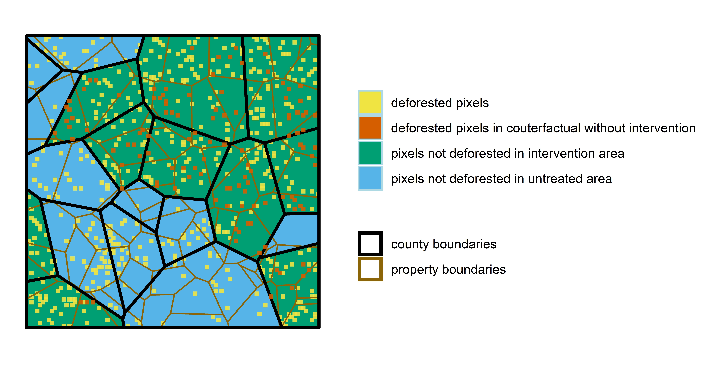

\sectionfont{\fontsize{11}{11}\selectfont}
\subsectionfont{\fontsize{11}{11}\selectfont}


```{r setup, include=FALSE}
library(knitr)
library(ggplot2)
library(kableExtra)
library(tidyverse)


knitr::opts_chunk$set(echo = FALSE, warnings = FALSE, messages = FALSE, out.width="49%", fig.align = "center")
```

<!-- To do: -->

<!-- - outcome: binary outcome equal to one if any deforestation occurs within boundary -->
<!-- - adjust bias plot to spec chart  -->
<!-- - multiple group-period extension -->

<!-- Possible extensions: -->
<!-- - weighting possibilities -->
<!-- make properties more or less heterogeneous -->


# Abstract {-}
Conservation scientists are increasingly measuring the impacts of conservation interventions by applying quasiexperimental impact evaluation to remotely sensed panel data on land use change. However, these applications come with new challenges. Using Monte Carlo simulations and analytical proofs, we demonstrate that many of the panel econometric models employed for conservation impact evaluation are biased - the significance, magnitude and even direction of estimated effects from many studies are likely incorrect. These errors threaten to undermine the evidence base that underpins conservation policy adoption and design. We review this burgeoning literature and develop guidance for the design of econometric models quantifying conservation policy effectiveness. 

# Introduction

The founding goal of conservation science was to provide principles and tools to preserve biological diversity [@soule1985]. To live up to this goal, scientists must generate causal evidence detailing the effectiveness of  conservation interventions [@williams2020]. Such evidence is critical for practitioners who grapple with challenging questions of cause and effect. Do marine protected areas stop unsustainable harvesting of fish? Can payments for ecosystem services encourage lasting reforestation? When successful, conservation science provides answers that improve the way society confronts environmental challenges. However, inappropriate methods can yield misleading conclusions and, as a result, risk diverting scarce financial and political resources from the most effective conservation strategies.

Increasingly, econometric methods of impact evaluation have been used to disentangle causal relationships in conservation science [@butsic2017; @baylis2016]. These methods can generate accurate estimates of an intervention's impact by comparing observed outcomes to a rigorous counterfactual of what would have happened in the absence of an intervention [@ferraro2009; @meyfroidt2016; @ferraro2019; @ribas2020]. Conservation impact evaluation increasingly makes use of panel data in which units are observed repeatedly through time, thanks, in large part, to the proliferation of remote sensing [@blackman2013; @jones2015]. For example, NASA's landsat missions provide detailed and consistent information on land use spanning the entirety of the world since the 1970s [@hansen2012]. As a result, a scientist hoping to quantify the impacts of a land use policy adopted decades ago can assemble data for treated and control units that span both pre- and post-implementation periods [@jain2020].

However, many commonly used measures of land use change have structural differences from the data used in traditional, linear panel models. For example, deforestation is often measured using data with a similar structure to the Global Forest Change product produced by @hansen2013. When converted to a panel structure, these data yield binary observations detailing the first year in which each 30 by 30m pixel was deforested. Importantly, the data do not allow for the detection of reforestation timing and, as a result, are unable to detect repeated deforestation events in the same location. To date, insufficient attention has been paid to how such binary, irreversible outcome data may affect the performance of standard econometric tools. While many of our results apply to any setting with binary, irreversible data, we focus on the deforestation case.  

Here, we use a combination of analytical proofs and Monte Carlo simulations to demonstrate that many econometric analyses of deforestation are likely biased - significance, magnitude and even direction of estimated effects might be incorrect. These biases arise even when researchers follow common guidance to adopt "rigorous" research designs with valid counterfactuals [@blackman2013; @jones2015]. Our main result shows that two-way fixed effects regressions with pixel unit fixed effects cannot identify the desired treatment effect parameter. Papers published in economics journals as recently as 2021 use this problematic specification to recover treatment effect estimates. This result extends to recently developed difference-in-differences estimators that allow for multiple periods and variation in treatment timing (e.g., @callaway2020; @gardner2021). To help guide future impact evaluations, we propose multiple ways in which this bias can be reduced or even eliminated. We then explore non-random selection that arises due to irreversibility in the deforestation setting and how this feature of the data may lead to bias. Finally, we reflect on the econometric benefits that emerge when researchers are able to match their model structure to the relevant scale of the deforestation process. 

# Conservation impact evaluation using panel methods
<!-- NOTE: I think this opening paragraph could probably be integrated into the motivating introduction -->
While randomized experiments are the gold standard for scientific discovery in both the natural and social sciences [@edwards2020; @jayachandran2017], conservation often poses questions that are prohibitively expensive, unethical or impossible to pursue through experimentation. In such settings, a growing portfolio of statistical techniques enable researchers to draw causal conclusions using observational data [@larsen2019]. Importantly, these methods account for the non-random assignment of interventions that often confound identification of causal relationships; i.e., a low rate of deforestation within a remote protected area may reflect the protected area's effectiveness, or it may be indicative of the remote location's poor suitability for agricultural development [@andam2008; @pfaff2009]. These approaches frequently build upon panel data, in which researchers are able to observe changes in outcomes after the adoption of an intervention [@blackman2013]. When a rigorous research design is applied to panel data, observational studies can yield conclusions that are comparable to what a researcher would discover if they were able to run a randomized experiment [@ferraro2017].

We center our attention on the case in which a researcher would like to quantify the impact of a policy intervention on deforestation rates. We assume that the intervention has clearly defined boundaries (e.g., a protected area, certified concession, or indigenous territory), and that the researcher has access to spatially explicit observations of forest cover and forest loss spanning the periods before and after the intervention was adopted. This general setting describes a broad array of research studies that apply panel methods to remotely sensed data (Table \@ref(tab:table-lit)).

\renewcommand{\arraystretch}{1.5}
```{r table-lit}

lit_table <- read.csv("lit_table.csv")[,1:4]

kable(lit_table, format = "latex", 
      caption = "Econometric model structures used in avoided deforestation impact evaluations",
      col.names = c("Paper",
                    "Panel Method",
                    "Unit of analysis",
                    "Unit fixed effects level")) %>% 
  row_spec(0,bold=TRUE) %>% 
  kable_styling(font_size = 10, latex_options = c("striped", "HOLD_position"),
                #full_width = TRUE
                position = "center"
                )

```
\clearpage
<!-- 
TODO: -this is the one TODO that still needs to be addressed to a certain extent. I'm thinking that I'll wait to add the studies that use binary "any deforestation within bounds" outcome until we incorporate this outcome into the simulations. At that point, I'll more descriptively include the outcome as something separate from the unit of analysis

1. For "regression" panel methods - what does this mean? Aren't all of these studies using regression? Are these cross-sectional rather than panel models?
- need to address this in a more informative way, but many are in panel settings but use a model that does not use fixed effects 
3. Add studies that use binary "any deforestation within bounds" outcome?
- need to add these studies
4. Differentiate NDVI as an outcome vs binary deforestation?
- currently, I've excluded studies that use only NDVI. Some of these use both NDVI and a binary outcome
-->

In each of the studies detailed in Table \@ref(tab:table-lit), the researcher's goal is to measure the impact that a specific policy had on deforestation within treated units, also known as the \textit{average treatment effect on the treated} ($ATT$). The $ATT$ estimates the difference between the average deforestation rate of treated units with treatment, and the average deforestation rate of treated units without treatment. The fundamental challenge is that, for every treated unit, the researcher is unable to observe the value that the outcome would have taken in the absence of treatment [@holland1986]. In our case, this means that the researcher cannot observe the deforestation that would have occurred in treated units had they not received treatment. Figure \@ref(fig:counterfactual) displays this problem in the context of a simulated conservation intervention that reduced deforestation rates in treated areas --- the landscape is depicted as observed by the researcher at the end of the observation period, including the unobservable counterfactual of what would have happened if the conservation intervention had not been adopted. Note that in untreated areas, there is no counterfactual deforestation, since no intervention ever took place. 

```{r counterfactual, echo=FALSE, fig.cap="A map of a simulated landscape depicting patterns of deforestation under an effective conservation intervention, as well as counterfactual deforestation illustrating what would have happened in the absence of the intervention.", out.width = "100%"}

```


## Modeling the decision to deforest
<!-- So I was thinking it could be useful to have a more general definition of our y_{ivt} that can vary between 0 and 1 across periods. This way, we can motivate the selection bias through the underlying latent variable. I added the bare bones of a second model that isn't dynamic in the way the the pfaff/kerr model is. With the pfaff/kerr model, I had a hard time reconciling the fact that the landowner chooses time t (even though the sufficient condition for clearing is just the returns along the latent variable) with the fact that y_ivt can vary. Would love to hear whether you think the model is necessary at all or which model would be better motivation. -->

<!-- Alternatively, if the selection shouldn't come into play at all if the observed y^o_{ivt} that drops deforested pixels really should be the true y_ivt. Then our common trends and ATT would just reflect that selection -->


<!-- We dynamically model deforestation pressure following @kerr2003 and @pfaff2004a. A risk-neutral landowner decides when to clear forested pixel $i$ in property $v$ by maximizing the expected present discounted value of returns: -->

<!-- $$ \max\limits_T \int^T_0 S_{ivt}e^{-rt}dt + \int^\infty_TR_{ivt}e^{-rt} - C_Te^{-rt}$$ -->

<!-- , where $S_{it}$ represents returns to forest uses of the land; $R_{it}$ represents returns to non-forest uses of the land; $C_T$ represents the cost of clearing net of obtainable timber value; and $r$ is the interest rate.  -->

<!-- Clearing must be profitable and an arbitrage condition must hold in order for pixel $i$ in property $v$ to be cleared in time $t$: -->

<!-- $$R_{ivt} - S_{ivt} -r_tC_t+\frac{dC_t}{d_t}>0$$ -->

<!-- We express deforestation pressure in terms of a latent variable $y^*_{ivt}$, and its transformation into a binary variable indicating whether there exists deforestation pressure such that the pixel is cleared: -->

<!-- \begin{align} -->
<!--  y^*_{ivt} = R_{ivt} - S_{ivt} -r_tC_t+\frac{dC_t}{d_t} (\#eq:clearing)\\ -->
<!--  y_{ivt} = \begin{cases} -->
<!--       1 &  \text{if $y*_{ivt}>0$}\\ -->
<!--       0 &  \text{otherwise} -->
<!--    \end{cases} -->
<!-- \end{align} -->

<!-- We inform our empirical investigations based on this theoretical model.   -->


<!-- We inform our empirical investigations with a land rent model based on @pfaff1999. For further details we refer the reader to the paper cited, as we try to provide just enough intuition to motivate our empirical investigations. At any point in time, a plot of land is allocated between different land uses to maximize profit.  -->

<!-- $$ \max\limits_{l;I} \pi^l_{ivt} = P^l_{ivt}* Q^l_{ivt} (I_{ivt}) - R_{ivt}*I_{ivt}$$ -->
<!-- , where $l$ represents a given land use; $i$ represents a pixel located in property $v$; $t$ represents the year; and -->

<!-- \begin{align*} -->
<!-- P^l_{ivt} =&\text{ pixel-level prices for the vector of possible outputs from any given land use $l$,}\\  -->
<!-- Q^l_{ivt} =&\text{ the vector of all outputs produced from land use $l$,}\\  -->
<!-- I_{ivt} =&\text{ the vector of inputs used in all types of production,}\\  -->
<!-- R_{ivt} =&\text{ pixel-level prices for the vector of inputs used.}\\  -->
<!-- \end{align*} -->

<!-- One key factor to understanding our choice of this motivational model is the omission of past land use. In this model, regrowth is sufficiently fast that uncleared land is a viable option for pixels which were cleared in the previous observation [@pfaff1999]. In reality, forest regrowth is neither instantaneous nor is deforestation irreversible. We make this modeling assumption in order to explore the potential issues that arise when reforestation timing is ignored and assumed to be irreversible. This aspect of the model becomes relevant in Section \@ref(property). -->


<!-- NOTE: We should expand upon this description of the basic latent > binary decision rule model, and highlight examples from the literature that use this type of cut-off in both dynamic and static settings. Also need to adjust notation given that previous Pfaff model has been removed. -->
We model deforestation $(y_{ivt})$ as a binary choice by a landowner to clear a small plot of land $i$ within their larger property $v$ at time $t$. The decision to deforest depends upon a latent variable $(y_{ivt}^*)$ that represents the returns of the plot of land in its cleared state $(V_{ivt}^{cleared})$ relative to the returns from its forested state $(V_{ivt}^{uncleared})$, such that:

\begin{align}
 y^*_{ivt} = V^{cleared}_{ivt} - V^{uncleared}_{ivt} (\#eq:clearing)\\
 y_{ivt} = \begin{cases}
      1 &  \text{if $y^*_{ivt}>0$}\\
      0 &  \text{otherwise}
   \end{cases}
\end{align}

This generic clearing rule underpins a broad class of more specific static and dynamic models that have been used to explore the determinants of deforestation [@pfaff1999].
<!-- NOTE: Add more citations to past models - in particular, need to add dynamic models (pfaff and kerr?) Maybe add another sentence or two describing what these models have in common? -->

However, this basic model makes an assumption that the decision to deforest is reversible. In reality, a number of characteristics of both the process of deforestation, as well as the methods used to detect deforestation in individual plots, complicate this assumption. First, the goal of many conservation interventions is to prevent the loss of mature forests that may take decades, if not centuries, to regrow (CITE). In such cases, deforestation itself may be considered irreversible in human time scales, focusing the researchers' attention upon the first instance in which a plot is deforested. Even when deforestation of secondary forests is an object of interest, constraints imposed by remotely sensed datasets may force empirical researchers to treat deforestation as irreversible. Gradual processes of reforestation are inherently harder to identify than abrupt losses of forest cover (CITE HANSEN). In addition, determining the precise year in which the extended process of forest regrowth began is currently an active area of research for the remote sensing community, and often requires many years of post-regrowth observations (CITE GRAESSER?). As a result, commonly used deforestation datasets such as the Global Forest Change product often only identify the first year in which a pixel was cleared [@hansen2013]. Whether desired, or due to technical limitations, the resulting inability to observe repeated deforestation events has led many researchers to drop deforested pixels in the periods after they first become deforested [@jones2015; @alix-garcia2017]. As a result of deforestation's assumed irreversibility, the binary deforestation variable $y_{ivt}$ is further modified:

\begin{align*}
 y^o_{ivt} = \begin{cases}
      1 &  \text{if pixel $i$ is deforested in time $t$}\\
      0 &  \text{if pixel $i$ has never been deforested} \\
      NAN & \text{if pixel $i$ was deforested prior to time $t$}
   \end{cases}
\end{align*}


<!-- base our empirical investigations on a model of a landowner's decision to deforest a plot of land $i$ located within their property $v$. Across a variety of static [@pfaff1999] -->
<!-- and dynamic (ADD CITATIONS) settings -->

<!-- in a relatively general class of models that  with a land rent model based on @pfaff1999. For further details we refer the reader to the paper cited, as we try to provide just enough intuition to motivate our empirical investigations. At any point in time, a plot of land is allocated between different land uses to maximize profit. -->
<!-- [@pfaff1999] -->
<!-- Assuming two land uses (we simply consider cleared and uncleared) and privately optimal input choice, we can consider the following clearing decision: -->

<!-- $$\text{choose $l_{ivt}=$ cleared}  \hspace{5mm} iff: V^{cleared}_{ivt}> V^{uncleared}_{ivt},$$ -->

<!-- where $V^l_{ivt} = \max\limits_{I | l} \pi^l_{ivt}$. Thus, pixel $i$ in property $v$ would be deforested in time $t$ if $V^{cleared}_{ivt} - V^{uncleared}_{ivt} > 0$. We express deforestation pressure in terms of a latent $y^*_{ivt}$, and its transformation into a binary variable indicating whether there exists deforestation pressure such that the pixel is cleared in time $t$:   -->


<!-- Researchers generally cannot observe $y^*_{ivt}$ directly. Instead, they observe maps depicting pixel-level, binary deforestation, similar to what is depicted in Figure \@ref(fig:counterfactual). In the form of a panel dataset, the researcher observes the year in which a pixel is converted from forest to non-forest, and importantly, deforested pixels do not revert back to forest cover.  -->


<!-- Rather than directly observing deforestation rates across the landscape in each time period, the researcher observes annualized maps depicting pixel-level, binary deforestation $(y^o_{ivt}\ \epsilon \ 0, 1)$ with the following mapping from the latent $y^*_{ivt}$ to the observed $y^o_{ivt}$: -->

<!-- \begin{align} -->
<!--  y^o_{ivt} = \begin{cases} -->
<!--       1   & y^*_{ivt} > 0 \text{ and } y^*_{iv \tau} \leq 0 \text{ for all } \tau<t  \\ -->
<!--       0   &  y^*_{ivt} \leq 0 \text{ and } y^*_{iv \tau} \leq 0 \text{ for all } \tau<t \\ -->
<!--       NAN & otherwise -->
<!--    \end{cases} -->
<!-- \end{align} -->

<!-- Contemporaneous land rent, $R_{ivk}$,for land use $k$ at any given pixel $i$ located in property $v$ is defined as the difference between the value of outputs and inputs, $Q_{ivk}$ and $X_{ivk}$, at their respective location-specific prices $P_{ivk}$ and $C_{ivk}$. -->

<!-- \begin{align} -->
<!-- R_{ivk} = P_{ivk} Q_{ivk} - C_{ivk} X_{ivk} -->
<!-- \end{align} -->

<!-- We assume Cobb-Douglas production with a productivity shifter $S_{ivk}$ and that prices are affected by a vector, $Z_{ivk}$ of location-specific variables such as slope, market access, agricultural suitability, etc.. Land rent $R_{ivk}$ can be expressed as a function of the productivity shifters and variables affecting prices, and taking logs and collecting coefficients gives:  -->
<!-- \begin{align} -->
<!-- ln R_{ivk} = \alpha + \beta ln Z_{ivk} + \gamma ln S_{ivk} + \epsilon_{ivk} -->
<!-- \end{align} -->
<!-- , where $\epsilon_{ivk}$ is an error term.  -->

<!-- We only distinguish between forest ($k=0$) and non-forest ($k=1$) uses of the land. Pixel $i$ in property $v$ would be deforested in time $t$ if $y^*_{ivt} = R_{ivt1} - R_{ivt0} >0$. We express deforestation pressure in terms of a latent $y^*_{ivt}$, and its transformation into a binary variable indicating whether there exists deforestation pressure such that the pixel is cleared in time $t$:  -->

<!-- \begin{align} -->
<!--  y^*_{ivt} = R_{ivt1} - R_{ivt0} (\#eq:clearing)\\ -->
<!--  y_{ivt} = \begin{cases} -->
<!--       1 &  \text{if $y^*_{ivt}>0$}\\ -->
<!--       0 &  \text{otherwise} -->
<!--    \end{cases} -->
<!-- \end{align} -->


## Estimating the $ATT$: difference-in-differences and two-way fixed effects estimators

The remainder of our paper focuses on two methods commonly used to estimate the $ATT$ in conservation intervention settings with panel data: Difference-in-Differences (DID) and Two-way Fixed Effects (TWFE) regression models [@blackman2013; @jones2015]. Our parameter of interest, the $ATT$, is the average effect of the conservation intervention on treated pixels. Let $y_{ivt}(1)$ and $y_{ivt}(0)$ denote the potential outcomes of pixel $i$ in property $v$ in time $t$ with and without the treatment, respectively. The $ATT$ can now be expressed: 

$$ ATT = E[y_{ivt}(1) - y_{ivt}(0) |  t\geq t_0, D_i=1]$$

, where $t_0$ is the year that the intervention is implemented and $D_i$ is a dummy equal to one if pixel $i$ is ever treated.

The DID and TWFE methods have become so popular in part, because the researcher does not need random assignment of treatment to generate convincing estimates of a program's impact on avoided deforestation. Instead, the researcher must make a common trends assumption, under which we evaluate both methods. 

\textbf{Assumption 1:} (Common trends)
\begin{align*}
E[y_{ivt}(0) |  t\geq t_0, D_i=1]-E[y_{ivt}(0) |  t< t_0, D_i=1]=E[y_{ivt}(0) |  t\geq t_0, D_i=0]-E[y_{ivt}(0) |  t< t_0, D_i=0]
\end{align*}

Assumption 1 requires that deforestation rates in the intervention area and untreated units would have experienced the same average change in the outcome (trend) in the absence of the intervention. Put another way, this means that pixels in treated and untreated areas would have experienced the same change in their probability of deforestation across the two periods had no intervention ocurred. While fundamentally untestable, ensuring that deforestation rates in the intervention area and the control area followed parallel trajectories prior to the date of the intervention can give creedence to this assumption [@butsic2017]. 

We also evaluate the DID and TWFE models under the following stable unit treatment value assumption (SUTVA)

\textbf{Assumption 2:} (SUTVA)
\begin{align*}
\forall d \in \{ 0,1\}: \text{ if }D_i=d \text{ and }t\geq t_0, \text{ then }y_{ivt}(d)=y_{ivt}
\end{align*}

Assumption 2 requires that the potential outcomes for pixel $i$, $y_{ivt}(1)$ and $y_{ivt}(0)$, do not depend on the treatment status of any other pixel. There also cannot exist unobserved versions of treatment that may affect the potential outcomes. 


The typical DID regression model includes a dummy variable equal to one for units in the treatment group, a dummy variable equal to one for observations in the period after the intervention, and their interaction. 

\textbf{Regression 1:} (DID regression)
Let $\beta_{DID}$ denote the coefficient of the interaction between $D_{i}$ and an indicator for whether the intervention has been implemented in time $t$, $\mathbb{1} \{ t\geq t_0\}$,  in the following (population) OLS regression: 
\begin{align}
y^o_{ivt} = \alpha_0 + \alpha_1 D_i + \alpha_2 \mathbb{1} \{ t\geq t_0\}+ \beta_{DID} \text{ x } D_i \mathbb{1} \{ t\geq t_0\}  + \epsilon_{it}
\end{align}

Conceptually, the DID estimator calculates the treatment effect as the difference between the differences of the treated and untreated observations before and after treatment [@butsic2017]. 
\begin{align*}
\beta_{DID} = E[y^o_{ivt} |  t\geq t_0, D_i=1] - E[y^o_{ivt} |  t<t_0, D_i=1] - (E[y^o_{ivt} |  t\geq t_0, D_i=0] - E[y^o_{ivt} |  t<t_0, D_i=0] )\\
\end{align*}

When the $y^o_{ivt}$s are i.i.d., it is straightforward to show under Assumption 1 and 2,
\begin{align*}
\beta_{DID}=ATT
\end{align*}

Often times, however, the researcher wants to estimate the $ATT$ in a setting that is not consistent with the two-group, two-period case covered by DID models. TWFE regression models are frequently used to apply DID methods to multiple groups or treatment periods. This amounts to estimating a regression that controls for unit and time fixed effects, which account for any unobservable confounding variables that may vary across units or through time. 

\textbf{Regression 2:} (TWFE regression)
Let $\beta_{TWFE}$ denote the coefficient of the interaction between $D_{i}$ and $\mathbb{1} \{ t\geq t_0\}$  in the following (population) OLS regression: 
\begin{align}
y^o_{ivt} = \alpha + \beta_{TWFE} \text{ x } D_i \mathbb{1} \{ t\geq t_0\} + \lambda_t + \gamma_i + \epsilon_{it}
\end{align}
, where $\lambda_t$ and $\gamma_i$ are year and pixel fixed effects, respectively. 

Because TWFE regression models are often used to generalize the DID method, they are used in a wider variety of settings in the land use change impact evaluation literature. Settings in which units undergo treatment in more than two distinct time periods may be amenable to TWFE regression, but not the standard DID method. For example, a researcher may use a TWFE regression model to examine the effectiveness of a network of protected areas where the protected areas were created at different times, or a payment for ecosystem services (PES) program that enrolled properties in annual cohorts. In the case of two groups and two time periods, the TWFE regression should give an estimate equivalent to that of the DID model [@wooldridge]. Based on this flexibility, TWFE regression models have achieved widespread popularity in the literature  (Table \@ref(tab:table-lit)). 

<!-- Robert - I think this text is redundant with previous few sentences, and start of next section

When the treatment effect is constant across groups and over time, TWFE regressions typically estimate the average treatment effect in treated units under the standard common trends assumption [@dechaisemartin2020]. However, when TWFE models in the form of Regression 2 are applied to a binary, irreversible process such as deforestation, $\beta_{TWFE}$ fails to identify the $ATT$.  -->

# Pixel level, TWFE models fail to estimate the $ATT$

Despite widespread use of pixel level analyses of deforestation, the application of TWFE models to a binary, irreversible process such as deforestation does not yield an unbiased estimate the $ATT$. While dropping pixels (as in our definition of $y^o_{ivt}$) has been offered as a correction to account for the irreversibility of deforestation events [@jones2015], it is quite problematic in TWFE models. In fact, with this correction, the TWFE model yields the post-treatment difference in outcomes (single difference), rather than the desired $ATT$. The result stems from the fact that the TWFE regression is not able to identify off of pixels that are dropped in the first period. Thus the pre-treatment period deforestation rates are not accounted for in $\beta_{TWFE}$.

\textbf{Result:} $\beta_{TWFE}$ does not identify the $ATT$, but rather, in the two-group, two-period case identifies the post treatment difference in outcomes. 

\[ \beta_{TWFE} = ATT + \underbrace{E[y_{it}(0) | t<t_0, D_i=1] - E[y_{it}(0) | t<t_0, D_i=0]}_{\text{pre-treatment difference in deforestation rates}} \]

\textbf{Proof:} Appendix \@ref(TWFE-proof) Q.E.D.

Thus, Regression 2 forgoes the benefits that panel methods provide. In Appendix \@ref(ex-post), we show that $\hat{\beta}_{TWFE}$ is equivalent to the coefficient from a regression on a dataset where all pixels deforested in the pre-treatment period are simply dropped from the dataset completely. This remains the case even when the dataset contains more than two years worth of observations. Therefore, if the treated area has a different baseline deforestation rate than the control, the researcher will present a biased estimate of the intervention's impact. 

<!-- Robert to do: Edit following three paragraphs for flow.
-->

Further, it is frequently the case that treatment and control units have differing pre-treatment deforestation rates in the context of conservation interventions. Interventions may be implemented in a given area precisely because of a desire to reduce deforestation. It is conceivable that this bias could not only lead to changes in the magnitude of estimates, but changes in sign, thereby influencing policymakers to adopt ineffective policies or ignore effective program designs. In cases where the researcher has two groups and two distinct time periods, the simple DID model can still identify the $ATT$, however, TWFE models with pixel fixed effects as described by Regression 2 cannot be used to convincingly identify the $ATT$.

Researchers often find themselves in situations where the more flexible TWFE model is preferable to the simple DID, such as in the case of multiple groups and time periods. While many economists may be transitioning to newly developed estimators to address settings in which multiple groups undergo treatment in different time periods [e.g., @callaway2020; @gardner2021], we show in section \@ref(multipleGT) that many of these estimators suffer from the same issue. 

## Alternative construction of $y^o_{ivt}$ cannot recover $ATT$
<!-- Robert to do: Edit this section for clarity.
-->

In this context, the researcher is interested in how the intervention impacts the occurrence of deforestation events (i.e. the decision to clear), not simply the presence of cleared land. Keeping the deforested pixel in the panel beyond the first period in which it was observed as deforested may imply that it has actively been deforested in each subsequent time period, when in fact, no new deforestation event or clearing decision has ocurred. These pixels, therefore, contribute unwarrantedly toward the deforestation rate in each additional period they are left in the panel. This is intuitively problematic, because the deforestation rate in each period would be monotonically increasing by construction, which is not necessarily (and hopefully not) the case. Thus, researchers cannot leave deforested pixels in the panel and claim to estimate an intervention's impact on deforestation rates. We show that pixel-level regression models failing to drop deforested pixels in subsequent periods do indeed incur severe bias if used to estimate the $ATT$ as it is defined here (Appendix \@ref(keep-pixels)). 

Some researchers opt to keep deforested pixels in the panel, and instead of estimating a program's impact on deforestation rates, claim to estimate the programs impact on deforested area. However, when reforestation timing is unaccounted for, as is the case with most data products using a binary measure of deforestation, this is not possible. Rather than measuring deforested area at any given time, this outcome variable measures the stock of ever-deforested area through the current time period. It is unclear that this is a relevant parameter of interest in many cases and should not be interpreted as either a deforestation rate or the deforested area in a given time period. See (Appendix \@ref(keep-pixels)) for further discussion on this point.

# Monte Carlo simulations to compare alternative model performance

The rapid growth of the conservation impact evaluation literature has resulted in a diversity of alternate model structures that could yield more accurate estimates of the effectiveness of different interventions (Table \@ref(tab:table-lit)). To explore the relative performance of these different models, we employ a series of Monte Carlo simulations. Specifically, we randomly generate synthetic landscapes with known policy effectiveness and analyze the performance of different econometric models in estimating the policy's known impact.

## Data generating process

Each of our simulated landscapes consists of administrative units that are either untreated $(D=0)$ or are assigned to a conservation treatment $(D=1)$. We observe deforestation in two, even-length periods, a pre-treatment $(t < t_{0})$ and a post-treatment $(t \ge t_{0})$ period. 

We follow Equation \@ref(eq:clearing) and model these binary deforestation events as a function of each pixel's unobservable value along the continous, latent variable ($y^*_{ivt}$) indicating the return to clearing pixel $i$, in property $v$, in year $t$. 
<!-- The latent variable is defined: -->
\begin{align*}
y^*_{ivt} = & V^{cleared}_{ivt} - V^{uncleared}_{ivt}\\
=&\beta_0 + \beta_1 D_i +
 \beta_{2,0} (1 -  D_i ) \mathbbm{1}\{  t \geq t_0  \} +(\beta_{2,1} + \beta_3 )D_i \mathbbm{1}\{  t \geq t_0  \} +
 \alpha_i + u_{it} + \rho_{v}
\end{align*}

That is, the returns to deforestation evolve over the two time periods $(\mathbbm{1}\{  t \geq t_0  \})$, and differ across the control $(  D_i = 0 )$ and treated pixels $(  D_i = 1 )$. In addition, we assume that the value of deforestation is influenced by time-invariant random disturbances at the scale of individual pixels ($\alpha_i \sim N(0, \sigma_a^2)$) or properties ($\rho_v \sim N(0, \sigma_p^2)$), as well as time-varying, pixel-scale disturbances ($u_{it} \sim N(0, \sigma_u^2)$). These disturbances can represent a variety of spatial and temporal processes including, for example, the biophysical characteristics of a location, or the preferences of a property owner. 
<!-- Note for Albert: Should sub-script on property-level sigma be v?
-->


## Assumed parameter values
For the remainder of the paper, we explore a guiding example that has been parameterized to represent an impactful intervention in a high deforestation setting. In the existing literature, it is not uncommon to see annual treatment effects amounting to less than a 1 percentage point reduction in the annual deforestation rate [e.g. @robalino2013; @jones2017]. These modest reductions in the annual deforestation rate, however, can amount to large landscape-scale effects. For example, @alix-garcia2018 find that environmental land registration in Brazil’s Amazonian states of Mato Grosso and Para reduced the annual deforestation rate by an average 0.5 percentage points, which has amounted to an overall deforestation reduction of 10\%. 

The initial simulated landscape has the following characteristics: a pre-treatment deforestation rate of 2\% in the control area; a pre-treatment deforestation rate of 5\% in the intervention area; a decrease in the deforestation rate of 0.5 percentage points between the first and second period in the absence of treatment; and an average reduction of 1 percentage point in the deforestation rate in treated units due to the intervention ($ATT = -0.01$). We assume that $\sigma_u = 0.5$. Finally, we begin by assuming away time invariant pixel ($\sigma_a = 0$) and property-level disturbances ($\sigma_p = 0$) but relax this assumption in Section \@ref(property). Note that Assumptions 1 and 2 are satisfied by construction. The derivations detailing the mapping from the landscape characteristics to the corresponding parameters in $y^*_{ivt}$ can be found in Appendix \@ref(parameter-mapping). 

## Evaluation criteria

We compare econometric models using a combination of estimate bias, root mean squared error (RMSE), and coverage probability. Using our Monte Carlo simulations, we calculate estimate bias as the difference between each model's mean estimate of the $ATT$ and the known $ATT$ parameter. RMSE describes the distribution of estimates around the $ATT$. Coverage probability is defined as the proportion of simulations in which the true $ATT$ lies within the simulation's 95\% confidence interval (CI). As such, we would expect the $ATT$ to lie within this CI 95\% of the time, however, factors such as the bias of the estimates, their distribution, and treatment of standard errors may impact coverage.  

# Alternative specifications can yield unbiased estimates of the $ATT$
<!-- Robert to do: Restructure the next two paragraphs to reduce redundancy.
-->

TWFE models have risen to prominence due to their flexibility in applying DID methods to settings with multiple groups and variation in treatment timing. However, TWFE models with pixel fixed effects are not a viable approach to estimate the $ATT$ in deforestation impact evaluations. Column 1 of Figure \@ref(fig:summary-fig) shows the bias associated with Regression 2. In our guiding example, the ex-post single difference is 0.02 (the $ATT$ plus the post-treatment group difference in deforestation rates), when the true $ATT$ is equal to -0.01. This means that a positive bias of 0.03 results from the use of this regression model. However, we show that multiple alternate model specifications enable researchers to generate unbiased estimates of the $ATT$. We describe three straightforward solutions to this challenge below.

## Traditional difference-in-differences model

In the two-group, two-period case the typical DID model (Regression 1) is an unbiased estimator of the $ATT$, as shown in columns 2-5 of Figure \@ref(fig:summary-fig) (The typical DID is equivalent to including treatment fixed effects). However, researchers often want to use TWFE models because of their flexibility in situations that do not fall under the typical DID setup. Therefore, researchers should be aware of the trade-offs using aggregated units of analysis and fixed effects when using TWFE models for deforestation impact evaluation. 

## Spatially aggregated fixed effects

One can also use fixed effects at the level of a spatially aggregated unit rather than the pixel level to resolve bias associated with TWFE regressions with pixel fixed effects. For simplicity, we assume the researcher can choose between three levels at which to aggregate the data: grid cell, county, and property. Grid cells are uniform grids layered over the study area. Counties are heterogeneous administrative units at which we assign the treatment. Lastly, properties are smaller spatial units that lie within one or more counties. Pixel level TWFE models with spatially aggregated unit fixed effects are all in the form of Regression 3.

\textbf{Regression 3:} (pixel level TWFE regression with spatially aggregated unit fixed effects)
Let $\beta_{FE,j}$ denote the coefficient of the interaction between $D_{i}$ and $\mathbb{1} \{ t\geq t_0\}$  in the following (population) OLS regression:
\begin{align}
y^o_{ivt} = \alpha + \beta_{FE,j} \text{ x } D_i \mathbb{1} \{ t\geq t_0\} + \lambda_t + \gamma_j + \epsilon_{it}
\end{align}
, where $\lambda_t$ denotes year fixed effects and $\gamma_j$ denotes one of grid ($g$), county ($c$), or property ($v$) fixed effects ($j=\{g, c, v \}$).

Columns 6-8 of Figure \@ref(fig:summary-fig) show that pixel level TWFE regressions are unbiased estimators of the $ATT$ when grid, county, or property fixed effects are used rather than pixel fixed effects. We also see that, in the absence of property level perturbations (i.e. $\sigma_p=0$ in the DGP), all three models provide similar estimates and estimate distributions. 

```{r summary-fig, fig.cap="bias, distribution, and coverage of all models with clustered standard errors. ",  out.width="100%"}
knitr::include_graphics("figs/schart.png")
```


## Spatially aggregated units of analysis

Another potential solution to the bias associated with TWFE models is for researchers to aggregate multiple pixel level observations into larger units of analysis. The researcher must now calculate the deforestation rate in each time period. While we detail the tradeoffs of various deforestation rate calculations in the appendix (Appendix \@ref(rate-formula)), the following results are based on Equation \@ref(eq:deforrate) which is arguably the most commonly used formula in the literature [e.g. @carlson2018; @busch2015a]. 
\begin{align*} 
z_{jt} &= \frac{F_{j,t-1} - F_{j,t}}{F_{j,t-1}} (\#eq:deforrate)
\end{align*}
, where $F_{j,t}$ and $F_{j,t-1}$ are the forest cover in unit $j$ at times $t$ and $t-1$, respectively. Unit $j$ represents one of the three aggregated units, the grid cell (g), county (c), or property (v).

\textbf{Regression 4:} (grid/county/property level regression)
Let $\beta_{j}$ denote the coefficient of the interaction between $D_{j}$ and $\mathbb{1} \{ t\geq t_0\}$  in the following (population) OLS regression, where $j=\{g,c,v \}$:
\begin{align}
z_{jt} = \alpha + \beta_{j} \text{ x } D_j \mathbb{1} \{ t\geq t_0\} + \lambda_t + \gamma_j + \epsilon_{jt}
\end{align}
, where $\lambda_t$ denotes year fixed effects and $\gamma_j$ denotes one of grid, county, or property fixed effects. Note that in these regressions, the level of unit fixed effects matches the unit of analysis. The treatment variable $D_j = \frac{1}{N_j}\sum_{i=1}^{N_j}D_i$, is the average treatment value amongst all pixels in unit $j$.

Columns 9-11 of Figure \@ref(fig:summary-fig) show that the bias of the estimates does not vary dramatically across different levels of aggregation, however, the distributions are varied. In particular, the property-level model had the highest RMSE of unbiased specifications due to the heterogeneity in property sizes across the landscape. At the same time, relative to the pixel level models with spatially aggregated unit fixed effects, the coverage probability of these models is closer to the desired 95\%.

# Non-random selection and the spatial nature of the deforestation process {#property}

<!-- Robert to do: Edit this section
-->
The irreversible nature of the deforestation process creates the potential for non-random sample selection in this data setting. Because the process of deforestation is reflected to be irreversible in the panel, deforested pixels are no longer at risk of clearing in the periods after they are first deforested. This means the "at risk" set of pixels changes through time as more pixels become deforested. As such, the distribution that describes the returns to clearing the at-risk pixels may change through time as well, leading to the selection issue. For example, pixels with extremely high returns to clearing are more likely to be cleared early on, regardless of treatment status. In subsequent periods, therefore, these high return pixels are less likely to be present in the sample at all. In the context of two-groups and two-periods, only the second period suffers from this non-random sample selection, and we expresss the bias introduced from non-random sample selection below.

\textbf{Result:} Under Assumptions 1 and 2, in the two-group, two-period case, $\beta_{DID}$ suffers from non-random sample selection bias when the $y^o_{ivt}$s are not i.i.d.

\begin{align}
\beta_{DID} = & ATT +  \underbrace{E[y^o_{ivt}|t\geq t_0, D_i=1]-E[y_{ivt}|t\geq t_0, D_i=1] - (E[y^o_{ivt}|t\geq t_0, D_i=0]-E[y_{ivt}|t\geq t_0, D_i=0])}_\text{{bias emerging from non-random sample selection}}
\end{align}
<!-- = & ATT +  \\ -->
<!-- & P[y^o_{it}=1|t\geq t_0, D_i=1]-P[y_{it}=1|t\geq t_0, D_i=1] - (P[y^o_{it}=1|t\geq t_0, D_i=0]-P[y_{it}=1|t\geq t_0, D_i=0])\\ -->
<!-- = & ATT +  \\ -->
<!-- & P[ (y^*_{it}>0|t\geq t_0, D_i=1 ) \ | \ (y^*_{it}\leq 0 | t< t_0, D_i=1)]-P[y^*_{it}>0|t\geq t_0, D_i=1] - \\ -->
<!-- &(P[ (y^*_{it}>0|t\geq t_0, D_i=0 ) \ | \ (y^*_{it}\leq 0 | t< t_0, D_i=0)]-P[y^*_{it}>0|t\geq t_0, D_i=0])\\ -->

\textbf{Proof:} Appendix \@ref(selection-proof) Q.E.D.

In essence, the first and third expectations in the bias term are conditional on the pixel remaining forested after the first period.

Non-random selection was not an issue in our initial simulations, since we assumed away time-invariant pixel and property-level disturbances. The sample of at risk pixels in each time period did not depend on the deforestation that occurred the previous period, since the $y^o_{ivt}$s were i.i.d.. However, once time-invariant disturbances enter the DGP, the distribution of the $y^o_{iv2}s$ is potentially different from that of the $y^o_{iv1}$s. This is likely to be the case in reality, since each plot of land will have time-invariant characterisitcs such as slope, elevation, market access, agricultural suitability, etc. that impact its expected returns to clearing. 

In order to see how this non-random selection influences estimates in our simulated setting, we set $\sigma_a$, the standard error of the time-invariant pixel-level disturbances equal to $0.25$. Figure \@ref(fig:selection-fig) shows that non-random selection introduces a slight downward bias across every specification (specifications ordered from least to most bias). Pixel-level specifications suffer slightly more than specifications with a spatially aggregated unit of analysis in terms of bias and coverage. 

Another way to think about this bias is through the lens of reforestation timing. In equation 10, we see that the bias arises when the expectation of the observed $y^o_{ivt}$ and the true $y_{ivt}$ differ. This occurs when the researcher cannot observe reforestation timing in the data, and thus deforestation is irreversible in the panel dataset. We note that in practice, researchers cannot recover the second and fourth terms of the bias term in equation 10, meaning that the magnitude of this bias is unknown to the researcher. However, this bias is likely to be of a smaller magnitude in reality than in our simulated setting, since our simulated time frame for forest regrowth is too short to reflect true reforestation timing. For the remainder of the paper, we remove the bias due to non-random selection (only possible in the simulation setting). 

```{r selection-fig, fig.cap="Non-random selection introduces bias into estimates. Specifications are ordered by mean bias (least to most). ",  out.width="100%"}
knitr::include_graphics("figs/selection_schart.png")
```

# The value of linking model structure to the spatial process of deforestation

Connecting the econometric model to the process by which land use change occurs on the ground has clear benefits for estimation and inference in deforestation impact evaluation. Table \@ref(tab:table-lit) shows that researchers often use a binary point, pixel, or grid cell as the unit of analysis. While this may sometimes be the preferred unit, it may lead to biased results if the land use change process operates at a different scale.

Property level unobservables impact both treatment effect estimates and coverage probabilities. This is likely to be a factor when land use decisions are made at the property level, or the intervention seeks to alter underlying landowner incentives. Characteristics of land are also likely to be similar within the same spatial boundaries. In our Monte Carlo simulations, we reintroduce the standard deviation of the time-invariant property level disturbances in the initial DGP, $\sigma_p$, in order to account for these unobservables. 

## Matching grid cell resolution to scale of heterogeneity may reduce bias

In many instances, researchers do not have access to geospatial boundaries of these relevant administrative units. In these cases, utilizing a grid cell or alternative administrative unit to capture spatial heterogeneity is likely preferable to pixel level DID models for purposes of both estimation and inference. The scale of this grid cell or alternative unit relative to the process of land use change is important. Grid cell size plays a role in both estimation and inference, particularly when property level unobservables are present. 

We now vary the grid cell resolution used in our monte carlo simulations to understand the importance of scale when conducting conservation impact evaluations. Table \@ref(tab:grid-res) helps us to get a sense of relative scale within our synthetic landscapes for this section. We assume pixels are comparable to Landsat resolution (30 m), and so the average property in our landscape is 81 hectares. This average property area is equivalent to a 30 x 30 pixel grid cell in our setting. 

```{r grid-res}
nobs = 300^2
ppoints = 100
avg_parea = nobs/ppoints
# property: 900 square pixels | 900*900 = 810000 m^2 = 81 ha


# unit | grid cell resolution (m) | area (ha) | comparable use in literature

resolution_df <- data.frame(
  "pix" = c(3, 5 ,10, 20, 30, 50, 100)
) %>%
  mutate(resolution = pix*30,
         area_ha = resolution^2 / 10000#,
         #obs = round(nobs / pix^2)
         )

# property: 892.8571 square pixels | 30*30*892.8571 = 803571.4 m^2 = 80.35714 ha


kable(resolution_df, format = "latex", row.names = FALSE,  booktabs = T,
       caption = "Grid cell resolution and comparable area",
       col.names = NULL) %>% 
  add_header_above(c("resolution (pixels)"=1,"comparable resolution (m)"=1, "area (hectares)"=1), escape = TRUE, line =TRUE, bold = TRUE)%>% 
  kable_styling(font_size = 10, latex_options = c("HOLD_position", "striped"), 
                position = "center")

```


Figure \@ref(fig:grid-fe) shows how bias, coverage probability, and RMSE depend on grid size in pixel-level TWFE regressions with grid unit fixed effects (Regression 3, where $j$ represents grid cell $j$). Grid cells near to or slightly larger than the size of the average property tend to perform better than undersized or particularly large grid cells. We find that too high of resolution (too small of grid cells) analyses suffer from potentially severe bias, and low resolution (too large of grid cells) analyses, while largely unbiased, suffer from imprecise estimation and inference.

The top panel of Figure \@ref(fig:grid-fe) shows that even in the absence of property-level unobservables ($\sigma_p = 0$), too small of grids result in biased estimates of the $ATT$. The introduction of property unobservables exacerbates the issue with small grid cells, causing undersized grids to result in upward bias much more severe than when property unobservables play a lesser role. This results from the fact that small grid cells or pixels do not match the scale at which the deforestation process operates. Larger grid cells account for the spatial autocorrelation introduced within property boundaries by the property unobservables, while pixels and smaller grid cells do not. In the case when property unobservables are extreme ($\sigma_p = 0.25$), we see that bias is decreasing in grid cell size and is minimized at an point where grid cells are approaching the size of the larger properties in the landscape. When property unobservables are present, RMSE and coverage probability stabilize at the point where grid size approaches the scale of the average property. 

```{r grid-fe, fig.align="center", fig.cap="Regression 3 with grid unit fixed effects; bias, coverage, and rmse depend on grid size when property level unobservables are present. Note: x-axis begins at 2x2 grid cells to ensure grid cells are not simply pixels.", out.width = "90%", fig.pos='H', fig.show='hold'}
knitr::include_graphics(c("figs/gridsize_bias_fe.png", "figs/gridsize_cover_fe.png", "figs/gridsize_rmse_fe.png"))
```

Figure \@ref(fig:grid-uoa) shows how bias, coverage probability, and RMSE depend on grid size in grid-level TWFE regressions (Regression 4, where $j$ represents grid cell $j$). Again, undersized or particularly large grid cells suffer in terms of bias, coverage probability, and RMSE relative to grid cells near the scale of the average property. In the presence of significant heterogeneity at the property scale ($\sigma_p = 0.25$), undersized grids suffer from severe bias. This manifests in poor coverage probability and RMSE for these undersized grids as well. As grid cells become particularly large, all parameterizations begin to suffer in tems of RMSE and coverage, making the use of very low resolution grid cells a potential concern in terms of precision and inference. 

The findings in this section demonstrate the dangers of conducting the analysis at a scale that does not match that which drives landscape heterogeneity or the deforestation process. Using grid cells or pixels at too small of scale is likely to result in biased estimates. If using the grid cell as the unit of analysis rather than simply as the level of unit fixed effects, low resolution grid cells are likely to result in imprecise estimates of the $ATT$ and undesireable inference. 


```{r grid-uoa, fig.align="center", fig.cap="Regression 4 with grid as unit of analysis; bias, coverage, and rmse depend on grid size when property level unobservables are present. Note: x-axis begins at 2x2 grid cells to ensure grid cells are not simply pixels.", out.width = "90%", fig.pos='H', fig.show='hold'}
knitr::include_graphics(c("figs/gridsize_bias_uoa.png", "figs/gridsize_cover_uoa.png", "figs/gridsize_rmse_uoa.png"))
```

<!-- The introduction of property level unobservables changes the relative performance of each specification. Figure \@ref(fig:summary) demonstrates that specifications incorporating spatially aggregated units into the analysis, whether with fixed effects (Regression 3) or units of analysis (Regression 4), suffer from less bias than those that only incorporate the pixel. This difference is exacerbated as $\sigma_p$, the standard error governing the property level disturbances, increases, even when accounting for non-random selection. Ultimately, all models that incorporate spatial aggregation suffer from relatively little bias and incur less bias than the simple pixel-level DID. -->

<!-- Using Figure \@ref(fig:summary) to compare across all models, we see that RMSE tends to increase across all specifications as $\sigma_p$ increases. The pixel-level TWFE specifications with spatially aggregated unit fixed effects tend to have the lowest RMSE whenever $\sigma_p$ is nonzero. In contrast, the specification with the property as the unit of analysis and pixel-level DID tend to have the highest RMSE. When bias and coverage probability are comparable, it is preferable to use the model with lower RMSE. -->


<!-- ```{r summary, fig.align="center", fig.cap="bias, distribution, and coverage of all models with clustered standard errors. Each subplot represents simulated landscapes with varying $\\sigma_p$. specifications are ordered within subplots by absolute value of mean bias (by least to most). Bias estimates exclude bias introduced by non-random selection.", out.width = "100%", fig.pos='H', fig.show='hold'} -->
<!-- knitr::include_graphics("figs/full_schart.png") -->
<!-- ``` -->

<!-- As property level unobservables play a larger role, the treatment of standard errors also becomes more important. Standard error clustering is used by nearly every study in the literature for inference. The clustering problem is caused by the presence of a common unobserved random shock at the group level that leads to correlation between all observations within a group [@hansen2007]. We have introduced the random shock at the property level in our guiding example to represent individual landowner preferences or property characteristics. As such, correlation within grids and counties will also be introduced, since they contain multiple pixels within a property. Clustering standard errors relaxes the assumption of no correlation across observations within the spatial unit used for clustering [@jones2015]. -->


<!-- ```{r cover, fig.pos = "H", fig.cap = "test"} -->

<!-- coverage_pixel <- read.csv("did_cover.csv")[2:8] %>% -->
<!--   mutate(fixed.effects = "treatment (DID)") %>% -->
<!--   rbind(read.csv("fix_cover.csv")[2:8] ) -->


<!-- kable(coverage_pixel, format = "latex", row.names = FALSE,  booktabs = T, -->
<!--       caption = "Coverage probabilities for pixel-level specifications in presence of property level unobservables", -->
<!--       col.names = NULL) %>% -->
<!--   add_header_above(c("unit of analysis"=1,"unit fixed effects"=1, "standard error structure"=1, "0"=1, "0.1" = 1, "0.2" = 1, "0.3" = 1), escape = TRUE, line =TRUE, bold = TRUE)%>% -->
<!--   add_header_above(c(" "=1, " "=1, " "=1, "coverage probability ($\\\\sigma_p =$)"=4), escape = FALSE, line =FALSE, bold =TRUE)%>% -->
<!--   kable_styling(font_size = 10, latex_options = c("HOLD_position", "striped"), -->
<!--                 position = "center")%>% -->
<!--   row_spec(4, hline_after = TRUE) -->

<!-- ``` -->

<!-- Table \@ref(tab:cover) demonstrates how the presence of property level unobservables impacts coverage probability in pixel-level specifications, either as the simple DID (Regression 1; rows 1-4) or with spatially aggregated unit fixed effects (Regression 3; rows 5-7). The level at which standard errors are clustered clearly has an impact on coverage probability. Looking at the pixel-level DID, we see that the introduction of property-level unobservables causes coverage probability to decline rapidly when the spatial aspect of the deforestation process is ignored. As such, clustering at the pixel level is clearly ill-advised. -->


<!-- ```{r agg-cover, results = "asis", fig.show='hold'} -->

<!-- coverage_agg <- read.csv("agg_cover.csv")[2:9]%>% -->
<!--   mutate(weighted = ifelse(weighted=="yes", fixed.effects, "none")) -->

<!-- kable(coverage_agg, format = "latex", row.names = FALSE, booktabs = T, -->
<!--       caption = "Coverage probabilities for specifications with spatially aggregated unit of analysis in presence of property level unobservables", -->
<!--       col.names = NULL) %>% -->
<!--   add_header_above(c("unit of analysis"=1, "unit FE"=1, "area weights"=1, "SE structure"=1, "0"=1, "0.1" = 1, "0.2" = 1, "0.3" = 1), escape = TRUE, line =TRUE, bold = TRUE)%>% -->
<!--   add_header_above(c(" "=1, " "=1, " "=1, " "=1, "coverage probability ($\\\\sigma_p =$)"=4), escape = FALSE, line =FALSE, bold =TRUE)%>% -->
<!--   kable_styling(font_size = 10, latex_options = c("HOLD_position", "striped"), -->
<!--                 position = "center") -->

<!-- ``` -->

<!-- Table \@ref(tab:agg-cover) demonstrates how coverage probabilities are impacted by property-level unobservables for TWFE models with aggregated units of analysis and unit fixed effects. Property and county-level specifications both perform relatively well in the presence of property-level unobservables. Coverage probability declined after the introduction of property-level unobservables for the grid-level specification. This also occured in the pixel-level specification with grid unit fixed effects (Table \@ref(tab:cover)). Despite having on average higher RMSE, specifications with aggregated units of analysis and unit fixed effect have higher coverage probabilities relative to their pixel-level counterparts. -->

## Weighting by area recovers landscape scale estimates

Authors frequently choose to use a pixel or grid cell as their preferred unit of analysis for purposes of interpretation. The coefficient of interest from a specification using the pixel as the unit of analysis can be interpreted as the effect of the intervention across the landscape. In contrast, if a property is used, the coefficient should be interpreted as the effect of the intervention on the characteristic property in the sample. In order to reobtain a landscape-scale interpretation, one must weight the regression by the area of the unit of analysis (i.e. property). 

Above, weighting did not seem to have a major impact on bias, RMSE, or coverage probability. The use of area weights is likely to be most useful when the $ATT$ for the characteristic property differs from the $ATT$ across the landscape. We now consider the case when treatment effects are correlated with property size. The full DGP for this case can be found in Appendix \@ref(pweightDGP). The treatment effect now varies across properties, and properties with greater areas experience treatment effects of a lower magnitude than smaller properties. The $ATT$ across the landscape is still $-0.01$. However, because the treatment is more impactful in properties of smaller size, the treatment effect for the average property is less than $-0.01$, which is the landscape $ATT$.  

```{r pweight, fig.align="center", fig.cap="weighting recovers landscape scale interpretation", fig.pos='H', out.width= "100%", fig.show='hold'}
knitr::include_graphics(c("figs/pweight_schart.png"))
```

Figure \@ref(fig:pweight) shows the $ATT$ at both the property and landscape scale. The property-level TWFE regression identifies the $ATT$ relative to the characteristic property when area weights are not used and the landscape scale $ATT$ when they are used. Researchers should use these area weights when they are interested in the impact of the intervention across the landscape. In cases where the researcher is interested in how an intervention affects incentives at the property level, utilizing these weights may not be neccessary. 

<!-- Robert to do: Add sentence about settings where we want to recover heterogeneity in properties? 
-->

# Extension to multiple groups and time periods {#multipleGT}

The typical DID regression applies to settings with two-groups and two-periods, however, many times researchers use TWFE regressions to exploit variation across groups of units that receive treatment at different times. Recent work has show that in these cases, TWFE regressions identify a weighted average of all possible two-group/two-period DID estimators in the data [@goodman-bacon2021]. 
Further, when estimating the $ATT$, some weights on each group-time treatment effect parameter may actually be negative, which could lead for instance, to a negative regression coefficient while all the treatment effect parameters are positive [@dechaisemartin2020]. Newly developed estimators [e.g., @callaway2020; @gardner2021] seek to address these weighting issues by individually calculating two-period, two-group DID parameters before aggregating them to a summary measure of the overall $ATT$. 

One might conclude that these new estimators solve the issues with pixel level TWFE regressions that we present here, since some of these estimators involve separately calculating all two period/two-group treatment effects. We consider the estimators developed in this burgeoning literature in order to show that the issue with pixel unit fixed effects can still plague researchers' estimates even with this new suite of methods. 

Here, we introduce a setting in which groups of units receive treatment at different times (full DGP can be found in Appendix \@ref(multiDGP)). We consider three groups: an early group, a late group, and a never-treated group, where the early and late groups undergo treatment in years three and four, respectively. Each group experiences differing pre-treatment deforestation rates (7\%, 4\%, and 2\% for the early, late, and never-treated groups, respectively) and no time trend. The on-impact $ATT$ is $-0.02$ for both treated groups. Common trends is satisfied by construction, and we do not introduce any dynamic effects. Figure \@ref(fig:observed-multiGT) shows the observed deforestation rates ($E[y^o_{ivt}]$) from one iteration of our simulation in this setting. 

```{r observed-multiGT, fig.cap="Observed deforestation in simulated example with multiple groups and periods.", fig.pos='H', fig.show='hold'}


```

The left panel of Figure \@ref(fig:multiGT) shows that the estimators developed in @callaway2020 and @gardner2021 suffer from similar bias to TWFE regressions with pixel unit fixed effects if the pixel is used as the unit of analysis. All methods yield a treatment effect greater than or equal to 0 in all post-treatment periods, reflecting the fact that pre-treatment period deforestation rates are unaccounted for by the estimators. This is particularly  clear in the @callaway2020 estimator in which pre-treatment periods are all precisely zero, indicating that the estimator could only compute treatment effects using pixels that survived until the end of the observation period. The right panel of Figure \@ref(fig:multiGT) shows that this bias is eliminated when one uses an aggregated unit of analysis with binary treatment (e.g., county). We do not include pixel-level TWFE regressions with spatially aggregated fixed effects, because most recently developed estimators do not allow for a comparable implementation. Therefore if the researcher wants to obtain a landscape-scale interpretation, they must use an aggregated grid cell or weight the regression by the unit area. 

```{r multiGT, fig.cap="New estimators, similar to TWFE regressions with pixel unit fixed effects, cannot identify ATT with pixel as unit of analysis", fig.pos='H', fig.show='hold'}
knitr::include_graphics(c("figs/pixel_multiGT.png", "figs/county_multiGT.png"))
```

## Evidence of weighting concerns in the TWFE estimator

We now examine the performance of the @callaway2020 and @gardner2021 estimators relative to TWFE regressions when treatment effects vary across time and across groups. We again work with an early, late and untreated group. The full parameterization and DGP can be found in Appendix \@ref(multiDGP-param) Figure \@ref(fig:observed-multiGT2) shows deforestation rates in each of the three groups through time.

```{r observed-multiGT2, fig.cap="Observed deforestation in simulated example when treatment effects vary across groups and through time", fig.pos='H', fig.show='hold'}


```

Figure \@ref(fig:multiGT2) shows the event study estimates produced by each of the three estimators as well as the "truth" for both pixel and county-level analyses. Again, none of the estimators yield the $ATT$ with pixel-level analyses. In the county-level estimates, we see that the @callaway2020 and @gardner2021 estimators slightly outperform the TWFE estimator. This is evidence of the weighting that has become a concern with TWFE estimators in these type of settings. While each estimator produces a weighted average of group-time treatment effects, the weights do not neccessarily correspond to each groups representation in the sample for a given event-time treatment effect as do the weights in the alternative estimators.

```{r multiGT2, fig.cap="TWFE regressions suffer from weighting concerns when treatment effects vary across groups and through time", fig.pos='H', fig.show='hold'}
knitr::include_graphics(c("figs/pixel_multiGT2.png","figs/county_multiGT2.png"))
```

<!-- # Planned extensions -->

<!-- We plan to undertake the following extensions in future iterations of this paper: -->

<!-- \begin{itemize} -->
<!-- \item Many of our analyses may benefit from incorporation of heterogeneous treatment effects. This may be particularly interesting to vary at the property-level. This may better highlight the transition many economists are making to the newer suite of DID methods with multiple groups and time periods (Right now, the TWFE estimator performs great in Figure \@ref(fig:multiGT)b). Further, the use of area weights is likely to be most useful when the $ATT$ for the characteristic property differs from the $ATT$ across the landscape. In our current framework, these are the same, making it dificult to highlight to potential benefits of area weights. In many settings, researchers want to highlight the landscape $ATT$ rather than the property-level.  -->
<!-- \item (partially implemented) multiple grid sizes (i.e. larger than and smaller than average property). A clear experiment if which grid cells move closer to/further from the scale of properties may help clarify the benefits of matching scale to the scale at which heterogeneity is driven.  -->
<!-- \item incorporate binary outcome variable equal to one if any deforestation occurs in administrative unit during time $t$. This outcome has been used with increasing frequency, and the coefficient has been interpreted as a deforestation rate. This measure may perform better when heterogeneity is present.  -->
<!-- \end{itemize} -->

# Conclusions

<!-- a.     Failure of TWFE -->
<!-- b.     Point-level with aggregated FE and aggregated outcomes both work -->
<!-- c.     Non-random selection -->
<!-- d.     Benefits from connecting empirical model structure to the level of decision-making -->


Despite past guidance to the contrary, models that incorporate fixed effects for individual points are unable to yield unbiased estimates of a policy's $ATT$ when applied to irreversible, binary observations of deforestation. This is due to the fact that when pixels are dropped after they first become deforested, TWFE models cannot identify off of points deforested in the pre-treatment periods. This novel finding casts doubt on the reliability of a number of estimates in the avoided deforestation literature. 

In order to avoid issues associated with TWFE models that incorporate point fixed effects, researchers can take advantage of aggregated spatial units. TWFE models with aggregated units of analysis and point level TWFE models with aggregated fixed effects are both viable solutions. Which spatial unit of aggregation is preferable depends upon the process by which land use change actually occurs. Bias can arise from non-random sample selection when the outcome represents an irreversible state, as is the case in the deforestation setting. It can also arise when the specification is unrelated to the scale of the process determining land use change. As such, we explore the benefits of conducting estimation and inference at the scale that drives landscape heterogeneity and provide guidance for when the researcher does not have access to geospatial boundaries detailing the relevant units. Ultimately, context plays a role in what is feasible, and researchers should make clear the limits to their impact evaluation strategy. 

We do not integrate many aspects of the up and coming literature that explores how remotely sensed data may need special consideration when used in impact evaluation. Aspects of the collection process such as satellite sensor characteristics, atmospheric conditions, and image processing may influence the structure of remotely sensed data products [@jain2020; @alix-garcia2021]. Of particular concern is the propensity for non-classical measurement error, which can lead to biased estimates of the $ATT$ [@wooldridge]. @alix-garcia2021 propose a solution for the case of a remotely sensed binary outcome in which misclassification is non-classical. As the proliferation of research relying on satellite data continues, researchers will need consider the intricacies of particular satellite data sources in order to substantiate causal claims.

Several econometric considerations relevant to model design and interpretation were not explored in this paper. TWFE regression models have received substantial attention in the econometrics literature recently, regarding concerns surrounding their viability and interpretability [e.g. @kropko2020]. For example, properties of TWFE regression models that arise when treatment effects are heterogeneous across groups or over time may lead to erroneous results [@dechaisemartin2020]. We largely abstract away from choices of scale with regards to grid size or unit of analysis, but biased estimates may result from scale choices that are too large or too small relative to the data generating process or decision unit [@avelino2016] (partially implemented). This makes choice of grid cell size a relevant but unexplored aspect of our study. Lastly, the benefits of pre-matching control and treatment units are not addressed, but they are well understood to be substantial [e.g. @jones2015; @blackman2013].

Without clear guidance on key econometric decisions, a wide variety of methods have been used in the literature using quasi-experimental methods for avoided deforestation impact evaluation. We show that a number of studies use specifications that suffer from estimation bias and imprecise inference. The observations made here may apply to a wider audience beyond the set of researchers investigating the impacts of conservation interventions on deforestation. Any evaluation of interventions implemented at a spatial scale may benefit from this discussion. These results further apply to many settings in which the outcome represents an irreversible binary event. For example, studies addressing technology adoption as an outcome may fall prey to the same issues we describe with a point level analysis. Moving forward, it is imperative that researchers use methods that minimize bias and allow inference at expected levels of confidence. Misleading results may lead policymakers to avoid impactful policy designs or adopt policy that worsens environmental damages. 


# Acknowledgements and data {-}
We thank the University of California, Santa Barbara's Academic Senate for a Faculty Research Grant that supported this work. This paper contributes to the global land programme.

# References
<div id="refs"></div>

---
nocite: | 
  @koch, @panlasigui2018, @nolte_decentralized_2017, @butsic_effect_2017, @baehr_linking_2021, @benyishay_indigenous_2017, @arriagada_payments_2012, @busch_reductions_2015, @heilmayr_impacts_2016, @blackman_titling_2017, @herrera_impacts_2019, @anderson2018, @araujo_property_2009, @alix-garcia_forest_2017, @wendland_protected_2015, @alix-garcia_avoided_2018, @blackman2018, @carlson_effect_2018, @jones_forest_2017, @tabor_evaluating_2017, @holland_titling_2017, @baylis_conserving_2012, @blackman_strict_2015, @sanchez-azofeifa_costa_2007, @shah_evaluating_2015, @sims_parks_2017
---

# Appendix {#appendix}

## proof showing pixel level TWFE regression models with pixel fixed effects do not identify $ATT$ {#TWFE-proof}

In settings with a binary and unrepeatable outcome variable, the commonly used pixel level TWFE model yields the post-treatment difference in outcomes (single difference), rather than the desired $ATT$.


proof:

Consider a two-period setting $(t=1,2)$ with multiple pixels indexed by $i$. We observe $y_{it}$, the realized deforestation occurring in each pixel in each time period. Some units are exposed to a policy treatment ($D_i=1$) in the second time period $( t_0=2)$. Using the potential outcomes framework, we consider the potential outcomes for each observation as $y_{i,2}(D_i)$. In this notation, the treatment effect for unit $i$ can be defined as

$$\tau_i = y_{i,2}(1) - y_{i,2}(0) $$

<!-- We are interested in estimating the average treatment effect on the treated (ATT), which can be defined as: -->

In many deforestation maps generated through remote sensing, deforestation is represented as a binary indicator. Furthermore, deforestation is only observed once for a given location since these data products typically do not monitor the timing of reforestation. Given these constraints, deforestation is typically (@alix-garcia2017; @jones2015) represented as a binary, unrepeatable variable taking the following values: 


\[y_{it}= \begin{cases} 
      0 & \text{the pixel has never been deforested}\\
      1 & \text{the pixel was deforested in year }t\\
      NAN & \text{the pixel was deforested in a year }<t\\
   \end{cases}
\]

The traditional two-way fixed effects model seeks to estimate this effect using the following regression specification:

$$ y_{it} = \alpha + \beta_{TWFE} \text{ x } D_i \mathbb{1} \{ t\geq t_0\}  + \gamma_i + \eta_{t=2}+ u_{it}, \text{ for } t=1,2 $$

Taking into account the data structure of $y_{it}$ and our two-period case, we are left with:

$$ y_{i1}=\alpha+\gamma_i+u_{i1}$$

and

\[y_{i2}= \begin{cases} 
      \alpha+\beta_{TWFE} \text{ x }D_i+\gamma_i+\eta_{t=2} + u_{i2} & y_{i1}= 0\\
      NAN & y_{i1} \neq 0 
   \end{cases}
\]


First differencing,

\[y_{i2}-y_{i1}= \begin{cases} 
      (\alpha+\beta_{TWFE} \text{ x }D_i+\gamma_i+\eta_{t=2} + u_{i2}) - (\alpha+\gamma_i+u_{i1}) & y_{i1}= 0\\
      NAN & y_{i1} \neq 0 
   \end{cases}
\]


 Focusing on the first case, where $y_{i1}=0$
\begin{align*}
y_{i2}-y_{i1}&=(\alpha+\beta_{TWFE}\text{ x }D_i+\gamma_i+\eta_{t=2} + u_{i2}) - (\alpha+\gamma_i+u_{i1})\\
&=\beta_{TWFE}\text{ x }D_i + \eta_{t=2} + \Delta u_{i}
\end{align*}


The general expression can be restated as:

\[y_{i2}-y_{i1}= \begin{cases} 
 \beta_{TWFE} \text{ x }D_i + \eta_{t=2} + \Delta u_{i} & y_{i1}= 0\\
      NAN & y_{i1} \neq 0 
   \end{cases}
\]

With binary treatment ($D_i$), $\hat{\beta}_{TWFE}$, the regression’s estimate of $\beta_{TWFE}$ can be expressed as the double difference in mean outcomes across treated / untreated units, and across the two time periods:


\begin{align*}
\hat{\beta}&= \frac{1}{n_{i:D_i=1}}\sum_{i:D_i=1} y_{i2} - \frac{1}{n_{i:D_i=1}}\sum_{i:D_i=1} y_{i1} - (\frac{1}{n_{i:D_i=0}}\sum_{i:D_i=0} y_{i2} - \frac{1}{n_{i:D_i=0}}\sum_{i:D_i=0} y_{i1})
\end{align*}

However, this is only valid when $y_{i1}=0$. As a result, we can restate as: 

\begin{align*}
\hat{\beta}_{TWFE}&= \frac{1}{n_{i:D_i=1}}\sum_{i:D_i=1} y_{i2} - 0 - (\frac{1}{n_{i:D_i=0}}\sum_{i:D_i=0} y_{i2} - 0)\\
\end{align*}

Applying the potential outcomes notation to indicate whether we see the treated or untreated outcome:
\begin{align*}
\hat{\beta}_{TWFE}&= \frac{1}{n_{i:D_i=1}}\sum_{i:D_i=1} y_{i2}(1) - \frac{1}{n_{i:D_i=0}}\sum_{i:D_i=0} y_{i2}(0)\\
\end{align*}

Adding and subtracting $\frac{1}{n_{i:D_i=1}}\sum_{i:D_i=1} y_{i2}(0)$ gives:
\begin{align*}
\hat{\beta}_{TWFE}&=    \frac{1}{n_{i:D_i=1}}\sum_{i:D_i=1} y_{i2}(1) - y_{i2}(0)  \\
+& \frac{1}{n_{i:D_i=0}}\sum_{i:D_i=1}y_{i2}(0) - \frac{1}{n_{i:D_i=0}}\sum_{i:D_i=0} y_{i2}(0) 
\end{align*}

And finally, taking the expectation gives:
\begin{align*}
E[\hat{\beta}_{TWFE}]&=ATT+Diff\\
\beta_{TWFE}&=ATT+Diff\\
\blacksquare &
\end{align*}

## TWFE with pixel fixed effects is equivalent to running TWFE on dataset after dropping all pixels that were deforested in the first period {#ex-post}

## Analytical expression of  non-random sample selection bias in two-period two-group setting {#selection-proof}

In the two-group, two-period case, the bias can be expressed by the difference between the $DID$ estimand and the $ATT$: 
\begin{align*}
\beta_{DID} -ATT = &E[y^o_{ivt} |  t\geq t_0, D_i=1] - E[y^o_{ivt} |  t<t_0, D_i=1] - (E[y^o_{ivt} |  t\geq t_0, D_i=0] - E[y^o_{ivt} |  t<t_0, D_i=0] )\\
&-(E[y_{ivt}(1) |  t\geq t_0, D_i=1] - E[y_{ivt}(0) |  t\geq t_0, D_i=1])
\end{align*}

In the first period, the expectation of $y^o_{ivt}$ is the same as that of $y_{ivt}$, giving: 
\begin{align*}
\beta_{DID} -ATT=& E[y^o_{ivt} |  t\geq t_0, D_i=1] - E[y_{ivt} |  t<t_0, D_i=1] - (E[y^o_{ivt} |  t\geq t_0, D_i=0] - E[y_{ivt} |  t<t_0, D_i=0] )\\
&-(E[y_{ivt}(1) |  t\geq t_0, D_i=1] - E[y_{ivt}(0) |  t\geq t_0, D_i=1])
\end{align*}

Applying potential outcomes:
\begin{align*}
\beta_{DID} -ATT =& E[y^o_{ivt}(1) |  t\geq t_0, D_i=1] - E[y_{ivt}(0) |  t<t_0, D_i=1] - (E[y^o_{ivt}(0) |  t\geq t_0, D_i=0] - E[y_{ivt}(0) |  t<t_0, D_i=0] )\\
&-(E[y_{ivt}(1) |  t\geq t_0, D_i=1] - E[y_{ivt}(0) |  t\geq t_0, D_i=1])
\end{align*}


Applying our common trends assumption:
\begin{align*}
\beta_{DID} -ATT =& E[y^o_{ivt}(1) |  t\geq t_0, D_i=1] - E[y_{ivt}(0) |  t<t_0, D_i=0] - (E[y^o_{ivt}(0) |  t\geq t_0, D_i=0] - E[y_{ivt}(0) |  t<t_0, D_i=0] )\\
&-(E[y_{ivt}(1) |  t\geq t_0, D_i=1] - E[y_{ivt}(0) |  t\geq t_0, D_i=0])
\end{align*}

Simplifying: 
\begin{align*}
\beta_{DID} -ATT =& E[y^o_{ivt}(1) |  t\geq t_0, D_i=1] - E[y^o_{ivt}(0) |  t\geq t_0, D_i=0]  \\
&-(E[y_{ivt}(1) |  t\geq t_0, D_i=1] - E[y_{ivt}(0) |  t\geq t_0, D_i=0])
\end{align*}

\textbf{Extending to our simulations:}

In the context of our monte carlo simulations, this can be extended:

\begin{align*}
\beta_{DID} -ATT =& P[y^o_{ivt}(1)=1 |  t\geq t_0, D_i=1] - P[y^o_{ivt}(0)=1 |  t\geq t_0, D_i=0]  \\
&-(P[y_{ivt}(1)=1 |  t\geq t_0, D_i=1] - P[y_{ivt}(0)=1 |  t\geq t_0, D_i=0])
\end{align*}

\begin{align*}
\beta_{DID} -ATT =& P[(y_{ivt}(1)=1 |  t\geq t_0, D_i=1) | (y_{ivt}(0)=0 |  t< t_0, D_i=1)]\\
&- P[(y_{ivt}(0)=1 |  t\geq t_0, D_i=0) | (y_{ivt}(0)=0 |  t< t_0, D_i=0)]  \\
&-(P[y_{ivt}(1)=1 |  t\geq t_0, D_i=1] - P[y_{ivt}(0)=1 |  t\geq t_0, D_i=0])
\end{align*}

\begin{align*}
\beta_{DID} -ATT =& P[(y^*_{ivt}(1)>0 |  t\geq t_0, D_i=1) | (y^*_{ivt}(0) \leq 0 |  t< t_0, D_i=1)]\\
&- P[(y^*_{ivt}(0)>0 |  t\geq t_0, D_i=0) | (y^*_{ivt}(0) \leq 0 |  t< t_0, D_i=0)]  \\
&-(P[y^*_{ivt}(1)>0 |  t\geq t_0, D_i=1] - P[y^*_{ivt}(0)>0 |  t\geq t_0, D_i=0])
\end{align*}

Here, we let $t \in \{ 1,2 \}$ denote the first and second periods, respectively:

\begin{align*}
\beta_{DID} -ATT =& P[(\beta_0+\beta_1+\beta_{2,1}+\beta_3+\alpha_i + u_{i2} + \rho_{v}>0 |  t\geq t_0, D_i=1) | (\beta_0+\beta_1 +\alpha_i + u_{i1} + \rho_{v}\leq 0 |  t< t_0, D_i=1)]\\
&- P[(\beta_0+\beta_{2,0}+\alpha_i + u_{i2} + \rho_{v}>0 |  t\geq t_0, D_i=0) | (\beta_0+\alpha_i + u_{i1} + \rho_{v} \leq 0 |  t< t_0, D_i=0)]  \\
&-(P[\beta_0+\beta_1+\beta_{2,1}+\beta_3+\alpha_i + u_{i2} + \rho_{v}>0|  t\geq t_0, D_i=1] - P[\beta_0+\beta_{2,0}+\alpha_i + u_{i2} + \rho_{v}>0|  t\geq t_0, D_i=0])
\end{align*}


## Keeping pixels in periods after they are first deforested is not a viable solution  {#keep-pixels}

Remotely sensed metrics of deforestation at the pixel level are often subject to the dynamics of forest disturbance and regrowth. After a deforestation event occurs, the deforested area is unlikely to revert to forest cover within the study period, as it takes several years for forest to regenerate to a detectable level. Further, many data products do not allow for the monitoring of forest regrowth. In the panel therefore, it is likely that in the periods after a pixel is first realized as deforested, subsequent observations of the pixel will also observe the pixel as deforested. 

The logic for dropping binary pixels after they first become deforested is as follows. A forested pixel switches from its assigned value of 0 to a value of 1 following a discrete deforestation event. Keeping the deforested pixel in the panel beyond the first period in which it was observed as deforested may imply that it has actively been deforested in each subsequent time period. In fact, no new deforestation event has ocurred, but the area simply remains deforested from the prior event. These pixels, therefore, contribute positively towards the deforestation rate in each period they are left in the panel. As such, the coefficient cannot recover the $ATT$. 

### Analytical expression of bias in two-period two-group case when pixels are not dropped from the panel

The DID estimand is
\begin{align*}
& E[y_{it} |  t\geq t_0, D_i=1] - E[y_{it} |  t<t_0, D_i=1] - (E[y_{it} |  t\geq t_0, D_i=0] - E[y_{it} |  t<t_0, D_i=0] )\\
=& P(y_{it}=1 |  t\geq t_0, D_i=1) - P(y_{it}=1 |  t<t_0, D_i=1) - \\
& (P(y_{it}=1 |  t\geq t_0, D_i=0) - P(y_{it}=1 |  t<t_0, D_i=0) )
\end{align*}

In the case of an irreversible binary outcome, the first and third terms can be reexpressed, giving
\begin{align*}
& P(y_{it}=1 |  t\geq t_0, D_i=1)\cup P(y_{it}=1 |  t<t_0, D_i=1) - P(y_{it}=1 |  t<t_0, D_i=1) - \\
 & (P(y_{it}=1 |  t\geq t_0, D_i=0)\cup P(y_{it}=1 |  t<t_0, D_i=0) - P(y_{it}=1 |  t<t_0, D_i=0) ) \\
=& P(y_{it}=1 |  t\geq t_0, D_i=1) + P(y_{it}=1 |  t<t_0, D_i=1) -P(y_{it}=1 |  t\geq t_0, D_i=1)\cap P(y_{it}=1 |  t<t_0, D_i=1) -\\
& P(y_{it}=1 |  t<t_0, D_i=1) -\\
& (P(y_{it}=1 |  t\geq t_0, D_i=0) + P(y_{it}=1 |  t<t_0, D_i=0) - P(y_{it}=1 |  t\geq t_0, D_i=0)\cap P(y_{it}=1 |  t<t_0, D_i=0) 
\end{align*}


### Monte Carlo evidence

Figure \@ref(fig:keep-pixels) demonstrates the bias incurred from keeping deforested pixels in the panel after they are first realized as deforested in the context of our guiding example. Pixels that were deforested prior to the implementation of the policy continued to contribute to the deforestation rate in the post period in both the treatment and control groups. Dropping the pixels in the periods after they are first observed as deforested eliminates this bias in the DID model, as seen in Figure \@ref(fig:keep-pixels). 


```{r keep-pixels, echo=FALSE,out.width="75%", fig.cap="Distribution of DID estimates leaving deforested pixels in the panel and of DID estimates dropping deforested pixels. Note that leaving deforested pixels in the panel incurs severe bias.", fig.pos = 'H', fig.show='hold', fig.align='center'}
knitr::include_graphics("figs/did_keep.png")
```

## Alternative interpretation when keeping pixels is not accurate if reforestation timing is not available

Some authors opt to leave deforested pixels in the panel but adjust the interpretation of the coefficent of interest. Rather than the deforestation rate, researchers recover the impact of the intervention on area ever deforested. One important thing to note, however, is that researchers cannot interpret this as the deforested area in time $t$ if reforestation timing is not available. To illustrate this point, consider a setting in which reforestation timing is instantaneous, as in our definition of $y_{ivt}$. In this case, the deforestation rate is equivalent to the deforested area in time $t$. As we have shown, leaving deforested pixels in the panel cannot lead to identification of the $ATT$ for the deforestation rate and therefore, cannot identify the $ATT$ for the deforested area. This is, of course, an extreme case. Since reforestation timing is instantaneous, the bias is larger than we would expect in reality. However, this exercise helps to illustrate that reforestation timing must be accounted for to recover the deforested area at  a given time. 


<!-- While dropping pixels in the periods after they first become cleared does generate a small amount of bias, this is inherent to the nature of binary forest cover data. Dropping these observations allows the researcher to attain estimates with bias much closer to zero than would be possible keeping them in the panel. This bias is unrelated to that which may arise from satellite sensor characteristics, satellite angle, or atmospheric conditions [@jain2020]. -->

## Initial Monte Carlo parameter to $\beta$ coefficient mapping {\#parameter-mapping}

The following five parameters and their definitions inform the simulation parameterizations. 

\begin{align*}
baseline_0 &= E[y_{it}(0) |  t<t_0, D_i=0]\\
baseline_1 &= E[y_{it}(0) |  t<t_0, D_i=1]\\
trend_0 &= E[y_{it}(0) |  t\geq t_0, D_i=0] - E[y_{it}(0) |  t<t_0, D_i=0]\\
trend_1 &= E[y_{it}(0) |  t\geq t_0, D_i=1] - E[y_{it}(0) |  t<t_0, D_i=1]\\
ATT &= E[y_{it}(1) - y_{it}(0) |  t\geq t_0, D_i=1]\\
\end{align*}

Note the following constraints on the parameters:
\begin{align*}
E[y_{it}(0) |  t \geq t_0, D_i=0] \geq 0\\
E[y_{it}(1) |  t \geq t_0, D_i=1] \geq 0
\end{align*}

The parameters can be expressed as follows:

\begin{align*}
ATT =& E[y_{it}(1) - y_{it}(0) |  t\geq t_0, D_i=1] \\
=& E[ y_{it}(1) |  t\geq t_0, D_i=1] - E[y_{it}(0) |  t\geq t_0, D_i=1]\\
=& P(y_{it}(1) = 1 | t\geq t_0, D_i=1) - P(y_{it}(0) = 1 | t\geq t_0, D_i=1)\\
=& P(y_{it}^* (1) >0 | t\geq t_0, D_i=1) - P(y_{it}^*(0) >0 | t\geq t_0, D_i=1)\\
=& P(\beta_0 + \beta_1 +\beta_{2,1} +\beta_3 + \alpha_i +u_{it} > 0) - P(\beta_0 + \beta_1 +\beta_{2,1} + \alpha_i +u_{it} > 0)\\
=& P(-\alpha_i -u_{it} < \beta_0 + \beta_1 +\beta_{2,1} +\beta_3) - P(-\alpha_i -u_{it} < \beta_0 + \beta_1 +\beta_{2,1})\\
=& F(\beta_0 + \beta_1 +\beta_{2,1} +\beta_3) - F(\beta_0 + \beta_1 +\beta_{2,1})
\end{align*}


\begin{align*}
trend_0 =& E[y_{it}(0) |  t\geq t_0, D_i=0] - E[y_{it}(0) |  t<t_0, D_i=0]\\
=& P(y_{it}(0)=1 |  t\geq t_0, D_i=0) - P(y_{it}(0)=1 |  t<t_0, D_i=0)\\
=& P(y^*_{it}(0)>0 |  t \geq t_0, D_i=0 | y^*_{it}(0)<0 |  t < t_0, D_i=0) - P(y^*_{it}(0)>0 |  t<t_0, D_i=0)\\
=& \frac{(1-P(y^*_{it}(0)>0 |  t < t_0, D_i=0)) P(y^*_{it}(0)>0 |  t \geq t_0, D_i=0 )}{(1-P(y^*_{it}(0)>0 |  t < t_0, D_i=0))}- P(y^*_{it}(0)>0 |  t<t_0, D_i=0)\\
=& P(-\alpha_i -u_{it} < \beta_0 +\beta_{2,0}) - P(-\alpha_i -u_{it} < \beta_0 )\\
=& F(\beta_0 + \beta_{2,0}) - F(\beta_0)
\end{align*}

\begin{align*}
trend_1 =& E[y_{it}(0) |  t\geq t_0, D_i=1] - E[y_{it}(0) |  t<t_0, D_i=1]\\
=& P(y_{it}(0)=1 |  t\geq t_0, D_i=1) - P(y_{it}(0)=1 |  t<t_0, D_i=1)\\
=& P(y^*_{it}(0) > 0 |  t \geq t_0, D_i=1 \cap y^*_{it}(0) < 0 |  t < t_0, D_i=1) - P(y^*_{it}(0)>0 |  t<t_0, D_i=1)\\
=& P(-\alpha_i -u_{it} < \beta_0 +\beta_1+\beta_{2,1}) - P(-\alpha_i -u_{it} < \beta_0+\beta_1 )\\
=& F(\beta_0 +\beta_1+ \beta_{2,1}) - F(\beta_0+\beta_1)
\end{align*}

\begin{align*}
baseline_0 =& E[y_{it}(0) |  t<t_0, D_i=0]\\
=& P(y_{it}(0)=1 |  t< t_0, D_i=0)\\
=& P(y^*_{it}(0)>0 | t<t_0, D_i=0)\\
=& P(-\alpha_i -u_{it} < \beta_0 ) \\
=& F(\beta_0)
\end{align*}

\begin{align*}
baseline_1 =& E[y_{it}(0) |  t<t_0, D_i=1]\\
=& P(y_{it}(0)=1 |  t< t_0, D_i=1)\\
=& P(y^*_{it}(0)>0 | t<t_0, D_i=1)\\
=& P(-\alpha_i -u_{it} < \beta_0 +\beta_1) \\
=& F(\beta_0+\beta_1)
\end{align*}


, Where $F()$ is the CDF of a $N(0, \sigma^2_a + \sigma^2_u + \sigma^2_p)$


Now solving for the $\beta$ coefficients:

solving for $\beta_0$
\begin{align*}
& baseline_0= F(\beta_0) \\
\Leftrightarrow \\
& \beta_0 = F^{-1}(baseline_0)
\end{align*}

solving for $\beta_1$
\begin{align*}
& baseline_1= F(\beta_0 + \beta_1) \\
\Leftrightarrow \\
& \beta_1 = F^{-1}(baseline_1) - \beta_0
\end{align*}

solving for $\beta_{2,0}$
\begin{align*}
&trend= F(\beta_0 + \beta_{2,0} ) - F(\beta_0) \\
\Leftrightarrow \\
&trend + baseline_0 =F( \beta_0 + \beta_{2,0})\\
\Leftrightarrow \\
&F^{-1}(trend + baseline_0 ) =\beta_0 + \beta_{2,0}\\
\Leftrightarrow \\
&\beta_{2,0} = F^{-1}(trend + baseline_0 ) - \beta_0 
\end{align*}

solving for $\beta_{2,1}$
\begin{align*}
&trend= F(\beta_0 + \beta_{1}+\beta_{2,1} ) - F(\beta_0 + \beta_1) \\
\Leftrightarrow \\
&trend + baseline_1 =F( \beta_0 +\beta_1+ \beta_{2,1})\\
\Leftrightarrow \\
&F^{-1}(trend + baseline_1 ) =\beta_0 + +\beta_1+ \beta_{2,1}\\
\Leftrightarrow \\
&\beta_{2,1} = F^{-1}(trend + baseline_1 ) - \beta_0 -\beta_1
\end{align*}

solving for $\beta_3$
\begin{align*}
&ATT= F(\beta_0 + \beta_1 +\beta_{2,1} +\beta_3) - F(\beta_0 + \beta_1 +\beta_{2,1})\\
\Leftrightarrow \\
&ATT + F(\beta_0 + \beta_1 +\beta_{2,1}) = F(\beta_0 + \beta_1 +\beta_{2,1} +\beta_3) \\
\Leftrightarrow \\
&F^{-1}(ATT + F(\beta_0 + \beta_1 +\beta_{2,1}) )= \beta_0 + \beta_1 +\beta_{2,1} +\beta_3\\
\Leftrightarrow \\
&\beta_3 = F^{-1}(ATT + F(\beta_0 + \beta_1 +\beta_{2,1}) )- (\beta_0 + \beta_1 +\beta_{2,1})\\
\end{align*}

with hetergeneous treatment effects
\begin{align*}
ATT&= E(\beta_0 + \beta_1 +\beta_{2,1} +\beta_3) - E(\beta_0 + \beta_1 +\beta_{2,1})\\
&=P(-\alpha_i -u_{it} - \beta_3 < \beta_0 + \beta_1 +\beta_{2,1} + \mu) - P(-\alpha_i -u_{it} < \beta_0 + \beta_1 +\beta_{2,1})\\
&= G(\beta_0 + \beta_1 +\beta_{2,1} + \mu) - F(\beta_0 + \beta_1 +\beta_{2,1})
\end{align*}
, where $\beta_3 \sim N(\mu, \sigma_{te}^2)$ and $G()$ is the CDF of a $N(0, \sigma^2_a + \sigma^2_u + \sigma^2_p + \sigma_{te}^2)$
and 

\begin{align*}
&ATT= G(\beta_0 + \beta_1 +\beta_{2,1} ) - F(\beta_0 + \beta_1 +\beta_{2,1})\\
\Leftrightarrow \\
&ATT + F(\beta_0 + \beta_1 +\beta_{2,1}) = G(\beta_0 + \beta_1 +\beta_{2,1} +\mu) \\
\Leftrightarrow \\
&G^{-1}(ATT + F(\beta_0 + \beta_1 +\beta_{2,1}) )= \beta_0 + \beta_1 +\beta_{2,1} +\mu\\
\Leftrightarrow \\
&\mu = G^{-1}(ATT + F(\beta_0 + \beta_1 +\beta_{2,1}) )- (\beta_0 + \beta_1 +\beta_{2,1})\\
\end{align*}

## DGP for multiple groups and variation in treatment timing {#multiDGP}

### parameterization for heterogeneous treatment effects example {#multiDGP-param}

## DGP when treatment effects are correlated with property size {#pweightDGP}

## Calculating deforestation rates {#rate-formula}

Upon choosing an aggregated unit of analysis, the researcher must compute the deforestaion rate. This varies thoughout the literature, and many authors do not explicitly define the formula used. Different names are used to describe the calculation of the annual deforestation rate, which generates further confusion [@puyravaud2003]. We test the performance of three common deforestation rate formulas in the literature. 

One common formula to calculate annual deforestation rates is
\begin{align}
\text{Outcome 1)} &= \frac{F_{i,t-1} - F_{it}}{F_{i,t-1}}
\end{align}
, where $F_{it}$ and $F_{i,t-1}$ are the forest cover at times $t$ and $t-1$, respectively. This calculation is used consistently in the literature [e.g. @carlson2018; @busch2015a], and is arguably the most widely used formula. Some authors have also calculated the deforestation rate in relation to the initial observed level of forest cover, replacing $F_{it}$ with $F_{i0}$, the baseline forest cover, in equation (1). This gives outcome 2):
\begin{align}
\text{Outcome 2)} &= \frac{F_{i0} - F_{it}}{F_{i0}}
\end{align}
<!-- Are there any examples in which people used this formula in the literature? -->

Lastly, we consider a formula derived from the Compound Interest Law that has also been used in recent studies [e.g. @ruggiero2019; @puyravaud2003]. Outcome 3) is given by:

\begin{align}
\text{Outcome 3)} &= ln(F_{i,t-1}/F_{it})
\end{align}

```{r deforrates, echo=FALSE,out.width="75%", fig.cap="Distribution of estimates produced by different outcome variable formulae", fig.pos='H', fig.align='center'}
knitr::include_graphics("figs/outcome.png")
```

Figure \@ref(fig:deforrates) demonstrates that outcome 1 results in the least bias in our guiding example. The other outcomes result in relatively greater bias, although this difference seems minimal in our setting. RMSE is also comparable across the three outcomes. 

We express concern surrounding the use of the initial observed baseline forest cover in the calculation of deforestation rates, as in formula (2). As the rate is calculated in periods further away from the baseline, the deforestation rate will be increasingly high, even if the rate has not changed over time. We demonstrate this issue in Figure \@ref(fig:formula-length) by examining how bias behaves as a function of the length of study period. Formula (2) is indeed the least robust to changes in the length of study period. We set $trend =0$ and $ATT=0$ to show a basic case where the intervention had no effect and deforestation rates in the treated and untreated group are stable though time.

Regardless of authors' choice of formula, we advise that this formula be explicitly stated in the paper. This will help to avoid confusion as to which formula was used and help researchers understand which methods are the standard within the literature. Moving forward in our paper, all specifications using aggregated data use outcome 1. In our guiding example, it resulted in the least bias and lowest RMSE, and it is currently the most common deforestation rate calculation used in the literature. 

Here, we show that outcome formula 2) is problematic in our context. We examine the performance of the three outcomes in an example where $ATT=0$ and $trend=0$. This simple exercise allows us to gauge how the outcomes behave through time. As we see below, outcome 2) is the least robust to changes in the study period length, while outcomes 1) and 2) behave nearly identically. 


```{r formula-length, echo=FALSE, out.width="75%", fig.cap="Bias as a function of study period length with ATT =0 and no time trend", fig.pos='H', fig.align='center'}

#, "figs/outcome_byyr2.png"))

```

## Unit of Analysis

Researchers must decide on the unit of analysis for their econometric model, which comes with several implications both for the interpretation of results and consideration of spatial autocorrelation. Analyses using a binary pixel or plot are standard in the literature [@jones2015], but authors have used multiple areal units including larger grids or irregular polygons based on administrative boundaries. A pixel or grid cell (e.g., pixels aggregated to a 5kmx5km grid) level analysis may be preferable in contexts where there is no clear alternative unit of interest, however, the pixel is often times used without any explanation for why it is preferred to alternative options.

Pixel level analyses often times require the researcher to sample points in the interest of computational feasibility [e.g. @alix-garcia2018; @anderson2018]. In our paper, we do not consider the impact this may have on the analysis. Sampling pixels from the landscape may ignore important spatial dependencies or relationships that would be captured with aggregation. Some papers, as a result, choose to aggregate pixels to the grid level. This maintains the landscape-scale interpretation provided by pixel level analyses, while allowing the author to include every pixel in the analysis within a manageable number of grid cells. In exchange for fine-scale spatial specificity, using coarser-resolution cells rather than pixels has the benefits of diluting the effects of possible spatial misalignments between datasets, enabling easier interpolation of missing data within cells, and subsuming localized spatial correlation [@busch2015a]. Although not necessarily an issue, one consideration of using grid cell aggregation is the potential for the grid cell to overlap two or more administrative units. In this case, the treatment variable will be continuous, or the researcher must make a decision as to how treatment should be represented. 

Other papers in the literature choose to conduct analysis at the level of the property or comparable decision making unit. This level of analysis matches the scale at which management decisions often occur [@carlson2018], and has been promoted in the context of PES programs that enroll at the property level. Using the entire area owned by an individual landowner or a larger administrative unit such as the county provides the advantage of accounting for spillover effects that occur when the intervention spurs deforestation on other parts of the relevant unit [@blackman2018; @alix-garcia2014; @arriagada2012]. Some researchers have avoided them due to interpretability in certain situations. The interpretation on the treatment effect coefficient is the average effect on a property with average characteristics [@alix-garcia2017]. The effect of the intervention on a landowner's land use decisions is likely what the researcher is after when evaluating PES program, however, this measure may be less directly related to the success of a landscape-scale intervention. If a property does not have an easily attributable first date of treatment because of shifts or overlaps in boundaries over time, it may also not be an easy unit of analysis to work with. 

<!-- ### Functional form -->

<!-- While the vast majority of papers use OLS, maintaining a linear functional form, some authors do justify their use of alternate functional forms based on the structure of observed data. In many cases, the distribution of observed data is nonnegative and concentrated near zero deforestation [@carlson2018; @busch2015a]. @busch2015a argues a poisson model is theoretically consistent with forest cover loss within an aggregated unit being the count of many independent, discrete binary observations of forest cover loss at the pixel level.  -->

<!-- While non-linear functional forms may be theoretically preferable to OLS, this is often times more complicated to implement in practice. In order to obtain an interpretable estimate of the $ATT$, researchers using non-linear functional forms generally need to compute marginal or average partial effects from the estimated coefficients. It has been noted in the impact evaluation literature that fixed effects cannot typically be used in most non-linear methods due to the incidental parameters problem [e.g. @jones2015; @wendland2015], favoring the use of OLS in regression models containing fixed effects. @fernandez-val2016 show that a bias correction is needed to get asymptotically unbiased estimates logit, probit, and poisson TWFE models. These bias corrections are available in various statistical packages and are necessary in order to get unbiased estimates when using fixed effects with non-linear functional forms. -->


<!-- In our paper, coefficient estimates are converted into the $ATT$ using the \textbf{mfx} package in R, which takes into account the binary nature of the treatment variable.  -->
