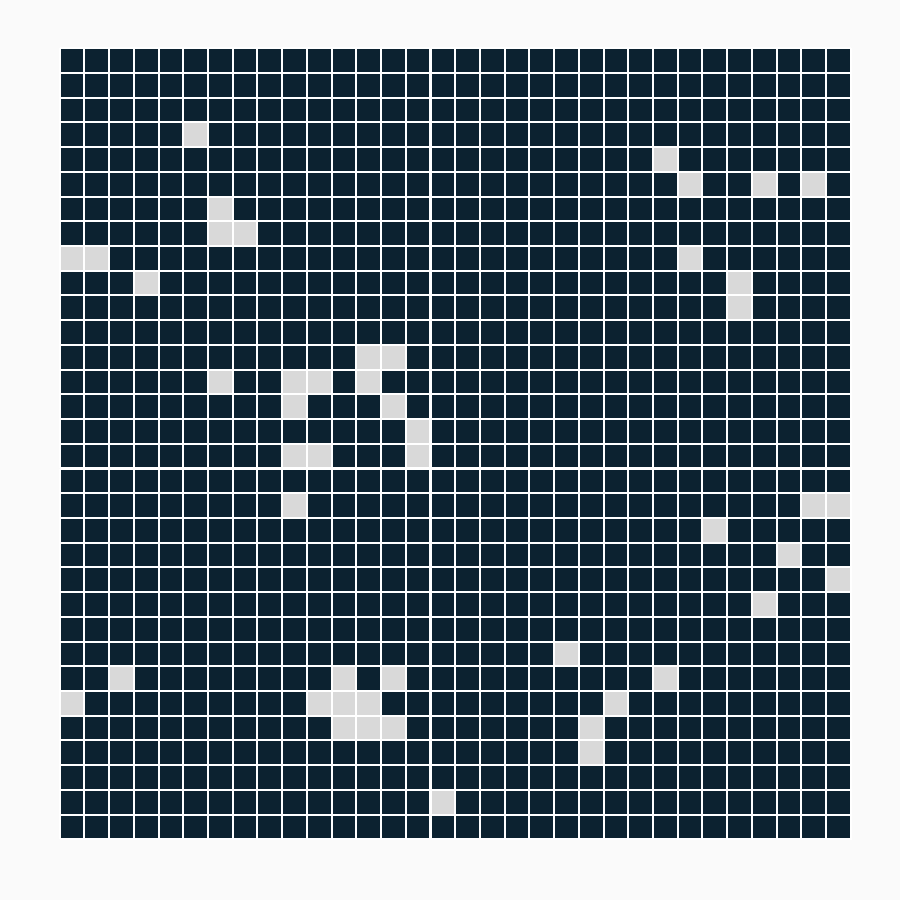
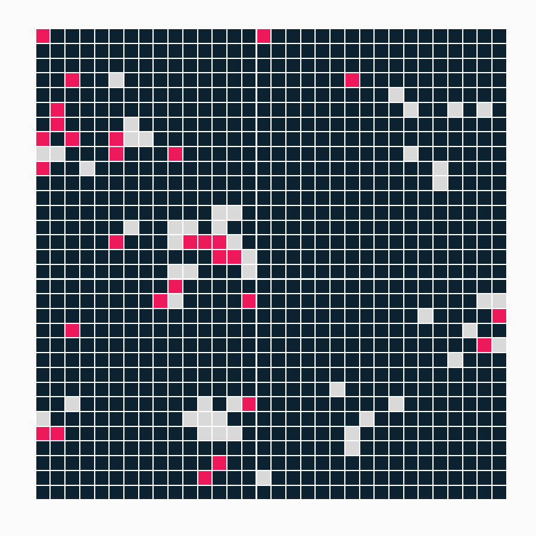
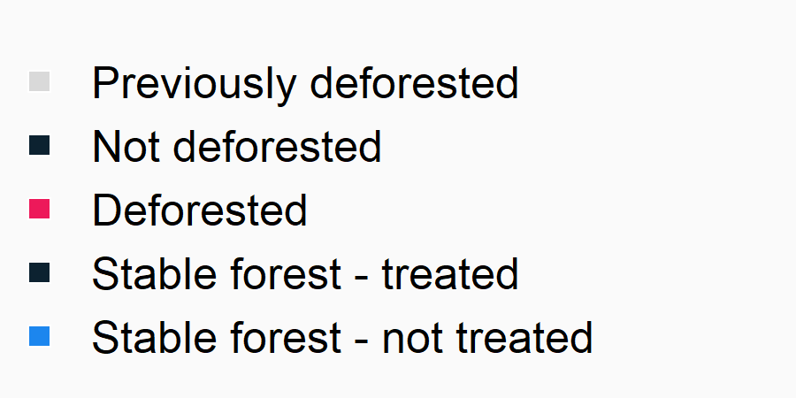
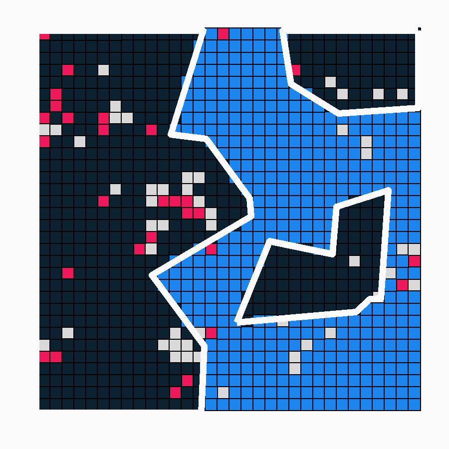
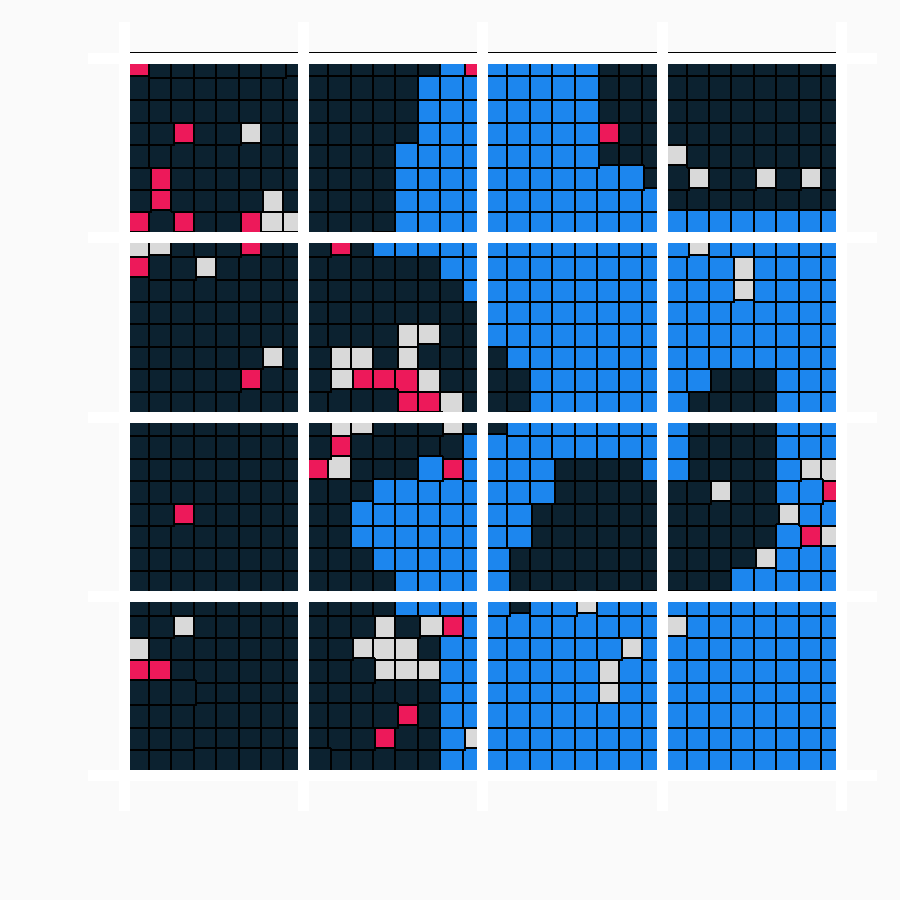
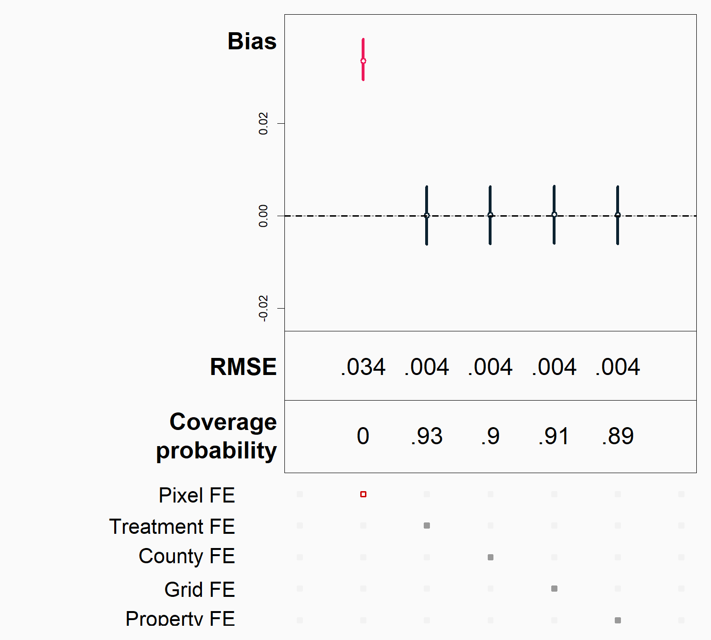

  
  
```{r Setup, include = F}
options(htmltools.dir.version = FALSE)
library(pacman)
p_load(ggplot2, ggthemes, viridis, dplyr, magrittr, knitr, kableExtra)
# Define pink color
red_pink <- "#e64173"
# Knitr options
opts_chunk$set(
  comment = "#>",
  fig.align = "center",
  fig.height = 7,
  fig.width = 10.5,
  # dpi = 300,
  # cache = T,
  warning = F,
  message = F
)
```

```{css, echo=FALSE}
@media print {
  .has-continuation {
    display: block !important;
  }
}
```

```{css echo=FALSE}
.highlight-last-item > ul > li, 
.highlight-last-item > ol > li {
  opacity: 0.5;
}
.highlight-last-item > ul > li:last-of-type,
.highlight-last-item > ol > li:last-of-type {
  opacity: 1;
}
```

```{r, load_refs, include=FALSE, cache=FALSE}
library(RefManageR)
BibOptions(check.entries = FALSE,
           bib.style = "authoryear",
           cite.style = "alphabetic",
           style = "markdown",
           hyperlink = FALSE,
           dashed = FALSE)
myBib <- ReadBib("../paper/deforestation_econometrics.bib", check = FALSE)
```


# Motivation

.pull-left[
  ### Remotely sensed land cover data has facilitated new insights into:
  
  - Heterogeneous impacts of PES  
  (e.g. Chervier and Costedoat, 2017)
  
  - Effectiveness of environmental policies  
  (e.g. Pfaff et al., 2016)
  
  - Economic impact of tenure reform  
  (e.g. Jordán and Heilmayr, 2021)
  ]

--
  .pull-right[
    ### Papers using econometric methods<sup>†</sup> that cite Hansen et al., 2013
    
    ```{r, bar1, echo=FALSE, fig.height = 5.5, dev = "svg"}
    cite_df <- tibble("year" = c(2013, 2014, 2015, 2016, 2017, 2018, 2019, 2020), 
                      "ncites" = c(2, 30, 69, 85, 112, 133, 154, 189))
    cite_plot <- cite_df %>% 
      ggplot(aes(x = year, y = ncites)) +
      geom_bar(stat = "identity", fill = "#0c2230") +
      ylab("Number of papers") +
      xlab("Year") +
      theme_bw(base_size = 18) +
      theme(plot.background = element_rect(fill = "#FAFAFA",colour = "#FAFAFA"),
            panel.background = element_rect(fill = "#FAFAFA",colour = "#FAFAFA"))
    cite_plot
    ```
    
    .footnote[
      †  Google scholar search string: (econometric* or "causal inference" or "impact evaluation" or "fixed effects" or "regression discontinuity" or "instrumental variable")
      ]
    
    ]


---
  # Data setting
  .pull-left[
    ```{r, echo=FALSE}
    
    ```
    ]


.pull-right[
  ## Initial forested landscape
  
  ```{r, echo=FALSE, out.width = "100%", fig.align = 'left'}
  knitr::include_graphics("../presentations/figs/defor_3_lgd.png")
  ```
  ]

---
  # Data setting
  .pull-left[
    ```{r, echo=FALSE}
    
    ```
    ]


.pull-right[
  ## Year 1 deforestation
  ```{r, echo=FALSE, out.width = "100%", fig.align = 'left'}
  knitr::include_graphics("../presentations/figs/defor_3_lgd.png")
  ```
  ]

---
  # Data setting
  .pull-left[
    ```{r, echo=FALSE}
    knitr::include_graphics("../presentations/figs/defor_3.png")
    ```
    ]


.pull-right[
  ## Year 2 deforestation
  ```{r, echo=FALSE, out.width = "100%", fig.align = 'left'}
  knitr::include_graphics("../presentations/figs/defor_3_lgd.png")
  ```
  ]


---
  # Data setting
  .pull-left[
    ```{r, echo=FALSE}
    knitr::include_graphics("../presentations/figs/defor_4.png")
    ```
    ]


.pull-right[
  ## Year 3 deforestation
  ```{r, echo=FALSE, out.width = "100%", fig.align = 'left'}
  knitr::include_graphics("../presentations/figs/defor_3_lgd.png")
  ```
  ]

---
  # Data setting
  .pull-left[
    ```{r, echo=FALSE}
    knitr::include_graphics("../presentations/figs/defor_5.png")
    ```
    ]


.pull-right[
  ## Year 4 deforestation
  ```{r, echo=FALSE, out.width = "100%", fig.align = 'left'}
  knitr::include_graphics("../presentations/figs/defor_3_lgd.png")
  ```
  ]

---
  # Data setting
  .pull-left[
    ```{r, echo=FALSE}
    knitr::include_graphics("../presentations/figs/defor_5.png")
    ```
    ]

.pull-right[
  ### Data characteristics
  - Wall to wall data
  - Fine spatial scales
  - Relatively long time series
  ]

---
  # Data setting
  .pull-left[
    ```{r, echo=FALSE}
    knitr::include_graphics("../presentations/figs/defor_5.png")
    ```
    ]

.pull-right[
  ### Data characteristics
  - Wall to wall data
  - Fine spatial scales
  - Relatively long time series
  - Binary
  - Irreversible
  ]

---
  # Data setting
  
  .pull-left[
    ```{r, echo=FALSE}
    knitr::include_graphics("../presentations/figs/defor_3.png")
    ```
    ]

.pull-right[
  ## Data wrinkle
  Since $y_{i,t}$ is an irreversible, binary outcome, it is typically<sup>†</sup> expressed as:
    
    $$y_{it}= \begin{cases} 
  0 & \text{the pixel has never been deforested}\\
  1 & \text{the pixel was deforested in year }t\\
  NAN & \text{the pixel was deforested in a year }<t\\
  \end{cases}$$
    
    .footnote[
      †  Separate proof in paper shows why this is indeed the preferred solution.
      ]
  
  ]


---
  
  # Data setting
  .pull-left[
    ```{r, echo=FALSE}
    knitr::include_graphics("../presentations/figs/defor_3.png")
    ```
    ]

.pull-right[
  
  ### Do traditional econometric methods generate unbiased estimates in this setting?
  
  ]

---
  # Data setting
  .pull-left[
    ```{r, echo=FALSE}
    knitr::include_graphics("../presentations/figs/defor_3.png")
    ```
    ]

.pull-right[
  
  ### Do traditional econometric methods generate unbiased estimates in this setting?
  - Importance of scale (Avelino et al., 2016)
  - Nonclassical measurement error (Jain, 2020; Alix-Garcia and Millimet, 2020)
  
  ]


---
  
  # Conservation policy impact evaluation
  .pull-left[
    ```{r, echo=FALSE}
    knitr::include_graphics("../presentations/figs/intervention.png")
    ```
    ]


.pull-right[
  ### Goal: estimate $ATT$ from intervention
  <br />
    <br />
    <br />
    <br />
    <br />
    <br />
    <br />
    ```{r, echo=FALSE, out.width = "75%", fig.align = 'left'}
  
  ```
  ]


---
  
  # Conservation policy impact evaluation
  .pull-left[
    ```{r, echo=FALSE}
    knitr::include_graphics("../presentations/figs/intervention.png")
    ```
    ]


.pull-right[
  
  ### Two-way fixed effects regression<sup>†</sup>:
  ### $$y_{i,t}=\beta D_{i,t} + \gamma_i + \alpha_t + u_{i,t}$$
  
  - $D_{i,t}$: dummy equal to one if pixel $i$ is treated in time $t$
    - $\gamma_i$: pixel fixed effects
  - $\alpha_t$: time fixed effects
  <br />
    <br />
    
    ### Expectation: 
    $\beta$ identifies $ATT$
    
    
    .footnote[
      †  used in papers published in JAERE, Conservation Letters, Biological Conservation, and more as recently as 2021
      ]
  ]


---
  
  layout: false
class: inverse, middle
# Result:
## TWFE regressions w/ pixel fixed effects don't estimate $ATT$

---
  class: highlight-last-item

# Proof results


$$
  \begin{align*}
\hat{\beta}&= \underbrace{\frac{1}{n_{i:D_i=1}}\sum_{i:D_i=1} \left( y_{i,2}(1)-y_{i,2}(0) \right)}_{ATT} + \underbrace{\left( \frac{1}{n_{i:D_i=1}}\sum_{i:D_i=1} y_{i,2}(0) - \frac{1}{n_{i:D_i=0}}\sum_{i:D_i=0} y_{i,2}(0) \right)}_{\text{Baseline difference in mean deforestation rates}}
\end{align*}
$$
  
  ##  $$\Downarrow$$
  
  
  ### Intuition:
  
  
  
  
  ---
  class: highlight-last-item

# Proof results


$$
  \begin{align*}
\hat{\beta}&= \underbrace{\frac{1}{n_{i:D_i=1}}\sum_{i:D_i=1} \left( y_{i,2}(1)-y_{i,2}(0) \right)}_{ATT} + \underbrace{\left( \frac{1}{n_{i:D_i=1}}\sum_{i:D_i=1} y_{i,2}(0) - \frac{1}{n_{i:D_i=0}}\sum_{i:D_i=0} y_{i,2}(0) \right)}_{\text{Baseline difference in mean deforestation rates}}
\end{align*}
$$
  
  ##  $$\Downarrow$$
  
  
  ### Intuition:
  
  
  - When pixel $i$ is deforested in the first period, it is dropped in the second period

---
  
  class: highlight-last-item

# Proof results


$$
  \begin{align*}
\hat{\beta}&= \underbrace{\frac{1}{n_{i:D_i=1}}\sum_{i:D_i=1} \left( y_{i,2}(1)-y_{i,2}(0) \right)}_{ATT} + \underbrace{\left( \frac{1}{n_{i:D_i=1}}\sum_{i:D_i=1} y_{i,2}(0) - \frac{1}{n_{i:D_i=0}}\sum_{i:D_i=0} y_{i,2}(0) \right)}_{\text{Baseline difference in mean deforestation rates}}
\end{align*}
$$
  
  ##  $$\Downarrow$$
  
  
  ### Intuition:
  
  
  - When pixel $i$ is deforested in the first period, it is dropped in the second period

- In calculation of $\hat{\beta}$, pixel fixed effects do not account for these observations


---
  
  
  class: highlight-last-item

# Proof results


$$
  \begin{align*}
\hat{\beta}&= \underbrace{\frac{1}{n_{i:D_i=1}}\sum_{i:D_i=1} \left( y_{i,2}(1)-y_{i,2}(0) \right)}_{ATT} + \underbrace{\left( \frac{1}{n_{i:D_i=1}}\sum_{i:D_i=1} y_{i,2}(0) - \frac{1}{n_{i:D_i=0}}\sum_{i:D_i=0} y_{i,2}(0) \right)}_{\text{Baseline difference in mean deforestation rates}}
\end{align*}
$$
  
  ##  $$\Downarrow$$
  
  
  ### Intuition:
  
  
  - When pixel $i$ is deforested in the first period, it is dropped in the second period

- In calculation of $\hat{\beta}$, pixel fixed effects do not account for these observations

- Only surviving pixels get accounted for, which must have $y_{i,1} = 0$
  
  ---
  
  
  layout: false
class: inverse, middle
# Monte Carlo simulations with synthetic landscapes

---
  
  # Bias in TWFE model
  
  ```{r, echo=FALSE, out.width = "98%"}
knitr::include_graphics("../presentations/figs/twfe_0.png")
```


---
  # Bias in TWFE model
  
  ```{r, echo=FALSE, out.width = "98%"}
knitr::include_graphics("../presentations/figs/twfe_1.png")
```

---
  # Bias in TWFE model
  
  ```{r, echo=FALSE, out.width = "98%"}
knitr::include_graphics("../presentations/figs/twfe_2.png")
```

---
  # Bias in TWFE model
  
  ```{r, echo=FALSE, out.width = "98%"}
knitr::include_graphics("../presentations/figs/twfe_3.png")
```
---
  
  layout: false
class: inverse, middle
# Aggregation as a solution 
### Multiple alternate specifications yield unbiased estimates of $ATT$

---
  
  # Aggregation as a solution
  
  .pull-left[
    - scale of fixed effects 
    - or unit of analysis
    
    ]

.pull-right[
  ```{r, echo=FALSE}
  knitr::include_graphics("../presentations/figs/intervention.png")
  ```
  ]

---
  
  # Candidate spatial units
  
  .pull-left[
    ### scale of fixed effects or unit of analysis
    - Pixel (e.g. Alix-Garcia et al., 2018)
    ]

.pull-right[
  ```{r, echo=FALSE}
  knitr::include_graphics("../presentations/figs/intervention.png")
  ```
  ]

---
  
  # Candidate spatial units 
  
  .pull-left[
    ### scale of fixed effects or unit of analysis
    - Pixel (e.g. Alix-Garcia et al., 2018)
    - Treatment (e.g. Arriagada et al., 2012)
    ]

.pull-right[
  ```{r, echo=FALSE}
  
  ```
  ]

---
  # Candidate spatial units 
  
  .pull-left[
    ### scale of fixed effects or unit of analysis
    - Pixel (e.g. Alix-Garcia et al., 2018)
    - Treatment (e.g. Arriagada et al., 2012)
    - County (e.g. Blackman, 2015)
    ]

.pull-right[
  ```{r, echo=FALSE}
  knitr::include_graphics("../presentations/figs/county.png")
  ```
  ]


---
  # Candidate spatial units 
  
  .pull-left[
    ### scale of fixed effects or unit of analysis
    - Pixel (e.g. Alix-Garcia et al., 2018)
    - Treatment (e.g. Arriagada et al., 2012)
    - County (e.g. Blackman, 2015)
    - Grid cell (e.g. Costedoat et al., 2015)
    ]

.pull-right[
  ```{r, echo=FALSE}
  
  ```
  ]

---
  # Candidate spatial units 
  
  .pull-left[
    ### scale of fixed effects or unit of analysis
    - Pixel (e.g. Alix-Garcia et al., 2018)
    - Treatment (e.g. Arriagada et al., 2012)
    - County (e.g. Blackman, 2015)
    - Grid cell (e.g. Costedoat et al., 2015)
    - Property (e.g. Heilmayr and Lambin, 2016)
    ]

.pull-right[
  ```{r, echo=FALSE}
  knitr::include_graphics("../presentations/figs/property.png")
  ```
  ]


---
  
  # Aggregation as a solution
  
  .pull-left[
    ### Aggregated fixed effects
    ```{r, echo=FALSE, out.width = "95%", fig.align = "left"}
    
    ```
    ]

--
  
  .pull-right[
    ### Aggregated units of observation
    ```{r, echo=FALSE, out.width = "95%", fig.align = "left"}
    knitr::include_graphics("../presentations/figs/spec_did_agg.png")
    ```
    ]

---
  
  layout: false
class: inverse, middle
# When are certain spatial units preferred?
### introduction of property level disturbances
---
  # Impacts of property-level disturbances 
  
  .pull-left[
    ```{r, echo=FALSE}
    knitr::include_graphics("../presentations/figs/property.png")
    ```
    ]

--
  
  .pull-right[
    ### pixel-level DID suffers
    ```{r, echo=FALSE, out.width = "90%"}
    knitr::include_graphics("../presentations/figs/spec_prop_did.png")
    ```
    ]

---
  # Benefits of property-level models $(\sigma_p=0.3)$
  
  .pull-left[
    ### Aggregated fixed effects 
    ```{r, echo=FALSE, out.width = "90%", fig.align = "left"}
    knitr::include_graphics("../presentations/figs/spec_prop_fe.png")
    ```
    ]

--
  
  .pull-right[
    ### Aggregated units of analysis
    ```{r, echo=FALSE, out.width = "95%", fig.align = "left"}
    knitr::include_graphics("../presentations/figs/spec_prop_agg.png")
    ```
    ]

---
  
  layout: false
class: inverse, middle
# Extension: multiple groups and variation in treatment timing

---
  
  # New DID estimators suffer similar fate
  
  .pull-left[
    - Callaway and Sant'anna (2020); Gardner (2021) cannot identify $ATT$ with pixel unit of analysis

```{r, echo=FALSE, out.width = "80%", fig.align = "left"}

```
]

--

.pull-right[
- Aggregation solves the issue

```{r, echo=FALSE, out.width = "80%", fig.align = "left"}

```
]


---
class: highlight-last-item

# Key insights

- TWFE regressions with pixel fixed effects do not identify expected estimand
(Nor do recently developed DID estimators w/ pixel unit of analysis)

---

class: highlight-last-item

# Key insights

- TWFE regressions with pixel fixed effects do not identify expected estimand
(Nor do recently developed DID estimators w/ pixel unit of analysis)

- utilizing spatial aggregation can eliminate bias (FE or unit of analysis) 

---

class: highlight-last-item

# Key insights

- TWFE regressions with pixel fixed effects do not identify expected estimand
(Nor do recently developed DID estimators w/ pixel unit of analysis)

- utilizing spatial aggregation can eliminate bias (FE or unit of analysis) 

- when contemplating preferred spatial unit of aggregation, match analysis to scale at which heterogeneity enters landscape

---

layout: false
class: inverse, middle
# Thanks!
Albert Garcia (albertogarcia@ucsb.edu) and Robert Heilmayr (rheilmayr@ucsb.edu)