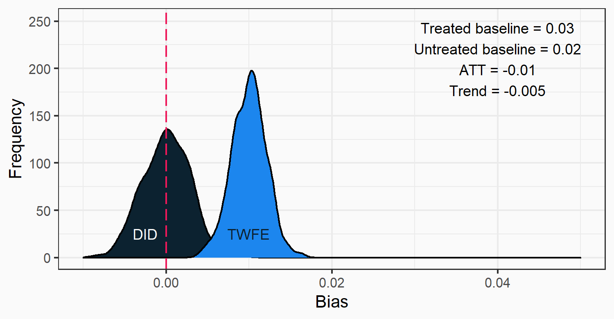
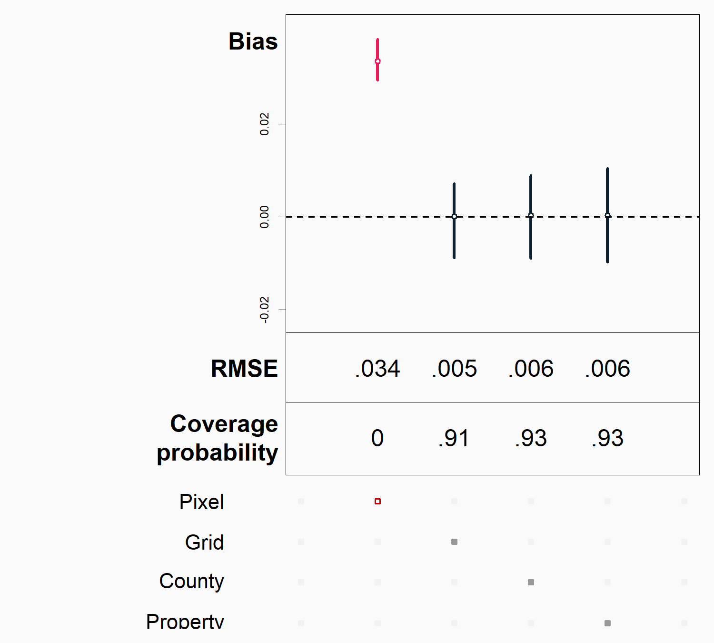
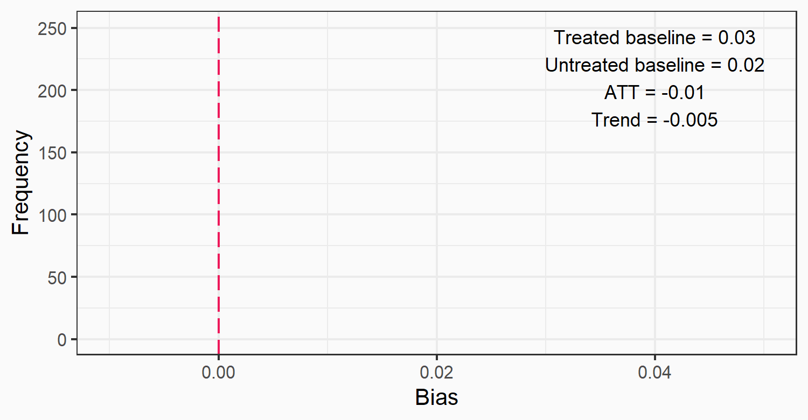
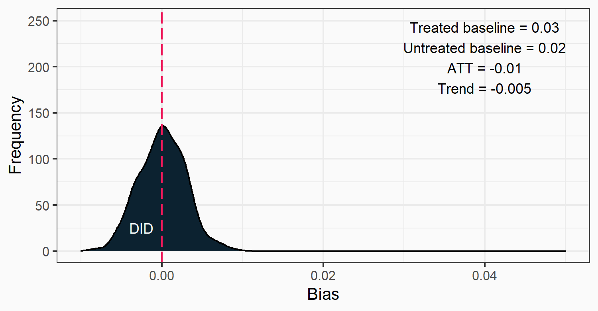
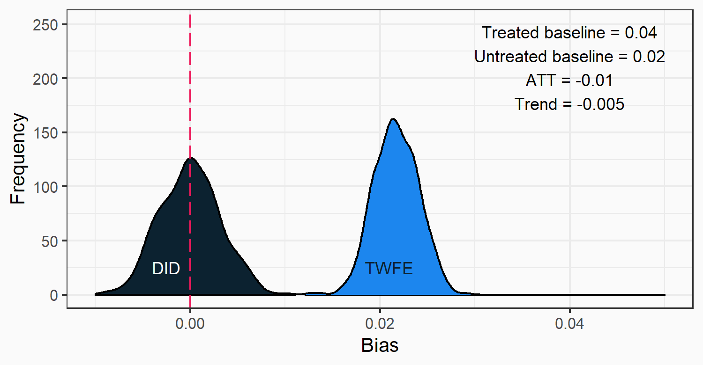
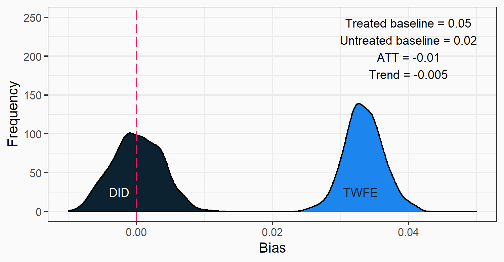
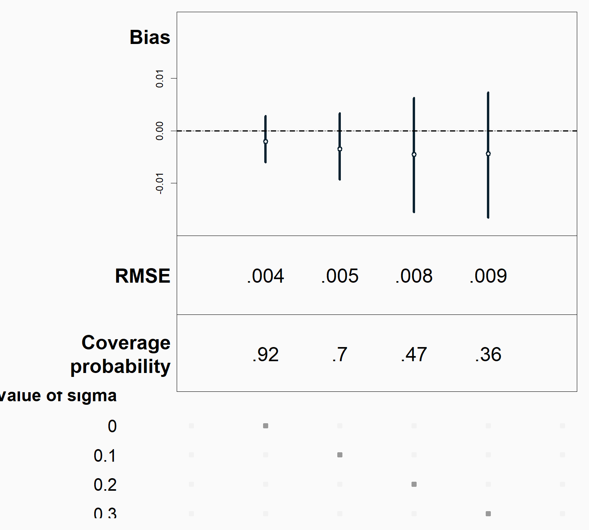

class: inverse, middle

```{r Setup, include = F}
options(htmltools.dir.version = FALSE)
library(pacman)
p_load(ggplot2, ggthemes, viridis, dplyr, magrittr, knitr, kableExtra)
# Define pink color
red_pink <- "#e64173"
# Knitr options
opts_chunk$set(
  comment = "#>",
  fig.align = "center",
  fig.height = 7,
  fig.width = 10.5,
  # dpi = 300,
  # cache = T,
  warning = F,
  message = F
)
```

```{css, echo=FALSE}
@media print {
  .has-continuation {
    display: block !important;
  }
}
```

```{css echo=FALSE}
.highlight-last-item > ul > li, 
.highlight-last-item > ol > li {
  opacity: 0.5;
}
.highlight-last-item > ul > li:last-of-type,
.highlight-last-item > ol > li:last-of-type {
  opacity: 1;
}
```

```{r, load_refs, include=FALSE, cache=FALSE}
library(RefManageR)
BibOptions(check.entries = FALSE,
           bib.style = "authoryear",
           cite.style = "alphabetic",
           style = "markdown",
           hyperlink = FALSE,
           dashed = FALSE)
myBib <- ReadBib("../paper/deforestation_econometrics.bib", check = FALSE)
```

# Motivation

---
# Motivation

.pull-left[
### Papers using econometric methods<sup>†</sup> that cite Hansen et al., 2013

```{r, bar1, echo=FALSE, fig.height = 5.5, dev = "svg"}
cite_df <- tibble("year" = c(2013, 2014, 2015, 2016, 2017, 2018, 2019, 2020), 
                  "ncites" = c(2, 30, 69, 85, 112, 133, 154, 189))

cite_plot <- cite_df %>% 
  ggplot(aes(x = year, y = ncites)) +
  geom_bar(stat = "identity", fill = "#0c2230") +
  ylab("Number of papers") +
  xlab("Year") +
  theme_bw(base_size = 18) +
  theme(plot.background = element_rect(fill = "#FAFAFA",colour = "#FAFAFA"),
        panel.background = element_rect(fill = "#FAFAFA",colour = "#FAFAFA"))


cite_plot
```

.footnote[
†  Google scholar search string: (econometric* or "causal inference" or "impact evaluation" or "fixed effects" or "regression discontinuity" or "instrumental variable")
]

]

--
.pull-right[
### Data characteristics
- Wall to wall data
- Fine spatial scales
- Relatively long time series
]


---
# Motivation
.pull-left[
### Papers using econometric methods<sup>†</sup> that cite Hansen et al., 2013

```{r, echo=FALSE, fig.height = 5.5, dev = "svg"}
cite_plot
```

.footnote[
†  Google scholar search string: (econometric* or "causal inference" or "impact evaluation" or "fixed effects" or "regression discontinuity" or "instrumental variable")
]

]

.pull-right[
### Data characteristics
- Wall to wall data
- Fine spatial scales
- Relatively long time series
- Binary
- Irreversible
]

---
# Motivation
.pull-left[
### Papers using econometric methods<sup>†</sup> that cite Hansen et al., 2013

```{r, echo=FALSE, fig.height = 5.5, dev = "svg"}
cite_plot
```


]

.pull-right[
### Data characteristics
- Wall to wall data
- Fine spatial scales
- Relatively long time series
- Binary
- Irreversible

### Do traditional econometric models generate unbiased estimates in this setting?

]

---
# Motivation
.pull-left[
### Papers using econometric methods<sup>†</sup> that cite Hansen et al., 2013

```{r, echo=FALSE, fig.height = 5.5, dev = "svg"}
cite_plot
```


]

.pull-right[
### Data characteristics
- Wall to wall data
- Fine spatial scales
- Relatively long time series
- Binary
- Irreversible

### Do traditional econometric models generate unbiased estimates in this setting?
- Importance of scale (Avelino et al., 2016)
- Nonclassical measurement error (Jain, 2020; Alix-Garcia and Millimet, 2020)

]

---
# Results

.pull-left[
### Commonly used and suggested "robust" specification cannot identify $ATT$:
$$defor_{i,t}=\beta D_{i,t} + \gamma_i + \alpha_t + u_{i,t}$$

]

.pull-right[
```{r, echo=FALSE}

```
]
---
# Aggregation as a solution

.pull-left[
### Aggregated fixed effects
```{r, echo=FALSE, out.width = "95%", fig.align = "left"}
knitr::include_graphics("../presentations/figs/spec_did_fe.png")
```
]

--


.pull-right[
### Aggregated units of observation
```{r, echo=FALSE, out.width = "95%", fig.align = "left"}

```
]

---

# Benefits of property-level models $(\sigma_p=0.3)$

.pull-left[
### Aggregated fixed effects 
```{r, echo=FALSE, out.width = "90%", fig.align = "left"}
knitr::include_graphics("../presentations/figs/spec_prop_fe.png")
```
]

--

.pull-right[
### Aggregated units of analysis
```{r, echo=FALSE, out.width = "90%", fig.align = "left"}
knitr::include_graphics("../presentations/figs/spec_prop_agg.png")
```
]

---

# Bias in TWFE model

```{r, echo=FALSE}

```


---
# Bias in TWFE model

```{r, echo=FALSE}

```

---
# Bias in TWFE model

```{r, echo=FALSE}

```

---
# Bias in TWFE model

```{r, echo=FALSE}

```

---
# Bias in TWFE model

```{r, echo=FALSE}

```

---
# Aggregation as a solution

.pull-left[
### Aggregated fixed effects
```{r, echo=FALSE, out.width = "95%", fig.align = "left"}
knitr::include_graphics("../presentations/figs/spec_did_fe.png")
```
]

--

.pull-right[
### Aggregated units of observation
```{r, echo=FALSE, out.width = "95%", fig.align = "left"}

```
]

---
# Impacts of property-level disturbances on DID

```{r, echo=FALSE, out.width = "55%", fig.align = "left"}

```

---
# Benefits of property-level models $(\sigma_p=0.3)$

.pull-left[
### Aggregated fixed effects 
```{r, echo=FALSE, out.width = "90%", fig.align = "left"}
knitr::include_graphics("../presentations/figs/spec_prop_fe.png")
```
]

--

.pull-right[
### Aggregated units of analysis
```{r, echo=FALSE, out.width = "90%", fig.align = "left"}
knitr::include_graphics("../presentations/figs/spec_prop_agg.png")
```
]


---

layout: false
class: inverse, middle
# Thanks!
Albert Garcia (agarcia@bren.ucsb.edu) and Robert Heilmayr (rheilmayr@ucsb.edu)

<!-- --- -->
<!-- # References -->
<!-- ```{r refs, echo= FALSE, results = "asis"} -->
<!-- PrintBibliography(myBib) -->
<!-- ``` -->