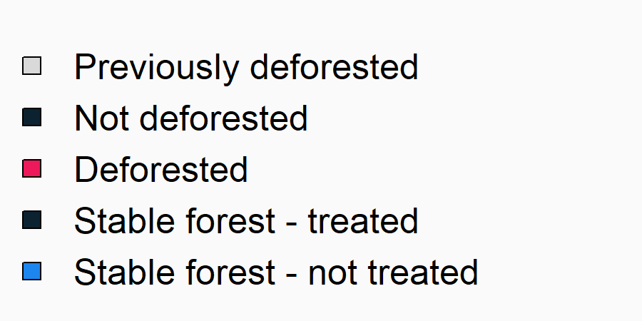

class: inverse, middle

```{r Setup, include = F}
options(htmltools.dir.version = FALSE)
library(pacman)
p_load(ggplot2, ggthemes, viridis, dplyr, magrittr, knitr, kableExtra)
# Define pink color
red_pink <- "#e64173"
# Knitr options
opts_chunk$set(
  comment = "#>",
  fig.align = "center",
  fig.height = 7,
  fig.width = 10.5,
  # dpi = 300,
  # cache = T,
  warning = F,
  message = F
)
```

```{css, echo=FALSE}
@media print {
  .has-continuation {
    display: block !important;
  }
}
```

```{css echo=FALSE}
.highlight-last-item > ul > li, 
.highlight-last-item > ol > li {
  opacity: 0.5;
}
.highlight-last-item > ul > li:last-of-type,
.highlight-last-item > ol > li:last-of-type {
  opacity: 1;
}
```

```{r, load_refs, include=FALSE, cache=FALSE}
library(RefManageR)
BibOptions(check.entries = FALSE,
           bib.style = "authoryear",
           cite.style = "alphabetic",
           style = "markdown",
           hyperlink = FALSE,
           dashed = FALSE)
myBib <- ReadBib("../paper/deforestation_econometrics.bib", check = FALSE)
```


# Motivation

---
# What policies can slow deforestation?

## Why should we care about deforestation?

## Opportunity from remotely sensed data.

## Role of econometrics to answer this question

---
# Rapid growth in literature

## Plot of gscholar cites

## Types of questions being answered (maybe from UC-EE scholars?)

---
# Overview

## Pixel-level TWFE recommended, but yield biased results

## Multiple solutions can yield unbiased estimates

## Opportunity to better integrate appropriate unit of decision-making

---
# Description of data setting

## Raster of discrete observations

## Panel

## Irreversible outcome

## Example figures from Hansen data?


---
# Researcher's objective

## Recover average treatment effect on the treated

<!-- --- -->
<!--   -->

---
# Data setting
.pull-left[
```{r, echo=FALSE}
knitr::include_graphics("../presentations/figs/initial_forest.png")
```
]


.pull-right[
## Initial forested landscape

```{r, echo=FALSE, out.width = "100%", fig.align = 'left'}
knitr::include_graphics("../presentations/figs/defor_3_lgd.png")
```
]

---
# Data setting
.pull-left[
```{r, echo=FALSE}
knitr::include_graphics("../presentations/figs/defor_2.png")
```
]


.pull-right[
## Year 1 deforestation
```{r, echo=FALSE, out.width = "100%", fig.align = 'left'}
knitr::include_graphics("../presentations/figs/defor_3_lgd.png")
```
]

---
# Data setting
.pull-left[
```{r, echo=FALSE}
knitr::include_graphics("../presentations/figs/defor_3.png")
```
]


.pull-right[
## Year 2 deforestation
```{r, echo=FALSE, out.width = "100%", fig.align = 'left'}
knitr::include_graphics("../presentations/figs/defor_3_lgd.png")
```
]


---
# Data setting
.pull-left[
```{r, echo=FALSE}
knitr::include_graphics("../presentations/figs/defor_4.png")
```
]


.pull-right[
## Year 3 deforestation
```{r, echo=FALSE, out.width = "100%", fig.align = 'left'}
knitr::include_graphics("../presentations/figs/defor_3_lgd.png")
```
]

---
# Data setting
.pull-left[
```{r, echo=FALSE}
knitr::include_graphics("../presentations/figs/defor_5.png")
```
]


.pull-right[
## Year 4 deforestation
```{r, echo=FALSE, out.width = "100%", fig.align = 'left'}
knitr::include_graphics("../presentations/figs/defor_3_lgd.png")
```
]

---
# Data setting
.pull-left[
```{r, echo=FALSE}
knitr::include_graphics("../presentations/figs/defor_3.png")
```
]


.pull-right[
```{r, echo=FALSE, out.width = "100%", fig.align = 'left'}
knitr::include_graphics("../presentations/figs/defor_3_lgd.png")
```
]

---
# Data setting
.pull-left[
```{r, echo=FALSE}
knitr::include_graphics("../presentations/figs/county.png")
```
]


.pull-right[
```{r, echo=FALSE, out.width = "100%", fig.align = 'left'}

```
]

---
# Data setting
.pull-left[
```{r, echo=FALSE}
knitr::include_graphics("../presentations/figs/intervention.png")
```
]


.pull-right[
## Year 4 deforestation
```{r, echo=FALSE, out.width = "100%", fig.align = 'left'}
knitr::include_graphics("../presentations/figs/intervention_lgd.png")
```
]

---
# Preview

.pull-left[
```{r, echo=FALSE}
knitr::include_graphics("../presentations/figs/intervention.png")
```
]


.pull-right[
### $\hat{\beta}$ returned by this model is not a consistent estimate of the $ATT$

### Multiple possible corrections
- Aggregate fixed effects
- Aggregate units of observation

### Benefits of matching units of observation to level of decisionmaking
]


---

layout: false
class: inverse, middle
# Analytical proof
## Pixel-level, two-way fixed effects model doesn't estimate $ATT$

---
class: highlight-last-item

# Proof: Pixel-level TWFE model doesn't estimate ATT

## Setting

--

- Imagine a two-period setting $(t=1,2)$ with multiple points indexed by $i$.

--

- We observe $y_{i,t}$, a binary measure of deforestation at point $i$ at time $t$.

--

- Some units are exposed to a policy treatment in second period $(D_{i,t=2}=1)$

--

- Let potential outcome for each unit can be expressed as $y_{i,t}(D)$

--

- Unit-level treatment effect can be expressed as $E_i=y_{i,2}(1)-y_{i,2}(0)$

--

- We want to estimate average treatment effect on the treated $(ATT)$ which can be defined as:

$$ATT=\frac{1}{\eta_{i:W_i=1}}\sum_{i:W_i=1}^{N}{y_{i,2}(1)-y_{i,2}(0)}$$

---
class: highlight-last-item

# Proof: Pixel-level TWFE model doesn't estimate ATT

.pull-left[
## Data wrinkle
Since $y_{i,t}$ is an irreversible, binary outcome, it is typically<sup>†</sup> expressed as:

$$y_{it}= \begin{cases} 
      0 & \text{the pixel has never been deforested}\\
      1 & \text{the pixel was deforested in year }t\\
      NAN & \text{the pixel was deforested in a year }<t\\
   \end{cases}$$

]

.pull-right[
```{r, echo=FALSE}
knitr::include_graphics("../presentations/figs/defor_3.png")
```
]


.footnote[
†  Separate proof in paper shows why this is the preferred solution.
]


---
class: highlight-last-item

# Proof: Pixel-level TWFE model doesn't estimate ATT

## TWFE model:
## $$y_{i,t} = \alpha + \beta \times D_i \times \mathbb{1} \{t=2\}  + \gamma_i + \eta_{t=2}+ u_{i,t}$$

--

##  $$\Downarrow$$

$$y_{i,1}=\alpha+\gamma_i+u_{i,1}$$
--
$$y_{i,2}= \begin{cases} 
      \alpha+\beta \times D_i+\gamma_i+\eta_{t=2} + u_{i2} & y_{i1}= 0\\
      NAN & y_{i1} \neq 0 
   \end{cases}$$
--

## $$\Downarrow$$
$$y_{i,2}-y_{i,1}= \begin{cases} 
 \beta  \times D_i + \eta_{t=2} + \Delta u_{i} & y_{i1}= 0\\
      NAN & y_{i1} \neq 0 
   \end{cases}$$


---
class: highlight-last-item

# Proof: Pixel-level TWFE model doesn't estimate ATT

$\hat{\beta}$ (our estimate of the $ATT$) can also be expressed as a double difference:

$$
\begin{align*}
\hat{\beta}&= \frac{1}{n_{i:D_i=1}}\sum_{i:D_i=1} (y_{i,2}-y_{i,1}) - \frac{1}{n_{i:D_i=0}}\sum_{i:D_i=0} (y_{i,2} - y_{i,1})
\end{align*}
$$
--

However, this is only valid when $y_{i,1}=0$. Thus, we can restate (and shift to PO notation):
<!-- $$ -->
<!-- \begin{align*} -->
<!-- \hat{\beta}&= \frac{1}{n_{i:D_i=1}}\sum_{i:D_i=1} (y_{i,2}-0) - \frac{1}{n_{i:D_i=0}}\sum_{i:D_i=0} (y_{i,2} - 0) -->
<!-- \end{align*} -->
<!-- $$ -->
$$
\begin{align*}
\hat{\beta}&= \frac{1}{n_{i:D_i=1}}\sum_{i:D_i=1} y_{i,2}(1) - \frac{1}{n_{i:D_i=0}}\sum_{i:D_i=0} y_{i,2}(0)
\end{align*}
$$
--

Adding and subtracting $\frac{1}{n_{i:D_i=1}}\sum_{i:D_i=1} y_{i,2}(0)$:
$$
\begin{align*}
\hat{\beta}&= \underbrace{\frac{1}{n_{i:D_i=1}}\sum_{i:D_i=1} \left( y_{i,2}(1)-y_{i,2}(0) \right)}_{ATT} + \underbrace{\left( \frac{1}{n_{i:D_i=1}}\sum_{i:D_i=1} y_{i,2}(0) - \frac{1}{n_{i:D_i=0}}\sum_{i:D_i=0} y_{i,2}(0) \right)}_{\text{Baseline difference in mean deforestation rates}}
\end{align*}
$$

---

layout: false
class: inverse, middle
# Monte Carlo simulations 
## Multiple alternate specifications yield unbiased estimates of $ATT$

---
class: highlight-last-item

# Data generating process

.pull-left[
```{r, echo=FALSE}
knitr::include_graphics("../presentations/figs/intervention.png")
```
]


.pull-right[

<br />

Simulated landscape of forested pixels $(i)$ 

Pixels are located inside properties $(v)$ and counties $(c)$

Multiple time periods $(t)$ divided into two even-length periods $(t<t_0 \text{ or } t \geq t_0)$

At time $t_0$, counties are randomly assigned to treatment $(D=1)$

]

---
# Data generating process


- Decision to deforest is modeled a function of a continuous, latent random variable $(y^*_{i,v,t})$ representing the return to clearing (Pfaff and Sanchez-Azofeifa, 2004).

--

- "Researcher" observes binary deforestation:

\begin{align}
 y_{i,v,t} = \begin{cases}
      1   & y^*_{i,v,t} > 0 \text{ and } y^*_{i,v, \tau} \leq 0 \text{ for all } \tau<t  \\
      0   &  y^*_{i,v,t} \leq 0 \text{ and } y^*_{i,v, \tau} \leq 0 \text{ for all } \tau<t \\
      NAN & otherwise
   \end{cases}
\end{align}

--

- DGP constrains $(y^*_{i,v,t})$ based on eight parameters:
  - $baseline_0 = E[y_{i,t}(0) |  t<t_0, D_i=0$
  - $baseline_1 = E[y_{i,t}(0) |  t<t_0, D_i=1]$
  - $trend_0 = E[y_{i,v,t}(0) |  t\geq t_0, D_i=0] - E[y_{i,v,t}(0) |  t<t_0, D_i=0]$
  - $trend_1 = E[y_{i,v,t}(0) |  t\geq t_0, D_i=1] - E[y_{i,v,t}(0) |  t<t_0, D_i=1]$
  - $ATT = E[y_{i,v,t}(1) - y_{i,v,t}(0) |  t\geq t_0, D_i=1]$
  - $\alpha_i \sim N(0,\sigma_a^2)$
  - $\rho_v \sim N(0, \sigma_p^2)$
  - $u_{it} \sim N(0,\sigma_u^2)$


---
# Simulated bias in TWFE model

```{r, echo=FALSE}
knitr::include_graphics("../presentations/figs/twfe_0.png")
```


---
# Simulated bias in TWFE model

```{r, echo=FALSE}
knitr::include_graphics("../presentations/figs/twfe_1.png")
```

---
# Simulated bias in TWFE model

```{r, echo=FALSE}
knitr::include_graphics("../presentations/figs/twfe_2.png")
```

---
# Simulated bias in TWFE model

```{r, echo=FALSE}
knitr::include_graphics("../presentations/figs/twfe_3.png")
```

---
# Simulated bias in TWFE model

```{r, echo=FALSE}
knitr::include_graphics("../presentations/figs/twfe_4.png")
```

---
# Solution 1 - Aggregate fixed effects

- Plot 1: Highlight difference between standard TWFE and traditional DID

- Plot 2: Contrast with further FE models with county / property / grid FEs

---
# Solution 2 - Aggregate unit of observation

- Plot: Contrast previous slide to county / property / grid-level aggregation

---
# Relative performance of two approaches
- Key insight: Similar performance
- Plot: Show county FE model against county observation model. Flicker through alternate parameterizations

---
# Property-level fixed effects

## Slide 1: Highlight degradation in performance of DID as property-level error increases
- Plot: Four sequential panels - pixel-level DID under increasing sigma_p

<!-- ## Slide 2: Clustering can improve the poor coverage, but obviously wouldn't address bias / RMSE -->
<!-- - Plot: Hold sigma_p at a high level, compare performance of DID across -->

## Slide 2: Reduction in bias by using alternate fixed effects / units of analysis. Both methods work well
- Plots: Hold sigma_p at a high level, compare against county/grid/property FE models; or county/grid/property unit of analysis

## Slide 3: Emphasize value of property-level data if available
- Plot: HOld sigma_p high, compare property level model performance county/grid cell models

---

layout: false
class: inverse, middle
# Conclusions

---
# Additional considerations

## Non-classical measurement error (Alix-Garcia and Millimet; Jain)

## Broader concerns about TWFE


<!-- --- -->
<!-- # References -->
<!-- ```{r refs, echo= FALSE, results = "asis"} -->
<!-- PrintBibliography(myBib) -->
<!-- ``` -->