class: inverse, middle

```{r Setup, include = F}
options(htmltools.dir.version = FALSE)
library(pacman)
p_load(ggplot2, ggthemes, viridis, dplyr, magrittr, knitr, kableExtra)
# Define pink color
red_pink <- "#e64173"
# Knitr options
opts_chunk$set(
  comment = "#>",
  fig.align = "center",
  fig.height = 7,
  fig.width = 10.5,
  # dpi = 300,
  # cache = T,
  warning = F,
  message = F
)
```

```{css, echo=FALSE}
@media print {
  .has-continuation {
    display: block !important;
  }
}
```

```{css echo=FALSE}
.highlight-last-item > ul > li, 
.highlight-last-item > ol > li {
  opacity: 0.5;
}
.highlight-last-item > ul > li:last-of-type,
.highlight-last-item > ol > li:last-of-type {
  opacity: 1;
}
```

```{r, load_refs, include=FALSE, cache=FALSE}
library(RefManageR)
BibOptions(check.entries = FALSE,
           bib.style = "authoryear",
           cite.style = "alphabetic",
           style = "markdown",
           hyperlink = FALSE,
           dashed = FALSE)
myBib <- ReadBib("../paper/deforestation_econometrics.bib", check = FALSE)
```


# Motivation

---
# Motivation

.pull-left[
### Remotely sensed land cover data has facilitated new insights into:
- Corruption and illegal deforestation  
(e.g. Burgess et al., 2012)

- Environmental consequences of intensification  
(e.g. Abman et al., 2020)

- Effectiveness of environmental policies  
(e.g. Jayachandran et al., 2016)

- Economic impact of tenure reform  
(e.g. Jordán and Heilmayr, 2021)
]

--
.pull-right[
### Papers using econometric methods<sup>†</sup> that cite Hansen et al., 2013

```{r, bar1, echo=FALSE, fig.height = 5.5, dev = "svg"}
cite_df <- tibble("year" = c(2013, 2014, 2015, 2016, 2017, 2018, 2019, 2020, 2021), 
                  "ncites" = c(2, 30, 66, 81, 111, 129, 145, 144, 193))

cite_plot <- cite_df %>% 
  ggplot(aes(x = year, y = ncites)) +
  geom_bar(stat = "identity", fill = "#0c2230") +
  ylab("Number of papers") +
  xlab("Year") +
  theme_bw(base_size = 18) +
  theme(plot.background = element_rect(fill = "#FAFAFA",colour = "#FAFAFA"),
        panel.background = element_rect(fill = "#FAFAFA",colour = "#FAFAFA"))


cite_plot
```

.footnote[
†  Google scholar search string: (econometric* or "causal inference" or "impact evaluation" or "fixed effects" or "regression discontinuity" or "instrumental variable")
]

]


---
# Data setting
.pull-left[
```{r, echo=FALSE}
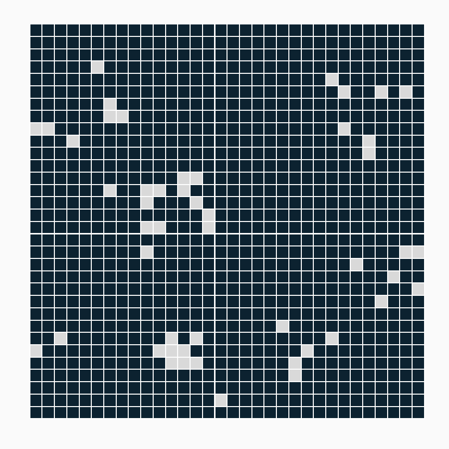
```
]


.pull-right[
## Initial forested landscape

```{r, echo=FALSE, out.width = "100%", fig.align = 'left'}
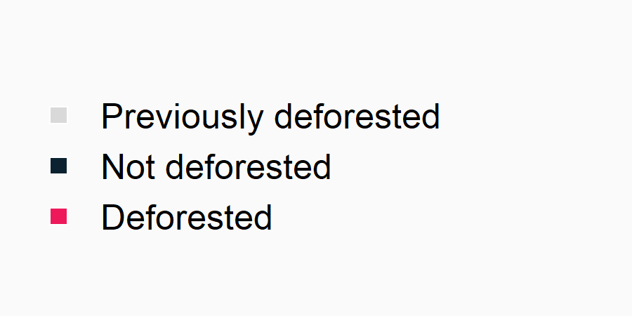
```
]

---
# Data setting
.pull-left[
```{r, echo=FALSE}
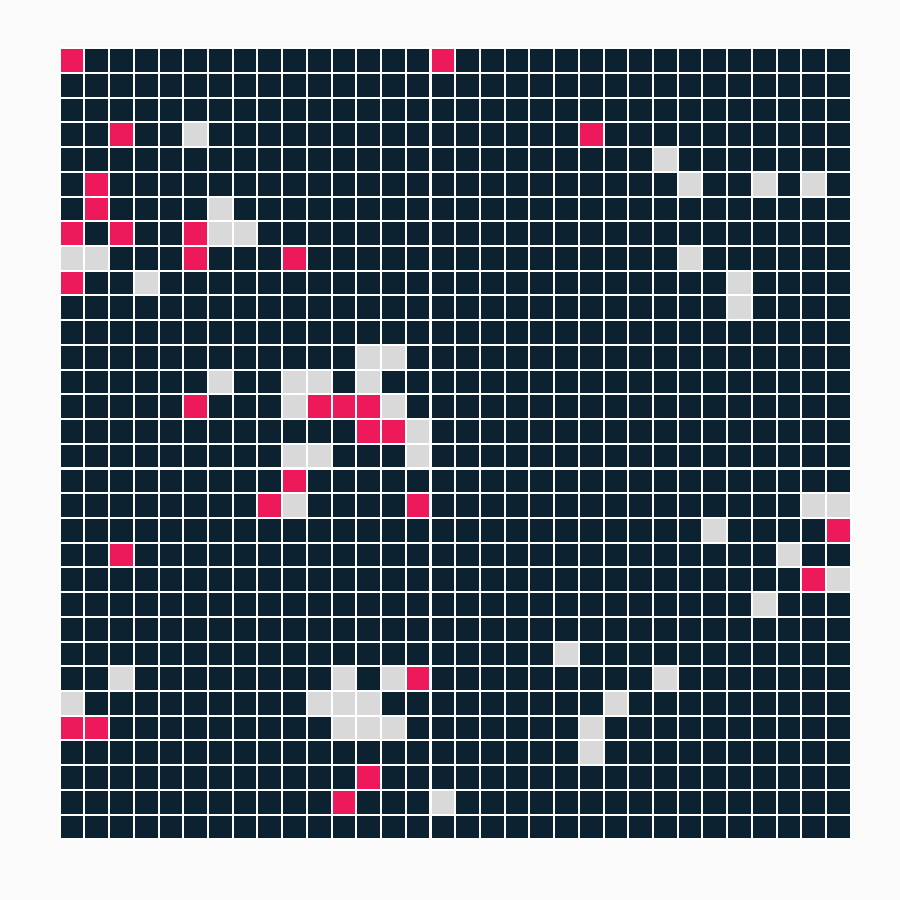
```
]


.pull-right[
## Year 1 deforestation
```{r, echo=FALSE, out.width = "100%", fig.align = 'left'}

```
]

---
# Data setting
.pull-left[
```{r, echo=FALSE}
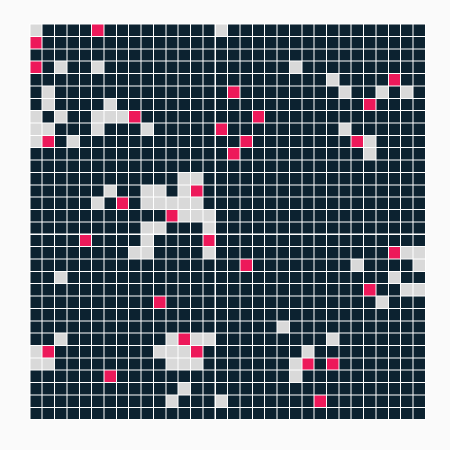
```
]


.pull-right[
## Year 2 deforestation
```{r, echo=FALSE, out.width = "100%", fig.align = 'left'}

```
]


---
# Data setting
.pull-left[
```{r, echo=FALSE}
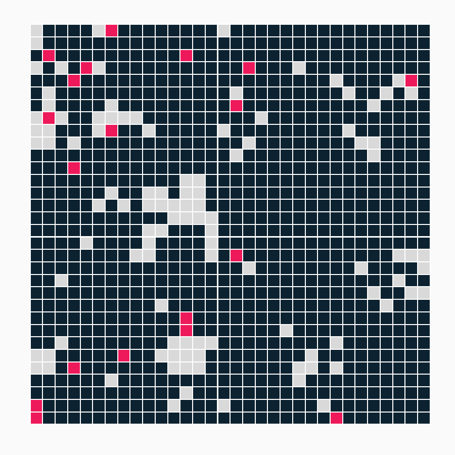
```
]


.pull-right[
## Year 3 deforestation
```{r, echo=FALSE, out.width = "100%", fig.align = 'left'}

```
]

---
# Data setting
.pull-left[
```{r, echo=FALSE}
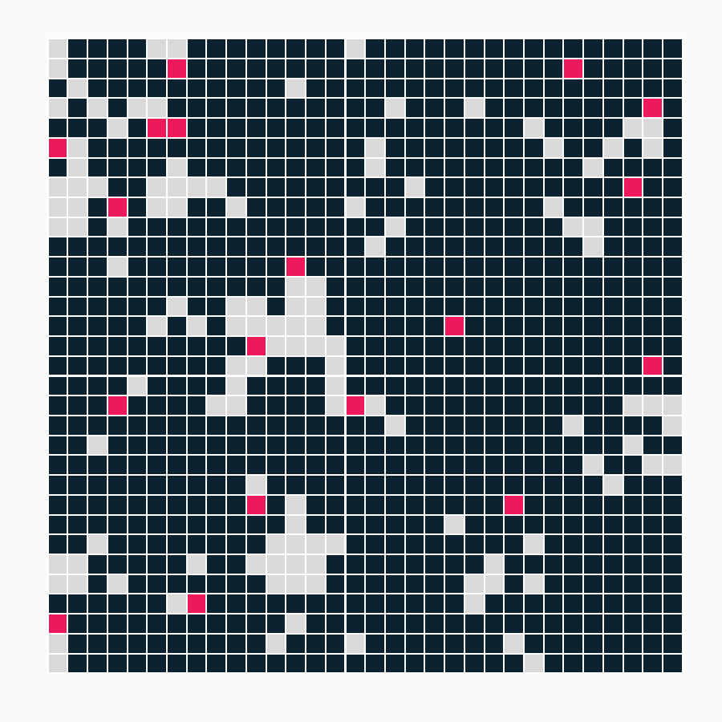
```
]


.pull-right[
## Year 4 deforestation
```{r, echo=FALSE, out.width = "100%", fig.align = 'left'}

```
]

---
# Data setting
.pull-left[
```{r, echo=FALSE}

```
]

.pull-right[
### Data characteristics
- Wall to wall data
- Fine spatial scales
- Relatively long time series
]

---
# Data setting
.pull-left[
```{r, echo=FALSE}

```
]

.pull-right[
### Data characteristics
- Wall to wall data
- Fine spatial scales
- Relatively long time series
- Binary
- Irreversible
]

---
# Data setting
.pull-left[
```{r, echo=FALSE}

```
]

.pull-right[
### Data characteristics
- Wall to wall data
- Fine spatial scales
- Relatively long time series
- Binary
- Irreversible

### Do traditional econometric models generate unbiased estimates in this setting?

]

---
# Data setting
.pull-left[
```{r, echo=FALSE}

```
]

.pull-right[
### Data characteristics
- Wall to wall data
- Fine spatial scales
- Relatively long time series
- Binary
- Irreversible

### Do traditional econometric models generate unbiased estimates in this setting?
- Importance of scale (Avelino et al., 2016)
- Nonclassical measurement error (Jain, 2020; Alix-Garcia and Millimet, 2020)

]


---
# Conservation policy impact evaluation
.pull-left[
```{r, echo=FALSE}
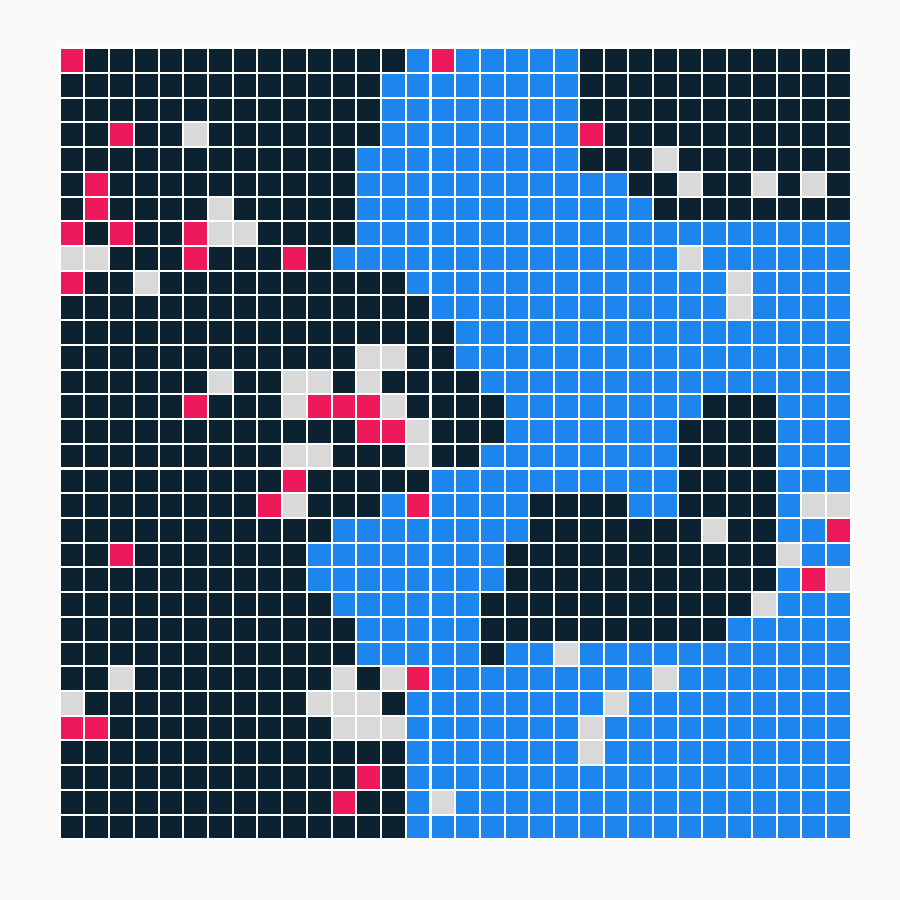
```
]


.pull-right[
<br />
<br />
<br />
<br />
<br />
<br />
<br />
<br />
## <br />


```{r, echo=FALSE, out.width = "75%", fig.align = 'left'}
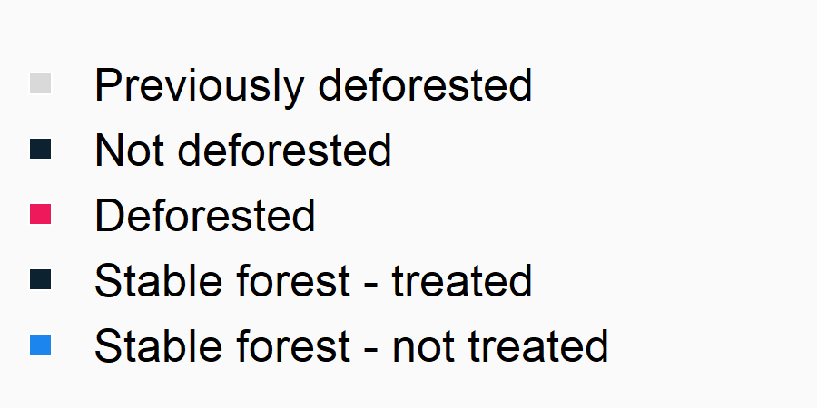
```
]


---
# Conservation policy impact evaluation
.pull-left[
```{r, echo=FALSE}

```
]


.pull-right[

### Researcher wants to estimate $ATT$ from intervention

### Follows common guidance (e.g. Jones and Lewis, 2015) and estimates a two-way fixed model:
### $$defor_{i,t}=\beta D_{i,t} + \gamma_i + \alpha_t + u_{i,t}$$


```{r, echo=FALSE, out.width = "75%", fig.align = 'left'}

```
]

---
# Preview of results

.pull-left[
```{r, echo=FALSE}

```
]


.pull-right[
<br />
### $$defor_{i,t}=\beta D_{i,t} + \gamma_i + \alpha_t + u_{i,t}$$

### $\hat{\beta}$ is a biased estimate of $ATT$

### Multiple possible solutions
- Aggregate fixed effects
- Aggregate units of observation

### Benefits of structuring model to match scale of decisionmaking
]


---

layout: false
class: inverse, middle
# Analytical proof
## Pixel-level, two-way fixed effects model doesn't estimate $ATT$

---
class: highlight-last-item

# Proof: Pixel-level TWFE model doesn't estimate ATT

## Setting

--

- Imagine a two-period setting $(t=1,2)$ with multiple points indexed by $i$.

--

- We observe $y_{i,t}$, a binary measure of deforestation at point $i$ at time $t$.

--

- Some units are exposed to a policy treatment in second period $(D_{i,t=2}=1)$

--

- Let potential outcome for each unit can be expressed as $y_{i,t}(D)$

--

- Unit-level treatment effect can be expressed as $E_i=y_{i,2}(1)-y_{i,2}(0)$

--

- We want to estimate average treatment effect on the treated $(ATT)$ which can be defined as:

$$ATT=\frac{1}{\eta_{i:W_i=1}}\sum_{i:W_i=1}^{N}{y_{i,2}(1)-y_{i,2}(0)}$$

---
class: highlight-last-item

# Proof: Pixel-level TWFE model doesn't estimate ATT

.pull-left[
## Data wrinkle
Since $y_{i,t}$ is an irreversible, binary outcome, it is typically<sup>†</sup> expressed as:

$$y_{it}= \begin{cases} 
      0 & \text{the pixel has never been deforested}\\
      1 & \text{the pixel was deforested in year }t\\
      NAN & \text{the pixel was deforested in a year }<t\\
   \end{cases}$$

]

.pull-right[
```{r, echo=FALSE}

```
]


.footnote[
†  Separate proof in paper shows why this is the preferred solution.
]


---
class: highlight-last-item

# Proof: Pixel-level TWFE model doesn't estimate ATT

## TWFE model:
## $$y_{i,t} = \alpha + \beta \times D_i \times \mathbb{1} \{t=2\}  + \gamma_i + \eta_{t=2}+ u_{i,t}$$

--

##  $$\Downarrow$$

$$y_{i,1}=\alpha+\gamma_i+u_{i,1}$$
--
$$y_{i,2}= \begin{cases} 
      \alpha+\beta \times D_i+\gamma_i+\eta_{t=2} + u_{i2} & y_{i1}= 0\\
      NAN & y_{i1} \neq 0 
   \end{cases}$$
--

## $$\Downarrow$$
$$y_{i,2}-y_{i,1}= \begin{cases} 
 \beta  \times D_i + \eta_{t=2} + \Delta u_{i} & y_{i1}= 0\\
      NAN & y_{i1} \neq 0 
   \end{cases}$$


---
class: highlight-last-item

# Proof: Pixel-level TWFE model doesn't estimate ATT

$\hat{\beta}$ (our estimate of the $ATT$) can also be expressed as a double difference:

$$
\begin{align*}
\hat{\beta}&= \frac{1}{n_{i:D_i=1}}\sum_{i:D_i=1} (y_{i,2}-y_{i,1}) - \frac{1}{n_{i:D_i=0}}\sum_{i:D_i=0} (y_{i,2} - y_{i,1})
\end{align*}
$$
--

However, this is only valid when $y_{i,1}=0$. Thus, we can restate (and shift to PO notation):
<!-- $$ -->
<!-- \begin{align*} -->
<!-- \hat{\beta}&= \frac{1}{n_{i:D_i=1}}\sum_{i:D_i=1} (y_{i,2}-0) - \frac{1}{n_{i:D_i=0}}\sum_{i:D_i=0} (y_{i,2} - 0) -->
<!-- \end{align*} -->
<!-- $$ -->
$$
\begin{align*}
\hat{\beta}&= \frac{1}{n_{i:D_i=1}}\sum_{i:D_i=1} y_{i,2}(1) - \frac{1}{n_{i:D_i=0}}\sum_{i:D_i=0} y_{i,2}(0)
\end{align*}
$$
--

Adding and subtracting $\frac{1}{n_{i:D_i=1}}\sum_{i:D_i=1} y_{i,2}(0)$:
$$
\begin{align*}
\hat{\beta}&= \underbrace{\frac{1}{n_{i:D_i=1}}\sum_{i:D_i=1} \left( y_{i,2}(1)-y_{i,2}(0) \right)}_{ATT} + \underbrace{\left( \frac{1}{n_{i:D_i=1}}\sum_{i:D_i=1} y_{i,2}(0) - \frac{1}{n_{i:D_i=0}}\sum_{i:D_i=0} y_{i,2}(0) \right)}_{\text{Baseline difference in mean deforestation rates}}
\end{align*}
$$

---

layout: false
class: inverse, middle
# Monte Carlo simulations 
## Multiple alternate specifications yield unbiased estimates of $ATT$

---
class: highlight-last-item

# Data generating process

.pull-left[
```{r, echo=FALSE}

```
]


.pull-right[

<br />

Simulated landscape of forested pixels $(i)$ 

Pixels are located inside properties $(v)$ and counties $(c)$

Multiple time periods $(t)$ divided into two even-length periods $(t<t_0 \text{ or } t \geq t_0)$

At time $t_0$, counties are randomly assigned to treatment $(D=1)$

]

---
# Data generating process


- Decision to deforest is modeled a function of a continuous, latent random variable $(y^*_{i,v,t})$ representing the return to clearing (Pfaff and Sanchez-Azofeifa, 2004).

$$(y^*_{i,v,t})=\psi_0 + \psi_1 D_i + \psi_2  (1 -  D_i ) 1\{  t \geq t_0  \} + \psi_3  D_i 1\{  t \geq t_0  \} + \alpha_i + \rho_v+u_{i,t}$$


--

- "Researcher" observes binary deforestation:

\begin{align}
 y_{i,v,t} = \begin{cases}
      1   & y^*_{i,v,t} > 0 \text{ and } y^*_{i,v, \tau} \leq 0 \text{ for all } \tau<t  \\
      0   &  y^*_{i,v,t} \leq 0 \text{ and } y^*_{i,v, \tau} \leq 0 \text{ for all } \tau<t \\
      NAN & otherwise
   \end{cases}
\end{align}

--

- DGP constrains $(y^*_{i,v,t})$ based on seven parameters:
  - $baseline_0 = E[y_{i,v,t}(0) |  t<t_0, D_i=0]$
  - $baseline_1 = E[y_{i,v,t}(0) |  t<t_0, D_i=1]$
  - $trend_0 = E[y_{i,v,t}(0) |  t\geq t_0, D_i=0] - E[y_{i,v,t}(0) |  t<t_0, D_i=0]$
  - $ATT = E[y_{i,v,t}(1) - y_{i,v,t}(0) |  t\geq t_0, D_i=1]$
  - $\alpha_i \sim N(0,\sigma_a^2)$
  - $\rho_v \sim N(0, \sigma_p^2)$
  - $u_{it} \sim N(0,\sigma_u^2)$


---
# Candidate econometric models

.pull-left[
### Scale of fixed effects or unit of observation
- Pixel (e.g. Alix-Garcia et al., 2018)
]

.pull-right[
```{r, echo=FALSE}

```
]

---
# Candidate econometric models

.pull-left[
### Scale of fixed effects or unit of observation
- Pixel (e.g. Alix-Garcia et al., 2018)
- Treatment (e.g. Arriagada et al., 2012)
]

.pull-right[
```{r, echo=FALSE}
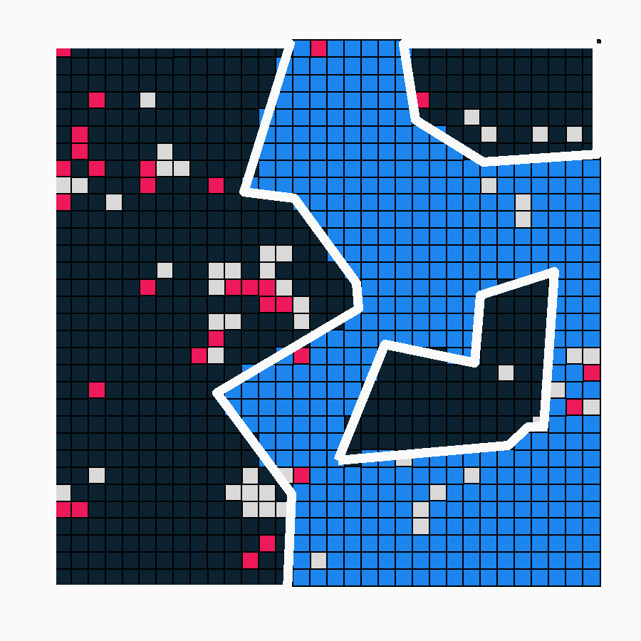
```
]

---
# Candidate econometric models

.pull-left[
### Scale of fixed effects or unit of observation
- Pixel (e.g. Alix-Garcia et al., 2018)
- Treatment (e.g. Arriagada et al., 2012)
- County (e.g. Blackman, 2015)
]

.pull-right[
```{r, echo=FALSE}
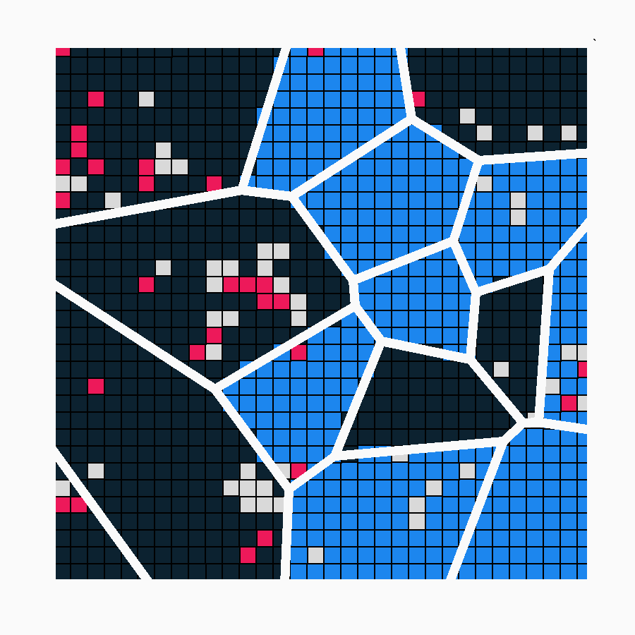
```
]


---
# Candidate econometric models

.pull-left[
### Scale of fixed effects or unit of observation
- Pixel (e.g. Alix-Garcia et al., 2018)
- Treatment (e.g. Arriagada et al., 2012)
- County (e.g. Blackman, 2015)
- Grid cell (e.g. BenYishay et al., 2017)
]

.pull-right[
```{r, echo=FALSE}
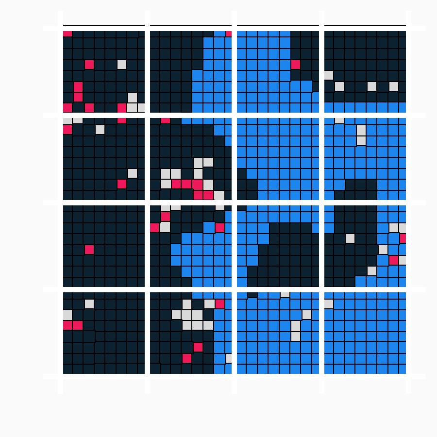
```
]

---
# Candidate econometric models

.pull-left[
### Scale of fixed effects or unit of observation
- Pixel (e.g. Alix-Garcia et al., 2018)
- Treatment (e.g. Arriagada et al., 2012)
- County (e.g. Blackman, 2015)
- Grid cell (e.g. BenYishay et al., 2017)
- Property (e.g. Heilmayr and Lambin, 2016)
]

.pull-right[
```{r, echo=FALSE}
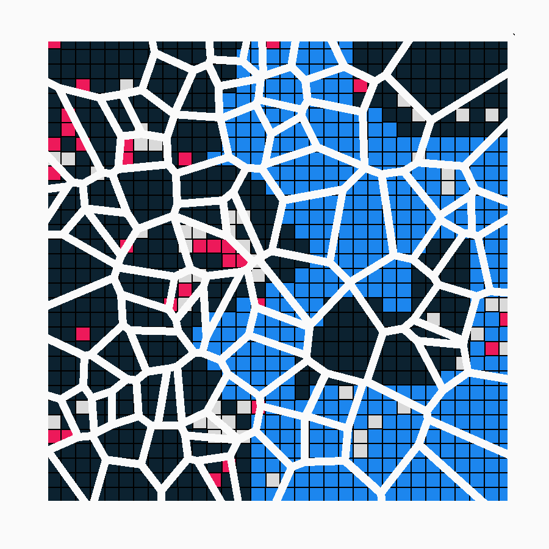
```
]


---
# Candidate econometric models

.pull-left[
### Scale of fixed effects or unit of observation
- Pixel (e.g. Alix-Garcia et al., 2018)
- Treatment (e.g. Arriagada et al., 2012)
- County (e.g. Blackman, 2015)
- Grid cell (e.g. BenYishay et al., 2017)
- Property (e.g. Heilmayr and Lambin, 2016)

### Functional form

### Calculation of deforestation rate
]

.pull-right[
```{r, echo=FALSE}

```
]

---
# Bias in TWFE model

```{r, echo=FALSE}
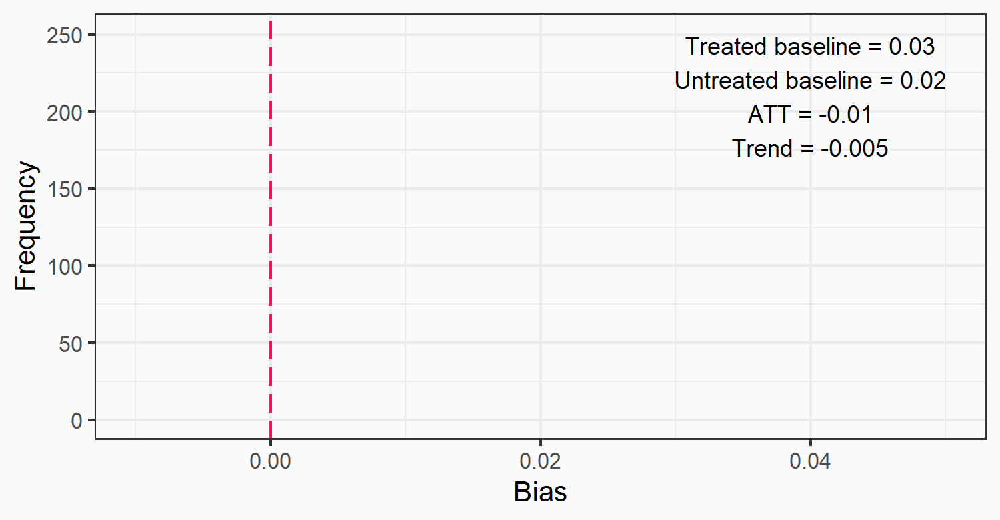
```


---
# Bias in TWFE model

```{r, echo=FALSE}
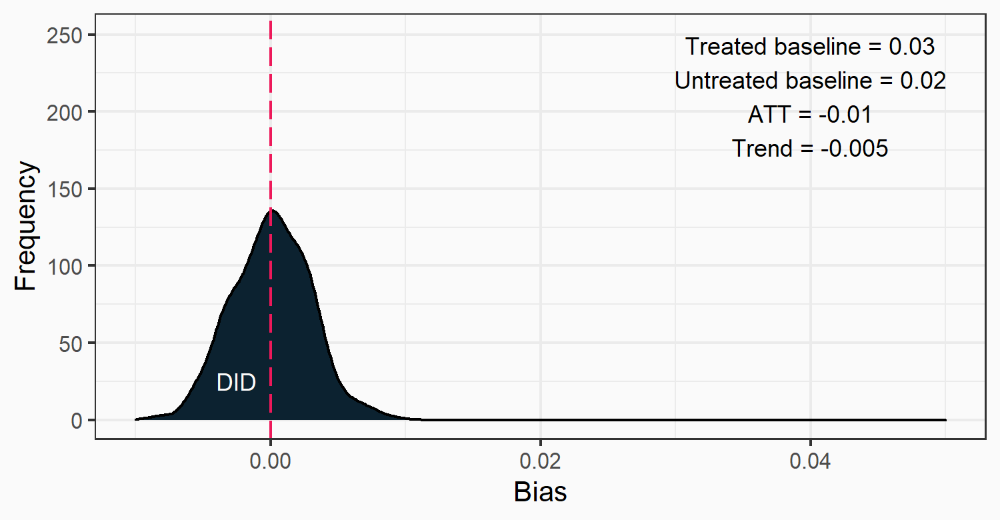
```

---
# Bias in TWFE model

```{r, echo=FALSE}
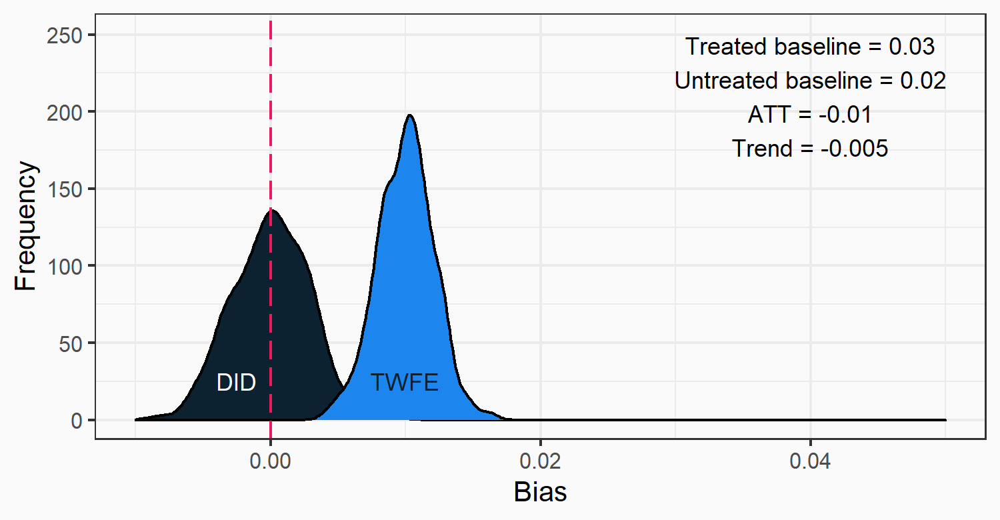
```

---
# Bias in TWFE model

```{r, echo=FALSE}
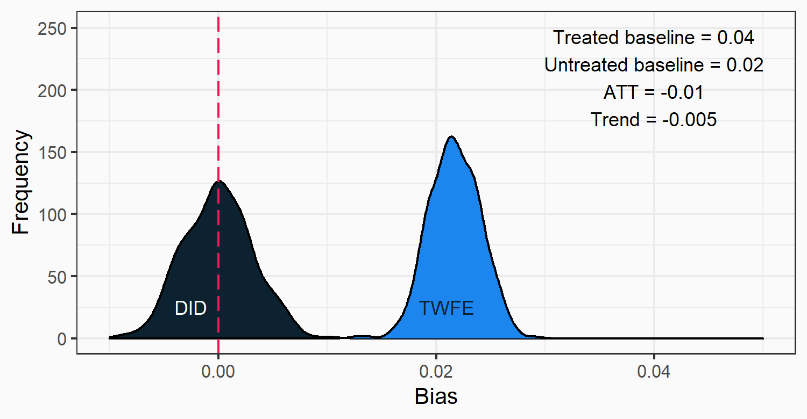
```

---
# Bias in TWFE model

```{r, echo=FALSE}
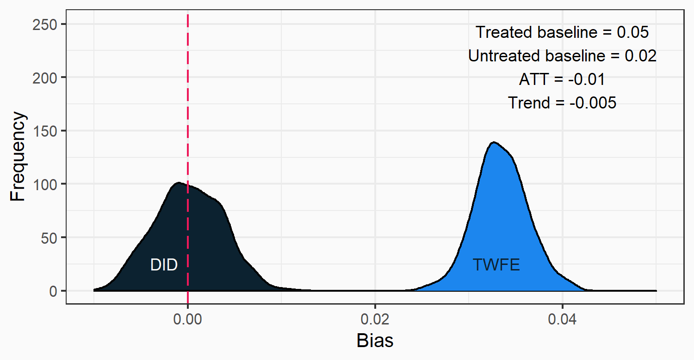
```

---
# Aggregation as a solution

.pull-left[
### Aggregated fixed effects
```{r, echo=FALSE, out.width = "95%", fig.align = "left"}
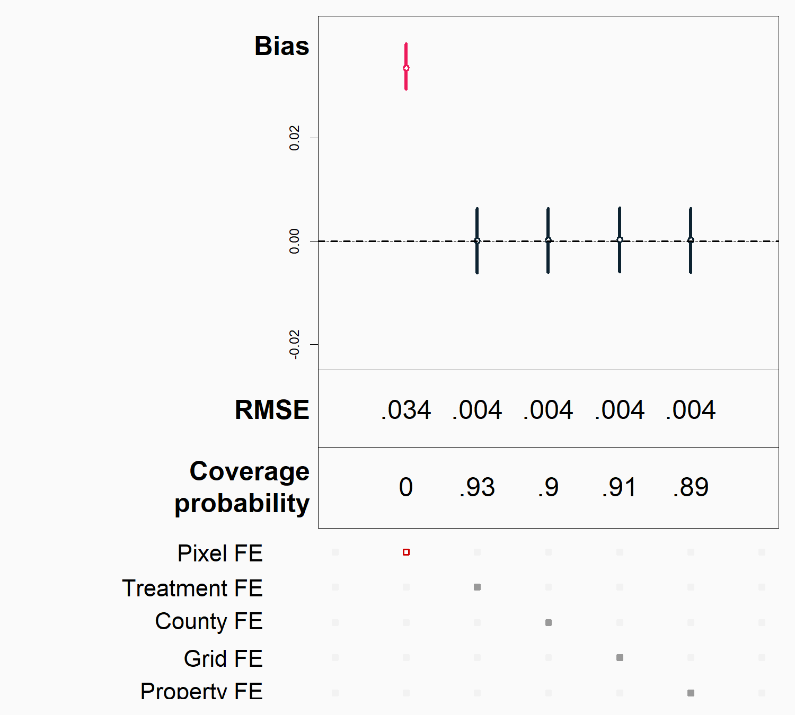
```
]

--

.pull-right[
### Aggregated units of observation
```{r, echo=FALSE, out.width = "95%", fig.align = "left"}
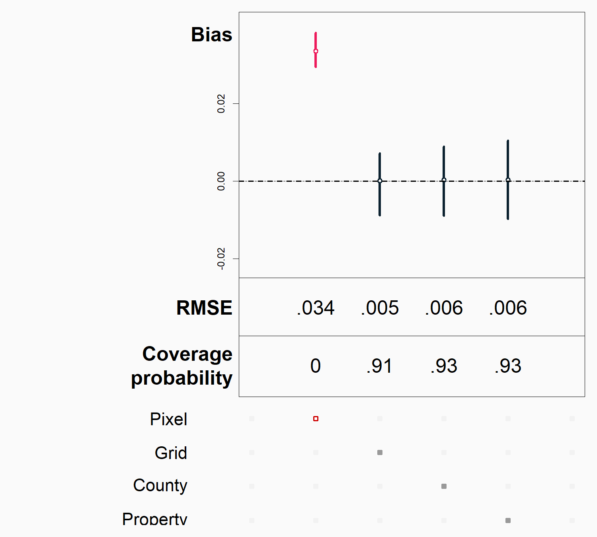
```
]

---
# Impacts of property-level disturbances on DID

```{r, echo=FALSE, out.width = "55%", fig.align = "left"}
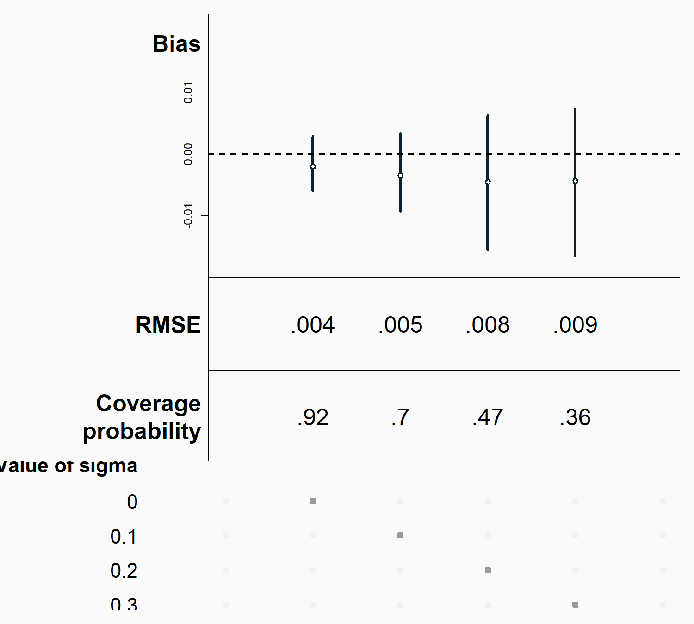
```

---
# Benefits of property-level models $(\sigma_p=0.3)$

.pull-left[
### Aggregated fixed effects 
```{r, echo=FALSE, out.width = "90%", fig.align = "left"}
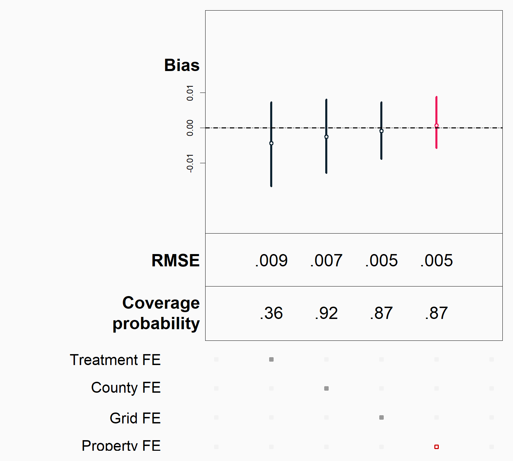
```
]

--

.pull-right[
### Aggregated units of analysis
```{r, echo=FALSE, out.width = "90%", fig.align = "left"}
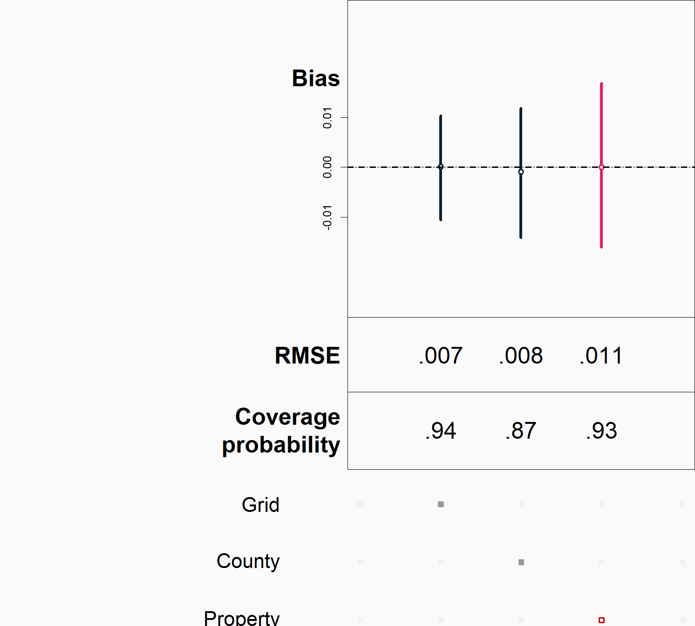
```
]


---

layout: false
class: inverse, middle
# Conclusions

---
# Conclusions

.pull-left[
### Pixel-level, two-way fixed effects models do not yield expected estimand

### Multiple alternate model structures provide (much less) biased estimates

### Aligning model structure to scale of decisionmaking improves model performance
]

.pull-right[
### Aggregated units of observation
```{r, echo=FALSE, out.width = "95%", fig.align = "left"}

```
]


---
# Potential extensions

## Impact of weighting in presence of heterogeneous treatment effects

## Comparisons to survival models

## Bias stemming from non-random sample selection

## Shiny App to enable researchers to test alternate parameterizations?

---

layout: false
class: inverse, middle
# Thanks!
Albert Garcia (agarcia@bren.ucsb.edu) and Robert Heilmayr (rheilmayr@ucsb.edu)

<!-- --- -->
<!-- # References -->
<!-- ```{r refs, echo= FALSE, results = "asis"} -->
<!-- PrintBibliography(myBib) -->
<!-- ``` -->