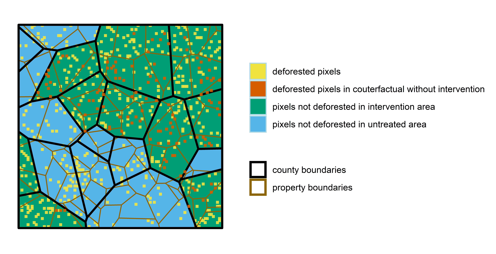

class: inverse, middle

```{r Setup, include = F}
options(htmltools.dir.version = FALSE)
library(pacman)
p_load(ggplot2, ggthemes, viridis, dplyr, magrittr, knitr, kableExtra)
# Define pink color
red_pink <- "#e64173"
# Knitr options
opts_chunk$set(
  comment = "#>",
  fig.align = "center",
  fig.height = 7,
  fig.width = 10.5,
  # dpi = 300,
  # cache = T,
  warning = F,
  message = F
)
```

```{css, echo=FALSE}
@media print {
  .has-continuation {
    display: block !important;
  }
}
```


# Motivation

---
# What policies can slow deforestation?

## Why should we care about deforestation?

## Opportunity from remotely sensed data.

## Role of econometrics to answer this question

---
# Rapid growth in literature

## Plot of gscholar cites

## Types of questions being answered (maybe from UC-EE scholars?)

---
# Overview

## Pixel-level TWFE recommended, but yield biased results

## Multiple solutions can yield unbiased estimates

## Opportunity to better integrate appropriate unit of decision-making

---
# Description of data setting

## Raster of discrete observations

## Panel

## Irreversible outcome

## Example figures from Hansen data?


---
# Researcher's objective

## Recover average treatment effect on the treated

---
# Data structure
```{r echo=FALSE}

```

???
Ideally would animate this figure

---

layout: false
class: inverse, middle
# TWFE - proof

---
# Proof: Pixel-level TWFE model doesn't estimate ATT

## Setting

--

- Imagine a two-period setting $(t=1,2)$ with multiple points indexed by $i$.

--

- We observe $y_{i,t}$, a binary measure of deforestation at point $i$ at time $t$.

--

- Some units are exposed to a policy treatment in second period $(D_{i,t=2}=1)$

--

- Let potential outcome for each unit can be expressed as $y_{i,t}(D)$

--

- Unit-level treatment effect can be expressed as $E_i=y_{i,2}(1)-y_{i,2}(0)$

--

- We want to estimate average treatment effect on the treated $(ATT)$ which can be defined as:

$$ATT=\frac{1}{\eta_{i:W_i=1}}\sum_{i:W_i=1}^{N}{y_{i,2}(1)-y_{i,2}(0)}$$

---
# Proof: Pixel-level TWFE model doesn't estimate ATT

## Data wrinkle

Since $y_{i,t}$ is an irreversible, binary outcome, it is often expressed as:

$$y_{it}= \begin{cases} 
      0 & \text{the pixel has never been deforested}\\
      1 & \text{the pixel was deforested in year }t\\
      NAN & \text{the pixel was deforested in a year }<t\\
   \end{cases}
.$$

---
# Proof: Pixel-level TWFE model doesn't estimate ATT

## TWFE model to estimate $ATT$


---

layout: false
class: inverse, middle
# Monte Carlo simulations of potential solutions


---
# DGP


???
Notes here

---
# Confirm proof

## Flicker through plots of TWFE bias as a function of pre-treatment differences

---
# Solution 1 - Aggregate fixed effects to more aggregated unit of observation

- Standard DID

- Property / county / grid-cell FE

---
# Solution 2 - Aggregate unit of observation

---
# Relative performance of different approaches?

---
# Property-level fixed effects

---

layout: false
class: inverse, middle
# Conclusions
